# Chapter 5: วงจรลอจิกเชิงผสม

## Combinational Logic Circuits

---

## 5.1 บทนำ

**วงจรเชิงผสม (Combinational Circuit)** — เอาต์พุตขึ้นอยู่กับ **อินพุตปัจจุบัน** เท่านั้น (ไม่มีหน่วยความจำ)

$$\text{Output} = f(\text{Current Inputs})$$

### ลักษณะสำคัญ:
- ไม่มี feedback path จากเอาต์พุตกลับเข้าอินพุต
- ไม่มีองค์ประกอบเก็บค่า (ไม่มี Flip-flop, Latch)
- เอาต์พุตตอบสนองทันที (มีเฉพาะ propagation delay)

### กระบวนการออกแบบวงจรเชิงผสม:

```
1. กำหนดปัญหา (สร้าง Truth Table)
          ↓
2. เขียนสมการบูลีน (SOP / POS)
          ↓
3. ลดรูปสมการ (K-Map / Algebra)
          ↓
4. วาดวงจรด้วยเกต
          ↓
5. ตรวจสอบความถูกต้อง
```

แบ่งเนื้อหาเป็น 2 ส่วน:
- **ส่วนที่ 1:** วงจรคำนวณทางคณิตศาสตร์ (Arithmetic Circuits)
- **ส่วนที่ 2:** วงจรจัดการข้อมูล (Data Routing Circuits)

---

# ส่วนที่ 1: วงจรคำนวณ (Arithmetic Circuits)

---

## 5.2 Half Adder (วงจรบวกครึ่ง)

บวกเลขฐานสอง **2 บิต** — ไม่มี Carry input (ใช้กับหลักหน่วยเท่านั้น)

### Truth Table

| A | B | Sum (S) | Carry (C) |
|:---:|:---:|:---:|:---:|
| 0 | 0 | 0 | 0 |
| 0 | 1 | 1 | 0 |
| 1 | 0 | 1 | 0 |
| 1 | 1 | 0 | 1 |

### สมการ:

$$S = A \oplus B \quad \text{(XOR)}$$
$$C = A \cdot B \quad \text{(AND)}$$

### วงจร Half Adder:

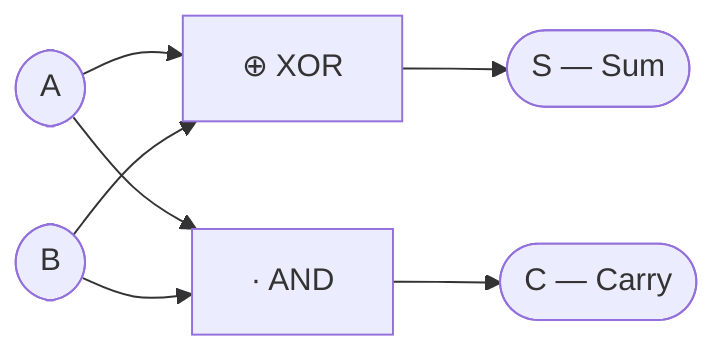

### ตัวอย่างการบวก:

```
  A = 1
+ B = 1
──────
  S = 0  (ผลบวก)
  C = 1  (ทดไปหลักถัดไป)
```

---

## 5.3 Full Adder (วงจรบวกเต็ม) ⭐

บวกเลขฐานสอง **3 บิต** (A, B, และ Carry-in $C_{in}$ จากหลักก่อนหน้า)

### Truth Table

| A | B | $C_{in}$ | Sum (S) | $C_{out}$ |
|:---:|:---:|:---:|:---:|:---:|
| 0 | 0 | 0 | 0 | 0 |
| 0 | 0 | 1 | 1 | 0 |
| 0 | 1 | 0 | 1 | 0 |
| 0 | 1 | 1 | 0 | 1 |
| 1 | 0 | 0 | 1 | 0 |
| 1 | 0 | 1 | 0 | 1 |
| 1 | 1 | 0 | 0 | 1 |
| 1 | 1 | 1 | 1 | 1 |

### K-Map ลดรูป Sum และ Carry-out

**K-Map สำหรับ S** $= \sum m(1, 2, 4, 7)$:

```
  ┌──────────┬──────┬──────┬──────┬──────┐
  │ A \ BC   │  00  │  01  │  11  │  10  │
  ├──────────┼──────┼──────┼──────┼──────┤
  │    0     │  0   │  1   │  0   │  1   │
  ├──────────┼──────┼──────┼──────┼──────┤
  │    1     │  1   │  0   │  1   │  0   │
  └──────────┴──────┴──────┴──────┴──────┘
  (ไม่มีกลุ่มที่จัดได้ → ต้องใช้ XOR)
```

$$S = A \oplus B \oplus C_{in}$$

**K-Map สำหรับ $C_{out}$** $= \sum m(3, 5, 6, 7)$:

```
  ┌──────────┬──────┬──────┬──────┬──────┐
  │ A \ BC   │  00  │  01  │  11  │  10  │
  ├──────────┼──────┼──────┼──────┼──────┤
  │    0     │  0   │  0   │  1   │  0   │
  ├──────────┼──────┼──────┼──────┼──────┤
  │    1     │  0   │  1   │  1   │  1   │
  └──────────┴──────┴──────┴──────┴──────┘
```

$$C_{out} = AB + AC_{in} + BC_{in} = AB + C_{in}(A \oplus B)$$

### วงจร Full Adder จาก Half Adder 2 ตัว:

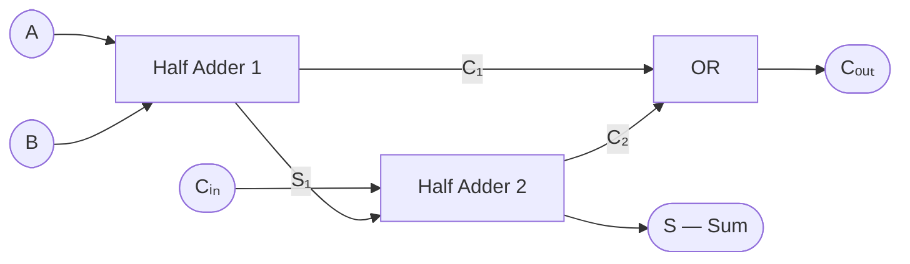

### 4-bit Ripple Carry Adder (วงจรบวก 4 บิต)

นำ Full Adder 4 ตัวมาต่อกันเป็นลูกโซ่ — $C_{out}$ ของแต่ละหลักต่อเป็น $C_{in}$ ของหลักถัดไป:

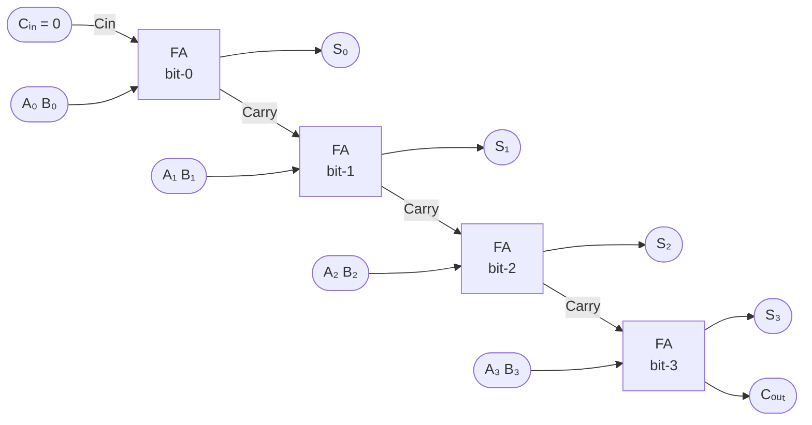

**ตัวอย่าง:** 0101 + 0011 = ?

```
    0 1 0 1    (= 5)
  + 0 0 1 1    (= 3)
  ─────────
  0 1 0 0 0    (= 8)
         ↑
    Carry = 1 ทดไปเรื่อยๆ
```

**IC: 7483** (4-bit Binary Full Adder with Fast Carry)

> ⚠️ **ข้อเสีย Ripple Carry:** Carry ต้อง "ripple" จากหลักต่ำไปหลักสูง → delay สะสม เช่น 8-bit = delay × 8
> 💡 **ทางแก้:** Carry Look-Ahead Adder (CLA) — คำนวณ carry ล่วงหน้าพร้อมกัน

---

## 5.4 Half Subtractor / Full Subtractor

### Half Subtractor (ลบ 2 บิต ไม่มี Borrow-in)

| A | B | Diff (D) | $B_{out}$ |
|:---:|:---:|:---:|:---:|
| 0 | 0 | 0 | 0 |
| 0 | 1 | 1 | 1 |
| 1 | 0 | 1 | 0 |
| 1 | 1 | 0 | 0 |

$$D = A \oplus B$$
$$B_{out} = \overline{A} \cdot B$$

> $B_{out} = 1$ หมายถึง "ยืม" จากหลักถัดไป (เหมือน borrow ในการลบทศนิยม)

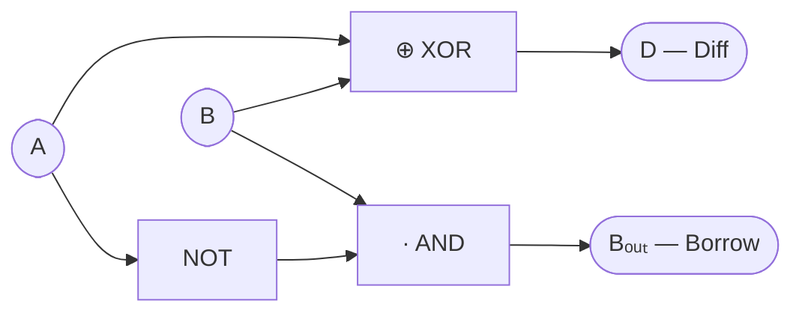

### Full Subtractor (ลบ 3 บิต รวม Borrow-in)

| A | B | $B_{in}$ | Diff (D) | $B_{out}$ |
|:---:|:---:|:---:|:---:|:---:|
| 0 | 0 | 0 | 0 | 0 |
| 0 | 0 | 1 | 1 | 1 |
| 0 | 1 | 0 | 1 | 1 |
| 0 | 1 | 1 | 0 | 1 |
| 1 | 0 | 0 | 1 | 0 |
| 1 | 0 | 1 | 0 | 0 |
| 1 | 1 | 0 | 0 | 0 |
| 1 | 1 | 1 | 1 | 1 |

$$D = A \oplus B \oplus B_{in}$$
$$B_{out} = \overline{A}B + B_{in}(\overline{A \oplus B})$$

### วงจรลบด้วย Adder + 2's Complement

$$A - B = A + \overline{B} + 1$$

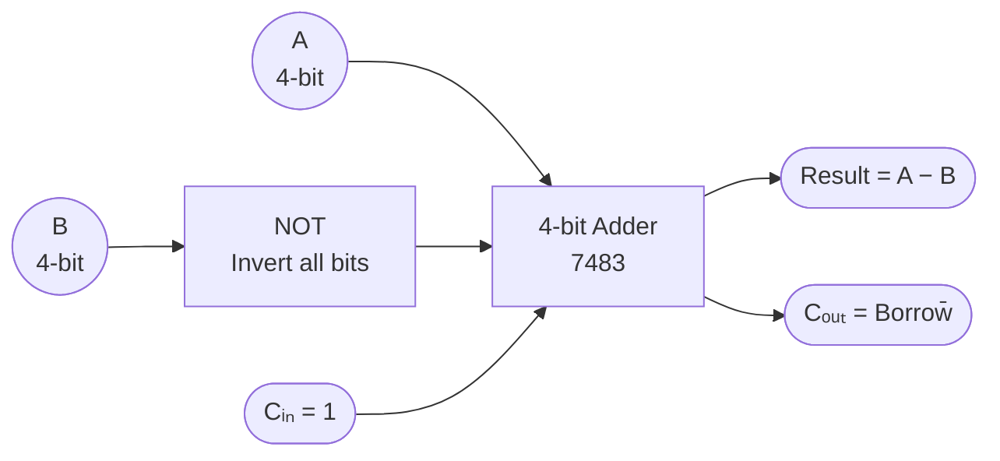

---

## 5.5 Comparator (วงจรเปรียบเทียบ)

เปรียบเทียบเลขฐานสอง 2 จำนวน → 3 เอาต์พุต: $A>B$, $A<B$, $A=B$

### 1-bit Comparator

| A | B | $A>B$ | $A=B$ | $A<B$ |
|:---:|:---:|:---:|:---:|:---:|
| 0 | 0 | 0 | 1 | 0 |
| 0 | 1 | 0 | 0 | 1 |
| 1 | 0 | 1 | 0 | 0 |
| 1 | 1 | 0 | 1 | 0 |

$$GT = A\overline{B}, \quad EQ = \overline{A \oplus B}, \quad LT = \overline{A}B$$

### 4-bit Comparator (IC 7485)

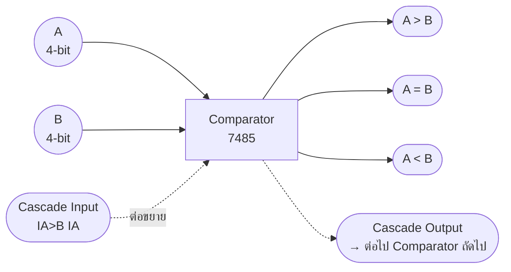

เปรียบเทียบ A (A3-A0) กับ B (B3-B0) โดยเริ่มจาก **MSB ก่อน**:

```
  ถ้า A3 ≠ B3 → ผลลัพธ์จาก bit นี้เลย
  ถ้า A3 = B3 → ดู A2 ≠ B2
  ถ้า A2 = B2 → ดู A1 ≠ B1
  ถ้า A1 = B1 → ดู A0 ≠ B0
  ถ้าทุก bit เท่ากัน → ดูจาก Cascade Input
```

> IC **7485** มีขา Cascade Input: $I_{A>B}$, $I_{A<B}$, $I_{A=B}$ สำหรับต่อขยายเป็น n-bit comparator

---

# ส่วนที่ 2: วงจรจัดการข้อมูล (Data Routing Circuits)

---

## 5.6 Encoder (ตัวเข้ารหัส)

แปลง $2^n$ input lines → $n$-bit binary output

> มีเพียง **1 input ที่ active** ในแต่ละเวลา → บอกว่า "input ตัวไหน active"

### 8-to-3 Encoder (Octal-to-Binary)

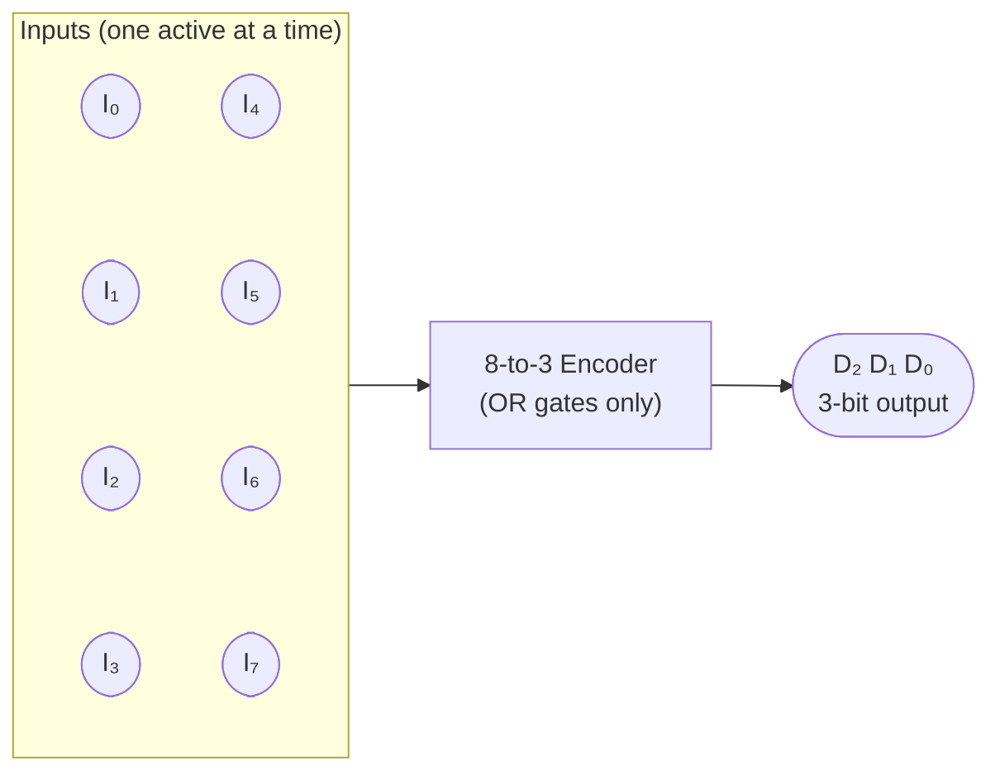

| Input Active | $D_2$ | $D_1$ | $D_0$ |
|:---:|:---:|:---:|:---:|
| $I_0$ | 0 | 0 | 0 |
| $I_1$ | 0 | 0 | 1 |
| $I_2$ | 0 | 1 | 0 |
| $I_3$ | 0 | 1 | 1 |
| $I_4$ | 1 | 0 | 0 |
| $I_5$ | 1 | 0 | 1 |
| $I_6$ | 1 | 1 | 0 |
| $I_7$ | 1 | 1 | 1 |

### สมการของ 8-to-3 Encoder:

$$D_0 = I_1 + I_3 + I_5 + I_7$$
$$D_1 = I_2 + I_3 + I_6 + I_7$$
$$D_2 = I_4 + I_5 + I_6 + I_7$$

วงจรใช้เพียง **OR gates เท่านั้น**

### Priority Encoder ⭐

เมื่อมีหลายอินพุต active พร้อมกัน → เลือกตัวที่มี **ลำดับความสำคัญสูงสุด** (index สูงสุด)

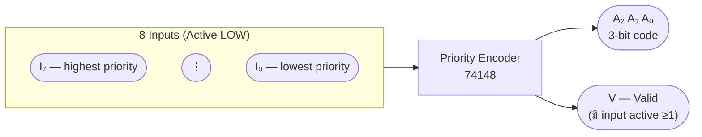

เพิ่ม output พิเศษ **V (Valid)** = 1 เมื่อมี input active อย่างน้อย 1 ตัว

**IC 74148** — 8-to-3 Priority Encoder (Active LOW):

| $I_7$ | $I_6$ | $I_5$ | $I_4$ | $I_3$ | $I_2$ | $I_1$ | $I_0$ | $A_2$ | $A_1$ | $A_0$ | V |
|:---:|:---:|:---:|:---:|:---:|:---:|:---:|:---:|:---:|:---:|:---:|:---:|
| 1 | 1 | 1 | 1 | 1 | 1 | 1 | **0** | 0 | 0 | 0 | 1 |
| 1 | 1 | 1 | 1 | 1 | 1 | **0** | X | 0 | 0 | 1 | 1 |
| 1 | 1 | 1 | 1 | 1 | **0** | X | X | 0 | 1 | 0 | 1 |
| 1 | 1 | 1 | 1 | **0** | X | X | X | 0 | 1 | 1 | 1 |
| 1 | 1 | 1 | **0** | X | X | X | X | 1 | 0 | 0 | 1 |
| 1 | 1 | **0** | X | X | X | X | X | 1 | 0 | 1 | 1 |
| 1 | **0** | X | X | X | X | X | X | 1 | 1 | 0 | 1 |
| **0** | X | X | X | X | X | X | X | 1 | 1 | 1 | 1 |

> 74148 ใช้ logic Active LOW: อินพุต 0 = active

---

## 5.7 Decoder (ตัวถอดรหัส) ⭐

แปลง $n$-bit input → $2^n$ output lines (active เพียง 1 เส้นในแต่ละเวลา)

> ตรงข้ามกับ Encoder — บอกว่า "input นี้ตรงกับ output ตัวไหน"

### 2-to-4 Decoder

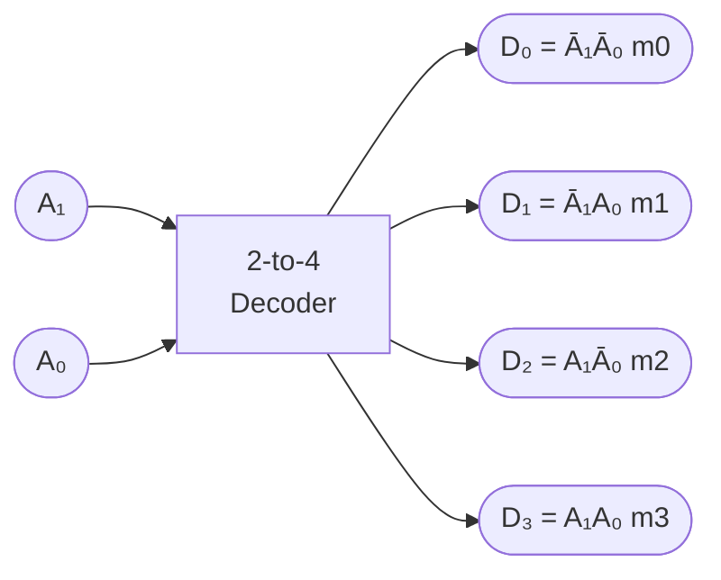

| $A_1$ | $A_0$ | $D_0$ | $D_1$ | $D_2$ | $D_3$ |
|:---:|:---:|:---:|:---:|:---:|:---:|
| 0 | 0 | **1** | 0 | 0 | 0 |
| 0 | 1 | 0 | **1** | 0 | 0 |
| 1 | 0 | 0 | 0 | **1** | 0 |
| 1 | 1 | 0 | 0 | 0 | **1** |

$$D_0 = \overline{A_1}\,\overline{A_0}, \quad D_1 = \overline{A_1}\,A_0, \quad D_2 = A_1\,\overline{A_0}, \quad D_3 = A_1\,A_0$$

แต่ละเอาต์พุต = **minterm 1 ตัว** ของอินพุต

### 3-to-8 Decoder (IC 74138)

มี **Enable inputs** 3 ตัว ($E_1$ active HIGH, $E_2$ และ $E_3$ active LOW):

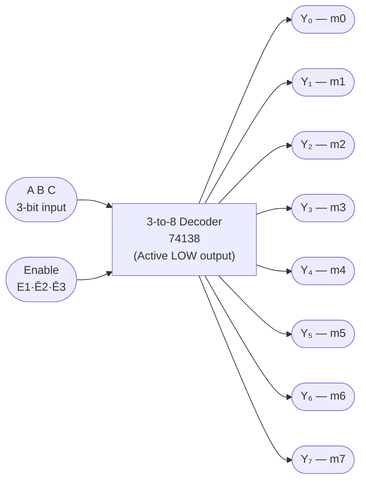

เมื่อ $EN = E_1 \cdot \overline{E_2} \cdot \overline{E_3} = 1$ → เอาต์พุต Active LOW

### ประยุกต์: ใช้ Decoder สร้างฟังก์ชันบูลีน ⭐

เนื่องจากแต่ละเอาต์พุต Decoder = minterm 1 ตัว → ต่อ NAND gate เข้ากับเอาต์พุตที่ต้องการ

**ตัวอย่าง:** $F(A,B,C) = \sum m(1, 3, 5, 6)$ จาก 74138:

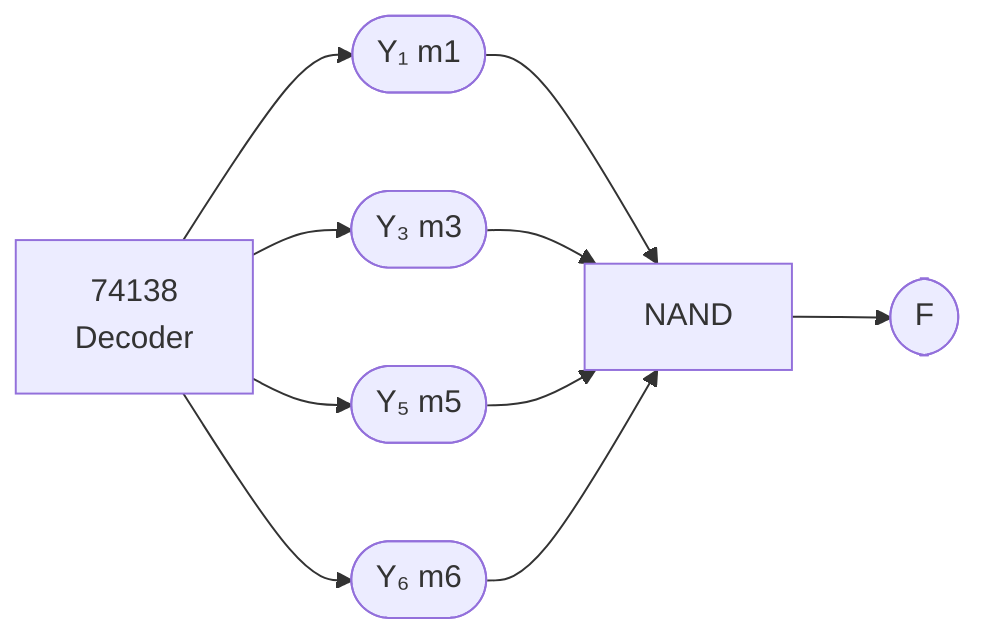

> ⚠️ 74138 เอาต์พุต Active LOW → ใช้ NAND แทน OR

### ต่อ Decoder ขนาดเล็กเป็นขนาดใหญ่ (4-to-16):

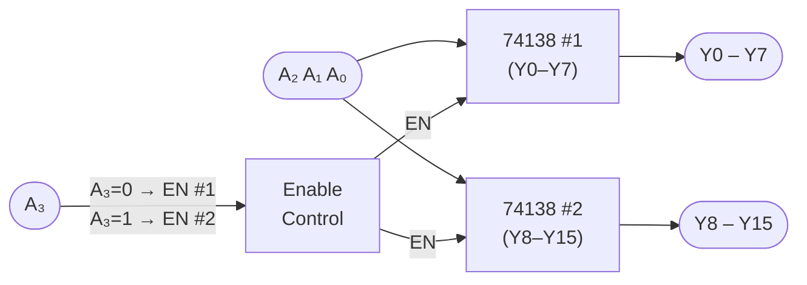

### BCD to 7-Segment Decoder ⭐

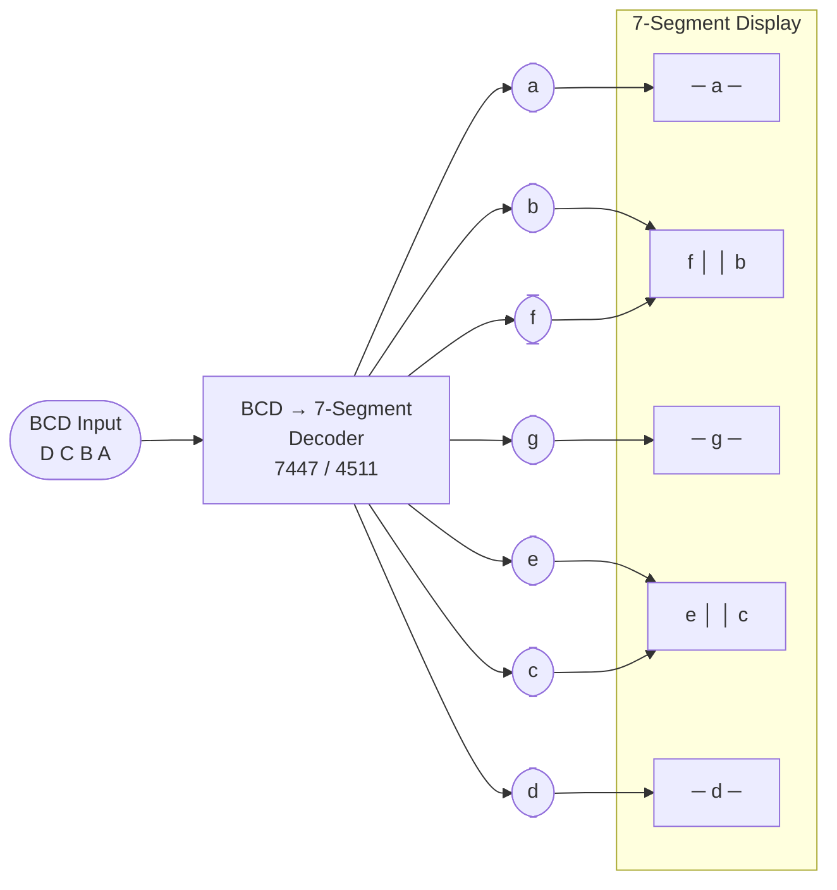

| BCD (DCBA) | หลัก | a | b | c | d | e | f | g |
|:---:|:---:|:---:|:---:|:---:|:---:|:---:|:---:|:---:|
| 0000 | **0** | 1 | 1 | 1 | 1 | 1 | 1 | 0 |
| 0001 | **1** | 0 | 1 | 1 | 0 | 0 | 0 | 0 |
| 0010 | **2** | 1 | 1 | 0 | 1 | 1 | 0 | 1 |
| 0011 | **3** | 1 | 1 | 1 | 1 | 0 | 0 | 1 |
| 0100 | **4** | 0 | 1 | 1 | 0 | 0 | 1 | 1 |
| 0101 | **5** | 1 | 0 | 1 | 1 | 0 | 1 | 1 |
| 0110 | **6** | 1 | 0 | 1 | 1 | 1 | 1 | 1 |
| 0111 | **7** | 1 | 1 | 1 | 0 | 0 | 0 | 0 |
| 1000 | **8** | 1 | 1 | 1 | 1 | 1 | 1 | 1 |
| 1001 | **9** | 1 | 1 | 1 | 1 | 0 | 1 | 1 |

#### ตัวอย่าง: K-Map ลดรูป segment `g`

$$g = \sum m(2, 3, 4, 5, 6, 9) + \sum d(10, 11, 12, 13, 14, 15)$$

```
  ┌─────────┬──────┬──────┬──────┬──────┐
  │ AB \ CD │  00  │  01  │  11  │  10  │
  ├─────────┼──────┼──────┼──────┼──────┤
  │   00    │  0   │  0   │  1   │  1   │
  ├─────────┼──────┼──────┼──────┼──────┤
  │   01    │  1   │  1   │  0   │  1   │
  ├─────────┼──────┼──────┼──────┼──────┤
  │   11    │  X   │  X   │  X   │  X   │
  ├─────────┼──────┼──────┼──────┼──────┤
  │   10    │  1   │  X   │  X   │  X   │
  └─────────┴──────┴──────┴──────┴──────┘
```

→ $g = A + BC + B\overline{D} + \overline{B}C\overline{D}$

**IC: 7447** (active LOW, common-anode) | **IC: 4511** (active HIGH, CMOS)

---

## 5.8 Multiplexer — MUX (ตัวเลือกสัญญาณ) ⭐

เลือก **1 อินพุตจากหลายตัว** ส่งไปเอาต์พุต ตาม Select lines

> คิดว่าเป็น "สวิตช์หมุนดิจิทัล" — n select bits → เลือกจาก $2^n$ inputs

### MUX 4:1

$$Y = \overline{S_1}\,\overline{S_0}\,I_0 + \overline{S_1}\,S_0\,I_1 + S_1\,\overline{S_0}\,I_2 + S_1\,S_0\,I_3$$

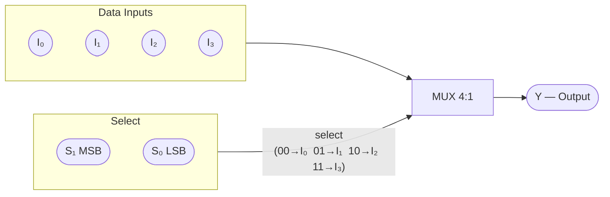

| $S_1$ | $S_0$ | Y |
|:---:|:---:|:---:|
| 0 | 0 | $I_0$ |
| 0 | 1 | $I_1$ |
| 1 | 0 | $I_2$ |
| 1 | 1 | $I_3$ |

### MUX 8:1 (IC 74151)

| $S_2$ | $S_1$ | $S_0$ | Y |
|:---:|:---:|:---:|:---:|
| 0 | 0 | 0 | $I_0$ |
| 0 | 0 | 1 | $I_1$ |
| 0 | 1 | 0 | $I_2$ |
| 0 | 1 | 1 | $I_3$ |
| 1 | 0 | 0 | $I_4$ |
| 1 | 0 | 1 | $I_5$ |
| 1 | 1 | 0 | $I_6$ |
| 1 | 1 | 1 | $I_7$ |

**IC: 74153** (Dual 4:1 MUX), **74151** (8:1 MUX)

### MUX เป็น Universal Function Generator ⭐

**เทคนิค 1:** ต่อ Select = ตัวแปรทั้งหมด, Data input = ค่าฟังก์ชัน

**ตัวอย่าง:** ใช้ MUX 4:1 สร้าง $F(A,B) = \sum m(1, 2, 3)$

```
  S₁ = A,  S₀ = B

  I₀ = 0  (m0=0)  I₁ = 1  (m1=1)
  I₂ = 1  (m2=1)  I₃ = 1  (m3=1)

  → F = A + B
```

**เทคนิค 2:** MUX $2^{n-1}$:1 สร้างฟังก์ชัน n ตัวแปร — ตัวแปรสุดท้ายต่อที่ data input โดยตรง

**ตัวอย่าง:** ใช้ MUX 4:1 สร้าง $F(A,B,C) = \sum m(1, 2, 4, 7)$

| A | B | $C=0$ | $C=1$ | Data Input |
|:---:|:---:|:---:|:---:|:---:|
| 0 | 0 | 0 | 1 | $C$ |
| 0 | 1 | 1 | 0 | $\overline{C}$ |
| 1 | 0 | 1 | 0 | $\overline{C}$ |
| 1 | 1 | 0 | 1 | $C$ |

### ต่อ MUX ขยายขนาด (MUX 8:1 จาก 4:1 × 2):

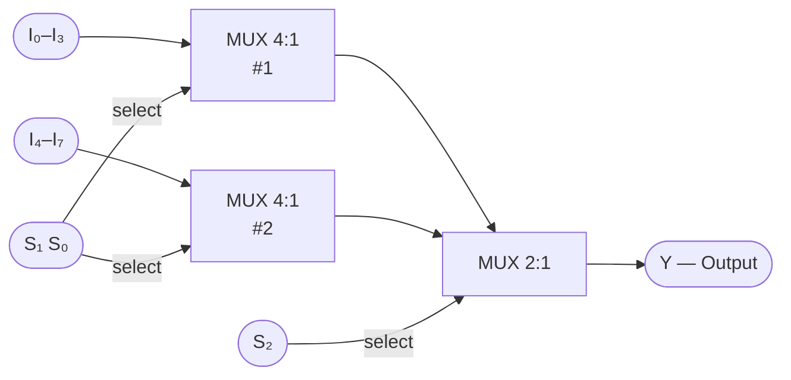

---

## 5.9 Demultiplexer — DEMUX (ตัวกระจายสัญญาณ)

รับ **1 อินพุต** กระจายไปยัง **1 ใน $2^n$ เอาต์พุต** ตาม Select lines

### DEMUX 1-to-4

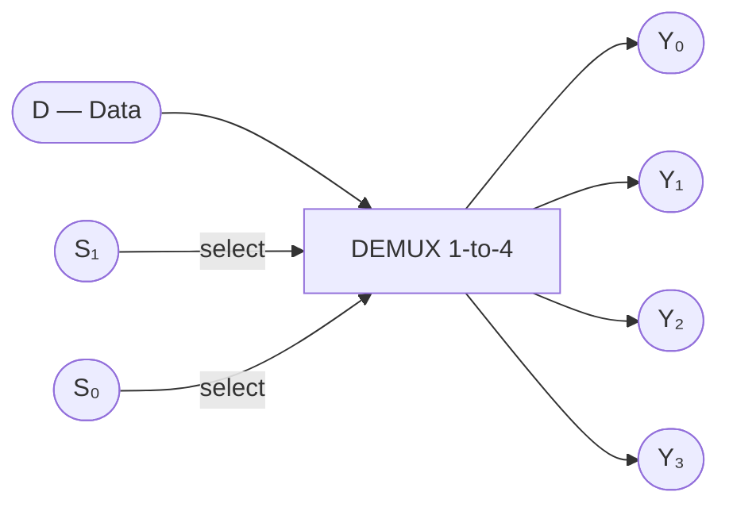

| $S_1$ | $S_0$ | $Y_0$ | $Y_1$ | $Y_2$ | $Y_3$ |
|:---:|:---:|:---:|:---:|:---:|:---:|
| 0 | 0 | D | 0 | 0 | 0 |
| 0 | 1 | 0 | D | 0 | 0 |
| 1 | 0 | 0 | 0 | D | 0 |
| 1 | 1 | 0 | 0 | 0 | D |

$$Y_0 = D \cdot \overline{S_1}\,\overline{S_0}, \quad Y_1 = D \cdot \overline{S_1}\,S_0, \quad Y_2 = D \cdot S_1\,\overline{S_0}, \quad Y_3 = D \cdot S_1\,S_0$$

### Decoder ← → DEMUX

**Decoder + Enable = DEMUX** — ต่อ Data เข้าที่ขา Enable ของ 74138

### ประยุกต์: Data Multiplexing ผ่านสายเดียว

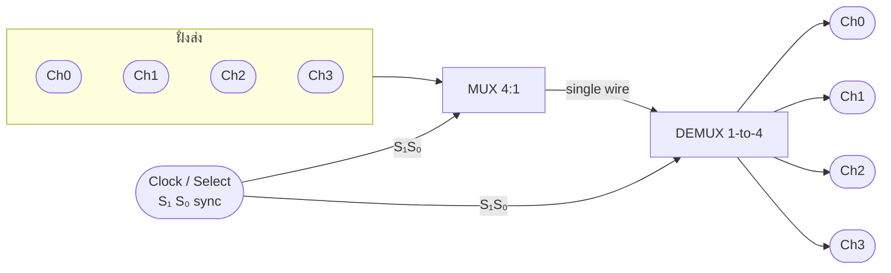

---

## 5.10 สรุปเปรียบเทียบวงจรเชิงผสม

| วงจร | ทิศทาง | Input | Output | IC |
|:---|:---:|:---:|:---:|:---:|
| Encoder | $2^n \to n$ | $2^n$ | $n$ | 74148 |
| Priority Encoder | $2^n \to n$ (priority) | $2^n$ | $n+1$ (V) | 74148 |
| Decoder | $n \to 2^n$ | $n$ | $2^n$ | 74138, 74139 |
| MUX | หลาย → 1 | $2^n + n$ | 1 | 74151, 74153 |
| DEMUX | 1 → หลาย | $1 + n$ | $2^n$ | 74138 |

### IC สรุปที่ต้องรู้:

| IC | ฟังก์ชัน | หมายเหตุ |
|:---:|:---|:---|
| **7483** | 4-bit Full Adder | พร้อม Fast Carry |
| **7485** | 4-bit Magnitude Comparator | Cascade ได้ |
| **74138** | 3-to-8 Decoder / DEMUX 1-to-8 | Active LOW output |
| **74139** | Dual 2-to-4 Decoder | Active LOW output |
| **74148** | 8-to-3 Priority Encoder | Active LOW I/O |
| **74151** | 8:1 MUX | มี complement output |
| **74153** | Dual 4:1 MUX | 2 ตัวใน IC เดียว |
| **7447** | BCD→7-Seg Decoder | Active LOW, common-anode |
| **4511** | BCD→7-Seg Decoder | Active HIGH, CMOS |

---

## แบบฝึกหัดท้ายบท

1. ออกแบบ 4-bit Ripple Carry Adder จาก Full Adder — วาดแผนผังและทดสอบ 6+9
2. ใช้ MUX 4:1 สร้างฟังก์ชัน $F(A,B,C) = \sum m(0, 2, 5, 7)$ ด้วยเทคนิคตัวแปรสุดท้าย
3. ใช้ MUX 8:1 สร้างฟังก์ชัน $F(A,B,C) = \sum m(1, 2, 6, 7)$
4. ใช้ Decoder 3-to-8 + NAND gate สร้าง $F(A,B,C) = \sum m(0, 3, 5, 6)$
5. ออกแบบ BCD to 7-Segment สำหรับ segment `e` โดยใช้ K-Map
6. เปรียบเทียบข้อดีข้อเสียของ Normal Encoder กับ Priority Encoder
7. ต่อวงจร 4-bit Adder + 7-Segment Display บน **Tinkercad** โดยใช้ IC 7483 + 4511
8. ออกแบบวงจร 2's complement subtractor โดยใช้ IC 7483 + NOT gates
