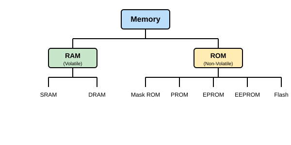
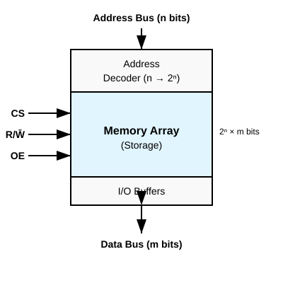
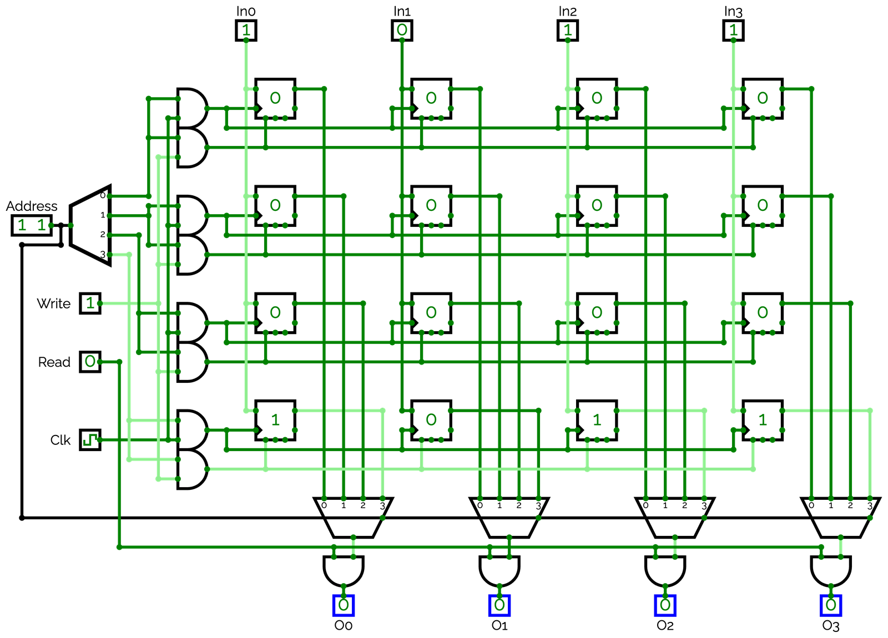
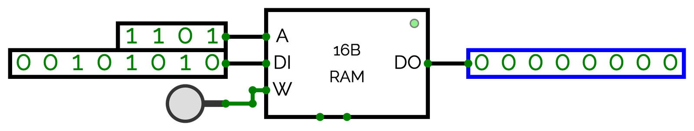
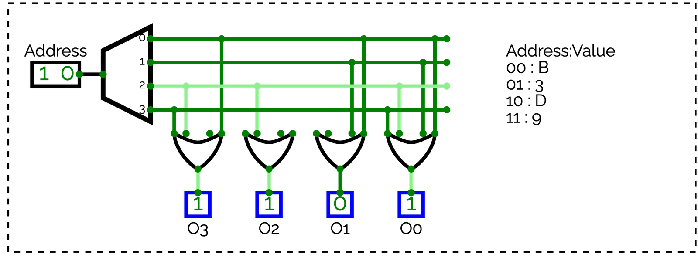
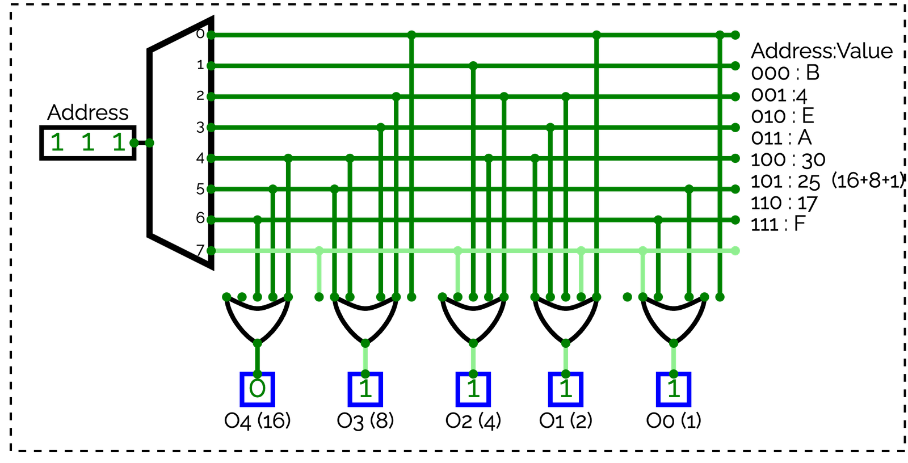
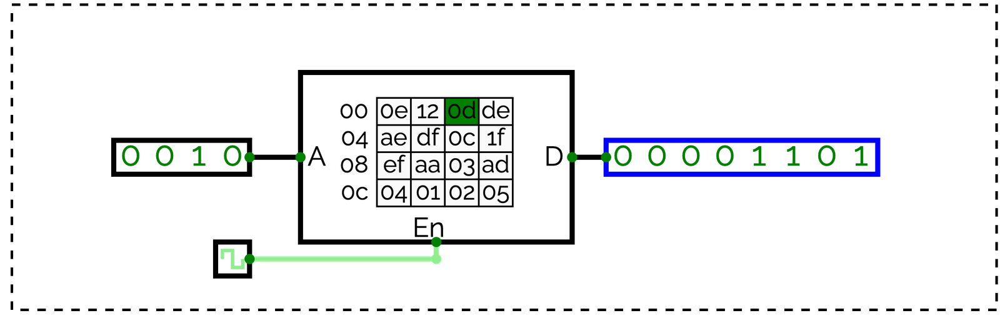
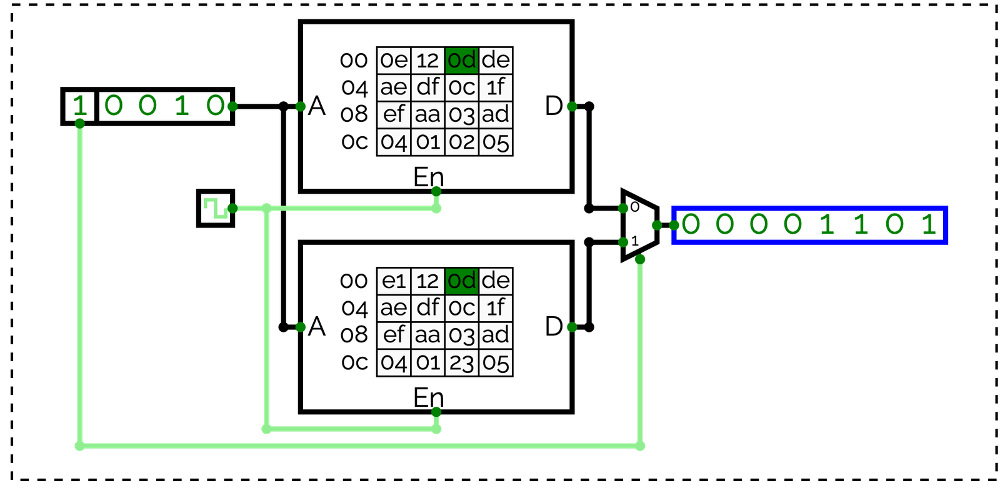
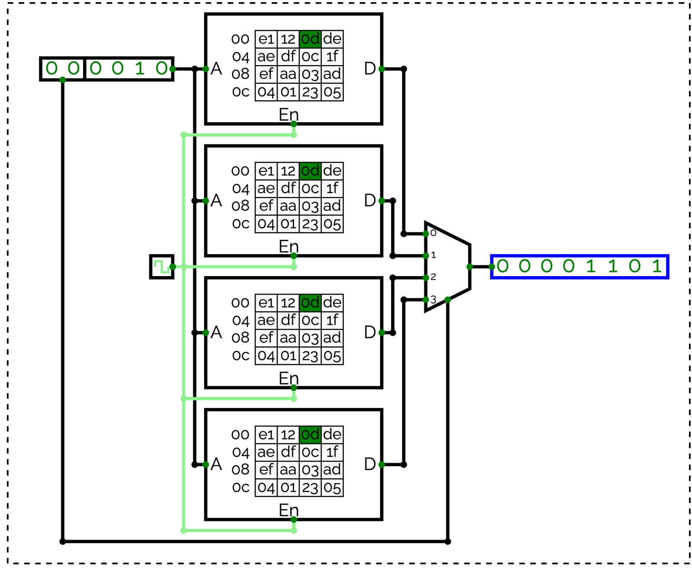
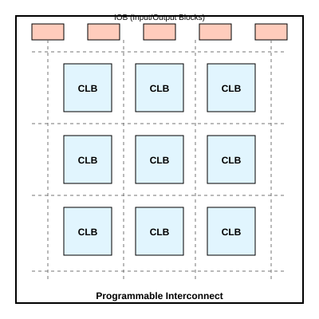

# Chapter 8: หน่วยความจำ PLD และการแปลงสัญญาณ ADC/DAC

## Memory Devices, Programmable Logic & Data Conversion

---

**รายวิชา:** ตรรกศาสตร์ของดิจิตอลคอมพิวเตอร์ (Digital Computer Logic)  
**เนื้อหา:** สัปดาห์ที่ 12  

---

<div class="chapter-tab-content" data-tab-name="Concept" data-tab-icon="💡" id="concept" markdown="1">

## 🎯 แผนที่การเรียนรู้บทที่ 8 (Learning Roadmap)

เมื่อศึกษาวงจรลอจิกเชิงลำดับ (Sequential Logic) เช่น ฟลิปฟลอป วงจรนับ และชิฟต์เรจิสเตอร์ในบทก่อนหน้าแล้ว ในบทนี้เราจะก้าวเข้าสู่ **ระบบดิจิทัลระดับโครงสร้าง (System-Level Digital Systems)** ซึ่งประกอบด้วย 3 เสาหลักสำคัญ:

```text
┌─────────────────────────────────────────────────────────────────────────┐
│                      สถาปัตยกรรมระบบดิจิทัลครบวงจร                          │
├───────────────────┬─────────────────────────┬───────────────────────────┤
│ 1. การจัดเก็บข้อมูล │ 2. การประมวลผลที่ยืดหยุ่น  │ 3. การเชื่อมต่อกับโลกจริง  │
│    (Memory)       │    (PLD & FPGA)         │    (Data Conversion)      │
├───────────────────┼─────────────────────────┼───────────────────────────┤
│ • RAM (SRAM/DRAM) │ • PROM vs PLA vs PAL    │ • DAC (R-2R Ladder)       │
│ • ROM & Flash     │ • CPLD และ FPGA         │ • ADC (Sampling/Quantize) │
│ • Address Decode  │ • Look-Up Table (LUT)   │ • PWM & Interfacing       │
└───────────────────┴─────────────────────────┴───────────────────────────┘
```

---

# ภาคที่ 1: สถาปัตยกรรมและเทคโนโลยีหน่วยความจำ (Memory Devices)

## 8.1 จากฟลิปฟลอปสู่ระบบหน่วยความจำ (From Flip-Flops to Memory)

ในบทที่ 6 และ 7 เราทราบว่า **ฟลิปฟลอป 1 ตัว เก็บข้อมูลได้ 1 บิต** และการนำฟลิปฟลอปมาต่อรวมกันเป็น **เรจิสเตอร์ (Register)** ช่วยให้เก็บข้อมูลได้ 4 ถึง 8 บิต 

แต่ระบบคอมพิวเตอร์จริงต้องการจัดเก็บข้อมูลนับพันล้านบิต การต่อฟลิปฟลอปทีละตัวจะสิ้นเปลืองสายสัญญาณและพื้นที่บนชิปมหาศาล จึงเกิดการพัฒนา **สถาปัตยกรรมหน่วยความจำ (Memory Architecture)** ที่รวมเซลล์จัดเก็บเข้าเป็นตาราง 2 มิติ (Matrix Array) และใช้สายสัญญาณร่วมกัน



หน่วยความจำแบ่งออกเป็น 2 กลุ่มใหญ่ตามการคงอยู่ของข้อมูล:
1. **RAM (Random Access Memory):** หน่วยความจำแบบลบเลือนได้ (**Volatile**) — ข้อมูลจะสูญหายทันทีเมื่อปิดไฟเลี้ยง อ่านและเขียนข้อมูลได้รวดเร็ว
2. **ROM (Read-Only Memory):** หน่วยความจำแบบไม่ลบเลือน (**Non-Volatile**) — ข้อมูลยังคงอยู่แม้ไม่มีไฟเลี้ยง เหมาะสำหรับเก็บโปรแกรมเริ่มต้นระบบ (Bootloader/Firmware)

---

## 8.2 สถาปัตยกรรมภายในและสัญญาณควบคุม (Memory Architecture & Control Signals)

โครงสร้างภายในของหน่วยความจำมาตรฐานประกอบด้วย 3 ส่วนหลัก:



### หน้าที่ของบัสและสัญญาณควบคุม

1. **Address Bus ($n$ เส้น):** บัสสัญญาณอินพุตสำหรับระบุตำแหน่งที่ต้องการอ่านหรือเขียน หากมี $n$ เส้น จะเข้าถึงตำแหน่งข้อมูลได้ทั้งหมด $2^n$ ตำแหน่ง (Words)
2. **Address Decoder ($n \to 2^n$):** วงคารถอดรหัส ทำหน้าที่เปลี่ยนรหัสแอดเดรส $n$ บิต ให้กลายเป็นสัญญาณเลือกแถว (Word Line) เพียงแถวเดียวในแต่ละขณะ
3. **Memory Array ($2^n \times m$ บิต):** ตารางเซลล์เก็บข้อมูล จัดเรียงเป็น $2^n$ แถว โดยแต่ละแถวมีความกว้าง $m$ บิต
4. **Data Bus ($m$ เส้น):** บัสรับ-ส่งข้อมูลแบบสองทิศทาง (Bi-directional) กว้าง $m$ บิต เท่ากับขนาดข้อมูลต่อหนึ่งตำแหน่ง
5. **สัญญาณควบคุม (Control Signals):**
   - **$\text{CS}$ หรือ $\text{CE}$ (Chip Select / Chip Enable):** เปิด/ปิดการทำงานของชิปตัวนั้น (มักทำงานแบบ Active-LOW: $\overline{\text{CS}}$)
   - **$\text{R/}\overline{\text{W}}$ (Read/Write):** กำหนดทิศทางการทำงาน ($1 = \text{Read}$ อ่านข้อมูลออก, $0 = \text{Write}$ เขียนข้อมูลเข้า)
   - **$\text{OE}$ (Output Enable):** สั่งเปิดบัฟเฟอร์เอาต์พุตให้ขับสัญญาณลง Data Bus หาก $\text{OE} = 0$ ขาเอาต์พุตจะอยู่ในสถานะอิมพีแดนซ์สูง (**High-Z**) เพื่อไม่ให้ชนกับชิปตัวอื่น

---

## 8.3 การคำนวณขนาดและความจุหน่วยความจำ (Memory Capacity Calculations)

ความจุของหน่วยความจำระบุในรูป:

$$\text{ความจุรวม} = \text{จำนวนตำแหน่ง (Addresses)} \times \text{ความกว้างข้อมูลต่อตำแหน่ง (Data Bits)}$$

$$\text{Total Bits} = 2^n \times m$$

โดยที่ $n$ คือจำนวนเส้นของ Address Bus และ $m$ คือจำนวนเส้นของ Data Bus

> 💡 **หน่วยวัดความจุในระบบดิจิทัล:**
> - $1\text{ K (Kilo)} = 2^{10} = 1,024$
> - $1\text{ M (Mega)} = 2^{20} = 1,048,576$
> - $1\text{ G (Giga)} = 2^{30} = 1,073,741,824$
> - $1\text{ Byte} = 8\text{ bits}$

---

### ตัวอย่างการคำนวณ

#### 📌 ตัวอย่างที่ 8.1: คำนวณความจุจากจำนวนขา
**โจทย์:** ชิปหน่วยความจำตัวหนึ่งมีขา Address 12 ขา ($A_0 - A_{11}$) และขา Data 8 ขา ($D_0 - D_7$) จงหาความจุรวมในหน่วย Byte
- จำนวนตำแหน่ง = $2^{12} = 4,096$ ตำแหน่ง ($4\text{ K}$)
- ความกว้างข้อมูล = $8\text{ bits} = 1\text{ Byte}$
- ความจุรวม = $4,096 \times 8\text{ bits} = 4,096\text{ Bytes} = \mathbf{4\text{ KB}}$

#### 📌 ตัวอย่างที่ 8.2: หาจำนวนขาจากความจุที่กำหนด
**โจทย์:** ต้องการชิปหน่วยความจำขนาด $64\text{ KB}$ โดยส่งข้อมูลครั้งละ 8 บิต จะต้องมีขา Address และ Data กี่เส้น?
- ข้อมูล 8 บิต $\to$ Data Bus มี **8 เส้น** ($m = 8$)
- ความจุ $64\text{ KB} = 64 \times 1,024 = 65,536$ ตำแหน่ง
- จากสมการ $2^n = 65,536 \implies n = \log_2(65,536) = 16$
- ดังนั้น ต้องใช้ Address Bus **16 เส้น** ($A_0 - A_{15}$)

---

## 8.4 หน่วยความจำ RAM: SRAM vs DRAM

คำว่า **Random Access** หมายถึง **"การเข้าถึงแบบสุ่มได้เท่าเทียมกันทุกตำแหน่ง"** ไม่ว่าจะอ่านตำแหน่งแรกสุดหรือตำแหน่งสุดท้าย วงจรจะใช้เวลาหน่วงเท่ากันเสมอ ต่างจากเทปแม่เหล็กที่ต้องกรอข้ามลำดับ



### การเปรียบเทียบ SRAM และ DRAM

| คุณสมบัติ | SRAM (Static RAM) | DRAM (Dynamic RAM) |
|:---|:---:|:---:|
| **โครงสร้างเซลล์เก็บข้อมูล** | ฟลิปฟลอป (ทรานซิสเตอร์ 6 ตัว : 6T) | ตัวเก็บประจุ + ทรานซิสเตอร์ (1T-1C) |
| **ความเร็วในการเข้าถึง** | **เร็วมาก (1–10 ns)** ✅ | ช้ากว่า (30–60 ns) |
| **การ Refresh ข้อมูล** | **ไม่ต้องรีเฟรช** (ข้อมูลคงอยู่ตราบใดที่มีไฟ) | **ต้องรีเฟรชตลอดเวลา** (ประจุใน C รั่วไหล) |
| **ความหนาแน่นต่อพื้นที่** | ต่ำ (ชิปมีขนาดใหญ่ต่อความจุ) | **สูงมาก** ✅ (ประหยัดพื้นที่ชิป) |
| **ราคาต่อไบต์** | แพง | **ถูก** ✅ |
| **การใช้งานหลัก** | หน่วยความจำแคช (L1, L2, L3 Cache) | หน่วยความจำหลักของคอมพิวเตอร์ (DDR4, DDR5) |

### กลไกการทำงานของ RAM Array (ระดับเกต)
จากภาพวงจรจำลอง **RAM ขนาด 4 Address × 4 bit** ด้านบน:
1. **Address Decoder (2→4):** ถอดรหัส Address 2 บิต ($A_1, A_0$) เพื่อเลือกว่าจะเปิดแถวใดเพียงแถวเดียวจาก 4 แถว
2. **จังหวะเขียน (Write Cycle):** เมื่อให้ $\text{Write} = 1$ ข้อมูลจากขาเข้า $\text{In}_0 - \text{In}_3$ จะไหลผ่านเกตเข้าไปประจุลงในเซลล์ฟลิปฟลอปของแถวที่ถูกเลือกตามจังหวะสัญญาณนาฬิกา (Clk)
3. **จังหวะอ่าน (Read Cycle):** สัญญาณจากเซลล์ของแต่ละแถวจะถูกส่งต่อเข้าสู่มัลติเพล็กเซอร์ (Multiplexer) แถวล่างสุด ซึ่งถูกควบคุมด้วยแอดเดรสเดียวกัน เพื่อเลือกส่งข้อมูลของแถวนั้นออกทาง $\text{O}_0 - \text{O}_3$



ในระดับชิปสำเร็จรูป (Black Box View) เราไม่ต้องต่อเกตทีละตัว แต่เชื่อมต่อเพียงบัสแอดเดรส ข้อมูลเข้า ข้อมูลออก และสัญญาณควบคุมทิศทางข้อมูล ($\text{W}$)

---

## 8.5 หน่วยความจำ ROM: สถาปัตยกรรมและเทคโนโลยี

**ROM (Read-Only Memory)** ถูกออกแบบมาเพื่ออ่านข้อมูลอย่างเดียว ข้อมูลถูกบันทึกไว้ถาวรโดยไม่สูญหายเมื่อตัดไฟ

### 1. วิวัฒนาการของเทคโนโลยี ROM

1. **Mask ROM:** บันทึกข้อมูลตั้งแต่อยู่ในขั้นตอนกระบวนการผลิตของโรงงาน แก้ไขไม่ได้ ต้นทุนต่ำมากเมื่อผลิตจำนวนมหาศาล
2. **PROM (Programmable ROM):** ชิปเปล่าจากโรงงาน ผู้ใช้สามารถ "เบิร์น" ข้อมูลลงชิปได้เอง 1 ครั้ง โดยการเป่าฟิวส์ขนาดจิ๋ว (Fusible Links) ภายในชิปให้ขาด
3. **EPROM (Erasable PROM):** ลบข้อมูลเดิมได้โดยการส่องรังสีอัลตราไวโอเลต (UV) ผ่านกระจกควอตซ์บนตัวชิป แล้วนำมาโปรแกรมใหม่ได้
4. **EEPROM (Electrically Erasable PROM):** ลบและเขียนใหม่ได้ด้วยสัญญาณไฟฟ้าทีละไบต์ ไม่ต้องถอดชิปออกจากบอร์ด
5. **Flash Memory:** พัฒนาต่อยอดจาก EEPROM สามารถลบและเขียนข้อมูลเป็นบล็อกขนาดใหญ่ได้อย่างรวดเร็ว นิยมใช้ใน Thumb Drive, MicroSD และ SSD

### 2. NAND Flash vs NOR Flash

| คุณสมบัติ | NAND Flash | NOR Flash |
|:---|:---:|:---:|
| **ความจุต่อราคา** | **สูงมาก / ราคาถูก** ✅ | ต่ำ / ราคาสูง |
| **การเข้าถึงข้อมูล** | อ่าน/เขียนเป็นบล็อก (Page/Block) | **เข้าถึงแบบสุ่มทีละไบต์ได้โดยตรง** (XIP) ✅ |
| **ความเร็วในการอ่าน** | ปานกลาง | **เร็วมาก** ✅ |
| **ความเร็วในการเขียน/ลบ**| **เร็วมาก** ✅ | ช้า |
| **การใช้งาน** | SSD, SD Card, สมาร์ตโฟน | เก็บ BIOS, UEFI, เฟิร์มแวร์อุปกรณ์ไมโครคอนโทรลเลอร์ |

---

### 3. โครงสร้างภายในของ ROM: Address Decoder + OR Array

หัวใจของ ROM คือวงจร **Address Decoder ต่อร่วมกับ OR Array** ที่กำหนดค่าเอาต์พุตไว้ล่วงหน้า:



**การทำงานของ ROM 4 Address × 4 bit:**
- อินพุต Address 2 บิต ($A_1, A_0$) ถูกถอดรหัสเป็นเส้นเลือก 4 เส้น
- จุดตัดใดที่มีการเชื่อมสายเข้ากับ OR Gate ประจำคอลัมน์ จะให้เอาต์พุตเป็นลอจิก `1` จุดที่ปล่อยลอยไว้จะเป็น `0`
- ตัวอย่าง: เมื่อป้อน Address = `10` แถวที่ 2 ทำงาน ส่งสัญญาณเข้า OR gate ของคอลัมน์ $O_3, O_2, O_0$ ทำให้ได้ค่าเอาต์พุต `1101` (Hex: D)



> 💡 **แนวคิดสำคัญ: ROM คือวงจร Combinational Logic (Look-Up Table)**
> สังเกตว่าโครงสร้างของ ROM คือการ **จำลองตารางความจริง (Truth Table)** ทั้งหมดลงบนฮาร์ดแวร์!
> - อินพุต Address = ตัวแปรต้นของสมการ ($A, B, C, \dots$)
> - เอาต์พุต Data = ผลลัพธ์ของฟังก์ชันลอจิก ($F_0, F_1, \dots$)
> เราสามารถใช้วงจร ROM เพียงตัวเดียวทดแทนวงจรตรรกะที่ซับซ้อน เช่น การสร้าง **Full Adder จาก ROM** โดยไม่ต้องต่อเกตแม้แต่ตัวเดียว (ดังที่ได้ปฏิบัติใน Lab 14)

---

## 8.6 การถอดรหัสที่อยู่และการขยายขนาดหน่วยความจำ (Address Decoding & Expansion)

เมื่อระบบต้องการหน่วยความจำขนาดใหญ่กว่าชิปตัวเดียวที่มีขายในท้องตลาด เราจะใช้วิธี **ขยายหน่วยความจำ (Memory Expansion)** โดยการต่อชิปหลายตัวเข้ากับบัสร่วมกัน

### กฎทองของการต่อขยายหน่วยความจำ
1. **บัสข้อมูล (Data Bus):** เชื่อมต่อขนานถึงกันทุกตัว
2. **บัสแอดเดรสบิตล่าง (Lower Address Bits):** ต่อขนานเข้ากับขาแอดเดรสของชิปทุกตัว เพื่อเลือกตำแหน่งภายในตัวชิป
3. **บัสแอดเดรสบิตบน (Higher Address Bits):** นำไปเข้าวงคารถอดรหัส (Address Decoder เช่น 74138) เพื่อสร้างสัญญาณ **Chip Select ($\overline{\text{CS}}$)** เลือกให้ชิปทำงานทีละตัวเท่านั้น

---

### ภาพจำลองการขยายขนาดทีละขั้นตอน

#### ขั้นที่ 1: ชิปเดี่ยวขนาด 16 × 8 bits (ความจุ 16 Bytes)
ใช้ Address Bus 4 บิต ($A_3 - A_0$) ระบุตำแหน่ง $0000_2$ ถึง $1111_2$ (ช่วงแอดเดรส: `00h - 0Fh`)



#### ขั้นที่ 2: ขยายเป็น 32 × 8 bits (ความจุ 32 Bytes) ด้วยชิป 2 ตัว
เพิ่ม Address Bus อีก 1 บิตเป็น 5 บิต ($A_4 - A_0$):
- $A_3 - A_0$ ต่อขนานเข้าชิปทั้งสอง
- **$A_4$ เป็นตัวเลือกชิป:** ถ้า $A_4 = 0$ เลือกชิปตัวที่ 1 (`00h - 0Fh`), ถ้า $A_4 = 1$ เลือกชิปตัวที่ 2 (`10h - 1Fh`)



#### ขั้นที่ 3: ขยายเป็น 64 × 8 bits (ความจุ 64 Bytes) ด้วยชิป 4 ตัว
ใช้ Address Bus รวม 6 บิต ($A_5 - A_0$):
- $A_3 - A_0$ เลือกตำแหน่งภายในชิป
- บิตบน **$A_5, A_4$** นำไปผ่าน Decoder เพื่อสร้างสัญญาณเปิดชิป 1 ใน 4 ตัว



### ตารางแผนผังหน่วยความจำ (Memory Map)

| ชิป | $A_5$ | $A_4$ | ช่วงแอดเดรส (Hex) | ขนาดความจุ | สัญญาณควบคุม |
|:---:|:---:|:---:|:---:|:---:|:---:|
| **Chip 0** | 0 | 0 | `00h` – `0Fh` | 16 Bytes | $\text{CS}_0 = 0$ |
| **Chip 1** | 0 | 1 | `10h` – `1Fh` | 16 Bytes | $\text{CS}_1 = 0$ |
| **Chip 2** | 1 | 0 | `20h` – `2Fh` | 16 Bytes | $\text{CS}_2 = 0$ |
| **Chip 3** | 1 | 1 | `30h` – `3Fh` | 16 Bytes | $\text{CS}_3 = 0$ |

---

# ภาคที่ 2: อุปกรณ์ลอจิกโปรแกรมได้ (Programmable Logic Devices - PLD)

## 8.7 ทำไมต้องใช้ PLD? (Why Programmable Logic?)

ในการสร้างวงจรดิจิทัลยุคแรก วิศวกรต้องนำไอซีลอจิกเกตพื้นฐาน (ตระกูล 74xx) หลายสิบตัวมาต่อสายเข้าด้วยกันบนแผ่นปริ้นต์ (PCB) ซึ่งก่อให้เกิดปัญหา:
- ขนาดแผงวงจรใหญ่และมีจุดบัดกรีจำนวนมาก
- สัญญาณรบกวนสูงและกินพลังงานมาก
- เมื่อต้องการแก้ไขการทำงาน ต้องออกแบบแผงวงจรใหม่ทั้งหมด

**อุปกรณ์ลอจิกโปรแกรมได้ (PLD: Programmable Logic Device)** แก้ปัญหานี้โดยการบรรจุโครงข่ายเกตลอจิกจำนวนมหาศาลไว้ในชิปตัวเดียว แล้วเปิดให้ผู้ออกแบบ "โปรแกรมการเชื่อมต่อวงจรภายใน" ได้ตามต้องการผ่านคอมพิวเตอร์

### ตารางเปรียบเทียบสถาปัตยกรรมหัวใจของตระกูล PLD

สถาปัตยกรรมพื้นฐานของ PLD ทุกชนิดสร้างขึ้นบนรูปแบบสมการ **Sum of Products (SOP)** คือประกอบด้วย **AND Array (เทอมคูณ)** และ **OR Array (เทอมบวก)**

| ตระกูลอุปกรณ์ | โครงสร้าง AND Array | โครงสร้าง OR Array | จุดเด่น |
|:---|:---:|:---:|:---|
| **PROM** | ตายตัว (Fixed) | โปรแกรมได้ (Programmable) | เก็บตารางความจริงครบทุก Minterm |
| **PLA** (Prog. Logic Array) | **โปรแกรมได้** | **โปรแกรมได้** | **ยืดหยุ่นสูงสุด** แชร์ Product Term ข้ามเอาต์พุตได้ |
| **PAL** (Prog. Array Logic) | **โปรแกรมได้** | **ตายตัว (Fixed)** | **ความเร็วสูง วงจรง่าย ต้นทุนต่ำ** |
| **GAL** (Generic Array Logic)| **โปรแกรมได้** | ตายตัว (พร้อม OLMC) | ใช้เทคโนโลยี EEPROM ลบและเขียนใหม่ได้ |

---

## 8.8 PLA (Programmable Logic Array)

PLA เป็นอุปกรณ์ที่มีความยืดหยุ่นสูงสุดเพราะสามารถโปรแกรมได้ทั้งฝั่ง AND Array และ OR Array

<svg viewBox="0 0 720 370" role="img" aria-label="โครงสร้างภายในของ PLA: Input Inverters, AND Array โปรแกรมได้, OR Array โปรแกรมได้" style="width:100%; max-width:700px; height:auto; display:block; margin:1.25rem auto; font-family:'Segoe UI',system-ui,sans-serif;">
  <defs>
    <marker id="arrow-pla-new" viewBox="0 0 10 10" refX="9" refY="5" markerWidth="7" markerHeight="7" orient="auto-start-reverse">
      <path d="M0,0 L10,5 L0,10 z" fill="#475569"/>
    </marker>
  </defs>

  <!-- Headers -->
  <text x="100" y="24" text-anchor="middle" font-size="13" font-weight="600" fill="#0f172a">อินพุต (Inputs)</text>
  <text x="360" y="24" text-anchor="middle" font-size="13" font-weight="600" fill="#0f172a">AND Array (โปรแกรมได้)</text>
  <text x="610" y="24" text-anchor="middle" font-size="13" font-weight="600" fill="#0f172a">OR Array (โปรแกรมได้)</text>

  <!-- Inputs -->
  <text x="40" y="60" font-size="13" font-weight="600" fill="#0f172a">A</text>
  <path d="M55,64 L260,64" fill="none" stroke="#475569" stroke-width="1.5"/>
  <text x="40" y="100" font-size="13" font-weight="600" fill="#0f172a">A'</text>
  <path d="M55,104 L260,104" fill="none" stroke="#475569" stroke-width="1.5"/>
  <text x="40" y="140" font-size="13" font-weight="600" fill="#0f172a">B</text>
  <path d="M55,144 L260,144" fill="none" stroke="#475569" stroke-width="1.5"/>
  <text x="40" y="180" font-size="13" font-weight="600" fill="#0f172a">B'</text>
  <path d="M55,184 L260,184" fill="none" stroke="#475569" stroke-width="1.5"/>

  <!-- Programmed connections for AND gates -->
  <!-- P1 = A.B -->
  <circle cx="120" cy="64" r="4.5" fill="#4f46e5"/>
  <circle cx="120" cy="144" r="4.5" fill="#4f46e5"/>
  <path d="M120,64 L120,86 L300,86" fill="none" stroke="#4f46e5" stroke-width="1.5" marker-end="url(#arrow-pla-new)"/>

  <!-- P2 = A'.B' -->
  <circle cx="165" cy="104" r="4.5" fill="#4f46e5"/>
  <circle cx="165" cy="184" r="4.5" fill="#4f46e5"/>
  <path d="M165,104 L165,184 L165,208 L300,208" fill="none" stroke="#4f46e5" stroke-width="1.5" marker-end="url(#arrow-pla-new)"/>

  <!-- P3 = A.B' -->
  <circle cx="210" cy="64" r="4.5" fill="#4f46e5"/>
  <circle cx="210" cy="184" r="4.5" fill="#4f46e5"/>
  <path d="M210,64 L210,184 L210,318 L300,318" fill="none" stroke="#4f46e5" stroke-width="1.5" marker-end="url(#arrow-pla-new)"/>

  <!-- AND Gate Blocks -->
  <rect x="300" y="64" width="110" height="44" rx="6" fill="#f1f5f9" stroke="#334155" stroke-width="1.5"/>
  <text x="355" y="82" text-anchor="middle" font-size="11.5" font-weight="600" fill="#0f172a">AND (P1)</text>
  <text x="355" y="98" text-anchor="middle" font-size="11" fill="#475569">A·B</text>

  <rect x="300" y="186" width="110" height="44" rx="6" fill="#f1f5f9" stroke="#334155" stroke-width="1.5"/>
  <text x="355" y="204" text-anchor="middle" font-size="11.5" font-weight="600" fill="#0f172a">AND (P2)</text>
  <text x="355" y="220" text-anchor="middle" font-size="11" fill="#475569">A'·B'</text>

  <rect x="300" y="296" width="110" height="44" rx="6" fill="#f1f5f9" stroke="#334155" stroke-width="1.5"/>
  <text x="355" y="314" text-anchor="middle" font-size="11.5" font-weight="600" fill="#0f172a">AND (P3)</text>
  <text x="355" y="330" text-anchor="middle" font-size="11" fill="#475569">A·B'</text>

  <!-- Connections to OR Gates -->
  <!-- O1 = P1 + P2 -->
  <rect x="520" y="110" width="110" height="44" rx="6" fill="#fef3c7" stroke="#b45309" stroke-width="1.5"/>
  <text x="575" y="128" text-anchor="middle" font-size="11.5" font-weight="600" fill="#0f172a">OR Gate</text>
  <text x="575" y="144" text-anchor="middle" font-size="11" fill="#b45309">P1 + P2</text>
  <path d="M410,86 L470,86 L470,122 L520,122" fill="none" stroke="#475569" stroke-width="1.5" marker-end="url(#arrow-pla-new)"/>
  <path d="M410,208 L470,208 L470,138 L520,138" fill="none" stroke="#475569" stroke-width="1.5" marker-end="url(#arrow-pla-new)"/>
  <path d="M630,132 L680,132" fill="none" stroke="#475569" stroke-width="2" marker-end="url(#arrow-pla-new)"/>
  <text x="700" y="136" font-size="13" font-weight="600" fill="#0f172a">O1</text>

  <!-- O2 = P1 + P3 (Notice P1 is shared!) -->
  <rect x="520" y="240" width="110" height="44" rx="6" fill="#fef3c7" stroke="#b45309" stroke-width="1.5"/>
  <text x="575" y="258" text-anchor="middle" font-size="11.5" font-weight="600" fill="#0f172a">OR Gate</text>
  <text x="575" y="274" text-anchor="middle" font-size="11" fill="#b45309">P1 + P3</text>
  <path d="M470,86 L490,86 L490,252 L520,252" fill="none" stroke="#475569" stroke-width="1.5" marker-end="url(#arrow-pla-new)"/>
  <path d="M410,318 L490,318 L490,268 L520,268" fill="none" stroke="#475569" stroke-width="1.5" marker-end="url(#arrow-pla-new)"/>
  <path d="M630,262 L680,262" fill="none" stroke="#475569" stroke-width="2" marker-end="url(#arrow-pla-new)"/>
  <text x="700" y="266" font-size="13" font-weight="600" fill="#0f172a">O2</text>
</svg>

### จุดเด่นของการแชร์ Product Term ใน PLA
สังเกตเส้นทางของเทอม $P_1 = A \cdot B$ ในวงจรด้านบน:
- $P_1$ ถูกสร้างขึ้นจาก AND Gate เพียงตัวเดียว
- แต่ถูกลากไปเข้าทั้ง OR Gate ของ $O_1$ และ OR Gate ของ $O_2$ พร้อมกัน
- ทำให้ประหยัดจำนวนเกตลอจิกได้อย่างมาก เหมาะกับวงจรที่มีเทอมร่วมกันหลายตัว

---

## 8.9 PAL (Programmable Array Logic) และตัวอย่างการออกแบบ

ถึงแม้ PLA จะยืดหยุ่นสูง แต่ข้อเสียคือสัญญาณต้องวิ่งผ่านส่วนเชื่อมต่อที่โปรแกรมได้ถึง 2 ชั้น ทำให้ความเร็วลดลง บริษัทผู้ออกแบบจึงคิดค้น **PAL** โดยให้ **AND Array โปรแกรมได้ แต่ตรึง OR Array ไว้คงที่ (Fixed OR)**

### ตัวอย่างการออกแบบ: วงจรควบคุมเตาอบไมโครเวฟ (Smart Microwave Controller)

เราต้องการออกแบบวงจรความปลอดภัยของไมโครเวฟด้วย PAL โดยกำหนดเงื่อนไข:
- **อินพุต:**
  - $\text{Door}$: ประตูปิดสนิท ($1 = \text{ปิด}$)
  - $\text{Timer}$: ยังมีเวลาอุ่นเหลืออยู่ ($1 = \text{เวลาไม่หมด}$)
  - $\text{Start}$: มีการกดปุ่มเริ่มทำงาน ($1 = \text{กด}$)
  - $\text{Overheat}$: เตาอบร้อนเกินขีดจำกัด ($1 = \text{ร้อนเกิน}$)
- **เอาต์พุต:**
  - $\text{Magnetron}$: สั่งจ่ายคลื่นความร้อน
  - $\text{Light}$: ไฟส่องสว่างภายในเตา
  - $\text{Buzzer}$: สัญญาณเสียงเตือน

#### สมการลอจิก (Logic Equations):
1. **หัวคลื่น ($\text{Magnetron}$):** จะทำงานเมื่อประตูปิด AND เวลาเหลือ AND กดเริ่ม AND เตาไม่ร้อนเกิน
   $$\text{Magnetron} = \text{Door} \cdot \text{Timer} \cdot \text{Start} \cdot \overline{\text{Overheat}}$$
2. **ไฟส่อง ($\text{Light}$):** เปิดเมื่อเปิดประตู OR เมื่อหัวคลื่นกำลังทำงาน
   $$\text{Light} = \overline{\text{Door}} + (\text{Door} \cdot \text{Timer} \cdot \text{Start} \cdot \overline{\text{Overheat}})$$
3. **เสียงเตือน ($\text{Buzzer}$):** ดังเมื่อเตาร้อนเกิน OR เมื่ออุ่นอาหารเสร็จ (เวลาหมดขณะประตูปิด)
   $$\text{Buzzer} = \text{Overheat} + (\overline{\text{Timer}} \cdot \text{Door})$$

#### เมทริกซ์การโปรแกรม PAL (PAL Programming Matrix):

```text
[ AND Array - โปรแกรมได้ ]                       [ Fixed OR ]
อินพุต             P1   P2   P3   P4   P5
────────────────┼────┼────┼────┼────┼────┤
Door            │ X  │    │ X  │    │ X  │
Door'           │    │ X  │    │    │    │
Timer           │ X  │    │ X  │    │    │
Timer'          │    │    │    │    │ X  │
Start           │ X  │    │ X  │    │    │
Overheat        │    │    │    │ X  │    │
Overheat'       │ X  │    │ X  │    │    │
────────────────┴────┴────┴────┴────┴────┘
(X = จุดเชื่อมต่อฟิวส์)

P1 ───────────────────────────────────────► Magnetron
P2 ──┐
P3 ──┴────────────────────────────────────► Light
P4 ──┐
P5 ──┴────────────────────────────────────► Buzzer
```

> ⚠️ **ข้อจำกัดของ PAL ที่เห็นได้ชัด:**
> สังเกตว่าเทอม $P_1$ กับ $P_3$ คือสมการเดียวกัน ($\text{Door} \cdot \text{Timer} \cdot \text{Start} \cdot \overline{\text{Overheat}}$) แต่ PAL ไม่สามารถแชร์ Product Term ได้เหมือน PLA จึงจำเป็นต้องโปรแกรมสร้างเทอมเดิมซ้ำอีกครั้งใน $P_3$ เพื่อป้อนเข้า OR Gate ของ $\text{Light}$

---

## 8.10 ก้าวสู่วงจรความจุสูง: CPLD และ FPGA

เมื่อระบบต้องการความซับซ้อนระดับไมโครโพรเซสเซอร์หรือวงจรประมวลผลกราฟิก PLD แบบพื้นฐานจะไม่เพียงพอ จึงเกิดการพัฒนาเทคโนโลยีขั้นสูง:

### 1. CPLD (Complex Programmable Logic Device)
คือการนำโครงสร้างคล้าย PAL/GAL หลายๆ บล็อก (เรียกว่า Macrocell) มารวมไว้บนชิปตัวเดียว แล้วเชื่อมต่อกันด้วย **Global Interconnect Matrix (GIM)** เหมาะสำหรับงานควบคุมลอจิกความเร็วสูงที่ต้องการความหน่วงเวลาสม่ำเสมอ

### 2. FPGA (Field Programmable Gate Array)
เป็นเทคโนโลยีชิปลอจิกโปรแกรมได้ที่ได้รับความนิยมสูงสุดในปัจจุบัน สามารถจำลองระบบคอมพิวเตอร์ทั้งตัว (System on Chip - SoC) ได้อย่างสมบูรณ์



โครงสร้างภายในของ FPGA ประกอบด้วย:
1. **CLB (Configurable Logic Blocks):** บล็อกลอจิกที่กระจายอยู่ทั่วชิป
2. **IOB (Input/Output Blocks):** บล็อกควบคุมขาเชื่อมต่อกับวงจรภายนอก
3. **Programmable Interconnect:** เส้นทางเดินสายสัญญาณแบบตาข่ายที่สามารถสลับการเชื่อมต่อได้อิสระ

#### หัวใจของ FPGA: Look-Up Table (LUT)
ใน FPGA ไม่ได้ใช้เกต AND และ OR จริงๆ แต่ใช้ **SRAM ขนาดเล็กทำหน้าที่เป็น LUT (Look-Up Table)**
- เช่น **LUT ขนาด 4 อินพุต** คือ SRAM ขนาด 16 บิต
- เมื่อเราออกแบบวงจร ซอฟต์แวร์จะคำนวณตารางความจริง 16 แถว แล้วนำค่า 0/1 ไปหยอดลงใน SRAM
- เมื่อมีสัญญาณอินพุตเข้ามา 4 บิต SRAM จะส่งบิตที่ตรงกับตำแหน่งนั้นออกมาทันที
- ทำให้สร้างฟังก์ชันลอจิกใดๆ ก็ได้ด้วยความเร็วเท่ากันเสมอ!

*(ในบทที่ 9 เราจะได้เรียนรู้การเขียนโค้ดบรรยายฮาร์ดแวร์ด้วยภาษา Verilog HDL เพื่อโปรแกรมลงบน FPGA)*

---

# ภาคที่ 3: การแปลงสัญญาณและการเชื่อมต่อ (Data Conversion: DAC & ADC)

## 8.11 โลกแอนะล็อก vs โลกดิจิทัล (Bridging Physical & Digital Worlds)

คอมพิวเตอร์และชิปประมวลผลทำงานด้วยระบบตัวเลข **ดิจิทัล (0 และ 1)** แต่ปรากฏการณ์ทางกายภาพในโลกจริงล้วนเป็น **แอนะล็อก (ต่อเนื่อง ไม่จำกัดระดับ)** เช่น อุณหภูมิ, ความดัน, แรงดันไฟฟ้า, เสียง, และแสงสว่าง

```text
┌─────────────────┐       ┌─────────────────┐       ┌─────────────────┐
│ โลกกายภาพจริง    │ ────► │  ADC (แปลงเข้า)  │ ────► │ ระบบประมวลผล    │
│ สัญญาณแอนะล็อก   │       │ Analog-to-Digital│       │ (MCU/FPGA/DSP)  │
└─────────────────┘       └─────────────────┘       └────────┬────────┘
         ▲                                                   │
         │                ┌─────────────────┐                │
         └─────────────── │  DAC (แปลงออก)  │ ◄──────────────┘
                          │ Digital-to-Analog│
                          └─────────────────┘
```

- **ADC (Analog-to-Digital Converter):** ทำหน้าที่เป็น "ประสาทสัมผัส" แปลงแรงดันแอนะล็อกเป็นรหัสตัวเลขส่งให้ตัวประมวลผล
- **DAC (Digital-to-Analog Converter):** ทำหน้าที่เป็น "แขนขา" แปลงตัวเลขการคำนวณกลับไปเป็นแรงดันไฟฟ้าแอนะล็อกเพื่อขับอุปกรณ์ภายนอก

---

## 8.12 วงจรแปลงดิจิทัลเป็นแอนะล็อก (DAC: Digital-to-Analog Converter)

### หลักการทำงานและสมการคำนวณ
DAC รับรหัสไบนารีขนาด $n$ บิตเข้ามา แล้วสร้างแรงดันเอาต์พุต $V_{out}$ ตามสัดส่วนของแรงดันอ้างอิง ($V_{ref}$):

$$V_{out} = V_{ref} \times \frac{D}{2^n}$$

โดยที่:
- $V_{ref}$ = แรงดันไฟฟ้าอ้างอิงสูงสุด (Reference Voltage)
- $D$ = ค่าข้อมูลดิจิทัลในเลขฐานสิบ ($0$ ถึง $2^n - 1$)
- $n$ = จำนวนบิตความละเอียด (Resolution)

### พารามิเตอร์สำคัญของ DAC
1. **Resolution (ความละเอียด):** จำนวนบิต $n$ ยิ่งมีบิตมาก ขั้นบันไดของสัญญาณยิ่งละเอียด
2. **Step Size (ขนาดขั้นบันได):** แรงดันที่เปลี่ยนแปลงต่อการเพิ่มค่าดิจิทัลขึ้น 1 LSB:
   $$\text{Step Size} = \frac{V_{ref}}{2^n}$$
3. **Full-Scale Output ($V_{FS}$):** แรงดันสูงสุดที่ DAC จ่ายได้เมื่อป้อนอินพุตเป็น 1 ทุกบิต:
   $$V_{FS} = V_{ref} \times \frac{2^n - 1}{2^n} = V_{ref} - \text{Step Size}$$

---

### โครงสร้างวงจร DAC แบบ R-2R Resistor Ladder

ในทางปฏิบัติ เราไม่นิยมใช้วงจร Binary-Weighted Resistor DAC เพราะต้องการตัวต้านทานหลากหลายค่าที่มีความแม่นยำสูงมาก (เช่น $R, 2R, 4R, 8R, 16R, \dots$) ซึ่งผลิตในไอซีได้ยาก

วงจรมาตรฐานที่นิยมใช้ทั่วโลกคือ **R-2R Ladder DAC** ซึ่งใช้ตัวต้านทานเพียง **2 ค่าเท่านั้น คือ $R$ และ $2R$**:

```text
Vref
  │
 ─── [2R] ───┬─── [2R] ───┬─── [2R] ───┬─── [2R] ───┐
             │            │            │            │
            [R]          [R]          [R]          [R]
             │            │            │            │
            D3           D2           D1           D0   (Input Bits)
           (MSB)                                  (LSB)
             │
             └───────────────────────────────────────► Vout (ผ่าน Op-Amp)
```

**เหตุผลที่ R-2R Ladder ได้รับความนิยม:**
1. ใช้ค่าตัวต้านทานเพียง 2 ค่า ($R$ และ $2R$) จึงสามารถควบคุมความแม่นยำและสัมประสิทธิ์อุณหภูมิในชิปไอซีได้ง่ายมาก
2. สามารถขยายจำนวนบิตเพิ่มได้ง่ายโดยเพียงแค่ต่อบันไดขั้นถัดไป

---

### ตัวอย่างการคำนวณ DAC

#### 📌 ตัวอย่างที่ 8.3: การคำนวณแรงดันเอาต์พุต DAC
**โจทย์:** DAC ขนาด 4 บิต ใช้แรงดันอ้างอิง $V_{ref} = 8\text{ V}$ จงหา:
1. ค่า Step Size
2. แรงดันเอาต์พุต $V_{out}$ เมื่ออินพุตไบนารีคือ $1010_2$
3. แรงดัน Full-Scale สูงสุด ($V_{FS}$)

**วิธีทำ:**
1. $\text{Step Size} = \frac{V_{ref}}{2^n} = \frac{8\text{ V}}{2^4} = \frac{8}{16} = \mathbf{0.5\text{ V ต่อขั้น}}$
2. แปลง $1010_2$ เป็นฐานสิบ: $D = 8 + 2 = 10$
   $$V_{out} = 10 \times 0.5\text{ V} = \mathbf{5.0\text{ V}}$$
3. แรงดัน Full-Scale เมื่ออินพุตเป็น $1111_2$ ($D = 15$):
   $$V_{FS} = 15 \times 0.5\text{ V} = \mathbf{7.5\text{ V}}$$

---

## 8.13 วงจรแปลงแอนะล็อกเป็นดิจิทัล (ADC: Analog-to-Digital Converter)

กระบวนการแปลงแรงดันแอนะล็อกให้กลายเป็นตัวเลขดิจิทัลต้องผ่าน **3 ขั้นตอนตามลำดับ**:

```text
  สัญญาณแอนะล็อก
       │
       ▼
┌──────────────┐      ┌──────────────┐      ┌──────────────┐      ข้อมูลดิจิทัล
│ 1. Sampling  │ ───► │2.Quantization│ ───► │ 3. Encoding  │ ───►  (Binary)
│ สุ่มวัดค่าตามเวลา│      │ ปัดเศษเป็นระดับ │      │ แปลงเป็นเลข 0/1 │
└──────────────┘      └──────────────┘      └──────────────┘
```

### 1. Sampling (การสุ่มตัวอย่าง)
การวัดค่าระดับแรงดันของสัญญาณ ณ ช่วงจังหวะเวลาที่แน่นอน
> **ทฤษฎีบทของไนควิสต์ (Nyquist Sampling Theorem):**
> ความถี่ในการสุ่มตัวอย่าง ($f_s$) จะต้อง **มากกว่าหรือเท่ากับ 2 เท่าของความถี่สูงสุดของสัญญาณ ($f_{max}$)** เสมอ
> $$f_s \geq 2 \times f_{max}$$
> *หากสุ่มช้ากว่านี้ จะเกิดความผิดเพี้ยนของสัญญาณที่เรียกว่า **Aliasing***

### 2. Quantization (การแบ่งระดับ)
การปัดค่าแรงดันที่วัดได้ให้ตกลงใน "ขั้นบันได (Level)" ที่ใกล้เคียงที่สุด
- ADC ขนาด $n$ บิต จะแบ่งระดับได้ทั้งหมด $2^n$ ระดับ
- การปัดเศษนี้จะก่อให้เกิดความคลาดเคลื่อนที่หลีกเลี่ยงไม่ได้ เรียกว่า **Quantization Error** โดยมีค่าสูงสุดไม่เกิน $\mathbf{\pm \frac{1}{2}\text{ LSB}}$

### 3. Encoding (การเข้ารหัส)
การนำระดับขั้นที่ได้มาแปลงเป็นรหัสเลขฐานสอง ($000_2, 001_2, \dots$)

---

### การเปรียบเทียบสถาปัตยกรรม ADC ยอดนิยม

| สถาปัตยกรรม | หลักการทำงาน | ความเร็ว | ความแม่นยำ | ความซับซ้อนของวงจร | การนำไปใช้จริง |
|:---|:---|:---:|:---:|:---:|:---|
| **Flash ADC** | ใช้ตัวเปรียบเทียบแรงดัน (Comparator) ขนานกัน $2^n - 1$ ตัว | **เร็วที่สุดในโลก** ✅ (ns) | ปานกลาง (6–8 บิต) | สูงมาก ($2^n-1$ เกต) | สโคปดิจิทัล, สัญญาณเรดาร์ |
| **SAR ADC** | ใช้วิธีค้นหาแบบไบนารี (Binary Search) ทีละบิต | ปานกลาง (1–5 µs) | **ดี (10–16 บิต)** ✅ | ปานกลาง ประหยัดพลังงาน | ไมโครคอนโทรลเลอร์ (Arduino, STM32) |
| **Sigma-Delta ($\Sigma\Delta$)** | Oversampling + กรองความถี่ดิจิทัล | ช้า (ms) | **สูงมาก (16–24 บิต)** ✅ | ซับซ้อนด้วยคณิตศาสตร์ | ระบบเสียงคุณภาพสูง (Hi-Fi Audio), เครื่องชั่ง |

---

### Flash ADC vs SAR ADC (เข้าใจกลไกได้ง่ายๆ)

#### 1. Flash ADC: "วัดพร้อมกันทุกระดับในพริบตาเดียว"
หากต้องการสร้าง Flash ADC ขนาด 3 บิต จะต้องใช้ Comparator มากถึง $2^3 - 1 = 7$ ตัว ต่อแบ่งแรงดันขนานกัน
- เมื่อแรงดันอินพุตเข้ามา Comparator ทุกตัวจะตัดสินใจพร้อมกันทันที
- ส่งผลให้ได้ผลลัพธ์ในจังหวะ Clock เดียว เร็วที่สุด แต่ถ้าทำ 10 บิต ต้องใช้ Comparator ถึง $1,023$ ตัว!

```text
Vin ──┬── [ Comparator 7 ] ── (มากกว่า 7/8 Vref ?) ──┐
      ├── [ Comparator 6 ] ── (มากกว่า 6/8 Vref ?) ──┤
      ├── [ Comparator 5 ] ── (มากกว่า 5/8 Vref ?) ──┤  Priority
      ├── [ Comparator 4 ] ── (มากกว่า 4/8 Vref ?) ──┼─ Encoder ──► เอาต์พุตดิจิทัล 3 บิต
      ├── [ Comparator 3 ] ── (มากกว่า 3/8 Vref ?) ──┤
      ├── [ Comparator 2 ] ── (มากกว่า 2/8 Vref ?) ──┤
      └── [ Comparator 1 ] ── (มากกว่า 1/8 Vref ?) ──┘
```

#### 2. SAR ADC: "การชั่งน้ำหนักแบบผ่าครึ่ง (Binary Search)"
ใช้ Comparator เพียง **1 ตัวเดียว** ทำงานร่วมกับ DAC ภายใน
- รอบที่ 1: ตั้งบิตสูงสุด (MSB) เป็น 1 (เท่ากับครึ่งหนึ่งของ $V_{ref}$) แล้วถามว่า $V_{in}$ มากกว่าหรือน้อยกว่า?
- รอบที่ 2: ขยับไปทายบิตถัดไปตามผลเปรียบเทียบ ทำซ้ำ $n$ รอบจนครบทุกบิต
- จึงใช้เวลาเพียง $n$ รอบสัญญาณนาฬิกา ประหยัดวงจรและกินพลังงานต่ำมาก

---

## 8.14 เทคนิคทางเลือก: PWM (Pulse Width Modulation)

ในงานควบคุมกำลังไฟฟ้า เช่น การปรับความเร็วพัดลม มอเตอร์ หรือความสว่างของหลอดไฟ การใช้ DAC จ่ายแรงดันแอนะล็อกตรงๆ จะทำให้ทรานซิสเตอร์เกิดความร้อนสูญเสียมหาศาล

เราจึงนิยมใช้เทคนิค **PWM (Pulse Width Modulation)** ซึ่งปล่อยสัญญาณดิจิทัลที่มีเพียงระดับ HIGH ($V_{max}$) และ LOW ($0\text{ V}$) สลับกันด้วยความถี่สูง แล้วควบคุม **ความกว้างของช่วงบวก (Duty Cycle)** แทน

<svg viewBox="0 0 760 180" role="img" aria-label="ระบบควบคุมมอเตอร์ด้วย PWM ผ่าน Opto-Isolator และ MOSFET Driver" style="width:100%; max-width:740px; height:auto; display:block; margin:1.25rem auto; font-family:'Segoe UI',system-ui,sans-serif;">
  <defs>
    <marker id="arrow-pwm-new" viewBox="0 0 10 10" refX="9" refY="5" markerWidth="7" markerHeight="7" orient="auto-start-reverse">
      <path d="M0,0 L10,5 L0,10 z" fill="#475569"/>
    </marker>
  </defs>

  <rect x="20" y="30" width="160" height="54" rx="6" fill="#f1f5f9" stroke="#334155" stroke-width="1.5"/>
  <text x="100" y="58" text-anchor="middle" font-size="12" font-weight="600" fill="#0f172a">MCU / Logic</text>
  <text x="100" y="74" text-anchor="middle" font-size="10.5" fill="#475569">(สร้างพัลส์ PWM)</text>

  <path d="M180,57 L280,57" fill="none" stroke="#475569" stroke-width="2" marker-end="url(#arrow-pwm-new)"/>
  <text x="230" y="47" text-anchor="middle" font-size="11" fill="#4f46e5">PWM Signal</text>

  <rect x="280" y="30" width="160" height="54" rx="6" fill="#eef2ff" stroke="#4f46e5" stroke-width="1.5"/>
  <text x="360" y="58" text-anchor="middle" font-size="12" font-weight="600" fill="#0f172a">Opto-Isolator</text>
  <text x="360" y="74" text-anchor="middle" font-size="10.5" fill="#475569">(แยกกราวด์ป้องกันกวน)</text>

  <path d="M440,57 L540,57" fill="none" stroke="#475569" stroke-width="2" marker-end="url(#arrow-pwm-new)"/>

  <rect x="540" y="30" width="180" height="54" rx="6" fill="#fef3c7" stroke="#b45309" stroke-width="1.5"/>
  <text x="630" y="58" text-anchor="middle" font-size="12" font-weight="600" fill="#0f172a">MOSFET Driver</text>
  <text x="630" y="74" text-anchor="middle" font-size="10.5" fill="#b45309">(สวิตช์กำลังสูง)</text>

  <path d="M630,84 L630,135 L470,135" fill="none" stroke="#475569" stroke-width="2" marker-end="url(#arrow-pwm-new)"/>

  <rect x="280" y="110" width="180" height="54" rx="6" fill="#dcfce7" stroke="#16a34a" stroke-width="1.5"/>
  <text x="370" y="137" text-anchor="middle" font-size="12" font-weight="600" fill="#0f172a">DC Motor / Load</text>
  <text x="370" y="153" text-anchor="middle" font-size="10.5" fill="#16a34a">(รับแรงดันเฉลี่ย Vavg)</text>
</svg>

### สูตรคำนวณแรงดันเฉลี่ยของ PWM:

$$V_{avg} = V_{max} \times \text{Duty Cycle} = V_{max} \times \left(\frac{T_{ON}}{T_{ON} + T_{OFF}}\right)$$

| Duty Cycle | สัดส่วนสัญญาณ ($V_{max} = 12\text{ V}$) | แรงดันเฉลี่ย ($V_{avg}$) | พฤติกรรมของมอเตอร์ |
|:---:|:---|:---:|:---|
| **0%** | ปิดตลอดเวลา ($T_{ON} = 0$) | $0\text{ V}$ | มอเตอร์หยุดนิ่ง |
| **25%** | เปิด $1/4$ ของคาบเวลา | $3\text{ V}$ | มอเตอร์หมุนช้า |
| **50%** | เปิดครึ่งหนึ่ง ปิดครึ่งหนึ่ง | $6\text{ V}$ | ความเร็วปานกลาง |
| **100%** | เปิดค้างตลอดเวลา | $12\text{ V}$ | มอเตอร์หมุนด้วยความเร็วสูงสุด |

---

## 8.15 การเชื่อมต่อระบบในชีวิตประจำวัน (End-to-End System Interfacing)

ตัวอย่างการนำความรู้ทั้ง 3 ภาคในบทนี้มาต่อยอดเข้าด้วยกันเป็น **ระบบตรวจวัดอุณหภูมิดิจิทัล (Digital Thermometer Monitor)**:

<svg viewBox="0 0 760 140" role="img" aria-label="ระบบวัดอุณหภูมิ: LM35 Sensor เข้า ADC เข้า Processor เข้า Decoder ขับ 7-Segment" style="width:100%; max-width:740px; height:auto; display:block; margin:1.25rem auto; font-family:'Segoe UI',system-ui,sans-serif;">
  <defs>
    <marker id="arrow-sys" viewBox="0 0 10 10" refX="9" refY="5" markerWidth="7" markerHeight="7" orient="auto-start-reverse">
      <path d="M0,0 L10,5 L0,10 z" fill="#475569"/>
    </marker>
  </defs>

  <rect x="20" y="40" width="120" height="54" rx="6" fill="#f1f5f9" stroke="#334155" stroke-width="1.5"/>
  <text x="80" y="68" text-anchor="middle" font-size="12" font-weight="600" fill="#0f172a">LM35 Sensor</text>
  <text x="80" y="84" text-anchor="middle" font-size="10" fill="#475569">(Analog V)</text>

  <path d="M140,67 L200,67" fill="none" stroke="#475569" stroke-width="2" marker-end="url(#arrow-sys)"/>

  <rect x="200" y="40" width="120" height="54" rx="6" fill="#eef2ff" stroke="#4f46e5" stroke-width="1.5"/>
  <text x="260" y="68" text-anchor="middle" font-size="12" font-weight="600" fill="#0f172a">ADC (8-bit)</text>
  <text x="260" y="84" text-anchor="middle" font-size="10" fill="#4f46e5">(แปลงเป็น Binary)</text>

  <path d="M320,67 L380,67" fill="none" stroke="#475569" stroke-width="2" marker-end="url(#arrow-sys)"/>

  <rect x="380" y="40" width="140" height="54" rx="6" fill="#f1f5f9" stroke="#334155" stroke-width="1.5"/>
  <text x="450" y="68" text-anchor="middle" font-size="12" font-weight="600" fill="#0f172a">Digital Processor</text>
  <text x="450" y="84" text-anchor="middle" font-size="10" fill="#475569">(แปลงค่าเป็น BCD)</text>

  <path d="M520,67 L580,67" fill="none" stroke="#475569" stroke-width="2" marker-end="url(#arrow-sys)"/>

  <rect x="580" y="40" width="140" height="54" rx="6" fill="#dcfce7" stroke="#16a34a" stroke-width="1.5"/>
  <text x="650" y="68" text-anchor="middle" font-size="12" font-weight="600" fill="#0f172a">7-Seg Display</text>
  <text x="650" y="84" text-anchor="middle" font-size="10" fill="#16a34a">(แสดงผลตัวเลข °C)</text>
</svg>

### กระบวนการไหลของข้อมูล:
1. **เซนเซอร์อุณหภูมิ (LM35):** ให้แรงดันแอนะล็อกเชิงเส้น $10\text{ mV / }^\circ\text{C}$ (เช่น อุณหภูมิ $25^\circ\text{C}$ จ่ายแรงดันออกมา $250\text{ mV}$)
2. **ADC (8-bit):** สุ่มและแปลงแรงดัน $250\text{ mV}$ ให้กลายเป็นรหัสไบนารีส่งเข้าสู่บัสข้อมูล
3. **วงจรประมวลผล (Processor / PLD):** สเกลค่าตัวเลขไบนารีและแปลงให้อยู่ในรหัส BCD
4. **ภาคแสดงผล (Decoder 4511 + 7-Segment):** ถอดรหัส BCD ออกเป็นสัญญาณ 7 ขั้ว ($a-g$) ขับตัวเลขให้ผู้ใช้มองเห็น

---

## 8.16 สรุปสาระสำคัญบทที่ 8

1. **หน่วยความจำ** ประกอบด้วย Address Decoder, Memory Array, และ I/O Buffers โดยมีเส้น Address $n$ เส้น และเส้น Data $m$ เส้น ความจุเท่ากับ $2^n \times m$ บิต
2. **SRAM** ใช้ 6T Flip-Flop เร็วมาก ไม่ต้องรีเฟรช เหมาะกับแคช ส่วน **DRAM** ใช้ 1T-1C ต้องรีเฟรชตลอดเวลา ราคาถูก เหมาะกับแรมหลัก
3. **ROM** คือวงจร Decoder + OR Array ทำหน้าที่เหมือนตารางความจริงถาวร ใช้เป็น Look-Up Table สำหรับสร้างวงจรคอมบิเนชันได้
4. **PLD** ช่วยรวมวงจรลอจิกจำนวนมากลงในชิปเดียว:
   - **PROM:** Fixed AND, Programmable OR
   - **PLA:** Programmable AND, Programmable OR (ยืดหยุ่น แชร์เทอมได้)
   - **PAL:** Programmable AND, Fixed OR (เร็ว วงจรง่าย)
   - **FPGA:** ใช้ **Look-Up Table (LUT)** บน SRAM ขนาดเล็กจำลองวงจรลอจิกใดๆ ก็ได้
5. **DAC** แปลงไบนารีเป็นแรงดัน ($V_{out} = V_{ref} \times D / 2^n$) นิยมใช้วงจร **R-2R Ladder**
6. **ADC** แปลงแรงดันเป็นตัวเลขผ่าน 3 ขั้นตอน: Sampling $\to$ Quantization $\to$ Encoding โดยมี **Flash ADC** ที่เร็วที่สุด และ **SAR ADC** ที่ประหยัดและสมดุลที่สุด

</div>

<div class="chapter-tab-content" data-tab-name="Interactive Sim" data-tab-icon="🎮" id="sim" markdown="1">

## 🎮 ห้องทดลองจำลองหน่วยความจำ (RAM Simulator)

ทดลองป้อนแอดเดรสและสลับบิตข้อมูล $0$ และ $1$ บนโปรแกรมจำลองหน่วยความจำ RAM ขนาด 8 แอดเดรส × 8 บิต เพื่อสร้างความเข้าใจเชิงลึกในกลไกการเขียน (Write) และการอ่าน (Read):



---

### 🧪 ภารกิจท้าทายใน Simulator
1. **เขียนข้อมูล:** ตั้ง Address ไปที่ `010` (ตำแหน่งที่ 2) ป้อนข้อมูลบิตเป็น `10101010` แล้วกดปุ่ม Write
2. **ตรวจสอบการคงอยู่:** เปลี่ยน Address ไปที่ตำแหน่งอื่น จากนั้นเปลี่ยนกลับมาที่ `010` และสังเกตข้อมูลที่ปรากฏ
3. **เชื่อมโยงวงจรจริง:** ลองจำลองว่าหาก Address Bus มี 8 เส้น จะสามารถเก็บข้อมูลแบบนี้ได้ทั้งหมดกี่ไบต์? (คำตอบ: $2^8 = 256$ ไบต์)

---

### 🌐 แหล่งทดลองวงจรภายนอกที่แนะนำ
- **[Tinkercad Circuits — DAC R-2R Ladder](https://www.tinkercad.com/):** ออกแบบวงจรตัวต้านทาน R-2R บนเบรดบอร์ดเสมือน แล้วต่อสวิตช์ DIP Switch เพื่อวัดแรงดันแอนะล็อกด้วยมัลติมิเตอร์

</div>

<div class="chapter-tab-content" data-tab-name="Waveform / Truth Table" data-tab-icon="📊" id="waveform" markdown="1">

## 📊 ตารางอ้างอิงและเปรียบเทียบสถาปัตยกรรม (Reference Tables)

### ตารางที่ 1: เปรียบเทียบสถาปัตยกรรมหน่วยความจำ RAM และ ROM

| หัวข้อ | SRAM | DRAM | Flash (NAND) | Flash (NOR) |
|:---|:---:|:---:|:---:|:---:|
| **ความคงอยู่ของข้อมูล** | Volatile | Volatile | Non-Volatile | Non-Volatile |
| **โครงสร้างพื้นฐาน** | 6 ทรานซิสเตอร์ | 1C + 1T | Floating-gate MOS | Floating-gate MOS |
| **การเข้าถึงข้อมูล** | Byte-level Random | Byte-level Random | Block / Page level | Byte-level Random (XIP) |
| **ความเร็วในการอ่าน** | **เร็วที่สุด (< 10 ns)** | ปานกลาง (30–60 ns) | ช้ากว่า (อ่านเป็นบล็อก) | **เร็วมาก (50–100 ns)** |
| **การนำไปใช้งาน** | Cache L1/L2/L3 | Main Memory (DDR4/5) | SSD, SD Card, Flash Drive | BIOS, UEFI, Firmware |

---

### ตารางที่ 2: สรุปตระกูลอุปกรณ์ลอจิกโปรแกรมได้ (PLD Family Comparison)

| อุปกรณ์ | AND Matrix | OR Matrix | การโปรแกรมซ้ำ | ความจุ/ความซับซ้อน |
|:---:|:---:|:---:|:---:|:---:|
| **PROM** | Fixed | Programmable | ครั้งเดียว (OTP) | เล็ก (แทนตารางความจริง) |
| **PLA** | Programmable | Programmable | ครั้งเดียว / UV | เล็ก-ปานกลาง (แชร์เทอมได้) |
| **PAL** | Programmable | Fixed | ครั้งเดียว | เล็ก-ปานกลาง (เน้นความเร็ว) |
| **GAL** | Programmable | Fixed | **ซ้ำได้ด้วยไฟฟ้า (EEPROM)** | เล็ก-ปานกลาง (มี OLMC) |
| **CPLD** | หลายชุดเชื่อมด้วย GIM | หลายชุดเชื่อมด้วย GIM | ซ้ำได้ด้วย Flash/EEPROM | ปานกลาง (นับพันเกต) |
| **FPGA** | **ใช้ Look-Up Table (LUT)** | **ใช้ Look-Up Table (LUT)** | **ซ้ำได้ไม่จำกัด (SRAM)** | **มหาศาล (นับล้านเกต)** |

---

### ตารางที่ 3: สรุปความแตกต่างของสถาปัตยกรรม ADC

| สถาปัตยกรรม ADC | ความเร็วแปลงสัญญาณ | จำนวนบิตความละเอียด | ข้อดีเด่น | ข้อจำกัดหลัก |
|:---|:---:|:---:|:---|:---|
| **Flash ADC** | เร็วที่สุด (ns) | 6–8 บิต | แปลงเสร็จใน 1 Clock cycle | วงจรใหญ่ ใช้ Comparator มาก ($2^n-1$) |
| **SAR ADC** | ปานกลาง (µs) | 10–16 บิต | ขนาดเล็ก ประหยัดพลังงาน | ต้องใช้เวลา $n$ Clock cycles |
| **Sigma-Delta ($\Sigma\Delta$)** | ช้า (ms) | 16–24 บิต | ละเอียดสูงมาก สัญญาณรบกวนต่ำ | แปลงสัญญาณความถี่สูงไม่ได้ |

---

### ตารางที่ 4: สรุปบัสการสื่อสารดิจิทัลยอดนิยม (Interfacing Protocols)

| โปรโตคอล | จำนวนสายสัญญาณ | สัญญาณนาฬิกา | โหมดการทำงาน | ความเร็วสูงสุด | ระยะทาง |
|:---:|:---:|:---:|:---:|:---:|:---:|
| **UART** | 2 เส้น (TX, RX) | ไม่มี (Asynchronous) | จุดต่อจุด (Peer-to-Peer) | ~1–2 Mbps | ปานกลาง (2–5 ม.) |
| **I2C** | 2 เส้น (SDA, SCL) | มี (Synchronous) | หลายอุปกรณ์ (Multi-drop ด้วย Address) | 400 kbps – 3.4 Mbps | สั้นมาก (< 30 ซม.) |
| **SPI** | 4 เส้น (MOSI, MISO, SCK, CS) | มี (Synchronous) | 1 Master หลาย Slave (เลือกด้วย CS) | **สูงมาก (10–50+ Mbps)** | สั้น (< 20 ซม.) |

</div>

<div class="chapter-tab-content" data-tab-name="Challenge" data-tab-icon="🏆" id="challenge" markdown="1">

## 🏆 แบบฝึกหัดทบทวนและโจทย์ท้าทาย (Chapter 8 Exercises)

### ภาคที่ 1: หน่วยความจำ (Memory Calculations & Decoding)

1. **คำนวณขนาดบัส:** หน่วยความจำขนาด $32\text{ K} \times 16\text{ bits}$
   - จะต้องมี Address Bus กี่เส้น?
   - จะต้องมี Data Bus กี่เส้น?
   - มีความจุรวมทั้งหมดกี่ KiloBytes (KB)?
   *(คำใบ้: $32\text{ K} = 32 \times 1,024 = 2^?$, 16 บิต = 2 ไบต์)*

2. **การหาขอบเขตแอดเดรส (Address Range):** ชิปหน่วยความจำขนาด $8\text{ KB}$ ตัวหนึ่ง ถูกติดตั้งโดยมีแอดเดรสเริ่มต้นอยู่ที่ `4000h` จงคำนวณหาแอดเดรสสุดท้าย (Ending Address) ของชิปตัวนี้ในระบบเลขฐานสิบหก

3. **การออกแบบ Address Decoder:** ต้องการสร้างระบบหน่วยความจำขนาด $64\text{ KB}$ โดยใช้ชิปขนาด $16\text{ KB}$ จำนวน 4 ตัว ต่อเข้ากับไมโครโพรเซสเซอร์ที่มี Address Bus 16 บิต ($A_{15} - A_0$)
   - บิตใดบ้างที่ต้องต่อเข้ากับขาแอดเดรสของชิปแต่ละตัวโดยตรง?
   - บิตใดบ้างที่ต้องนำไปเข้าวงคารถอดรหัสเพื่อสร้างสัญญาณ Chip Select ($\overline{\text{CS}}_0 - \overline{\text{CS}}_3$)?
   - จงเขียนตาราง Memory Map แสดงช่วงแอดเดรสของชิปทั้ง 4 ตัว

---

### ภาคที่ 2: อุปกรณ์ลอจิกโปรแกรมได้ (PLD Design)

4. **การเปรียบเทียบ PLA และ PAL:**
   - ทำไม PAL จึงทำงานได้เร็วกว่า PLA?
   - ในกรณีใดที่การใช้ PLA จะประหยัดพื้นที่และจำนวนเกตได้มากกว่า PAL?

5. **สถาปัตยกรรม FPGA:** อธิบายความหมายของ **Look-Up Table (LUT)** ใน FPGA และยกตัวอย่างว่า LUT ขนาด 4 บิต สามารถจำลองวงจร Full Adder ได้อย่างไร?

---

### ภาคที่ 3: การแปลงสัญญาณ ADC/DAC และ PWM

6. **การคำนวณ DAC:** DAC ขนาด 8 บิต ใช้แรงดันอ้างอิง $V_{ref} = 5.12\text{ V}$
   - จงหาค่า Step Size ของ DAC ตัวนี้ในหน่วยมิลลิโวลต์ (mV)
   - หากป้อนข้อมูลดิจิทัลเป็น $10000000_2$ เอาต์พุตจะมีแรงดันเท่าใด?
   - หากต้องการสร้างแรงดัน $3.00\text{ V}$ จะต้องป้อนรหัสดิจิทัลค่าใด?

7. **การเลือกใช้งาน ADC:** ต้องการวัดแรงดันไฟฟ้าตั้งแต่ $0$ ถึง $3.3\text{ V}$ โดยต้องการให้ระบบแยกแยะการเปลี่ยนแปลงของแรงดันได้อย่างน้อยทุกๆ $5\text{ mV}$
   - ต้องใช้ ADC ที่มีความละเอียดอย่างน้อยกี่บิต ($n$)?
   - หากใช้ ADC ขนาด 10 บิต ความละเอียดจริงต่อขั้น (Step Size) จะมีค่ากี่มิลลิโวลต์?

8. **ทฤษฎีบทการสุ่มตัวอย่าง (Sampling):** สัญญาณเสียงพูดของมนุษย์มีความถี่สูงสุดไม่เกิน $4\text{ kHz}$
   - ตามทฤษฎีบทของไนควิสต์ จะต้องกำหนดอัตราการสุ่มตัวอย่าง ($f_s$) ของ ADC อย่างน้อยเท่าใด?
   - เพราะเหตุใดระบบบันทึกเสียงซีดี (CD Audio) จึงเลือกใช้อัตราสุ่มตัวอย่างที่ $44.1\text{ kHz}$?

9. **การควบคุมด้วย PWM:** มอเตอร์ไฟฟ้ากระแสตรงขนาด 24V ควบคุมความเร็วด้วยสัญญาณ PWM
   - หากต้องการให้มอเตอร์ทำงานเทียบเท่าแรงดันเฉลี่ย $18\text{ V}$ จะต้องตั้งค่า Duty Cycle ไว้ที่กี่เปอร์เซ็นต์?
   - จงอธิบายข้อดีของการใช้ PWM ขับมอเตอร์เมื่อเปรียบเทียบกับการใช้ตัวต้านทานปรับค่าได้เพื่อลดแรงดัน

</div>
