# Chapter 8: หน่วยความจำ PLD และการแปลงสัญญาณ ADC/DAC

## Memory Devices, Programmable Logic & Data Conversion

---

**รายวิชา:** ตรรกศาสตร์ของดิจิตอลคอมพิวเตอร์ (Digital Computer Logic)  
**เนื้อหา:** สัปดาห์ที่ 12  

---

<div class="chapter-tab-content" data-tab-name="Concept" data-tab-icon="💡" id="concept" markdown="1">

## 🎯 แผนที่การเรียนรู้บทที่ 8 (Learning Roadmap)

เจ็ดบทที่ผ่านมาเราไต่ระดับจาก "เกตเดี่ยว" ขึ้นมาสู่ "วงจรที่จำสถานะได้" แล้ว บทนี้เป็นจุดที่ทั้งสามเส้นทางมาบรรจบกันเป็น **ระบบดิจิทัลที่ใช้งานได้จริง** — คือระบบที่ **จำข้อมูลได้** **ปรับเปลี่ยนตรรกะได้** และ **คุยกับโลกภายนอกได้**

```text
┌─────────────────────────────────────────────────────────────────────────┐
│                      สถาปัตยกรรมระบบดิจิทัลครบวงจร                          │
├───────────────────┬─────────────────────────┬───────────────────────────┤
│ 1. การจัดเก็บข้อมูล │ 2. ตรรกะที่ยืดหยุ่นได้     │ 3. การเชื่อมต่อกับโลกจริง  │
│    (Memory)       │    (PLD / FPGA)         │    (Data Conversion)      │
├───────────────────┼─────────────────────────┼───────────────────────────┤
│ • RAM (SRAM/DRAM) │ • PROM · PLA · PAL      │ • DAC (R-2R Ladder)       │
│ • ROM & Flash     │ • GAL · CPLD · FPGA     │ • ADC (Sampling/Quantize) │
│ • Address Decode  │ • Fuse map · Registered │ • PWM & Interfacing       │
│                   │ • FPGA ระดับเกต/ฟลิปฟลอป │                           │
└───────────────────┴─────────────────────────┴───────────────────────────┘
```

> 🧭 **เส้นเรื่องของบทนี้:** ทั้งสามภาคใช้แนวคิดเดียวกันซ่อนอยู่ นั่นคือ **"ตารางความจริงคือฮาร์ดแวร์"**
> - ROM เก็บตารางความจริงไว้ถาวร
> - PLA/PAL สร้างตารางความจริงจากสมการ SOP ที่เราเลือกเอง
> - FPGA เก็บตารางความจริงลงใน SRAM เล็ก ๆ ที่เรียกว่า LUT
>
> เมื่อจับแนวคิดนี้ได้ เนื้อหาทั้งบทจะเชื่อมกันเป็นเรื่องเดียว

> 🔬 **หัวข้อ 8.15 ตอบคำถามที่ถามกันบ่อยที่สุด:** *"FPGA ข้างในเป็นอะไร สร้างจากเกตกับฟลิปฟลอปที่เรียนมาได้จริงไหม?"* — คำตอบคือได้ และเราจะแกะให้ดูทีละเกต พร้อมรายการไอซีสำหรับต่อทดลองจริงบนเบรดบอร์ด

---

# ภาคที่ 1: สถาปัตยกรรมและเทคโนโลยีหน่วยความจำ (Memory Devices)

## 8.1 จากฟลิปฟลอปสู่ระบบหน่วยความจำ (From Flip-Flops to Memory)

ในบทที่ 6 และ 7 เราทราบว่า **ฟลิปฟลอป 1 ตัว เก็บข้อมูลได้ 1 บิต** และการนำฟลิปฟลอปมาต่อรวมกันเป็น **เรจิสเตอร์ (Register)** ช่วยให้เก็บข้อมูลได้ 4 ถึง 8 บิต

แต่ระบบคอมพิวเตอร์จริงต้องจัดเก็บข้อมูลนับพันล้านบิต ถ้าต่อฟลิปฟลอปทีละตัวโดยลากสายควบคุมแยกกันทุกตัว จำนวนสายจะโตแบบเชิงเส้นตามจำนวนบิต ซึ่งเป็นไปไม่ได้ในทางปฏิบัติ จึงเกิด **สถาปัตยกรรมหน่วยความจำ (Memory Architecture)** ที่จัดเซลล์เก็บข้อมูลเป็นตาราง 2 มิติ แล้ว **ใช้สายสัญญาณร่วมกัน** โดยมีวงจรถอดรหัสคอยเลือกว่าจะให้แถวใดทำงาน


หน่วยความจำแบ่งออกเป็น 2 กลุ่มใหญ่ตามการคงอยู่ของข้อมูล:

1. **RAM (Random Access Memory):** หน่วยความจำแบบลบเลือนได้ (**Volatile**) — ข้อมูลสูญหายทันทีเมื่อปิดไฟเลี้ยง อ่านและเขียนได้รวดเร็ว
2. **ROM (Read-Only Memory):** หน่วยความจำแบบไม่ลบเลือน (**Non-Volatile**) — ข้อมูลยังคงอยู่แม้ไม่มีไฟเลี้ยง เหมาะกับโปรแกรมเริ่มต้นระบบ (Bootloader/Firmware)

---

## 8.2 สถาปัตยกรรมภายในและสัญญาณควบคุม (Memory Architecture & Control Signals)


โครงสร้างภายในของหน่วยความจำมาตรฐานประกอบด้วยส่วนหลักดังนี้:

1. **Address Bus ($n$ เส้น):** บัสอินพุตสำหรับระบุตำแหน่งที่ต้องการอ่านหรือเขียน หากมี $n$ เส้น จะเข้าถึงตำแหน่งข้อมูลได้ $2^n$ ตำแหน่ง (Words)
2. **Address Decoder ($n \to 2^n$):** วงจรถอดรหัส เปลี่ยนรหัสแอดเดรส $n$ บิต ให้เป็นสัญญาณเลือกแถว (Word Line) เพียงแถวเดียวในแต่ละขณะ
3. **Memory Array ($2^n \times m$ บิต):** ตารางเซลล์เก็บข้อมูล จัดเรียงเป็น $2^n$ แถว แต่ละแถวกว้าง $m$ บิต
4. **Data Bus ($m$ เส้น):** บัสรับ-ส่งข้อมูลแบบสองทิศทาง (Bi-directional) กว้างเท่ากับขนาดข้อมูลต่อหนึ่งตำแหน่ง
5. **สัญญาณควบคุม (Control Signals):**
   - **$\text{CS}$ / $\text{CE}$ (Chip Select / Chip Enable):** เปิด-ปิดการทำงานของชิปตัวนั้น (มักเป็น Active-LOW: $\overline{\text{CS}}$)
   - **$\text{R/}\overline{\text{W}}$ (Read/Write):** กำหนดทิศทาง ($1 = \text{Read}$, $0 = \text{Write}$)
   - **$\text{OE}$ (Output Enable):** สั่งเปิดบัฟเฟอร์เอาต์พุตให้ขับสัญญาณลงบัส หาก $\text{OE} = 0$ ขาเอาต์พุตจะอยู่ในสถานะอิมพีแดนซ์สูง (**High-Z**) เพื่อไม่ให้ชนกับชิปตัวอื่นที่ใช้บัสร่วมกัน

> 💡 **ทำไมต้องมีทั้ง CS และ OE?**
> $\overline{\text{CS}}$ ปลุกทั้งชิปให้ตื่น (กินไฟเต็มที่) ส่วน $\overline{\text{OE}}$ คุมเฉพาะบัฟเฟอร์ขาออก การแยกสองสัญญาณทำให้เราสั่งชิปเตรียมข้อมูลไว้ก่อน แล้วค่อยปล่อยลงบัสในจังหวะที่ต้องการ ซึ่งช่วยลดปัญหา **bus contention** (ชิปสองตัวขับบัสพร้อมกัน)

---

## 8.3 การคำนวณขนาดและความจุหน่วยความจำ (Memory Capacity)

$$\text{Total Bits} = \underbrace{2^n}_{\text{จำนวนตำแหน่ง}} \times \underbrace{m}_{\text{บิตต่อตำแหน่ง}}$$

โดยที่ $n$ คือจำนวนเส้นของ Address Bus และ $m$ คือจำนวนเส้นของ Data Bus

> 💡 **หน่วยวัดความจุในระบบดิจิทัล:**
> $1\text{ K} = 2^{10} = 1{,}024$ · $1\text{ M} = 2^{20} = 1{,}048{,}576$ · $1\text{ G} = 2^{30} = 1{,}073{,}741{,}824$ · $1\text{ Byte} = 8\text{ bits}$

#### 📌 ตัวอย่างที่ 8.1: คำนวณความจุจากจำนวนขา
**โจทย์:** ชิปหน่วยความจำมีขา Address 12 ขา ($A_0 - A_{11}$) และขา Data 8 ขา ($D_0 - D_7$) จงหาความจุรวมในหน่วย Byte

**วิธีทำ**
- จำนวนตำแหน่ง $= 2^{12} = 4{,}096$ ตำแหน่ง ($4\text{ K}$)
- ความกว้างข้อมูล $= 8\text{ bits} = 1\text{ Byte}$
- ความจุรวม $= 4{,}096 \times 8\text{ bits} = \mathbf{4\text{ KB}}$

#### 📌 ตัวอย่างที่ 8.2: หาจำนวนขาจากความจุที่กำหนด
**โจทย์:** ต้องการชิปหน่วยความจำขนาด $64\text{ KB}$ ส่งข้อมูลครั้งละ 8 บิต ต้องมีขา Address และ Data กี่เส้น?

**วิธีทำ**
- ข้อมูล 8 บิต $\to$ Data Bus **8 เส้น** ($m = 8$)
- ความจุ $64\text{ KB} = 64 \times 1{,}024 = 65{,}536$ ตำแหน่ง
- $2^n = 65{,}536 \implies n = \log_2(65{,}536) = 16$
- ดังนั้นต้องใช้ Address Bus **16 เส้น** ($A_0 - A_{15}$)

---

## 8.4 หน่วยความจำ RAM: SRAM vs DRAM

คำว่า **Random Access** หมายถึง **"เข้าถึงทุกตำแหน่งด้วยเวลาเท่ากัน"** ไม่ว่าจะอ่านตำแหน่งแรกสุดหรือสุดท้าย วงจรใช้เวลาหน่วงเท่ากันเสมอ ต่างจากเทปแม่เหล็กที่ต้องกรอข้ามลำดับ


### กลไกการทำงานของ RAM Array (ระดับเกต)

จากภาพวงจรจำลอง **RAM ขนาด 4 Address × 4 bit** ด้านบน:

1. **Address Decoder (2→4):** ถอดรหัส Address 2 บิต ($A_1, A_0$) เพื่อเปิดใช้งานแถวใดแถวหนึ่งจาก 4 แถว
2. **จังหวะเขียน (Write Cycle):** เมื่อ $\text{Write} = 1$ ข้อมูลจากขาเข้า $\text{In}_0 - \text{In}_3$ จะไหลผ่านเกตเข้าไปเก็บในเซลล์ฟลิปฟลอปของแถวที่ถูกเลือก ตามจังหวะสัญญาณนาฬิกา
3. **จังหวะอ่าน (Read Cycle):** สัญญาณจากเซลล์ของแต่ละแถวถูกส่งเข้ามัลติเพล็กเซอร์แถวล่างสุด ซึ่งควบคุมด้วยแอดเดรสชุดเดียวกัน เพื่อเลือกส่งข้อมูลของแถวนั้นออกทาง $\text{O}_0 - \text{O}_3$

### การเปรียบเทียบ SRAM และ DRAM

| คุณสมบัติ | SRAM (Static RAM) | DRAM (Dynamic RAM) |
|:---|:---:|:---:|
| **โครงสร้างเซลล์** | ฟลิปฟลอป (ทรานซิสเตอร์ 6 ตัว : 6T) | ตัวเก็บประจุ + ทรานซิสเตอร์ (1T-1C) |
| **ความเร็วในการเข้าถึง** | **เร็วมาก (1–10 ns)** ✅ | ช้ากว่า (30–60 ns) |
| **การ Refresh** | **ไม่ต้องรีเฟรช** | **ต้องรีเฟรชตลอดเวลา** (ประจุรั่วไหล) |
| **ความหนาแน่นต่อพื้นที่** | ต่ำ | **สูงมาก** ✅ |
| **ราคาต่อไบต์** | แพง | **ถูก** ✅ |
| **การใช้งานหลัก** | หน่วยความจำแคช (L1, L2, L3) | หน่วยความจำหลัก (DDR4, DDR5) |


ในระดับชิปสำเร็จรูป (Black Box View) เราไม่ต้องต่อเกตทีละตัว แต่เชื่อมเพียงบัสแอดเดรส ข้อมูลเข้า ข้อมูลออก และสัญญาณควบคุมทิศทางข้อมูล ($\text{W}$)

---

## 8.5 หน่วยความจำ ROM: เทคโนโลยีและโครงสร้างภายใน

### 1. วิวัฒนาการของเทคโนโลยี ROM

| รุ่น | วิธีบันทึกข้อมูล | วิธีลบข้อมูล | การใช้งานทั่วไป |
|:---|:---|:---|:---|
| **Mask ROM** | โรงงานฝังตอนผลิตชิป | ลบไม่ได้ | ผลิตจำนวนมหาศาล ต้นทุนต่อชิ้นต่ำสุด |
| **PROM** | ผู้ใช้เป่าฟิวส์เอง 1 ครั้ง | ลบไม่ได้ (OTP) | ต้นแบบยุคแรก |
| **EPROM** | โปรแกรมด้วยแรงดันสูง | ส่องรังสี UV ผ่านกระจกควอตซ์ | เฟิร์มแวร์ยุค 1980–90 |
| **EEPROM** | โปรแกรมด้วยไฟฟ้า | ลบด้วยไฟฟ้า **ทีละไบต์** | เก็บค่าตั้งต้น/คาลิเบรต |
| **Flash** | โปรแกรมด้วยไฟฟ้า | ลบด้วยไฟฟ้า **ทีละบล็อก** | SSD, MicroSD, Thumb Drive |

### 2. NAND Flash vs NOR Flash

| คุณสมบัติ | NAND Flash | NOR Flash |
|:---|:---:|:---:|
| **ความจุต่อราคา** | **สูงมาก / ถูก** ✅ | ต่ำ / แพง |
| **การเข้าถึงข้อมูล** | อ่าน-เขียนเป็นบล็อก (Page/Block) | **สุ่มทีละไบต์ได้โดยตรง (XIP)** ✅ |
| **ความเร็วในการอ่าน** | ปานกลาง | **เร็วมาก** ✅ |
| **ความเร็วในการเขียน/ลบ** | **เร็วมาก** ✅ | ช้า |
| **การใช้งาน** | SSD, SD Card, สมาร์ตโฟน | BIOS, UEFI, เฟิร์มแวร์ไมโครคอนโทรลเลอร์ |

### 3. โครงสร้างภายในของ ROM: Address Decoder + OR Array

หัวใจของ ROM คือวงจร **Address Decoder ต่อร่วมกับ OR Array** ที่กำหนดค่าเอาต์พุตไว้ล่วงหน้า:


**การทำงานของ ROM 4 Address × 4 bit:**
- อินพุต Address 2 บิต ($A_1, A_0$) ถูกถอดรหัสเป็นเส้นเลือก 4 เส้น
- จุดตัดที่มีการเชื่อมสายเข้ากับ OR Gate ประจำคอลัมน์ จะให้เอาต์พุตเป็นลอจิก `1` จุดที่ปล่อยลอยไว้จะเป็น `0`
- ตัวอย่าง: ป้อน Address = `10` แถวที่ 2 ทำงาน ส่งสัญญาณเข้า OR gate ของคอลัมน์ $O_3, O_2, O_0$ ได้เอาต์พุต `1101` (Hex: D)


> 💡 **แนวคิดสำคัญ: ROM คือวงจร Combinational Logic (Look-Up Table)**
> โครงสร้างของ ROM คือการ **จำลองตารางความจริงทั้งตาราง** ลงบนฮาร์ดแวร์
> - อินพุต Address = ตัวแปรต้นของสมการ ($A, B, C, \dots$)
> - เอาต์พุต Data = ผลลัพธ์ของฟังก์ชันลอจิก ($F_0, F_1, \dots$)
>
> เราจึงใช้ ROM ตัวเดียวแทนวงจรตรรกะที่ซับซ้อนได้ เช่นสร้าง **Full Adder จาก ROM** โดยไม่ต้องต่อเกตแม้แต่ตัวเดียว (ดังที่ปฏิบัติใน Lab 14) — และแนวคิดนี้เองคือประตูสู่ภาคที่ 2 ของบทนี้

---

## 8.6 การถอดรหัสที่อยู่และการขยายขนาดหน่วยความจำ (Address Decoding & Expansion)

เมื่อระบบต้องการหน่วยความจำใหญ่กว่าชิปตัวเดียวที่หาซื้อได้ เราจะ **ขยายหน่วยความจำ (Memory Expansion)** โดยต่อชิปหลายตัวเข้ากับบัสร่วมกัน

### กฎทองของการต่อขยายหน่วยความจำ
1. **บัสข้อมูล (Data Bus):** เชื่อมขนานถึงกันทุกตัว
2. **แอดเดรสบิตล่าง (Lower Address Bits):** ต่อขนานเข้าขาแอดเดรสของชิปทุกตัว เพื่อเลือกตำแหน่ง **ภายใน** ชิป
3. **แอดเดรสบิตบน (Higher Address Bits):** นำไปเข้าวงจรถอดรหัส (เช่น 74138) เพื่อสร้างสัญญาณ **Chip Select ($\overline{\text{CS}}$)** ให้ชิปทำงานทีละตัวเท่านั้น

### ภาพจำลองการขยายขนาดทีละขั้นตอน

#### ขั้นที่ 1: ชิปเดี่ยวขนาด 16 × 8 bits (ความจุ 16 Bytes)
ใช้ Address Bus 4 บิต ($A_3 - A_0$) ระบุตำแหน่ง $0000_2$ ถึง $1111_2$ (ช่วงแอดเดรส `00h - 0Fh`)


#### ขั้นที่ 2: ขยายเป็น 32 × 8 bits ด้วยชิป 2 ตัว
เพิ่ม Address Bus เป็น 5 บิต ($A_4 - A_0$):
- $A_3 - A_0$ ต่อขนานเข้าชิปทั้งสอง
- **$A_4$ เป็นตัวเลือกชิป:** $A_4 = 0$ เลือกชิปที่ 1 (`00h - 0Fh`), $A_4 = 1$ เลือกชิปที่ 2 (`10h - 1Fh`)


#### ขั้นที่ 3: ขยายเป็น 64 × 8 bits ด้วยชิป 4 ตัว
ใช้ Address Bus รวม 6 บิต ($A_5 - A_0$):
- $A_3 - A_0$ เลือกตำแหน่งภายในชิป
- บิตบน **$A_5, A_4$** ผ่าน Decoder เพื่อเปิดชิป 1 ใน 4 ตัว


### ตารางแผนผังหน่วยความจำ (Memory Map)

| ชิป | $A_5$ | $A_4$ | ช่วงแอดเดรส (Hex) | ขนาดความจุ | สัญญาณควบคุม |
|:---:|:---:|:---:|:---:|:---:|:---:|
| **Chip 0** | 0 | 0 | `00h` – `0Fh` | 16 Bytes | $\overline{\text{CS}}_0 = 0$ |
| **Chip 1** | 0 | 1 | `10h` – `1Fh` | 16 Bytes | $\overline{\text{CS}}_1 = 0$ |
| **Chip 2** | 1 | 0 | `20h` – `2Fh` | 16 Bytes | $\overline{\text{CS}}_2 = 0$ |
| **Chip 3** | 1 | 1 | `30h` – `3Fh` | 16 Bytes | $\overline{\text{CS}}_3 = 0$ |

> 🧮 **สูตรลัดสำหรับหาแอดเดรสสุดท้ายของชิป:**
> $$\text{แอดเดรสสุดท้าย} = \text{แอดเดรสเริ่มต้น} + (\text{ความจุชิป} - 1)$$
> เช่น ชิป $8\text{ KB}$ เริ่มที่ `4000h` จะสิ้นสุดที่ `4000h + 1FFFh =` **`5FFFh`**

---

# ภาคที่ 2: อุปกรณ์ลอจิกโปรแกรมได้ (Programmable Logic Devices)

## 8.7 ทำไมต้องใช้ PLD? (Why Programmable Logic?)

ในการสร้างวงจรดิจิทัลยุคแรก วิศวกรต้องนำไอซีตระกูล 74xx หลายสิบตัวมาต่อสายเข้าด้วยกันบนแผ่นปริ้นต์ ซึ่งก่อปัญหา 3 ข้อใหญ่:

- **ใหญ่และเปราะ** — แผงวงจรกินพื้นที่ มีจุดบัดกรีนับร้อยจุด แต่ละจุดคือโอกาสเสีย
- **ช้าและกินไฟ** — สัญญาณต้องวิ่งข้ามชิปหลายตัวผ่านลายทองแดงยาว เกิดหน่วงเวลาและสัญญาณรบกวน
- **แก้ไขไม่ได้** — เปลี่ยนเงื่อนไขลอจิกเพียงข้อเดียว ต้องออกแบบและสั่งผลิตแผงวงจรใหม่ทั้งแผ่น

**PLD (Programmable Logic Device)** แก้ทั้งสามข้อพร้อมกัน โดยบรรจุโครงข่ายเกตจำนวนมากไว้ในชิปตัวเดียว แล้วเปิดให้ผู้ออกแบบ **"โปรแกรมการเชื่อมต่อภายใน"** ได้เอง — แก้ตรรกะโดยไม่ต้องแตะหัวแร้งแม้แต่ครั้งเดียว

### สถาปัตยกรรมร่วมของ PLD ทุกตระกูล: AND Array → OR Array

กุญแจสำคัญคือ ทุกสมการบูลีนเขียนในรูป **ผลบวกของผลคูณ (Sum of Products - SOP)** ได้เสมอ:

$$F = \underbrace{(A \cdot B)}_{\text{product term}} + \underbrace{(A \cdot \overline{C})}_{\text{product term}} + \dots$$

ดังนั้นฮาร์ดแวร์ที่รองรับ SOP ได้ทุกรูปแบบจึงต้องการเพียง **2 ชั้น** คือ ชั้น AND (สร้างเทอมคูณ) แล้วตามด้วยชั้น OR (บวกเทอมเข้าด้วยกัน) — ความแตกต่างของ PROM, PLA และ PAL อยู่ที่ว่า **ชั้นไหนโปรแกรมได้บ้าง** เท่านั้น

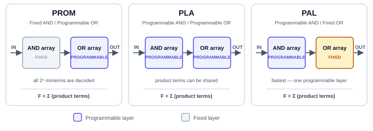

| ตระกูลอุปกรณ์ | AND Array | OR Array | จุดเด่น | จุดอ่อน |
|:---|:---:|:---:|:---|:---|
| **PROM** | ตายตัว (Decoder) | **โปรแกรมได้** | ตรงไปตรงมา ใช้ตารางความจริงได้ทันที | เปลืองมาก: $n$ อินพุตต้องมี $2^n$ แถวเสมอ |
| **PLA** | **โปรแกรมได้** | **โปรแกรมได้** | ยืดหยุ่นที่สุด **แชร์ Product Term ได้** | ช้าที่สุด (สัญญาณผ่าน 2 ชั้นที่โปรแกรมได้) |
| **PAL** | **โปรแกรมได้** | ตายตัว | **เร็ว** ราคาถูก ออกแบบง่าย | แชร์เทอมไม่ได้ · จำนวนเทอมต่อเอาต์พุตจำกัด |
| **GAL** | **โปรแกรมได้** | ตายตัว (+ OLMC) | เหมือน PAL แต่ **ลบเขียนใหม่ได้** (EEPROM) | ความจุยังเล็ก |

---

## 8.8 สัญกรณ์ย่อของ PLD (PLD Shorthand Notation)

ก่อนจะอ่านวงจร PLA/PAL ได้ ต้องรู้จัก **สัญกรณ์ย่อ** ก่อน เพราะ PLD ตัวจริงมีเกต AND นับร้อยตัว ตัวละหลายสิบอินพุต ถ้าวาดแบบเกตปกติจะเต็มหน้ากระดาษ วิศวกรจึงใช้ข้อตกลงดังนี้:

- เกต AND หนึ่งตัว วาดด้วย **เส้นเข้าเพียงเส้นเดียว** (เรียกว่า *product line*)
- เส้นอินพุตทุกเส้น (ทั้งตัวจริง $A$ และตัวคอมพลีเมนต์ $\overline{A}$) ลากตัดผ่าน product line
- **เครื่องหมาย ✕ ที่จุดตัด** = ฟิวส์ยังอยู่ = **มีการเชื่อมต่อ**
- **จุดตัดเปล่า ๆ** = ฟิวส์ถูกเป่าขาด = **ไม่เชื่อมต่อ**

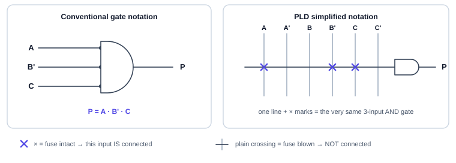

> ⚠️ **จุดที่นักศึกษาสับสนบ่อยที่สุด**
> เส้นสองเส้นตัดกัน **ไม่ได้** แปลว่าเชื่อมกัน ในวงจร PLD เส้นจะเชื่อมกันก็ต่อเมื่อมี **✕** (จุดโปรแกรมได้) หรือ **●** (จุดต่อตายตัวจากโรงงาน) กำกับอยู่เท่านั้น

---

## 8.9 PROM ในฐานะอุปกรณ์ลอจิกโปรแกรมได้

PROM คือ PLD ที่ **ชั้น AND ถูกตรึงเป็นวงจรถอดรหัสเต็มรูป** — มันสร้าง **ทุก minterm ที่เป็นไปได้** ให้ล่วงหน้า แล้วปล่อยให้เราเลือกเพียงว่าจะเอา minterm ไหนบวกเข้า OR gate บ้าง (ซึ่งก็คือการเขียนข้อมูลลงชิปนั่นเอง)

- **ข้อดี:** ไม่ต้องลดรูปสมการเลย ยกตารางความจริงมาเบิร์นลงชิปได้ตรง ๆ
- **ข้อเสีย:** เปลืองพื้นที่มหาศาล เพราะต้องมีแถวครบ $2^n$ แถวเสมอ แม้ฟังก์ชันจริงจะใช้เพียง 3–4 เทอมก็ตาม

$$\text{PROM สำหรับ 16 อินพุต} \implies 2^{16} = 65{,}536 \text{ แถว!}$$

นี่คือเหตุผลที่ต้องมี PLA และ PAL — เราต้องการอุปกรณ์ที่สร้าง **เฉพาะเทอมที่ใช้จริง** เท่านั้น

---

## 8.10 PLA (Programmable Logic Array) — ยืดหยุ่นที่สุด

PLA เปิดให้โปรแกรมได้ **ทั้งสองชั้น** จึงสร้างเฉพาะ product term ที่ต้องใช้ และ — ที่สำคัญกว่า — **เทอมหนึ่งเทอมป้อนให้หลายเอาต์พุตพร้อมกันได้**

### 🔧 ตัวอย่างการออกแบบที่ 8.1: วงจรควบคุมพัดลมระบายความร้อนในตู้ควบคุมไฟฟ้า

#### ขั้นที่ 1 — นิยามตัวแปร

| สัญลักษณ์ | ความหมาย | ลอจิก `1` | ลอจิก `0` |
|:---:|:---|:---|:---|
| $E$ | สวิตช์เปิดใช้งานระบบ (Enable) | ระบบเปิด | ระบบปิด |
| $T$ | เซนเซอร์อุณหภูมิ | ร้อนเกินกำหนด | อุณหภูมิปกติ |
| $M$ | สวิตช์สั่งเปิดพัดลมด้วยมือ (Manual) | กด | ไม่กด |
| $\text{FAN}$ | คำสั่งขับพัดลม | หมุน | หยุด |
| $\text{ALM}$ | ไฟเตือนสถานะผิดปกติ | ติด | ดับ |

**เงื่อนไขที่ต้องการ**
- พัดลมหมุนเมื่อ **ระบบเปิดอยู่** และ (ร้อนเกินกำหนด **หรือ** มีคนสั่งเปิดด้วยมือ)
- ไฟเตือนติดเมื่อ (ระบบเปิดแล้วอุณหภูมิยังสูง) **หรือ** (มีคนกดสวิตช์มือทั้งที่ระบบปิดอยู่ — ถือเป็นการใช้งานผิด)

#### ขั้นที่ 2 — ตารางความจริง

| $m$ | $E$ | $T$ | $M$ | $\text{FAN}$ | $\text{ALM}$ |
|:---:|:---:|:---:|:---:|:---:|:---:|
| 0 | 0 | 0 | 0 | 0 | 0 |
| 1 | 0 | 0 | 1 | 0 | **1** |
| 2 | 0 | 1 | 0 | 0 | 0 |
| 3 | 0 | 1 | 1 | 0 | **1** |
| 4 | 1 | 0 | 0 | 0 | 0 |
| 5 | 1 | 0 | 1 | **1** | 0 |
| 6 | 1 | 1 | 0 | **1** | **1** |
| 7 | 1 | 1 | 1 | **1** | **1** |

$$\text{FAN} = \Sigma m(5,6,7) \qquad \text{ALM} = \Sigma m(1,3,6,7)$$

#### ขั้นที่ 3 — ลดรูปด้วยผังคาร์โนห์ (ทบทวนบทที่ 4)

**ผังของ FAN**

| $E \backslash TM$ | 00 | 01 | 11 | 10 |
|:---:|:---:|:---:|:---:|:---:|
| **0** | 0 | 0 | 0 | 0 |
| **1** | 0 | **1** | **1** | **1** |

- จับคู่ $m_5, m_7$ (คอลัมน์ `01` กับ `11` ในแถว $E=1$ — ตัวแปรที่คงที่คือ $E=1, M=1$) $\to E \cdot M$
- จับคู่ $m_6, m_7$ (คอลัมน์ `11` กับ `10` ในแถว $E=1$ — ตัวแปรที่คงที่คือ $E=1, T=1$) $\to E \cdot T$

$$\boxed{\text{FAN} = E \cdot T + E \cdot M}$$

**ผังของ ALM**

| $E \backslash TM$ | 00 | 01 | 11 | 10 |
|:---:|:---:|:---:|:---:|:---:|
| **0** | 0 | **1** | **1** | 0 |
| **1** | 0 | 0 | **1** | **1** |

- จับคู่ $m_1, m_3$ (คอลัมน์ `01` กับ `11` ในแถว $E=0$) $\to \overline{E} \cdot M$
- จับคู่ $m_6, m_7$ (คอลัมน์ `11` กับ `10` ในแถว $E=1$) $\to E \cdot T$

$$\boxed{\text{ALM} = E \cdot T + \overline{E} \cdot M}$$

#### ขั้นที่ 4 — รวบรวม Product Term ที่ไม่ซ้ำกัน

สังเกตว่าทั้งสองสมการมีเทอม $E \cdot T$ เหมือนกัน จึงเหลือเทอมที่ไม่ซ้ำเพียง **3 เทอม**:

$$P_1 = E \cdot T \qquad P_2 = E \cdot M \qquad P_3 = \overline{E} \cdot M$$

#### ขั้นที่ 5 — เขียนตารางโปรแกรม PLA (PLA Programming Table)

นี่คือรูปแบบมาตรฐานที่ใช้สื่อสารกับซอฟต์แวร์โปรแกรมชิป:

| Product Term | $E$ | $T$ | $M$ | $\text{FAN}$ | $\text{ALM}$ |
|:---|:---:|:---:|:---:|:---:|:---:|
| $P_1 = E \cdot T$ | 1 | 1 | – | ✔ | ✔ |
| $P_2 = E \cdot M$ | 1 | – | 1 | ✔ | – |
| $P_3 = \overline{E} \cdot M$ | 0 | – | 1 | – | ✔ |

> **วิธีอ่าน:** ในคอลัมน์อินพุต `1` = ต่อเข้าเส้นตัวจริง, `0` = ต่อเข้าเส้นคอมพลีเมนต์, `–` = ไม่ต่อทั้งคู่ (ตัวแปรนั้นไม่มีผลต่อเทอมนี้) · ในคอลัมน์เอาต์พุต ✔ = เทอมนี้ป้อนเข้า OR gate ของเอาต์พุตนั้น

#### ขั้นที่ 6 — วงจร PLA ที่ได้

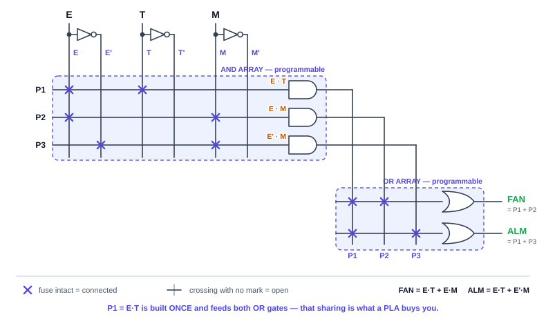

**อ่านวงจรทีละชั้น**
1. **ชั้นอินพุต:** สัญญาณ $E, T, M$ ผ่านบัฟเฟอร์และอินเวอร์เตอร์ ได้เส้นสัญญาณ 6 เส้น ($E, \overline{E}, T, \overline{T}, M, \overline{M}$) วิ่งลงมาตัดผ่านตารางทั้งหมด
2. **AND Array (โปรแกรมได้):** แต่ละแถวคือ product line — เช่นแถว $P_1$ มี ✕ ที่คอลัมน์ $E$ และ $T$ จึงได้ $P_1 = E \cdot T$
3. **OR Array (โปรแกรมได้):** เทอม $P_1, P_2, P_3$ กลายเป็นเส้นแนวตั้ง แถว $\text{FAN}$ มี ✕ ที่ $P_1$ และ $P_2$ จึงได้ $\text{FAN} = P_1 + P_2$

#### ขั้นที่ 7 — วัดผลว่าประหยัดอะไรบ้าง

| วิธีสร้าง | เกต AND | เกต OR | อินเวอร์เตอร์ | รวม |
|:---|:---:|:---:|:---:|:---:|
| ต่อเกต 74xx แยกตัว | 4 | 2 | 1 | **7 เกต / 3 ไอซี** |
| ใช้ PLA | 3 (แชร์ $P_1$) | 2 | 1 (มีในตัว) | **ชิปเดียว** |

> ⭐ **หัวใจของ PLA คือการแชร์ Product Term**
> เทอม $P_1 = E \cdot T$ ถูกสร้างจากเกต AND **เพียงตัวเดียว** แต่ลากไปป้อนทั้ง OR gate ของ $\text{FAN}$ และของ $\text{ALM}$ พร้อมกัน
> ยิ่งวงจรมีเอาต์พุตหลายตัวที่ใช้เงื่อนไขร่วมกันมาก (เช่นวงจรถอดรหัส 7-segment ที่ทุกเซกเมนต์ใช้ minterm ชุดเดียวกัน) PLA ยิ่งได้เปรียบ

---

### 🔥 ตัวอย่างการออกแบบขั้นสูงที่ 8.3: วงจรถอดรหัส BCD → 7-Segment บน PLA

ตัวอย่างที่ 8.1 มีเพียง 2 เอาต์พุต จึงยังไม่เห็นพลังของ PLA เต็มที่ คราวนี้ลองของจริง — **วงจรถอดรหัส BCD เป็น 7-segment** ซึ่งมี 4 อินพุตและ **7 เอาต์พุต** (ทบทวนจากบทที่ 5 และ Lab 7)

#### ขั้นที่ 1 — ตารางความจริง (ใช้ 7-segment แบบแคโทดร่วม, เซกเมนต์ติด = `1`)

| เลข | $A$ | $B$ | $C$ | $D$ | $a$ | $b$ | $c$ | $d$ | $e$ | $f$ | $g$ |
|:---:|:---:|:---:|:---:|:---:|:---:|:---:|:---:|:---:|:---:|:---:|:---:|
| 0 | 0 | 0 | 0 | 0 | 1 | 1 | 1 | 1 | 1 | 1 | 0 |
| 1 | 0 | 0 | 0 | 1 | 0 | 1 | 1 | 0 | 0 | 0 | 0 |
| 2 | 0 | 0 | 1 | 0 | 1 | 1 | 0 | 1 | 1 | 0 | 1 |
| 3 | 0 | 0 | 1 | 1 | 1 | 1 | 1 | 1 | 0 | 0 | 1 |
| 4 | 0 | 1 | 0 | 0 | 0 | 1 | 1 | 0 | 0 | 1 | 1 |
| 5 | 0 | 1 | 0 | 1 | 1 | 0 | 1 | 1 | 0 | 1 | 1 |
| 6 | 0 | 1 | 1 | 0 | 1 | 0 | 1 | 1 | 1 | 1 | 1 |
| 7 | 0 | 1 | 1 | 1 | 1 | 1 | 1 | 0 | 0 | 0 | 0 |
| 8 | 1 | 0 | 0 | 0 | 1 | 1 | 1 | 1 | 1 | 1 | 1 |
| 9 | 1 | 0 | 0 | 1 | 1 | 1 | 1 | 1 | 0 | 1 | 1 |

รหัส `1010`–`1111` (10–15) ไม่ใช่เลข BCD ที่ถูกต้อง จึงกำหนดเป็น **Don't Care ($\times$)** ทั้งหมด ซึ่งช่วยให้จับกลุ่มในผังคาร์โนห์ได้ใหญ่ขึ้นมาก

#### ขั้นที่ 2 — สมการ SOP ที่ลดรูปแล้ว (ลดรูปทีละเซกเมนต์ด้วยผังคาร์โนห์ 4 ตัวแปร)

| เซกเมนต์ | สมการ SOP ที่ลดรูปแล้ว | จำนวนเทอม |
|:---:|:---|:---:|
| $a$ | $A + C + BD + \overline{B}\,\overline{D}$ | 4 |
| $b$ | $\overline{B} + \overline{C}\,\overline{D} + CD$ | 3 |
| $c$ | $B + \overline{C} + D$ | 3 |
| $d$ | $A + \overline{B}\,\overline{D} + C\overline{D} + B\overline{C}D + \overline{B}C$ | **5** |
| $e$ | $\overline{B}\,\overline{D} + C\overline{D}$ | 2 |
| $f$ | $A + \overline{C}\,\overline{D} + B\overline{C} + B\overline{D}$ | 4 |
| $g$ | $A + B\overline{C} + C\overline{D} + \overline{B}C$ | 4 |

#### ขั้นที่ 3 — นับ Product Term (นี่คือขั้นตอนที่ตัดสินว่าจะใช้ชิปตัวไหน)

ถ้าสร้างแยกกันทีละเซกเมนต์ จะต้องใช้ช่องเทอมรวม $4+3+3+5+2+4+4 = \mathbf{25}$ ช่อง
แต่เมื่อไล่ดูว่าเทอมใดซ้ำกันบ้าง จะเหลือเทอมที่ **ไม่ซ้ำกันเพียง 15 เทอม**

| Product Term | ป้อนให้เซกเมนต์ | จำนวนเอาต์พุตที่ใช้ร่วม |
|:---|:---|:---:|
| $A$ | $a, d, f, g$ | **4** ⭐ |
| $\overline{B}\,\overline{D}$ | $a, d, e$ | **3** ⭐ |
| $C \overline{D}$ | $d, e, g$ | **3** ⭐ |
| $\overline{C}\,\overline{D}$ | $b, f$ | **2** ⭐ |
| $\overline{B} C$ | $d, g$ | **2** ⭐ |
| $B \overline{C}$ | $f, g$ | **2** ⭐ |
| $C$ · $BD$ · $\overline{B}$ · $CD$ · $B$ · $\overline{C}$ · $D$ · $B\overline{C}D$ · $B\overline{D}$ | อย่างละ 1 เซกเมนต์ | 1 |

$$\text{ประหยัดไป } 25 - 15 = \mathbf{10} \text{ เทอม } (40\%)$$

#### ขั้นที่ 4 — วงจร PLA ที่ได้

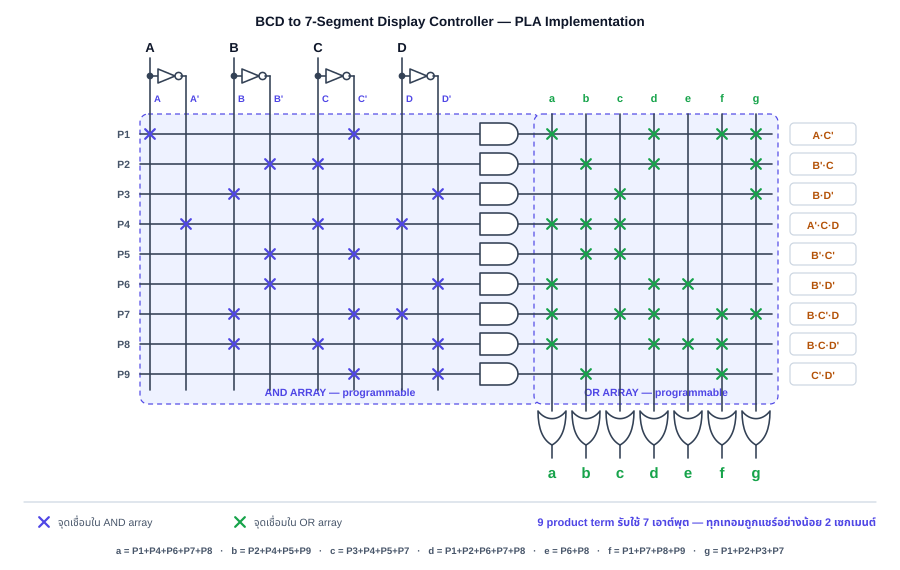

**วิธีอ่านวงจรขนาดใหญ่นี้**
- ครึ่งซ้ายคือ **AND Array** — อ่านตามแนวนอนทีละแถว เช่นแถว $P_{12}$ มี ✕ ที่ $B$, $\overline{C}$, $D$ จึงได้ $P_{12} = B \overline{C} D$
- ครึ่งขวาคือ **OR Array** — อ่านตามแนวตั้งทีละคอลัมน์ เช่นคอลัมน์ $g$ มี ✕ ที่แถว $P_1, P_{11}, P_{13}, P_{14}$ จึงได้ $g = A + C\overline{D} + \overline{B}C + B\overline{C}$
- เกต OR ถูกวาดหันลง (หมุน 90°) ที่ก้นแต่ละคอลัมน์ เพราะในวงจรที่มีเอาต์พุตมาก การวางแบบนี้อ่านง่ายกว่า
- ✕ สีเขียวคือเทอมที่ถูกแชร์ — จะเห็นว่าแถวที่มี ✕ สีเขียวหลายจุดคือแถวที่ "คุ้มค่า" ที่สุด

#### ขั้นที่ 5 — เปรียบเทียบกับทางเลือกอื่น

| วิธีสร้าง | ทรัพยากรที่ใช้ | ข้อสังเกต |
|:---|:---|:---|
| **PLA** | 15 product term | สร้างเฉพาะเทอมที่ใช้จริง และแชร์ข้ามเอาต์พุตได้ |
| **PAL** | ต้องมี **อย่างน้อย 5 เทอมต่อเอาต์พุต** (เพราะเซกเมนต์ $d$ ใช้ 5 เทอม) $\to 7 \times 5 = 35$ ช่อง | แชร์ไม่ได้ ต้องโปรแกรมเทอม $A$ ซ้ำถึง 4 ครั้ง |
| **ROM / PROM** | $2^4 \times 7 = 16 \times 7 = 112$ บิต | ไม่ต้องลดรูปเลย ยกตารางความจริงมาเบิร์นได้ทันที |
| **ไอซีสำเร็จรูป 7447/4511** | ชิปเดียว | เร็วและถูกที่สุด แต่แก้รูปแบบตัวเลขไม่ได้ |

> 💡 **ข้อสังเกตเชิงวิศวกรรมที่นักศึกษาควรจำ**
> ที่ 4 อินพุต ROM ต้องมี $2^4 = 16$ แถว ส่วน PLA ใช้ 15 เทอม — **แทบไม่ต่างกันเลย** PLA จึงยังไม่ได้เปรียบชัดเจน
>
> แต่ถ้าเพิ่มเป็น **10 อินพุต** ROM ต้องมี $2^{10} = 1{,}024$ แถวเสมอ ในขณะที่วงจรจริงส่วนใหญ่ใช้เทอมไม่เกิน 20–30 เทอม **ตรงนี้เองที่ PLA/PAL ชนะขาด** — และเป็นเหตุผลที่ ROM ถูกใช้แทนลอจิกได้เฉพาะเมื่ออินพุตน้อยเท่านั้น


---

## 8.11 PAL (Programmable Array Logic) — เร็วและถูกกว่า

ข้อเสียของ PLA คือสัญญาณต้องวิ่งผ่าน **จุดเชื่อมต่อที่โปรแกรมได้ถึง 2 ชั้น** จุดเชื่อมต่อแต่ละจุดมีความต้านทานและความจุไฟฟ้าแฝง ทำให้เกิดหน่วงเวลาสะสม (propagation delay) และยังกินพื้นที่ซิลิคอนมาก

บริษัท Monolithic Memories จึงคิดค้น **PAL** ในปี 1978 ด้วยการประนีประนอมที่ชาญฉลาด:

> **ให้ AND Array โปรแกรมได้ แต่ตรึง OR Array ไว้ตายตัว** — เกต OR แต่ละตัวรับ product term ตามจำนวนที่โรงงานกำหนดไว้ล่วงหน้า (จริง ๆ มักเป็น 7–8 เทอมต่อเอาต์พุต)

ผลลัพธ์: สัญญาณผ่านชั้นที่โปรแกรมได้เพียงชั้นเดียว จึง **เร็วกว่า ถูกกว่า และออกแบบง่ายกว่า** — แลกกับการที่ **แชร์ product term ข้ามเอาต์พุตไม่ได้**

### 🔧 ตัวอย่างการออกแบบที่ 8.2: วงจรควบคุมความปลอดภัยเตาอบไมโครเวฟ

#### ขั้นที่ 1 — นิยามตัวแปร

| สัญลักษณ์ | ความหมาย | ลอจิก `1` |
|:---:|:---|:---|
| $D$ | สวิตช์ประตู (Door) | ประตูปิดสนิท |
| $T$ | ตัวตั้งเวลา (Timer) | ยังมีเวลาอุ่นเหลืออยู่ |
| $S$ | ปุ่มเริ่มทำงาน (Start) | ถูกกดค้าง |
| $H$ | เซนเซอร์ความร้อน (Overheat) | ร้อนเกินขีดจำกัด |

#### ขั้นที่ 2 — สมการลอจิกจากข้อกำหนดความปลอดภัย

1. **หัวคลื่นไมโครเวฟ** ทำงานได้ก็ต่อเมื่อ ประตูปิด **และ** เวลาเหลือ **และ** กดเริ่ม **และ** ไม่ร้อนเกิน
   $$\text{MAGNETRON} = D \cdot T \cdot S \cdot \overline{H}$$
2. **ไฟส่องสว่างภายใน** ติดเมื่อ เปิดประตู (เพื่อให้มองเห็นตอนหยิบอาหาร) **หรือ** ขณะหัวคลื่นทำงาน
   $$\text{LAMP} = \overline{D} + (D \cdot T \cdot S \cdot \overline{H})$$
3. **เสียงเตือน** ดังเมื่อ ร้อนเกิน (เตือนภัย) **หรือ** เวลาหมดขณะประตูยังปิด (อุ่นเสร็จแล้ว)
   $$\text{BUZZER} = H + (D \cdot \overline{T})$$

#### ขั้นที่ 3 — จัดสรร Product Term ลงช่องที่ PAL มีให้

สมมติใช้ PAL เพื่อการเรียนรู้ขนาด **4 อินพุต × 6 product term × 3 เอาต์พุต** โดยเกต OR แต่ละตัวรับ **2 เทอมตายตัว**

| ช่อง | เทอมที่โปรแกรม | ป้อนเข้า | หมายเหตุ |
|:---:|:---|:---:|:---|
| $P_1$ | $D \cdot T \cdot S \cdot \overline{H}$ | MAGNETRON | |
| $P_2$ | **ไม่ใช้** | MAGNETRON | ต้องปิดการทำงาน |
| $P_3$ | $\overline{D}$ | LAMP | |
| $P_4$ | $D \cdot T \cdot S \cdot \overline{H}$ | LAMP | **ซ้ำกับ $P_1$** |
| $P_5$ | $H$ | BUZZER | |
| $P_6$ | $D \cdot \overline{T}$ | BUZZER | |

#### ขั้นที่ 4 — แผนผังฟิวส์ (Fuse Map)

| ช่อง | $D$ | $\overline{D}$ | $T$ | $\overline{T}$ | $S$ | $\overline{S}$ | $H$ | $\overline{H}$ | เทอมที่ได้ |
|:---:|:---:|:---:|:---:|:---:|:---:|:---:|:---:|:---:|:---|
| $P_1$ | ✕ | | ✕ | | ✕ | | | ✕ | $D \cdot T \cdot S \cdot \overline{H}$ |
| $P_2$ | ✕ | ✕ | ✕ | ✕ | ✕ | ✕ | ✕ | ✕ | $\mathbf{0}$ (ปิดใช้งาน) |
| $P_3$ | | ✕ | | | | | | | $\overline{D}$ |
| $P_4$ | ✕ | | ✕ | | ✕ | | | ✕ | $D \cdot T \cdot S \cdot \overline{H}$ |
| $P_5$ | | | | | | | ✕ | | $H$ |
| $P_6$ | ✕ | | | ✕ | | | | | $D \cdot \overline{T}$ |

#### ขั้นที่ 5 — วงจร PAL ที่ได้

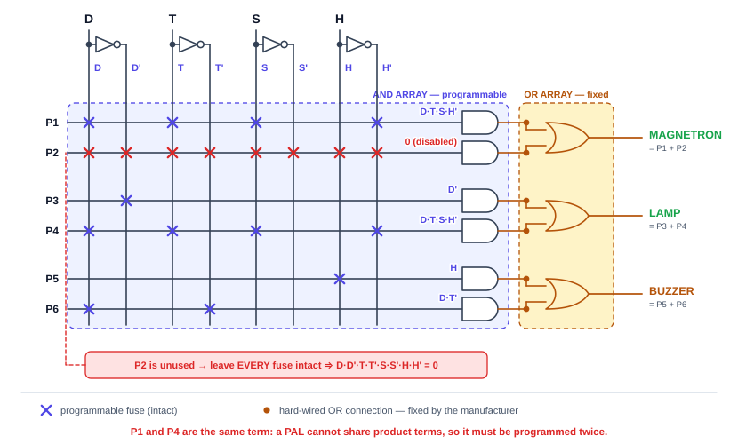

### ⚠️ สองบทเรียนสำคัญจากวงจร PAL นี้

**บทเรียนที่ 1 — PAL แชร์เทอมไม่ได้ จึงต้องโปรแกรมซ้ำ**

$P_1$ กับ $P_4$ คือสมการเดียวกันเป๊ะ ($D \cdot T \cdot S \cdot \overline{H}$) แต่เพราะ OR gate ของ MAGNETRON และของ LAMP ถูกเดินสายตายตัวมาจากโรงงาน เราจึงส่งเอาต์พุตของ AND gate ตัวเดียวไปสองที่ไม่ได้ — ต้องเสีย product line ไปอีกหนึ่งช่องเพื่อสร้างเทอมเดิมขึ้นมาใหม่

**บทเรียนที่ 2 — Product Term ที่ไม่ใช้ ต้อง "ปิด" ให้ถูกวิธี**

ช่อง $P_2$ ไม่ได้ใช้งาน แต่ **ห้ามเป่าฟิวส์ทิ้งทั้งหมด** เพราะอินพุตของ AND gate ที่ลอยอยู่จะถูกอ่านเป็นลอจิก `1` ทำให้ได้ $P_2 = 1$ ซึ่งจะบังคับให้ MAGNETRON ติดค้างตลอดเวลา — อันตรายถึงชีวิต!

วิธีที่ถูกต้องคือ **ปล่อยฟิวส์ไว้ครบทุกจุด** เพื่อให้ทั้งตัวจริงและตัวคอมพลีเมนต์เข้า AND gate พร้อมกัน:

$$P_2 = D \cdot \overline{D} \cdot T \cdot \overline{T} \cdot S \cdot \overline{S} \cdot H \cdot \overline{H} = 0$$

เมื่อ $P_2 = 0$ เกต OR จึงไม่ได้รับผลกระทบ ($\text{MAGNETRON} = P_1 + 0 = P_1$) — นี่คือการใช้กฎ **Complement Law** ($X \cdot \overline{X} = 0$) จากบทที่ 3 ในงานจริง

### ตารางเปรียบเทียบ: ถ้าออกแบบวงจรไมโครเวฟนี้ด้วย PLA แทน

| หัวข้อ | ใช้ PLA | ใช้ PAL |
|:---|:---:|:---:|
| **Product term ที่ต้องใช้** | **4 เทอม** ($D T S \overline{H}$, $\overline{D}$, $H$, $D\overline{T}$) | 6 ช่อง (ซ้ำ 1 + ปิดทิ้ง 1) |
| **การแชร์เทอม** | ได้ | **ไม่ได้** |
| **จำนวนชั้นที่โปรแกรมได้** | 2 ชั้น | **1 ชั้น** |
| **ความเร็ว (propagation delay)** | ช้ากว่า | **เร็วกว่า** ✅ |
| **ราคาและความซับซ้อนของชิป** | สูงกว่า | **ต่ำกว่า** ✅ |

> 📌 **สรุปการเลือกใช้:** ถ้าเอาต์พุตหลายตัว **ใช้เงื่อนไขร่วมกันมาก** → PLA คุ้มกว่า · ถ้าแต่ละเอาต์พุตมีสมการเป็นอิสระต่อกันและต้องการ **ความเร็ว** → PAL คุ้มกว่า
> ในทางการค้า PAL/GAL ชนะขาดและกลายเป็นมาตรฐานอุตสาหกรรม เพราะราคาถูกกว่าและเร็วกว่าอย่างมีนัยสำคัญ

---

### 🔥 ตัวอย่างการออกแบบขั้นสูงที่ 8.4: Registered PAL — ตัวนับ Mod-6 พร้อม Synchronous Clear

ตัวอย่างที่ 8.2 ยังเป็นวงจรคอมบิเนชันล้วน ๆ แต่ PAL รุ่นที่มีฟลิปฟลอปอยู่ในแมโครเซลล์ (**Registered PAL** เช่น PAL16R4, PAL16R8) ทำได้มากกว่านั้นมาก — มันสร้าง **วงจรเชิงลำดับ** ได้ในชิปเดียว เพราะมี 2 สิ่งที่ขาดไม่ได้:

1. **ฟลิปฟลอป D** ต่อท้ายเกต OR แต่ละตัว เพื่อเก็บสถานะปัจจุบัน
2. **เส้น Feedback** ที่ส่งเอาต์พุตของฟลิปฟลอปกลับเข้า AND Array เพื่อให้สถานะปัจจุบันมีผลต่อสถานะถัดไป

#### ขั้นที่ 1 — โจทย์

ออกแบบ **ตัวนับขึ้น Mod-6** (นับ $000 \to 001 \to 010 \to 011 \to 100 \to 101 \to 000$) โดยมี:
- อินพุต $\text{CLR}$ — เมื่อเป็น `1` ให้รีเซ็ตเป็น `000` ในขอบสัญญาณนาฬิกาถัดไป (**Synchronous Clear**)
- เอาต์พุต $Q_2 Q_1 Q_0$ — สถานะปัจจุบัน (แบบ Registered)
- เอาต์พุต $\text{TC}$ (Terminal Count) — เป็น `1` เมื่ออยู่ที่สถานะสุดท้าย `101` (แบบ Combinational)

#### ขั้นที่ 2 — ตารางสถานะถัดไป (Next-State Table) เมื่อ $\text{CLR} = 0$

| สถานะปัจจุบัน $Q_2 Q_1 Q_0$ | สถานะถัดไป $D_2 D_1 D_0$ | $\text{TC}$ |
|:---:|:---:|:---:|
| 0 0 0 | 0 0 1 | 0 |
| 0 0 1 | 0 1 0 | 0 |
| 0 1 0 | 0 1 1 | 0 |
| 0 1 1 | 1 0 0 | 0 |
| 1 0 0 | 1 0 1 | 0 |
| 1 0 1 | 0 0 0 | **1** |
| 1 1 0 | $\times$ $\times$ $\times$ | $\times$ |
| 1 1 1 | $\times$ $\times$ $\times$ | $\times$ |

#### ขั้นที่ 3 — สมการที่ลดรูปแล้ว (ใช้ผังคาร์โนห์ 3 ตัวแปร โดยมี `110` และ `111` เป็น Don't Care)

| เอาต์พุต | สมการ | โหมด |
|:---:|:---|:---:|
| $D_2$ | $\overline{\text{CLR}} \cdot (Q_1 Q_0 + Q_2 \overline{Q_0})$ | Registered |
| $D_1$ | $\overline{\text{CLR}} \cdot (\overline{Q_2}\,\overline{Q_1}\,Q_0 + Q_1 \overline{Q_0})$ | Registered |
| $D_0$ | $\overline{\text{CLR}} \cdot \overline{Q_0}$ | Registered |
| $\text{TC}$ | $Q_2 \cdot Q_0$ | Combinational |

> 🔎 **ทำไม $\overline{\text{CLR}}$ ถึงคูณอยู่ในทุกเทอม?** เพราะ Synchronous Clear ไม่ได้ใช้ขา CLEAR ของฟลิปฟลอป แต่ **บังคับให้อินพุต $D$ ทุกตัวเป็น 0** เมื่อสั่งเคลียร์ ฟลิปฟลอปจึงรับค่า `000` เข้าไปในขอบนาฬิกาถัดไปตามปกติ — เป็นเทคนิคที่ใช้กันทั่วไปใน PLD และ FPGA เพราะไม่ก่อสัญญาณรบกวนแบบ Asynchronous Clear

#### ขั้นที่ 4 — จัดสรรลงช่อง Product Term

PAL ตัวนี้มีเกต OR ที่รับ **2 เทอมตายตัว** ต่อเอาต์พุต และมี 4 แมโครเซลล์:

| ช่อง | เทอมที่โปรแกรม | เข้า OR ของ | หมายเหตุ |
|:---:|:---|:---:|:---|
| $P_1$ | $\overline{\text{CLR}} \cdot Q_1 \cdot Q_0$ | $D_2$ | |
| $P_2$ | $\overline{\text{CLR}} \cdot Q_2 \cdot \overline{Q_0}$ | $D_2$ | |
| $P_3$ | $\overline{\text{CLR}} \cdot \overline{Q_2} \cdot \overline{Q_1} \cdot Q_0$ | $D_1$ | |
| $P_4$ | $\overline{\text{CLR}} \cdot Q_1 \cdot \overline{Q_0}$ | $D_1$ | |
| $P_5$ | $\overline{\text{CLR}} \cdot \overline{Q_0}$ | $D_0$ | |
| $P_6$ | **ไม่ใช้** | $D_0$ | ปล่อยฟิวส์ไว้ครบ $\to 0$ |
| $P_7$ | $Q_2 \cdot Q_0$ | $\text{TC}$ | |
| $P_8$ | **ไม่ใช้** | $\text{TC}$ | ปล่อยฟิวส์ไว้ครบ $\to 0$ |

#### ขั้นที่ 5 — วงจร Registered PAL ที่ได้

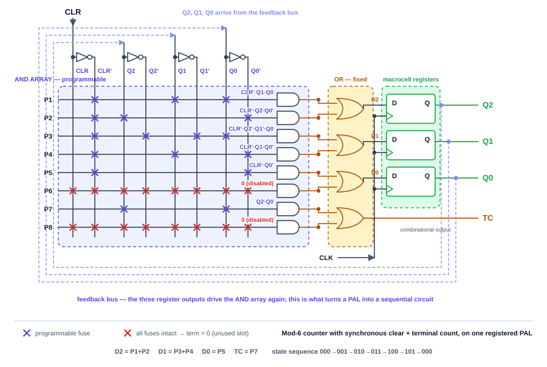

**สามสิ่งที่ต้องสังเกตในวงจรนี้**

1. **เส้นประสีม่วงคือ Feedback Bus** — $Q_2, Q_1, Q_0$ ไม่ได้ออกไปที่ขาชิปอย่างเดียว แต่วิ่งกลับเข้ามาเป็นคอลัมน์อินพุตของ AND Array ด้วย ทำให้วงจรนี้ "รู้ว่าตอนนี้อยู่สถานะไหน"
2. **แมโครเซลล์ผสมสองโหมดในชิปเดียว** — $Q_2, Q_1, Q_0$ ผ่านฟลิปฟลอป (Registered) ส่วน $\text{TC}$ ออกตรงจากเกต OR (Combinational) นี่คือประโยชน์ของ OLMC ในหัวข้อ 8.13
3. **ช่องที่ไม่ใช้ยังต้องปิดให้ถูกวิธี** — $P_6$ และ $P_8$ ใช้กฎเดิมจากตัวอย่างที่ 8.2 คือปล่อยฟิวส์ไว้ครบทุกจุดให้ได้ผลลัพธ์ $0$

#### ขั้นที่ 6 — ทวนสอบพฤติกรรมและตรวจการแก้ตัวเอง (Self-Correction)

สถานะ `110` และ `111` เรากำหนดเป็น Don't Care ตอนลดรูป จึงต้องตรวจย้อนว่าถ้าวงจรหลุดเข้าไปอยู่สถานะเหล่านี้ (เช่นจากสัญญาณรบกวนตอนเปิดเครื่อง) มันจะกลับเข้าวงรอบปกติได้หรือไม่ — แทนค่าในสมการจะได้:

$$110 \to 111 \to 100 \qquad \text{และ} \qquad 111 \to 100$$

ทั้งสองกรณีกลับเข้าวงรอบที่ถูกต้องภายใน 2 จังหวะสัญญาณนาฬิกา วงจรนี้จึงเป็น **Self-Correcting** — ปลอดภัยต่อการใช้งานจริง

> ⚠️ **บทเรียนสำคัญ:** ทุกครั้งที่ใช้ Don't Care ในการลดรูปวงจรเชิงลำดับ **ต้องตรวจสถานะที่หลุดออกนอกวงรอบเสมอ** เพราะ Don't Care หมายถึง "เราไม่สนใจ" ตอนออกแบบ แต่ฮาร์ดแวร์จริงจะมีค่าที่แน่นอนเสมอ ถ้าโชคร้ายวงจรอาจติดอยู่ในวงรอบที่ผิด (Lock-up) แล้วไม่กลับมาเลย


---

## 8.12 ขั้นตอนมาตรฐานในการออกแบบวงจรด้วย PLD

ทุกตัวอย่างข้างต้นเดินตามขั้นตอนเดียวกัน ซึ่งเป็นขั้นตอนที่ใช้ได้กับ PLD ทุกชนิด:

```text
  ① กำหนดอินพุต/เอาต์พุต       →  ตั้งชื่อตัวแปร นิยามความหมายของ 0 และ 1
            ↓
  ② สร้างตารางความจริง          →  ครบทุก 2ⁿ แถว (ใช้ don't care ได้)
            ↓
  ③ ลดรูปด้วย K-map / พีชคณิต   →  ให้ได้รูป SOP ที่สั้นที่สุด
            ↓
  ④ นับ Product Term ที่ไม่ซ้ำ   →  ตัวเลขนี้คือตัวกำหนดว่าต้องใช้ชิปรุ่นไหน
            ↓
  ⑤ เขียนตารางโปรแกรม/Fuse Map →  ระบุทุกจุด ✕ และ product term ที่ไม่ใช้
            ↓
  ⑥ ทวนสอบ (Verify)             →  แทนค่าอินพุตทุกกรณีกลับเข้าสมการที่ได้
```

### แนวทางเลือกอุปกรณ์

| ถ้าสถานการณ์เป็นแบบนี้… | ควรเลือก |
|:---|:---|
| ตารางความจริงเล็ก ไม่อยากลดรูป | **PROM / ROM** |
| เอาต์พุตหลายตัวใช้เทอมร่วมกันมาก | **PLA** |
| ต้องการความเร็วสูง สมการแต่ละเอาต์พุตเป็นอิสระ | **PAL** |
| เหมือน PAL แต่ต้องแก้ไขตรรกะซ้ำ ๆ ระหว่างพัฒนา | **GAL** |
| วงจรใหญ่ระดับหลายพันเกต ต้องการหน่วงเวลาสม่ำเสมอ | **CPLD** |
| ระบบใหญ่มาก มีฟลิปฟลอปนับหมื่น / ทำ SoC | **FPGA** |

---

## 8.13 GAL และหัวใจของมัน: Output Logic Macrocell (OLMC)

PAL ยุคแรกใช้ฟิวส์โลหะ โปรแกรมได้ครั้งเดียว — เขียนผิดคือชิปเสียทิ้ง **GAL (Generic Array Logic)** แก้ปัญหานี้ด้วยการเปลี่ยนไปใช้เซลล์ **EEPROM** ซึ่งลบและเขียนใหม่ได้ด้วยไฟฟ้านับร้อยครั้ง

แต่นวัตกรรมที่แท้จริงของ GAL อยู่ที่ **OLMC (Output Logic Macrocell)** — วงจรเล็ก ๆ ที่ต่อท้าย OR gate ทุกตัว ทำให้เอาต์พุตหนึ่งขาปรับพฤติกรรมได้หลายแบบด้วยการโปรแกรม

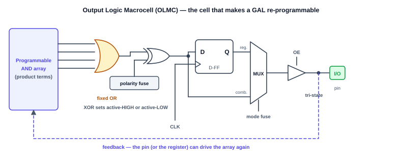

| ส่วนประกอบ | หน้าที่ | ผลที่ได้ |
|:---|:---|:---|
| **XOR + polarity fuse** | กลับขั้วเอาต์พุตหรือไม่ก็ได้ | เลือกได้ว่าจะให้ทำงานแบบ Active-HIGH หรือ Active-LOW |
| **D Flip-Flop** | เก็บสถานะตามสัญญาณนาฬิกา | ใช้ชิปเดียวสร้างวงจรเชิงลำดับ (ตัวนับ, FSM) ได้ |
| **MUX เลือกโหมด** | เลือกส่งสัญญาณจากฟลิปฟลอปหรือจาก XOR ตรง ๆ | สลับระหว่างโหมด **Registered** กับ **Combinational** |
| **Tri-state Buffer** | ควบคุมด้วยสัญญาณ $\text{OE}$ | ขานั้นกลายเป็นอินพุต เอาต์พุต หรือ High-Z ก็ได้ |
| **เส้น Feedback** | ป้อนสัญญาณกลับเข้า AND Array | สร้างวงจรที่สถานะปัจจุบันมีผลต่อสถานะถัดไป (FSM) |

> 💡 **ทำไม OLMC ถึงสำคัญ?** เพราะมันทำให้ชิปรุ่นเดียว (เช่น **GAL16V8** หรือ **GAL22V10** ซึ่งยังหาซื้อได้ถึงทุกวันนี้) แทนไอซี PAL รุ่นเก่าได้เป็นสิบ ๆ เบอร์ — คำว่า *Generic* ในชื่อ GAL มาจากตรงนี้เอง
>
> และเมื่อ OLMC มีทั้งฟลิปฟลอปและเส้น feedback ครบ **PLD จึงข้ามเส้นจากวงจรคอมบิเนชันมาสู่วงจรเชิงลำดับได้เต็มตัว** — ตัวนับ ชิฟต์เรจิสเตอร์ และ FSM ทั้งหมดที่เรียนในบทที่ 6–7 ยัดลงชิปตัวเดียวได้

---

## 8.14 ก้าวสู่วงจรความจุสูง: CPLD และ FPGA

### 1. CPLD (Complex Programmable Logic Device)

คือการนำโครงสร้างแบบ PAL/GAL หลาย ๆ บล็อก (Macrocell) มารวมไว้บนชิปตัวเดียว แล้วเชื่อมถึงกันด้วย **Global Interconnect Matrix** เนื่องจากทุกเส้นทางสัญญาณผ่านเมทริกซ์กลางเหมือนกันหมด CPLD จึงมี **หน่วงเวลาที่คาดเดาได้แน่นอน** เหมาะกับงานควบคุม กาวลอจิก (glue logic) และวงจร interface ความเร็วสูง

### 2. FPGA (Field Programmable Gate Array)

เทคโนโลยีที่ได้รับความนิยมสูงสุดในปัจจุบัน จำลองระบบคอมพิวเตอร์ทั้งตัว (System on Chip) ได้อย่างสมบูรณ์


โครงสร้างภายในประกอบด้วย:
1. **CLB (Configurable Logic Blocks):** บล็อกลอจิกนับหมื่นถึงล้านบล็อกกระจายทั่วชิป
2. **IOB (Input/Output Blocks):** บล็อกควบคุมขาเชื่อมต่อกับวงจรภายนอก
3. **Programmable Interconnect:** เส้นทางเดินสายแบบตาข่ายที่สลับการเชื่อมต่อได้อิสระ

### 3. หัวใจของ FPGA: Look-Up Table (LUT)

จุดที่ FPGA แตกต่างจาก PAL/CPLD อย่างสิ้นเชิงคือ **มันไม่ได้ใช้ AND/OR array เลย** แต่ใช้ **SRAM ขนาดจิ๋วทำหน้าที่เป็นตารางค้นหา (LUT)**

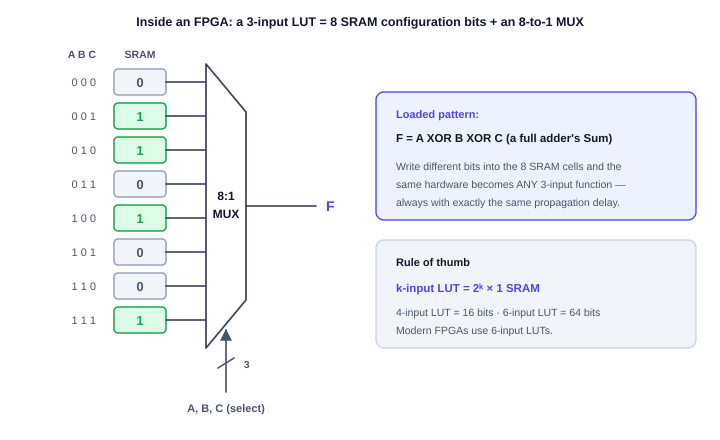

**หลักการทำงาน**
- LUT ขนาด $k$ อินพุต คือ SRAM ขนาด $2^k$ บิต ต่อกับมัลติเพล็กเซอร์ $2^k : 1$
- อินพุตของวงจรทำหน้าที่เป็น **สายเลือก (select)** ของมัลติเพล็กเซอร์
- ซอฟต์แวร์สังเคราะห์วงจรจะคำนวณตารางความจริงของสมการเรา แล้วหยอดค่า `0`/`1` ลง SRAM
- ป้อนอินพุตเข้ามา มัลติเพล็กเซอร์ก็หยิบบิตที่ตำแหน่งนั้นส่งออกทันที

$$k\text{-input LUT} = 2^k \times 1 \text{ bit SRAM}$$

> ⭐ **ทำไมแนวคิดนี้ถึงทรงพลัง?** เพราะ **ทุกฟังก์ชันลอจิกใช้เวลาเท่ากันหมด** ไม่ว่าสมการจะง่ายอย่าง $F = A$ หรือซับซ้อนอย่าง $F = A \oplus B \oplus C$ สัญญาณก็แค่วิ่งผ่านมัลติเพล็กเซอร์ชั้นเดียวเท่ากัน — การวิเคราะห์ timing จึงง่ายขึ้นมหาศาล

หัวข้อถัดไปจะแกะ LUT ตัวนี้ออกเป็นเกตและฟลิปฟลอปทีละตัว เพื่อพิสูจน์ว่าไม่มีอะไรซ่อนอยู่จริง ๆ

---

## 8.15 FPGA สร้างจากอะไร? เจาะลึกถึงระดับเกตและฟลิปฟลอป

คำถามที่นักศึกษาถามบ่อยที่สุดหลังเรียนเรื่อง FPGA คือ **"แล้วข้างในมันเป็นอะไร? สร้างจากเกตและฟลิปฟลอปที่เราเรียนมาได้จริงหรือ?"**

คำตอบคือ **ได้ และมันเป็นแบบนั้นจริง ๆ** — FPGA ไม่มีเวทมนตร์อะไรเลย ข้างในมีเพียง 3 อย่างที่เรารู้จักครบแล้วจากบทที่ 2, 5, 6 และ 7:

| ส่วนประกอบของ FPGA | สร้างจากอะไร | เรียนมาแล้วในบทที่ |
|:---|:---|:---:|
| **LUT** (ตรรกะ) | ฟลิปฟลอปเก็บค่า + มัลติเพล็กเซอร์ | 5, 6 |
| **ฟลิปฟลอปในเซลล์** (หน่วยความจำ) | ฟลิปฟลอป D | 6, 7 |
| **สวิตช์เดินสาย** (การเชื่อมต่อ) | ทรานซิสเตอร์ + ฟลิปฟลอปคุมเกต | 8 |

---

### 8.15.1 LUT คือ "มัลติเพล็กเซอร์ + ฟลิปฟลอป" เท่านั้น

ลองแกะ LUT ขนาด 2 อินพุตออกมาเป็นเกตทีละตัว จะได้สมการนี้:

$$F = C_0 \overline{A}\,\overline{B} + C_1 \overline{A} B + C_2 A \overline{B} + C_3 A B$$

สังเกตว่านี่คือ **สมการของมัลติเพล็กเซอร์ 4-to-1 เป๊ะ ๆ** (บทที่ 5) โดยที่:
- $A, B$ ทำหน้าที่เป็น **สายเลือก (select)**
- $C_0$–$C_3$ ทำหน้าที่เป็น **ข้อมูลเข้า** ซึ่งเก็บอยู่ในฟลิปฟลอป 4 ตัว

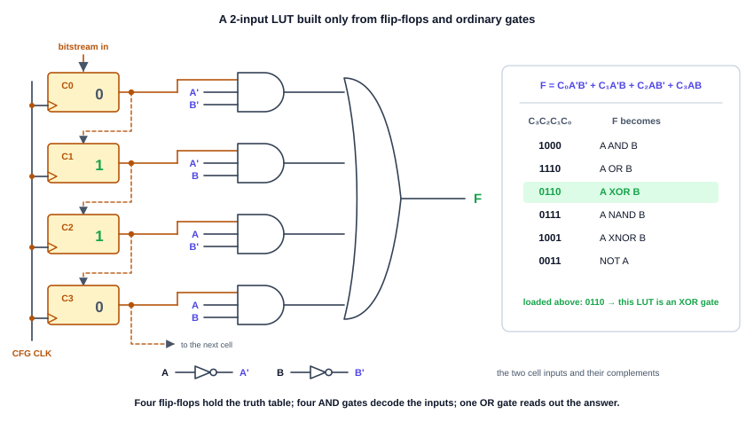

**อ่านวงจรทีละส่วน**
1. **ฟลิปฟลอป $C_0$–$C_3$ (สีส้ม)** — เก็บ "ตารางความจริง" ที่เราต้องการ ต่อกันเป็น **ชิฟต์เรจิสเตอร์** (บทที่ 7!) ข้อมูลคอนฟิกจึงไหลเข้าทีละบิตตามสัญญาณ CFG CLK นี่คือสิ่งที่เรียกว่า **Bitstream**
2. **เกต AND 4 ตัว** — ถอดรหัสว่าอินพุต $AB$ ตอนนี้ตรงกับแถวไหนของตาราง (เท่ากับวงจรถอดรหัส 2-to-4)
3. **เกต OR 1 ตัว** — รวมผลลัพธ์ มีเพียงแถวเดียวเท่านั้นที่เป็น `1` ได้ในแต่ละขณะ

**ผลลัพธ์ที่น่าทึ่ง:** ฮาร์ดแวร์ชุดเดิมไม่เปลี่ยนเลยแม้แต่เส้นเดียว แต่เปลี่ยนค่าในฟลิปฟลอป 4 ตัว แล้วมันกลายเป็นเกตคนละชนิด

| $C_3 C_2 C_1 C_0$ | $F$ กลายเป็น |
|:---:|:---|
| `1000` | $A \cdot B$ (AND) |
| `1110` | $A + B$ (OR) |
| `0110` | $A \oplus B$ (XOR) |
| `0111` | $\overline{A \cdot B}$ (NAND) |
| `1001` | $A \odot B$ (XNOR) |
| `0011` | $\overline{A}$ (NOT A) |

> 🧠 **นี่คือแนวคิดเดียวกับ ROM ในหัวข้อ 8.5 ทุกประการ** — เก็บตารางความจริงไว้ แล้วใช้อินพุตเป็นแอดเดรสไปหยิบคำตอบ ต่างกันแค่ ROM มีขนาดใหญ่และแก้ไม่ได้ ส่วน LUT เล็กจิ๋ว (4–64 บิต) และเขียนใหม่ได้ทุกครั้งที่เปิดเครื่อง

---

### 8.15.2 🔧 ลองสร้างเองบนเบรดบอร์ดจริง (1-Cell FPGA)

คำถาม *"สร้าง FPGA จากฟลิปฟลอปหรือเกตได้ไหม?"* ตอบได้ว่า **ได้ และใช้ไอซีที่ใช้ในใบงานของวิชานี้อยู่แล้ว**

#### แบบที่ 1 — LUT 3 อินพุต ด้วยไอซีเพียง 5 ตัว (แนะนำ)

| ไอซี | จำนวน | หน้าที่ในวงจร |
|:---:|:---:|:---|
| **7474** (Dual D Flip-Flop) | 4 ตัว | ฟลิปฟลอปคอนฟิก 8 บิต ($C_0$–$C_7$) = ตารางความจริง |
| **74151** (8-to-1 Multiplexer) | 1 ตัว | ตัวอ่านค่าออกจากตาราง โดยใช้ $A, B, C$ เป็นสายเลือก |

- ต่อ $Q$ ของฟลิปฟลอปทั้ง 8 ตัวเข้าขา $D_0$–$D_7$ ของ 74151
- ต่ออินพุตวงจร $A, B, C$ เข้าขาเลือก $S_2 S_1 S_0$
- เอาต์พุต $Y$ ของ 74151 คือ $F$
- ป้อนค่าคอนฟิกด้วย DIP Switch ที่ขา $D$ ของ 7474 แล้วกดปุ่มสร้างพัลส์นาฬิกา 1 ครั้งเพื่อ "โหลด Bitstream"

**ทดลอง:** โหลด `10010110` แล้ววัดเอาต์พุต — จะได้ $F = A \oplus B \oplus C$ ซึ่งก็คือ **Sum ของ Full Adder** จากนั้นโหลด `11101000` ใหม่โดยไม่ถอดสายเลยแม้แต่เส้นเดียว — จะได้ $F = AB + AC + BC$ ซึ่งคือ **Carry-out** ของ Full Adder

> นี่คือหัวใจของ FPGA ทั้งหมดในย่อหน้าเดียว: **เปลี่ยนวงจรโดยไม่แตะหัวแร้ง**

#### แบบที่ 2 — LUT 2 อินพุต แบบเห็นเกตทุกตัว

| ไอซี | จำนวน | หน้าที่ |
|:---:|:---:|:---|
| **7474** | 2 ตัว | ฟลิปฟลอปคอนฟิก 4 บิต |
| **7404** (Hex Inverter) | 1 ตัว | สร้าง $\overline{A}, \overline{B}$ |
| **7408** (Quad AND) | 2 ตัว | เกต AND 3 อินพุต 4 ชุด (ต่ออนุกรมตัวละ 2 เกต) |
| **7432** (Quad OR) | 1 ตัว | เกต OR 4 อินพุต (ต่อเป็นทรี 3 เกต) |

ตรงกับวงจรในรูปด้านบนทุกเส้น เหมาะสำหรับผู้ที่อยากเห็นว่า "ไม่มีอะไรซ่อนอยู่จริง ๆ"

#### แบบที่ 3 — เพิ่มให้เป็น Logic Cell เต็มรูป

เพิ่ม **7474 อีก 1 ตัว** ต่อที่เอาต์พุต $F$ เป็นฟลิปฟลอปเก็บข้อมูล และเพิ่ม **มัลติเพล็กเซอร์ 2-to-1** (สร้างจาก 7404 + 7408 + 7432 ตามสมการ $Y = \overline{S} F + S Q$) เพื่อเลือกว่าจะให้เอาต์พุตออกแบบ Combinational หรือ Registered — ครบเป็น Logic Cell หนึ่งเซลล์ตามหัวข้อถัดไป

---

### 8.15.3 Logic Cell หนึ่งเซลล์ประกอบด้วยอะไรบ้าง

ใน FPGA จริง หน่วยย่อยที่สุดเรียกว่า **Logic Cell** (Xilinx เรียก CLB, Intel/Altera เรียก LE) ประกอบด้วย LUT + ฟลิปฟลอป + มัลติเพล็กเซอร์เลือกโหมด

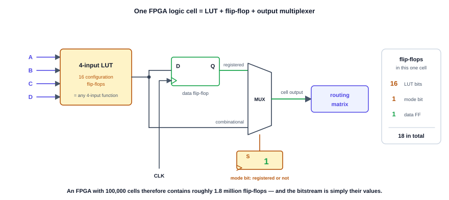

| ส่วน | หน้าที่ | จำนวนฟลิปฟลอปที่ใช้ |
|:---|:---|:---:|
| **LUT 4 อินพุต** | สร้างฟังก์ชันลอจิกใดก็ได้ของ 4 ตัวแปร | 16 (เก็บตารางความจริง) |
| **มัลติเพล็กเซอร์เลือกโหมด** | เลือก Combinational หรือ Registered | 1 (บิตโหมด) |
| **ฟลิปฟลอปข้อมูล** | เก็บสถานะของวงจรเชิงลำดับ | 1 (ใช้งานจริง) |
| | **รวม** | **18** |

> 📐 **คำนวณเล่น ๆ:** FPGA ขนาดกลางที่มี 100,000 Logic Cell จึงมีฟลิปฟลอปราว $100{,}000 \times 18 = 1.8$ **ล้านตัว** และ "โปรแกรม" ของมันก็คือค่า `0`/`1` ของฟลิปฟลอปเหล่านั้นทั้งหมดเรียงต่อกันเป็นสายยาว — ซึ่งก็คือไฟล์ Bitstream นั่นเอง

---

### 8.15.4 ตัวอย่างจริง: ตัวนับ 2 บิตจาก Logic Cell 2 เซลล์

ลองนำตัวนับจากบทที่ 7 มาวางลงบน FPGA จะเห็นภาพชัดที่สุด — ตัวนับขึ้น 2 บิตต้องการ:

$$D_0 = \overline{Q_0} \qquad D_1 = Q_1 \oplus Q_0$$

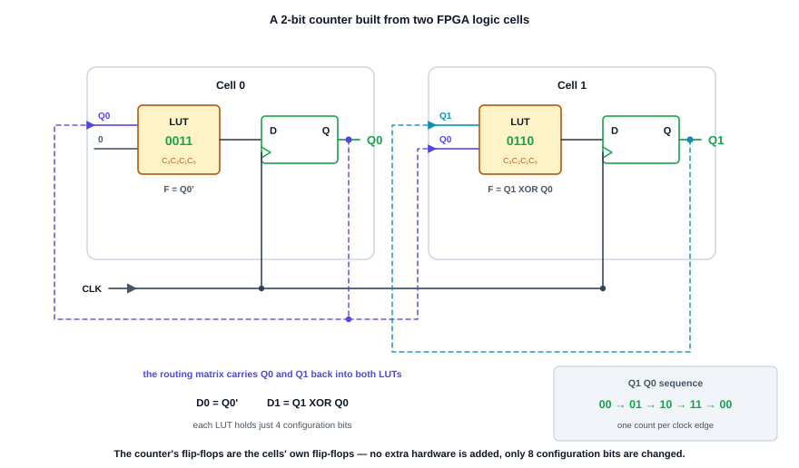

| เซลล์ | อินพุตของ LUT | ค่าใน LUT ($C_3 C_2 C_1 C_0$) | ฟังก์ชันที่ได้ | ฟลิปฟลอปที่ใช้ |
|:---:|:---|:---:|:---|:---|
| Cell 0 | $Q_0$ (อีกขาไม่ใช้) | `0011` | $\overline{Q_0}$ | ฟลิปฟลอปของเซลล์เอง $\to Q_0$ |
| Cell 1 | $Q_1, Q_0$ | `0110` | $Q_1 \oplus Q_0$ | ฟลิปฟลอปของเซลล์เอง $\to Q_1$ |

**สิ่งที่ต้องเข้าใจ:**
- **ฟลิปฟลอปของตัวนับ คือฟลิปฟลอปที่มีอยู่แล้วในเซลล์** ไม่ได้เพิ่มฮาร์ดแวร์ใหม่แม้แต่ชิ้นเดียว
- **ตรรกะระหว่างฟลิปฟลอป (สมการสถานะถัดไป) ถูกเก็บเป็นข้อมูล 4 บิตใน LUT** ไม่ได้ต่อเป็นเกต XOR จริง ๆ
- **เส้นป้อนกลับ $Q_0, Q_1$ วิ่งผ่าน Routing Matrix** ไม่ใช่ลายทองแดงตายตัว
- ถ้าอยากเปลี่ยนเป็นตัวนับลง เพียงเปลี่ยนค่าใน LUT ของ Cell 0 และ Cell 1 — **รวมแล้วแก้แค่ 8 บิต**

---

### 8.15.5 แม้แต่สายไฟก็เป็นฟลิปฟลอป

ชิ้นส่วนสุดท้ายที่เหลือคือ **การเดินสาย** ซึ่งก็โปรแกรมได้เช่นกัน จุดตัดของเส้นทางสัญญาณแต่ละจุดมี **ทรานซิสเตอร์ผ่านสัญญาณ (Pass Transistor)** คั่นอยู่ และเกตของทรานซิสเตอร์ตัวนั้นถูกควบคุมด้วย **ฟลิปฟลอปคอนฟิกอีก 1 ตัว**

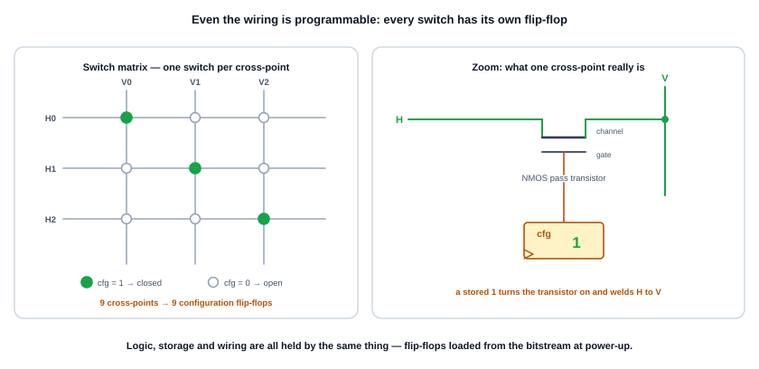

- ฟลิปฟลอปเก็บค่า `1` $\to$ ทรานซิสเตอร์นำกระแส $\to$ เส้นทางสองเส้นเชื่อมถึงกัน
- ฟลิปฟลอปเก็บค่า `0` $\to$ ทรานซิสเตอร์ปิด $\to$ สองเส้นแยกจากกัน

ในชิปจริง จำนวนฟลิปฟลอปที่ใช้คุมการเดินสาย **มีมากกว่า** ที่ใช้เก็บ LUT เสียอีก เพราะเส้นทางสัญญาณมีจำนวนมหาศาล

---

### 8.15.6 ผลที่ตามมาในทางปฏิบัติ: ทำไม FPGA ต้องมีชิป Flash คู่กันเสมอ

เมื่อทุกอย่างใน FPGA ถูกเก็บใน **ฟลิปฟลอป/SRAM** ซึ่งเป็นหน่วยความจำแบบ **Volatile** (ทบทวนหัวข้อ 8.4) ผลที่ตามมาคือ:

> **ปิดไฟเมื่อไร วงจรทั้งหมดหายไปทันที**

FPGA จึงต้องทำงานคู่กับ **ชิป Flash / EEPROM ภายนอก** ที่เก็บไฟล์ Bitstream ไว้แบบถาวร ทุกครั้งที่จ่ายไฟ ชิป FPGA จะอ่าน Bitstream จาก Flash มาเลื่อนเข้าฟลิปฟลอปคอนฟิกทั้งหมดก่อน (ใช้เวลาราว 10–200 มิลลิวินาที) แล้วจึงเริ่มทำงาน — นี่คือเหตุผลที่บอร์ด FPGA ทุกรุ่นจะมีชิปหน่วยความจำตัวเล็ก ๆ อยู่ข้าง ๆ เสมอ

### ตารางเปรียบเทียบสุดท้าย: PAL/GAL · CPLD · FPGA

| หัวข้อ | PAL / GAL | CPLD | FPGA |
|:---|:---:|:---:|:---:|
| **สร้างตรรกะด้วย** | AND-OR Array | AND-OR Array | **LUT (ฟลิปฟลอป + MUX)** |
| **เก็บคอนฟิกใน** | ฟิวส์ / EEPROM | EEPROM / Flash | **SRAM (ลบเมื่อดับไฟ)** |
| **ต้องโหลดใหม่ทุกครั้งที่เปิดเครื่อง** | ไม่ต้อง | ไม่ต้อง | **ต้อง** |
| **พร้อมทำงานหลังจ่ายไฟ** | ทันที | ทันที | หลังโหลด Bitstream เสร็จ |
| **หน่วงเวลา** | คงที่ คาดเดาได้ | คงที่ คาดเดาได้ | ขึ้นกับผลการวางและเดินสาย |
| **ความจุ** | สิบ–ร้อยเกต | พัน–หมื่นเกต | ล้านเกตขึ้นไป |

*(ในบทที่ 9 เราจะเรียนภาษา Verilog HDL เพื่อบรรยายวงจร แล้วให้ซอฟต์แวร์คำนวณค่าที่ต้องหยอดลง LUT และสวิตช์เดินสายเหล่านี้ให้อัตโนมัติ — เราจะไม่ต้องกรอกบิตเองอีกต่อไป)*

---

# ภาคที่ 3: การแปลงสัญญาณและการเชื่อมต่อ (Data Conversion)

## 8.16 โลกแอนะล็อก vs โลกดิจิทัล

ชิปประมวลผลทำงานด้วยเลข **ดิจิทัล (0 และ 1)** แต่ปรากฏการณ์ทางกายภาพในโลกจริงล้วนเป็น **แอนะล็อก** คือเปลี่ยนแปลงต่อเนื่องไม่จำกัดระดับ — อุณหภูมิ ความดัน เสียง แสง

```text
┌─────────────────┐       ┌──────────────────┐       ┌─────────────────┐
│ โลกกายภาพจริง    │ ────► │  ADC (แปลงเข้า)   │ ────► │ ระบบประมวลผล    │
│ สัญญาณแอนะล็อก   │       │ Analog-to-Digital│       │ (MCU/FPGA/DSP)  │
└─────────────────┘       └──────────────────┘       └────────┬────────┘
         ▲                                                    │
         │                ┌──────────────────┐                │
         └─────────────── │  DAC (แปลงออก)   │ ◄──────────────┘
                          │ Digital-to-Analog│
                          └──────────────────┘
```

- **ADC** ทำหน้าที่เป็น "ประสาทสัมผัส" แปลงแรงดันแอนะล็อกเป็นรหัสตัวเลข
- **DAC** ทำหน้าที่เป็น "แขนขา" แปลงตัวเลขกลับเป็นแรงดันเพื่อขับอุปกรณ์ภายนอก

---

## 8.17 วงจรแปลงดิจิทัลเป็นแอนะล็อก (DAC)

### หลักการและสมการคำนวณ

DAC รับรหัสไบนารี $n$ บิต แล้วสร้างแรงดันเอาต์พุตตามสัดส่วนของแรงดันอ้างอิง:

$$V_{out} = V_{ref} \times \frac{D}{2^n}$$

โดย $D$ คือค่าข้อมูลดิจิทัลในฐานสิบ ($0$ ถึง $2^n - 1$) และ $n$ คือจำนวนบิตความละเอียด

**พารามิเตอร์สำคัญ 3 ตัว**

1. **Resolution (ความละเอียด):** จำนวนบิต $n$ — ยิ่งมาก ขั้นบันไดยิ่งละเอียด
2. **Step Size (ขนาดขั้น):** แรงดันที่เปลี่ยนไปเมื่อค่าดิจิทัลเพิ่มขึ้น 1 LSB
   $$\text{Step Size} = \frac{V_{ref}}{2^n}$$
3. **Full-Scale Output:** แรงดันสูงสุดที่จ่ายได้ (เมื่ออินพุตเป็น 1 ทุกบิต)
   $$V_{FS} = V_{ref} \times \frac{2^n - 1}{2^n} = V_{ref} - \text{Step Size}$$

> ⚠️ สังเกตว่า $V_{FS}$ **ไม่เท่ากับ** $V_{ref}$ เสมอ — DAC จ่ายแรงดันได้สูงสุดน้อยกว่า $V_{ref}$ อยู่ 1 ขั้นเสมอ เพราะค่าดิจิทัลสูงสุดคือ $2^n - 1$ ไม่ใช่ $2^n$

### โครงสร้างวงจร R-2R Resistor Ladder

วงจร Binary-Weighted Resistor DAC ต้องใช้ตัวต้านทานหลายค่า ($R, 2R, 4R, 8R, \dots$) ที่แม่นยำสูงมาก ซึ่งผลิตในไอซีได้ยาก — DAC 8 บิตจะต้องการตัวต้านทานตั้งแต่ $R$ ถึง $128R$ ที่คลาดเคลื่อนไม่เกิน 0.2%

วงจรมาตรฐานที่ใช้กันทั่วโลกจึงเป็น **R-2R Ladder** ซึ่งใช้ตัวต้านทานเพียง **2 ค่า**:

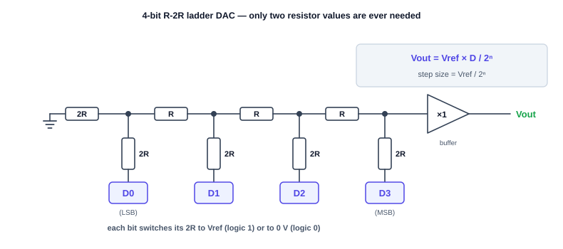

**เหตุผลที่ R-2R ได้รับความนิยม**
1. ใช้ตัวต้านทานเพียง $R$ กับ $2R$ จึงควบคุมอัตราส่วนและสัมประสิทธิ์อุณหภูมิบนชิปได้แม่นยำมาก (ผลิตตัวต้านทาน $2R$ จาก $R$ สองตัวต่ออนุกรมได้เลย)
2. ขยายจำนวนบิตได้ง่ายเพียงต่อบันไดขั้นถัดไป โดยไม่ต้องเปลี่ยนค่าตัวต้านทานเดิม

#### 📌 ตัวอย่างที่ 8.3: การคำนวณแรงดันเอาต์พุต DAC
**โจทย์:** DAC ขนาด 4 บิต ใช้ $V_{ref} = 8\text{ V}$ จงหา (1) Step Size (2) $V_{out}$ เมื่ออินพุตเป็น $1010_2$ (3) $V_{FS}$

**วิธีทำ**
1. $\text{Step Size} = \dfrac{8\text{ V}}{2^4} = \dfrac{8}{16} = \mathbf{0.5\text{ V ต่อขั้น}}$
2. $1010_2 = 8 + 2 = 10_{10}$ ดังนั้น $V_{out} = 10 \times 0.5 = \mathbf{5.0\text{ V}}$
3. อินพุตสูงสุด $1111_2 = 15$ ดังนั้น $V_{FS} = 15 \times 0.5 = \mathbf{7.5\text{ V}}$ (น้อยกว่า $V_{ref}$ อยู่ 1 ขั้นพอดี)

---

## 8.18 วงจรแปลงแอนะล็อกเป็นดิจิทัล (ADC)

การแปลงแรงดันแอนะล็อกเป็นตัวเลขต้องผ่าน **3 ขั้นตอนตามลำดับ**:

```text
  สัญญาณแอนะล็อก
       │
       ▼
┌──────────────┐      ┌──────────────┐      ┌──────────────┐      ข้อมูลดิจิทัล
│ 1. Sampling  │ ───► │2.Quantization│ ───► │ 3. Encoding  │ ───►  (Binary)
│ สุ่มวัดตามเวลา │      │ ปัดเป็นระดับ   │      │ แปลงเป็น 0/1  │
└──────────────┘      └──────────────┘      └──────────────┘
```

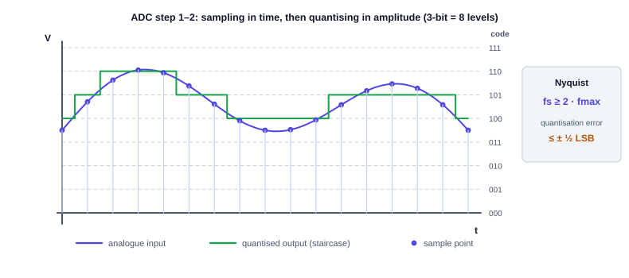

### 1. Sampling (การสุ่มตัวอย่าง)

การวัดระดับแรงดัน ณ จังหวะเวลาที่กำหนด

> **ทฤษฎีบทของไนควิสต์ (Nyquist Sampling Theorem)**
> ความถี่สุ่มตัวอย่าง ($f_s$) ต้อง **มากกว่าหรือเท่ากับ 2 เท่าของความถี่สูงสุดในสัญญาณ**
> $$f_s \geq 2 \times f_{max}$$
> หากสุ่มช้ากว่านี้ จะเกิดความผิดเพี้ยนที่เรียกว่า **Aliasing** — สัญญาณความถี่สูงจะถูกตีความผิดเป็นความถี่ต่ำ (เหมือนภาพล้อรถที่ดูเหมือนหมุนถอยหลังในภาพยนตร์)

### 2. Quantization (การแบ่งระดับ)

ปัดค่าแรงดันที่วัดได้ให้ตกลงในขั้นบันไดที่ใกล้ที่สุด
- ADC ขนาด $n$ บิต แบ่งระดับได้ $2^n$ ระดับ
- การปัดเศษก่อให้เกิดความคลาดเคลื่อนที่เลี่ยงไม่ได้ เรียก **Quantization Error** ค่าสูงสุดไม่เกิน $\mathbf{\pm \frac{1}{2}\text{ LSB}}$

### 3. Encoding (การเข้ารหัส)

แปลงระดับขั้นที่ได้เป็นรหัสเลขฐานสอง ($000_2, 001_2, \dots$)

### การเปรียบเทียบสถาปัตยกรรม ADC

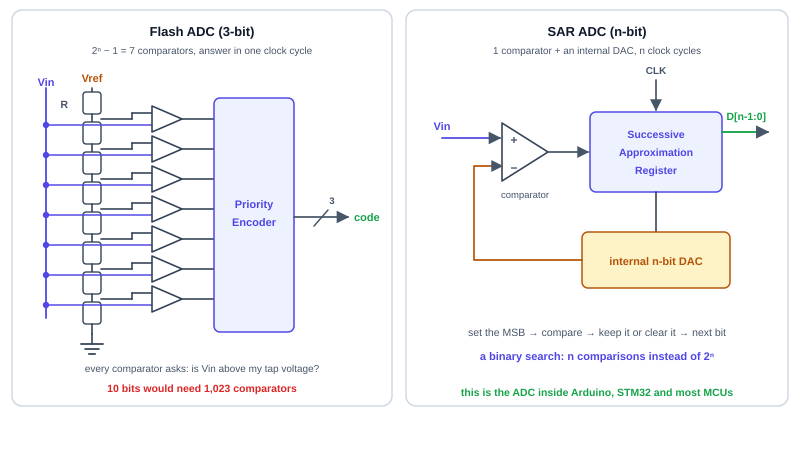

#### Flash ADC — "วัดทุกระดับพร้อมกันในพริบตาเดียว"
ใช้ตัวเปรียบเทียบ (Comparator) ขนานกัน $2^n - 1$ ตัว แต่ละตัวเทียบ $V_{in}$ กับแรงดันอ้างอิงของตัวเองที่แบ่งมาจากสายตัวต้านทาน เมื่อสัญญาณเข้ามา ทุกตัวตัดสินใจพร้อมกันทันที แล้ว Priority Encoder แปลงผลเป็นรหัสไบนารี
- **เร็วที่สุด** — ได้คำตอบในจังหวะสัญญาณนาฬิกาเดียว
- **แต่โตเร็วมาก** — 3 บิตใช้ 7 ตัว, 8 บิตใช้ 255 ตัว, **10 บิตใช้ถึง 1,023 ตัว**

#### SAR ADC — "การชั่งน้ำหนักแบบผ่าครึ่ง (Binary Search)"
ใช้ Comparator เพียง **1 ตัว** ทำงานร่วมกับ DAC ภายใน
- รอบที่ 1: ตั้งบิตสูงสุด (MSB) เป็น 1 แล้วถามว่า $V_{in}$ มากกว่าครึ่งหนึ่งของ $V_{ref}$ หรือไม่ — ถ้าน้อยกว่าก็เคลียร์บิตนั้นทิ้ง
- รอบที่ 2–$n$: ทำซ้ำกับบิตถัดไปเรื่อย ๆ
- ใช้เวลา $n$ รอบสัญญาณนาฬิกา แต่ประหยัดวงจรและพลังงานมหาศาล

> 💡 นี่คือ ADC ที่อยู่ในไมโครคอนโทรลเลอร์แทบทุกตัวที่นักศึกษาจะได้ใช้ — ทั้ง Arduino (10 บิต) และ STM32 (12 บิต)

| สถาปัตยกรรม | หลักการ | ความเร็ว | ความละเอียด | การนำไปใช้จริง |
|:---|:---|:---:|:---:|:---|
| **Flash ADC** | Comparator ขนาน $2^n-1$ ตัว | **เร็วที่สุด (ns)** ✅ | 6–8 บิต | ออสซิลโลสโคปดิจิทัล, เรดาร์ |
| **SAR ADC** | ค้นหาแบบไบนารีทีละบิต | ปานกลาง (1–5 µs) | **ดี (10–16 บิต)** ✅ | ไมโครคอนโทรลเลอร์ทั่วไป |
| **Sigma-Delta ($\Sigma\Delta$)** | Oversampling + กรองดิจิทัล | ช้า (ms) | **สูงมาก (16–24 บิต)** ✅ | เครื่องเสียง Hi-Fi, เครื่องชั่ง |

#### 📌 ตัวอย่างที่ 8.4: การเลือกความละเอียดของ ADC
**โจทย์:** ต้องการวัดแรงดัน $0$–$5\text{ V}$ โดยแยกแยะความเปลี่ยนแปลงได้ละเอียดถึง $10\text{ mV}$ ต้องใช้ ADC กี่บิต?

**วิธีทำ**
- จำนวนระดับที่ต้องการ $= \dfrac{5\text{ V}}{10\text{ mV}} = 500$ ระดับ
- หา $n$ ที่ทำให้ $2^n \geq 500$ : $2^8 = 256$ (ไม่พอ), $2^9 = 512$ (พอ)
- ดังนั้นต้องใช้ ADC อย่างน้อย $\mathbf{9}$ **บิต** — ในทางปฏิบัติเลือกเบอร์ที่หาซื้อได้คือ **10 บิต** ซึ่งให้ step size $= 5/1024 = 4.88\text{ mV}$

---

## 8.19 เทคนิคทางเลือก: PWM (Pulse Width Modulation)

ในงานควบคุมกำลังไฟฟ้า เช่น ปรับความเร็วมอเตอร์หรือความสว่างหลอดไฟ การใช้ DAC จ่ายแรงดันแอนะล็อกตรง ๆ ทำให้ทรานซิสเตอร์ทำงานในย่านเชิงเส้นและเกิดความร้อนสูญเสียมหาศาล

เราจึงใช้ **PWM** ซึ่งปล่อยสัญญาณดิจิทัลที่มีเพียงระดับ HIGH กับ LOW สลับกันด้วยความถี่สูง แล้วควบคุม **สัดส่วนช่วงเปิด (Duty Cycle)** แทน — ทรานซิสเตอร์จึงเป็นได้แค่ "เปิดสนิท" หรือ "ปิดสนิท" ซึ่งแทบไม่สูญเสียกำลังเลย

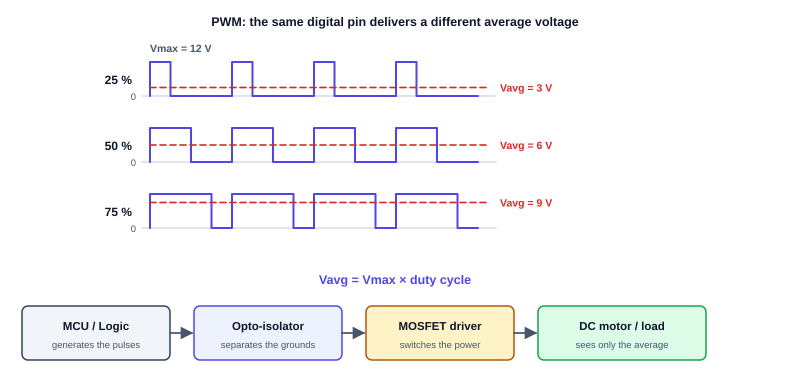

$$V_{avg} = V_{max} \times \text{Duty Cycle} = V_{max} \times \frac{T_{ON}}{T_{ON} + T_{OFF}}$$

| Duty Cycle | คำอธิบาย ($V_{max} = 12\text{ V}$) | $V_{avg}$ | พฤติกรรมมอเตอร์ |
|:---:|:---|:---:|:---|
| **0%** | ปิดตลอดเวลา | $0\text{ V}$ | หยุดนิ่ง |
| **25%** | เปิด $1/4$ ของคาบ | $3\text{ V}$ | หมุนช้า |
| **50%** | เปิดครึ่งหนึ่ง | $6\text{ V}$ | ความเร็วปานกลาง |
| **100%** | เปิดค้างตลอด | $12\text{ V}$ | ความเร็วสูงสุด |

> 🔌 **บทบาทของ Opto-Isolator:** มอเตอร์สร้างสัญญาณรบกวนและแรงดันย้อนกลับ (back-EMF) รุนแรง ออปโตไอโซเลเตอร์ตัดการเชื่อมต่อทางไฟฟ้าระหว่างฝั่งลอจิกกับฝั่งกำลัง โดยส่งสัญญาณผ่านแสงแทน จึงปกป้องวงจรควบคุมไม่ให้พัง

---

## 8.20 การเชื่อมต่อระบบแบบครบวงจร (End-to-End System)

ตัวอย่างการนำความรู้ทั้ง 3 ภาคมาต่อกันเป็น **ระบบวัดอุณหภูมิดิจิทัล**:

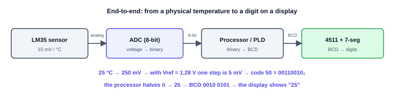

**กระบวนการไหลของข้อมูล**

1. **เซนเซอร์ LM35** ให้แรงดันแอนะล็อกเชิงเส้น $10\text{ mV}/^\circ\text{C}$ — ที่ $25^\circ\text{C}$ จ่าย $250\text{ mV}$
2. **ADC 8 บิต** ถ้าเลือก $V_{ref} = 1.28\text{ V}$ จะได้ step size $= 1.28/256 = 5\text{ mV}$ ดังนั้น $250\text{ mV}$ แปลงเป็นรหัส $50_{10} = 00110010_2$
3. **หน่วยประมวลผล (MCU หรือ PLD)** หารสองได้ค่า $25$ แล้วแปลงเป็นรหัส BCD `0010 0101`
4. **ภาคแสดงผล (4511 + 7-Segment)** ถอดรหัส BCD เป็นสัญญาณ 7 เส้น ($a$–$g$) ขับตัวเลข `25` ให้ปรากฏ

> 🎯 **สังเกตว่าทุกบทที่เรียนมาอยู่ในภาพเดียวนี้ทั้งหมด:** เลขฐาน (บทที่ 1) · รหัส BCD (บทที่ 1) · เกตและวงจรถอดรหัส (บทที่ 2, 5) · การลดรูปสมการในตัวถอดรหัส (บทที่ 3, 4) · เรจิสเตอร์เก็บค่าที่อ่านได้ (บทที่ 6, 7) · และการแปลงสัญญาณกับ PLD (บทที่ 8)

---

## 8.21 สรุปสาระสำคัญบทที่ 8

1. **หน่วยความจำ** ประกอบด้วย Address Decoder, Memory Array และ I/O Buffer — มี Address $n$ เส้น Data $m$ เส้น ความจุ $2^n \times m$ บิต การขยายขนาดทำโดยต่อ Data Bus ขนาน และใช้แอดเดรสบิตบนสร้างสัญญาณ $\overline{\text{CS}}$
2. **SRAM** ใช้ 6T Flip-Flop เร็วมาก ไม่ต้องรีเฟรช เหมาะกับแคช · **DRAM** ใช้ 1T-1C ต้องรีเฟรช ราคาถูก เหมาะกับหน่วยความจำหลัก
3. **ROM คือตารางความจริงที่ฝังลงฮาร์ดแวร์** — Decoder สร้าง minterm ทุกตัว แล้ว OR Array เลือกว่าจะบวกตัวไหน
4. **PLD ทุกตระกูลใช้โครงสร้าง AND Array → OR Array** ต่างกันแค่ชั้นไหนโปรแกรมได้:
   - **PROM** — AND ตายตัว, OR โปรแกรมได้ (เปลืองพื้นที่ เพราะต้องมี $2^n$ แถว)
   - **PLA** — โปรแกรมได้ทั้งสองชั้น **แชร์ product term ได้** ยืดหยุ่นสูงสุดแต่ช้าที่สุด
   - **PAL** — AND โปรแกรมได้, OR ตายตัว **เร็วกว่าและถูกกว่า** แต่ต้องโปรแกรมเทอมซ้ำเมื่อใช้ร่วมกัน
   - **GAL** — เหมือน PAL แต่ใช้ EEPROM ลบเขียนใหม่ได้ และมี **OLMC** ที่เลือกขั้ว/โหมด registered/tri-state/feedback ได้
5. **จุดที่ต้องระวังในการออกแบบ PAL:** product term ที่ไม่ใช้ต้อง **ปล่อยฟิวส์ไว้ครบ** เพื่อให้ได้ผลลัพธ์ $0$ ($X \cdot \overline{X} = 0$) ห้ามเป่าทิ้งทั้งแถวเด็ดขาด
6. **PLA ได้เปรียบเมื่อเอาต์พุตใช้เทอมร่วมกันมาก** — วงจรถอดรหัส BCD→7-segment ใช้เพียง 15 เทอม แทนที่จะเป็น 25 เทอม (ประหยัด 40%) แต่ที่อินพุตน้อย ๆ ROM ก็ยังสู้ได้สูสี ข้อได้เปรียบของ PLA/PAL จะชัดเจนเมื่ออินพุตเพิ่มขึ้น เพราะ ROM ต้องมี $2^n$ แถวเสมอ
7. **Registered PAL สร้างวงจรเชิงลำดับได้** ด้วยฟลิปฟลอปในแมโครเซลล์ + เส้น feedback กลับเข้า AND Array — ตัวนับ Mod-6 พร้อม Synchronous Clear ลงได้ในชิปเดียว และต้องตรวจ **Self-Correction** ของสถานะที่กำหนดเป็น Don't Care เสมอ
8. **FPGA ใช้ LUT** ซึ่งก็คือ SRAM ขนาด $2^k$ บิตต่อมัลติเพล็กเซอร์ — เก็บตารางความจริงตรง ๆ ทำให้ทุกฟังก์ชันมีหน่วงเวลาเท่ากัน
9. **ข้างใน FPGA ไม่มีอะไรนอกจากเกต ฟลิปฟลอป และทรานซิสเตอร์** — LUT คือมัลติเพล็กเซอร์ที่อ่านค่าจากฟลิปฟลอปคอนฟิก · ฟลิปฟลอปในเซลล์เก็บสถานะ · สวิตช์เดินสายคือทรานซิสเตอร์ที่มีฟลิปฟลอปคุมเกต · Logic Cell หนึ่งเซลล์ใช้ฟลิปฟลอปราว 18 ตัว และ **สร้างจำลองได้จริงบนเบรดบอร์ดด้วย 74151 + 7474**
10. **คอนฟิกของ FPGA เป็น Volatile** จึงต้องมีชิป Flash ภายนอกเก็บ Bitstream และโหลดใหม่ทุกครั้งที่จ่ายไฟ ต่างจาก PAL/GAL/CPLD ที่พร้อมทำงานทันที
11. **DAC** แปลงไบนารีเป็นแรงดัน $V_{out} = V_{ref} \times D/2^n$ นิยมใช้ **R-2R Ladder** เพราะใช้ตัวต้านทานเพียง 2 ค่า
12. **ADC** แปลงแรงดันเป็นตัวเลขผ่าน Sampling $\to$ Quantization $\to$ Encoding ต้องเคารพเงื่อนไข $f_s \geq 2f_{max}$ และมีความคลาดเคลื่อน $\pm\frac{1}{2}$ LSB เสมอ · **Flash** เร็วที่สุด **SAR** สมดุลที่สุด **$\Sigma\Delta$** ละเอียดที่สุด
13. **PWM** ให้แรงดันเฉลี่ยแปรผันตาม Duty Cycle โดยที่ทรานซิสเตอร์ทำงานแบบสวิตช์เต็มที่ จึงสูญเสียกำลังน้อยกว่าการใช้ DAC ขับโหลดโดยตรง

</div>

<div class="chapter-tab-content" data-tab-name="Interactive Sim" data-tab-icon="🎮" id="sim" markdown="1">

## 🎮 ห้องทดลองที่ 1: โปรแกรมจำลองหน่วยความจำ RAM

ทดลองป้อนแอดเดรสและสลับบิตข้อมูลบนหน่วยความจำ RAM ขนาด 8 แอดเดรส × 8 บิต เพื่อเข้าใจกลไกการเขียน (Write) และการอ่าน (Read):



### 🧪 ภารกิจ
1. **เขียนข้อมูล:** ตั้ง Address ไปที่ `010` ป้อนข้อมูล `10101010` แล้วกดปุ่ม Write
2. **ตรวจสอบการคงอยู่:** เปลี่ยน Address ไปตำแหน่งอื่น แล้วกลับมาที่ `010` — ข้อมูลยังอยู่หรือไม่?
3. **เชื่อมโยงสู่วงจรจริง:** ถ้า Address Bus มี 8 เส้น ชิปนี้จะเก็บข้อมูลได้กี่ไบต์? *(คำตอบ: $2^8 = 256$ ไบต์)*
4. **คิดต่อ:** ถ้าตัดไฟเลี้ยงออกแล้วจ่ายไฟกลับเข้าไปใหม่ ข้อมูลจะเป็นอย่างไร? เพราะเหตุใด?

---

## 🔧 ห้องทดลองที่ 2: ฝึกออกแบบวงจร PLD ด้วยตนเอง

การออกแบบ PLD เริ่มต้นที่การลดรูปสมการให้อยู่ในรูป SOP ที่สั้นที่สุดเสมอ ใช้เครื่องมือสองตัวนี้ช่วยในขั้นตอนที่ 3 ของกระบวนการออกแบบ (หัวข้อ 8.12)

### 🅰️ ผังคาร์โนห์ 3 ตัวแปร — สำหรับหาสมการ SOP



### 🅱️ เครื่องมือลดรูปสมการบูลีน — สำหรับตรวจคำตอบ



---

### 🧪 ภารกิจออกแบบ: ระบบควบคุมประตูอัตโนมัติของอาคาร

**ข้อกำหนด**

| สัญลักษณ์ | ความหมาย | ลอจิก `1` |
|:---:|:---|:---|
| $P$ | เซนเซอร์ตรวจจับคน | มีคนอยู่หน้าประตู |
| $L$ | สวิตช์ล็อกกลางคืน | ระบบถูกล็อก |
| $F$ | สัญญาณแจ้งเหตุเพลิงไหม้ | เกิดเพลิงไหม้ |
| $\text{OPEN}$ | คำสั่งเปิดประตู | เปิด |
| $\text{ALARM}$ | เสียงเตือน | ดัง |

- ประตูเปิดเมื่อ **มีคนมาและระบบไม่ได้ล็อก** หรือ **เกิดเพลิงไหม้** (ต้องเปิดเสมอเพื่อให้หนีออกได้)
- เสียงเตือนดังเมื่อ **เกิดเพลิงไหม้** หรือ **มีคนพยายามเข้าขณะที่ระบบล็อกอยู่**

**ขั้นตอนที่ต้องทำ**
1. เขียนตารางความจริงครบ 8 แถว
2. ใช้ผังคาร์โนห์ด้านบนหาสมการ SOP ของ $\text{OPEN}$ และ $\text{ALARM}$
3. นับว่ามี product term ที่ไม่ซ้ำกันกี่เทอม และเทอมใดที่ใช้ร่วมกันได้ทั้งสองเอาต์พุต
4. เขียนตารางโปรแกรม PLA ตามรูปแบบในหัวข้อ 8.10 ขั้นที่ 5
5. วาดวงจร PLA ด้วยสัญกรณ์ ✕ โดยเลียนแบบรูปในหัวข้อ 8.10

<details markdown="1">
<summary>👁️ คลิกเพื่อดูเฉลยขั้นที่ 2–3</summary>

$$\text{OPEN} = P \cdot \overline{L} + F \qquad \text{ALARM} = F + P \cdot L$$

Product term ที่ไม่ซ้ำมี **3 เทอม** คือ $P_1 = P \cdot \overline{L}$, $P_2 = F$, $P_3 = P \cdot L$

โดย $P_2 = F$ เป็นเทอมที่ **แชร์ได้ทั้งสองเอาต์พุต** — ถ้าใช้ PLA จะประหยัดไป 1 เทอม แต่ถ้าใช้ PAL ต้องโปรแกรม $F$ ซ้ำสองครั้ง

</details>

---

## 🔬 ห้องทดลองที่ 3: สร้าง "FPGA หนึ่งเซลล์" ด้วยมือ

การทดลองนี้พิสูจน์ด้วยไอซีจริงว่า FPGA ไม่มีอะไรมากไปกว่าเกตและฟลิปฟลอปที่เรียนมาแล้ว (ดูรายละเอียดวงจรในหัวข้อ 8.15.2)

### อุปกรณ์
| ไอซี | จำนวน | หน้าที่ |
|:---:|:---:|:---|
| **7474** Dual D Flip-Flop | 4 | ฟลิปฟลอปคอนฟิก 8 บิต = "ตารางความจริง" ที่โหลดเข้าไป |
| **74151** 8-to-1 Multiplexer | 1 | ตัวอ่านค่าจากตาราง โดยใช้ $A, B, C$ เป็นสายเลือก |
| DIP Switch + ปุ่มกด + LED | — | ป้อนค่าคอนฟิก, สร้างพัลส์นาฬิกา, แสดงผล $F$ |

### ขั้นตอน
1. ต่อ $Q$ ของ 7474 ทั้ง 8 ตัวเข้าขา $D_0$–$D_7$ ของ 74151 ตามลำดับ
2. ต่ออินพุตวงจร $A, B, C$ เข้าขาเลือก $S_2, S_1, S_0$ และต่อ $Y$ เข้า LED
3. ตั้ง DIP Switch เป็น `10010110` แล้วกดปุ่มนาฬิกา 1 ครั้ง — เท่ากับ "โหลด Bitstream"
4. ไล่ป้อน $ABC$ ครบทั้ง 8 กรณี บันทึกค่า $F$ ลงตารางความจริง
5. เปลี่ยน DIP Switch เป็น `11101000` กดปุ่มนาฬิกาอีกครั้ง **โดยไม่ถอดสายใด ๆ** แล้วบันทึกตารางความจริงใหม่

### สิ่งที่ควรได้และคำถามท้ายการทดลอง
- คอนฟิก `10010110` $\to$ ควรได้ $F = A \oplus B \oplus C$ (Sum ของ Full Adder)
- คอนฟิก `11101000` $\to$ ควรได้ $F = AB + AC + BC$ (Carry-out ของ Full Adder)
- **คำถาม 1:** วงจรเปลี่ยนหน้าที่ไปโดยสิ้นเชิงทั้งที่ไม่ได้ขยับสายเลย — สิ่งใดคือ "โปรแกรม" ของวงจรนี้?
- **คำถาม 2:** ถ้าตัดไฟเลี้ยงแล้วจ่ายกลับเข้าไปใหม่ วงจรจะยังทำงานเหมือนเดิมหรือไม่ เพราะเหตุใด? แล้วเรื่องนี้อธิบายได้ไหมว่าทำไมบอร์ด FPGA จริงจึงต้องมีชิป Flash อยู่ข้าง ๆ เสมอ
- **คำถาม 3:** จงหาค่าคอนฟิกที่ทำให้วงจรนี้กลายเป็นเกต NAND 3 อินพุต
- **คำถาม 4 (ต่อยอด):** เพิ่ม 7474 อีก 1 ตัวที่เอาต์พุต $Y$ แล้วลองสร้างวงจรที่สถานะเปลี่ยนตามสัญญาณนาฬิกา — คุณเพิ่งสร้าง Logic Cell แบบ Registered สำเร็จแล้ว

> 📌 ตารางค่าคอนฟิกสำหรับฟังก์ชันอื่น ๆ ดูได้จาก **ตารางที่ 9** ในแท็บ Waveform / Truth Table

---

## 🌐 แหล่งทดลองวงจรภายนอกที่แนะนำ

- **[CircuitVerse](https://circuitverse.org/simulator):** ต่อวงจร PROM, PLA และ PAL ในระดับเกตได้จริงบนเบราว์เซอร์ 👉 **ดูคู่มือต่อวงจรทีละขั้นตอนพร้อมตารางทดสอบได้ที่แท็บ 🛠️ CircuitVerse**
- **[Tinkercad Circuits](https://www.tinkercad.com/):** ออกแบบวงจร R-2R Ladder บนเบรดบอร์ดเสมือน ต่อ DIP Switch เป็นบิตอินพุต แล้ววัดแรงดันด้วยมัลติมิเตอร์ เทียบกับค่าที่คำนวณจากสูตร $V_{out} = V_{ref} \times D/2^n$
- **[EDA Playground](https://www.edaplayground.com/):** (ใช้ต่อในบทที่ 9) เขียนสมการ SOP ชุดเดียวกันด้วย Verilog แล้วเปรียบเทียบกับ fuse map ที่ออกแบบไว้ในบทนี้

</div>

<div class="chapter-tab-content" data-tab-name="Waveform / Truth Table" data-tab-icon="📊" id="waveform" markdown="1">

## 📊 ตารางอ้างอิงประจำบทที่ 8

### ตารางที่ 1: เปรียบเทียบสถาปัตยกรรมหน่วยความจำ

| หัวข้อ | SRAM | DRAM | Flash (NAND) | Flash (NOR) |
|:---|:---:|:---:|:---:|:---:|
| **ความคงอยู่ของข้อมูล** | Volatile | Volatile | Non-Volatile | Non-Volatile |
| **โครงสร้างพื้นฐาน** | 6 ทรานซิสเตอร์ | 1C + 1T | Floating-gate MOS | Floating-gate MOS |
| **การเข้าถึงข้อมูล** | Byte-level Random | Byte-level Random | Block / Page level | Byte-level Random (XIP) |
| **ความเร็วในการอ่าน** | **เร็วที่สุด (< 10 ns)** | ปานกลาง (30–60 ns) | ช้ากว่า (อ่านเป็นบล็อก) | **เร็วมาก (50–100 ns)** |
| **การนำไปใช้งาน** | Cache L1/L2/L3 | Main Memory (DDR4/5) | SSD, SD Card, Flash Drive | BIOS, UEFI, Firmware |

---

### ตารางที่ 2: สรุปตระกูลอุปกรณ์ลอจิกโปรแกรมได้ (PLD Family)

| อุปกรณ์ | AND Matrix | OR Matrix | แชร์เทอมได้? | การโปรแกรมซ้ำ | ความจุ/ความซับซ้อน |
|:---:|:---:|:---:|:---:|:---:|:---:|
| **PROM** | Fixed | Programmable | — | ครั้งเดียว (OTP) | เล็ก (ต้องมี $2^n$ แถว) |
| **PLA** | Programmable | Programmable | **ได้** ✅ | ครั้งเดียว / UV | เล็ก-ปานกลาง |
| **PAL** | Programmable | Fixed | ไม่ได้ | ครั้งเดียว | เล็ก-ปานกลาง (เน้นความเร็ว) |
| **GAL** | Programmable | Fixed (+ OLMC) | ไม่ได้ | **ซ้ำได้ด้วยไฟฟ้า (EEPROM)** ✅ | เล็ก-ปานกลาง |
| **CPLD** | หลายบล็อก | เชื่อมด้วย Interconnect Matrix | ได้ (ภายในบล็อก) | ซ้ำได้ (Flash/EEPROM) | นับพันเกต |
| **FPGA** | **ใช้ LUT แทน array** | **ใช้ LUT แทน array** | — (ไม่ใช้แนวคิด array) | **ซ้ำได้ไม่จำกัด (SRAM)** | **นับล้านเกต** |

---

### ตารางที่ 3: วิธีอ่านตารางโปรแกรม PLA

| สัญลักษณ์ในคอลัมน์อินพุต | ความหมาย | ในวงจรคือ |
|:---:|:---|:---|
| `1` | ต่อเข้าเส้น **ตัวจริง** ของตัวแปรนั้น | ✕ ที่คอลัมน์ $A$ |
| `0` | ต่อเข้าเส้น **คอมพลีเมนต์** | ✕ ที่คอลัมน์ $\overline{A}$ |
| `–` | ไม่ต่อทั้งคู่ (ตัวแปรนั้นไม่มีผล) | ไม่มี ✕ ทั้งสองคอลัมน์ |

| สัญลักษณ์ในคอลัมน์เอาต์พุต | ความหมาย |
|:---:|:---|
| ✔ | เทอมนี้ป้อนเข้า OR gate ของเอาต์พุตนั้น |
| `–` | ไม่ป้อน |

---

### ตารางที่ 4: ตารางโปรแกรมของตัวอย่างที่ 8.1 (PLA — วงจรควบคุมพัดลม)

| Product Term | $E$ | $T$ | $M$ | $\text{FAN}$ | $\text{ALM}$ |
|:---|:---:|:---:|:---:|:---:|:---:|
| $P_1 = E \cdot T$ | 1 | 1 | – | ✔ | ✔ |
| $P_2 = E \cdot M$ | 1 | – | 1 | ✔ | – |
| $P_3 = \overline{E} \cdot M$ | 0 | – | 1 | – | ✔ |

$$\text{FAN} = E \cdot T + E \cdot M \qquad \text{ALM} = E \cdot T + \overline{E} \cdot M$$

---

### ตารางที่ 5: Fuse Map ของตัวอย่างที่ 8.2 (PAL — วงจรควบคุมไมโครเวฟ)

| ช่อง | $D$ | $\overline{D}$ | $T$ | $\overline{T}$ | $S$ | $\overline{S}$ | $H$ | $\overline{H}$ | เทอมที่ได้ | ป้อนเข้า |
|:---:|:---:|:---:|:---:|:---:|:---:|:---:|:---:|:---:|:---|:---|
| $P_1$ | ✕ | | ✕ | | ✕ | | | ✕ | $D T S \overline{H}$ | MAGNETRON |
| $P_2$ | ✕ | ✕ | ✕ | ✕ | ✕ | ✕ | ✕ | ✕ | $0$ (ปิดใช้งาน) | MAGNETRON |
| $P_3$ | | ✕ | | | | | | | $\overline{D}$ | LAMP |
| $P_4$ | ✕ | | ✕ | | ✕ | | | ✕ | $D T S \overline{H}$ | LAMP |
| $P_5$ | | | | | | | ✕ | | $H$ | BUZZER |
| $P_6$ | ✕ | | | ✕ | | | | | $D \overline{T}$ | BUZZER |

$$\text{MAGNETRON} = D T S \overline{H} \qquad \text{LAMP} = \overline{D} + D T S \overline{H} \qquad \text{BUZZER} = H + D \overline{T}$$

---

### ตารางที่ 6: ตารางความจริงของตัวอย่างที่ 8.1 (สำหรับทวนสอบ)

| $E$ | $T$ | $M$ | $P_1 = ET$ | $P_2 = EM$ | $P_3 = \overline{E}M$ | $\text{FAN} = P_1+P_2$ | $\text{ALM} = P_1+P_3$ |
|:---:|:---:|:---:|:---:|:---:|:---:|:---:|:---:|
| 0 | 0 | 0 | 0 | 0 | 0 | 0 | 0 |
| 0 | 0 | 1 | 0 | 0 | 1 | 0 | **1** |
| 0 | 1 | 0 | 0 | 0 | 0 | 0 | 0 |
| 0 | 1 | 1 | 0 | 0 | 1 | 0 | **1** |
| 1 | 0 | 0 | 0 | 0 | 0 | 0 | 0 |
| 1 | 0 | 1 | 0 | 1 | 0 | **1** | 0 |
| 1 | 1 | 0 | 1 | 0 | 0 | **1** | **1** |
| 1 | 1 | 1 | 1 | 1 | 0 | **1** | **1** |

---

### ตารางที่ 7: การแชร์ Product Term ในตัวอย่างที่ 8.3 (PLA — BCD → 7-Segment)

| Product Term | $a$ | $b$ | $c$ | $d$ | $e$ | $f$ | $g$ | ใช้ร่วมกี่เอาต์พุต |
|:---|:---:|:---:|:---:|:---:|:---:|:---:|:---:|:---:|
| $P_1 = A$ | ✔ | | | ✔ | | ✔ | ✔ | **4** |
| $P_2 = C$ | ✔ | | | | | | | 1 |
| $P_3 = BD$ | ✔ | | | | | | | 1 |
| $P_4 = \overline{B}\,\overline{D}$ | ✔ | | | ✔ | ✔ | | | **3** |
| $P_5 = \overline{B}$ | | ✔ | | | | | | 1 |
| $P_6 = \overline{C}\,\overline{D}$ | | ✔ | | | | ✔ | | **2** |
| $P_7 = CD$ | | ✔ | | | | | | 1 |
| $P_8 = B$ | | | ✔ | | | | | 1 |
| $P_9 = \overline{C}$ | | | ✔ | | | | | 1 |
| $P_{10} = D$ | | | ✔ | | | | | 1 |
| $P_{11} = C\overline{D}$ | | | | ✔ | ✔ | | ✔ | **3** |
| $P_{12} = B\overline{C}D$ | | | | ✔ | | | | 1 |
| $P_{13} = \overline{B}C$ | | | | ✔ | | | ✔ | **2** |
| $P_{14} = B\overline{C}$ | | | | | | ✔ | ✔ | **2** |
| $P_{15} = B\overline{D}$ | | | | | | ✔ | | 1 |
| **จำนวนเทอมต่อเซกเมนต์** | 4 | 3 | 3 | **5** | 2 | 4 | 4 | รวม 25 ช่อง |

**15 เทอมไม่ซ้ำ** แทน 25 ช่อง $\to$ ประหยัด 40% · เซกเมนต์ $d$ ใช้มากที่สุด 5 เทอม จึงเป็นตัวกำหนดขนาด PAL ขั้นต่ำ

---

### ตารางที่ 8: การจัดสรร Product Term ของตัวอย่างที่ 8.4 (Registered PAL — ตัวนับ Mod-6)

| ช่อง | $\text{CLR}$ | $\overline{\text{CLR}}$ | $Q_2$ | $\overline{Q_2}$ | $Q_1$ | $\overline{Q_1}$ | $Q_0$ | $\overline{Q_0}$ | เทอมที่ได้ | เข้า OR ของ | โหมด |
|:---:|:---:|:---:|:---:|:---:|:---:|:---:|:---:|:---:|:---|:---:|:---:|
| $P_1$ | | ✕ | | | ✕ | | ✕ | | $\overline{\text{CLR}} Q_1 Q_0$ | $D_2$ | Reg |
| $P_2$ | | ✕ | ✕ | | | | | ✕ | $\overline{\text{CLR}} Q_2 \overline{Q_0}$ | $D_2$ | Reg |
| $P_3$ | | ✕ | | ✕ | | ✕ | ✕ | | $\overline{\text{CLR}}\,\overline{Q_2}\,\overline{Q_1} Q_0$ | $D_1$ | Reg |
| $P_4$ | | ✕ | | | ✕ | | | ✕ | $\overline{\text{CLR}} Q_1 \overline{Q_0}$ | $D_1$ | Reg |
| $P_5$ | | ✕ | | | | | | ✕ | $\overline{\text{CLR}}\,\overline{Q_0}$ | $D_0$ | Reg |
| $P_6$ | ✕ | ✕ | ✕ | ✕ | ✕ | ✕ | ✕ | ✕ | $0$ (ปิดใช้งาน) | $D_0$ | Reg |
| $P_7$ | | | ✕ | | | | ✕ | | $Q_2 Q_0$ | $\text{TC}$ | Comb |
| $P_8$ | ✕ | ✕ | ✕ | ✕ | ✕ | ✕ | ✕ | ✕ | $0$ (ปิดใช้งาน) | $\text{TC}$ | Comb |

**ตารางสถานะ:** `000` → `001` → `010` → `011` → `100` → `101` → `000` · สถานะหลุดวงรอบ `110` → `111` → `100` (Self-Correcting)

---

### ตารางที่ 9: ค่าที่ต้องโหลดลง LUT เพื่อให้ได้เกตแต่ละชนิด

**LUT 2 อินพุต** (ดัชนี $i = 2A + B$ · บิตเรียง $C_3 C_2 C_1 C_0$)

| ต้องการให้ $F$ เป็น | $C_3 C_2 C_1 C_0$ |
|:---|:---:|
| $A \cdot B$ (AND) | `1000` |
| $A + B$ (OR) | `1110` |
| $A \oplus B$ (XOR) | `0110` |
| $\overline{A \cdot B}$ (NAND) | `0111` |
| $\overline{A + B}$ (NOR) | `0001` |
| $A \odot B$ (XNOR) | `1001` |
| $\overline{A}$ (NOT A) | `0011` |
| $0$ / $1$ ตายตัว | `0000` / `1111` |

**LUT 3 อินพุต** (ดัชนี $i = 4A + 2B + C$ · บิตเรียง $C_7 \dots C_0$)

| ต้องการให้ $F$ เป็น | $C_7 \dots C_0$ | ใช้ทำอะไร |
|:---|:---:|:---|
| $A \oplus B \oplus C$ | `10010110` | **Sum** ของ Full Adder |
| $AB + AC + BC$ | `11101000` | **Carry-out** ของ Full Adder / Majority |
| $A \cdot B \cdot C$ | `10000000` | AND 3 อินพุต |
| $A + B + C$ | `11111110` | OR 3 อินพุต |

> ฮาร์ดแวร์ชุดเดิมทุกประการ — เปลี่ยนเฉพาะค่าในฟลิปฟลอปคอนฟิกเท่านั้น

---

### ตารางที่ 10: สูตรสำคัญของ DAC และ ADC

| ต้องการหา | สูตร |
|:---|:---|
| แรงดันเอาต์พุตของ DAC | $V_{out} = V_{ref} \times \dfrac{D}{2^n}$ |
| ขนาดขั้น (Step Size / Resolution) | $\dfrac{V_{ref}}{2^n}$ |
| แรงดันสูงสุด (Full Scale) | $V_{FS} = V_{ref} \times \dfrac{2^n - 1}{2^n}$ |
| จำนวนบิตที่ต้องใช้ | หา $n$ ที่น้อยที่สุดซึ่ง $2^n \geq \dfrac{\text{ช่วงแรงดัน}}{\text{ความละเอียดที่ต้องการ}}$ |
| อัตราสุ่มขั้นต่ำ (Nyquist) | $f_s \geq 2 f_{max}$ |
| ความคลาดเคลื่อนจากการปัดระดับ | $\pm \frac{1}{2}$ LSB |
| แรงดันเฉลี่ยจาก PWM | $V_{avg} = V_{max} \times \text{Duty Cycle}$ |
| ความจุหน่วยความจำ | $2^n \times m$ บิต |
| แอดเดรสสุดท้ายของชิป | แอดเดรสเริ่มต้น $+$ (ความจุ $-1$) |

---

### ตารางที่ 11: เปรียบเทียบสถาปัตยกรรม ADC

| สถาปัตยกรรม | ความเร็ว | จำนวนบิต | ข้อดีเด่น | ข้อจำกัดหลัก |
|:---|:---:|:---:|:---|:---|
| **Flash ADC** | เร็วที่สุด (ns) | 6–8 บิต | แปลงเสร็จใน 1 clock cycle | ใช้ comparator $2^n-1$ ตัว วงจรใหญ่มาก |
| **SAR ADC** | ปานกลาง (µs) | 10–16 บิต | ขนาดเล็ก ประหยัดพลังงาน | ต้องใช้เวลา $n$ clock cycles |
| **Sigma-Delta** | ช้า (ms) | 16–24 บิต | ละเอียดสูงมาก สัญญาณรบกวนต่ำ | แปลงสัญญาณความถี่สูงไม่ได้ |

---

### ตารางที่ 12: บัสการสื่อสารดิจิทัลยอดนิยม

| โปรโตคอล | จำนวนสาย | สัญญาณนาฬิกา | โหมดการทำงาน | ความเร็วสูงสุด | ระยะทาง |
|:---:|:---:|:---:|:---:|:---:|:---:|
| **UART** | 2 (TX, RX) | ไม่มี (Asynchronous) | จุดต่อจุด | ~1–2 Mbps | ปานกลาง (2–5 ม.) |
| **I2C** | 2 (SDA, SCL) | มี (Synchronous) | หลายอุปกรณ์ (เลือกด้วย Address) | 400 kbps – 3.4 Mbps | สั้นมาก (< 30 ซม.) |
| **SPI** | 4 (MOSI, MISO, SCK, CS) | มี (Synchronous) | 1 Master หลาย Slave (เลือกด้วย CS) | **สูงมาก (10–50+ Mbps)** | สั้น (< 20 ซม.) |

</div>

<div class="chapter-tab-content" data-tab-name="CircuitVerse" data-tab-icon="🛠️" id="circuitverse" markdown="1">

## 🛠️ ต่อวงจร PROM · PLA · PAL จริงบน CircuitVerse

ทุกวงจรในแท็บ Concept ต่อจริงได้บน **[CircuitVerse](https://circuitverse.org/simulator)** ฟรีบนเว็บ ไม่ต้องติดตั้งอะไร แท็บนี้คือคู่มือต่อวงจรทีละขั้นตอน พร้อมตารางทดสอบและจุดที่มักพลาด

> ⚠️ ชื่อเมนูและหมวดหมู่ของอิลิเมนต์อาจต่างกันเล็กน้อยตามเวอร์ชันของ CircuitVerse ถ้าหาไม่เจอให้ใช้ช่องค้นหาอิลิเมนต์ในแถบซ้าย

### เตรียมตัวก่อนเริ่ม

1. เปิด https://circuitverse.org/simulator แล้ว Login (สมัครฟรี)
2. ตั้งชื่อโปรเจกต์ `Ch08-PLD-<รหัสนักศึกษา>`
3. สร้างแท็บวงจรแยกกัน 3 แท็บด้วยปุ่ม **+** ที่แถบ Circuit Tabs ตั้งชื่อ `PROM`, `PLA`, `PAL`

| ส่วนของหน้าจอ | ตำแหน่ง | ใช้ทำอะไร |
|:---|:---|:---|
| **Element Panel** | แถบซ้าย | ลากอิลิเมนต์มาวาง |
| **Property Panel** | แถบขวา | ตั้งค่าอิลิเมนต์ที่เลือก โดยเฉพาะ **Input Size**, **Bit Width**, **Label** |
| **Circuit Tabs** | แถบบน | สลับ/สร้างวงจรย่อยในโปรเจกต์เดียว |

---

### 🔑 กฎทอง 3 ข้อที่ต้องจำให้ขึ้นใจ

| กฎ | เหตุผล | ถ้าทำผิด |
|:---|:---|:---|
| **1. ขาอินพุตทุกขาต้องมีสายต่อ** | ขาลอยมีค่า *undefined* (`x`) | เส้นลวดเป็นสีแดง อ่านผลไม่ได้ |
| **2. ขา AND ที่ไม่ใช้ → ต่อ `Power` (1)** | $X \cdot 1 = X$ ไม่รบกวนผลลัพธ์ | ถ้าต่อ Ground จะได้ 0 ตลอด |
| **3. ขา OR ที่ไม่ใช้ → ต่อ `Ground` (0)** | $X + 0 = X$ ไม่รบกวนผลลัพธ์ | ถ้าต่อ Power จะได้ 1 ตลอด |

> 💡 **กฎข้อ 2 คือเรื่องเดียวกับ "ฟิวส์ขาด = อ่านค่าเป็น 1" ใน PAL จริง** (หัวข้อ 8.11) — CircuitVerse จำลองพฤติกรรมนี้ได้ตรงเป๊ะ ทำให้เราทดลองบทเรียนเรื่อง Product Term ที่ไม่ใช้ได้ด้วยตาตัวเอง

อิลิเมนต์ `Power` และ `Ground` อยู่ในหมวด **Input**

---

## 🔵 วงจรที่ 1: PROM — Full Adder จาก Decoder + OR Array

**เทียบกับรูปในหัวข้อ 8.5** (`rom-4addr-4bit`) — AND Array ตายตัวคือ Decoder ที่สร้าง minterm ครบทุกตัว ส่วน OR Array คือส่วนที่เรา "โปรแกรม"

$$\text{Sum} = \Sigma m(1,2,4,7) \qquad \text{Cout} = \Sigma m(3,5,6,7)$$

### รายการอิลิเมนต์

| อิลิเมนต์ | จำนวน | หมวด | ตั้งค่า |
|:---|:---:|:---|:---|
| **Input** | 1 | Input | **Bit Width = 3** · Label `Addr` |
| **Decoder** | 1 | Decoders & Plexers | รับ 3 บิต ให้เอาต์พุต 8 เส้น $D_0$–$D_7$ |
| **OR Gate** | 2 | Gates | **Input Size = 4** · Label `Sum`, `Cout` |
| **Output** | 2 | Output | Label `Sum`, `Cout` |

> อยากได้สวิตช์แยก A, B, Cin? ใช้ **Input** 1 บิต 3 ตัว แล้วรวมด้วย **Splitter** (Bit Width = 3, Splitter Size = 3) ก่อนเข้า Decoder

### ตารางการต่อสาย

| จาก (Decoder) | ไป | เหตุผล |
|:---:|:---|:---|
| $D_1, D_2, D_4, D_7$ | OR `Sum` ขา 1–4 | minterm ของ Sum |
| $D_3, D_5, D_6, D_7$ | OR `Cout` ขา 1–4 | minterm ของ Cout |
| $D_0$ | *ไม่ต่อ* | ไม่อยู่ในสมการใด |

> 🔎 $D_7$ ต่อไปทั้งสองเกต — เอาต์พุตหนึ่งขับหลายขาได้ (Fan-out) ลากสายแยกจากจุดบนเส้นเดิมได้เลย

### ตารางบันทึกผล

| Addr | A | B | Cin | Sum | Cout | ถูกต้อง? |
|:---:|:---:|:---:|:---:|:---:|:---:|:---:|
| 0 | 0 | 0 | 0 | | | |
| 1 | 0 | 0 | 1 | | | |
| 2 | 0 | 1 | 0 | | | |
| 3 | 0 | 1 | 1 | | | |
| 4 | 1 | 0 | 0 | | | |
| 5 | 1 | 0 | 1 | | | |
| 6 | 1 | 1 | 0 | | | |
| 7 | 1 | 1 | 1 | | | |

### 🧪 ทดลองต่อ

1. **"โปรแกรมใหม่" โดยไม่แตะ Decoder** — ลบสายที่เข้า OR ทั้งหมด แล้วต่อใหม่เป็น $F_1 = \Sigma m(3,5,6,7)$ และ $F_2 = \Sigma m(0,3,5,6)$ (วงจรพาริตี)
   **คำถาม:** ส่วนใดของ PROM คือ "ส่วนที่โปรแกรมได้" และส่วนใดตายตัว?
2. **เทียบกับอิลิเมนต์ ROM สำเร็จรูป** — CircuitVerse มีอิลิเมนต์ **ROM** ให้ใช้ ลากมาวาง คลิกเพื่อกรอกข้อมูล Full Adder ($D_1 = \text{Cout}$, $D_0 = \text{Sum}$) แล้วเทียบผลกับวงจรที่ต่อเอง
   **คำถาม:** ได้ผลเหมือนกัน แต่วิธีใดทำให้เข้าใจ "ข้างใน ROM" มากกว่า?

---

## 🟣 วงจรที่ 2: PLA — วงจรควบคุมพัดลมระบายความร้อน

**เทียบกับรูป `pla-array.svg` ในหัวข้อ 8.10** — โปรแกรมได้ทั้งสองชั้น จึงแชร์ Product Term ได้

$$\text{FAN} = E T + E M \qquad \text{ALM} = E T + \overline{E} M$$

Product Term ที่ไม่ซ้ำ 3 เทอม: $P_1 = ET$ · $P_2 = EM$ · $P_3 = \overline{E}M$

### รายการอิลิเมนต์

| อิลิเมนต์ | จำนวน | ตั้งค่า |
|:---|:---:|:---|
| **Input** | 3 | Label `E`, `T`, `M` |
| **NOT Gate** | 1 | สร้าง $\overline{E}$ |
| **AND Gate** | 3 | **Input Size = 2** · Label `P1`, `P2`, `P3` |
| **OR Gate** | 2 | **Input Size = 2** · Label `FAN`, `ALM` |
| **Digital Led** | 2 | Label `FAN`, `ALM` |

### ตารางการต่อสาย

**ชั้น AND Array**

| เกต | ขา 1 | ขา 2 | ได้เทอม |
|:---:|:---:|:---:|:---|
| `P1` | $E$ | $T$ | $E \cdot T$ |
| `P2` | $E$ | $M$ | $E \cdot M$ |
| `P3` | $\overline{E}$ | $M$ | $\overline{E} \cdot M$ |

**ชั้น OR Array**

| เกต | ขา 1 | ขา 2 | ได้สมการ |
|:---:|:---:|:---:|:---|
| `FAN` | `P1` | `P2` | $P_1 + P_2$ |
| `ALM` | `P1` | `P3` | $P_1 + P_3$ |

> ⭐ **จุดสำคัญที่สุด:** เอาต์พุตของ `P1` ต้องลากไปเข้า **ทั้งสอง** OR Gate — นี่คือ **การแชร์ Product Term** ความสามารถที่ PAL ทำไม่ได้

### ตารางบันทึกผล

| $E$ | $T$ | $M$ | $P_1$ | $P_2$ | $P_3$ | FAN | ALM |
|:---:|:---:|:---:|:---:|:---:|:---:|:---:|:---:|
| 0 | 0 | 0 | | | | | |
| 0 | 0 | 1 | | | | | |
| 0 | 1 | 0 | | | | | |
| 0 | 1 | 1 | | | | | |
| 1 | 0 | 0 | | | | | |
| 1 | 0 | 1 | | | | | |
| 1 | 1 | 0 | | | | | |
| 1 | 1 | 1 | | | | | |

**ผลที่ควรได้:** $\text{FAN} = \Sigma m(5,6,7)$ · $\text{ALM} = \Sigma m(1,3,6,7)$ (ตรงกับตารางที่ 6 ในแท็บ Waveform)

### 🧪 คำถามท้ายวงจร

1. ถ้า **ไม่แชร์** $P_1$ (สร้าง AND แยกอีกตัวให้ ALM) ต้องใช้เกต AND กี่ตัว? เพิ่มขึ้นกี่เปอร์เซ็นต์?
2. กรณี $E = 0$ แต่ $M = 1$ เกิดอะไรขึ้นกับ FAN และ ALM? ตรงตามข้อกำหนดของโจทย์หรือไม่?
3. ถ้าเพิ่มเอาต์พุตที่ 3 คือ $\text{LOG} = E \cdot T$ ต้องเพิ่มเกต AND อีกกี่ตัว? เพราะเหตุใด?

---

## 🟠 วงจรที่ 3: PAL — วงจรควบคุมความปลอดภัยไมโครเวฟ

**เทียบกับรูป `pal-array.svg` ในหัวข้อ 8.11** — โปรแกรมได้เฉพาะ AND Array ส่วน OR เดินสายตายตัว **2 เทอมต่อเอาต์พุต**

$$\text{MAGNETRON} = D T S \overline{H} \qquad \text{LAMP} = \overline{D} + D T S \overline{H} \qquad \text{BUZZER} = H + D \overline{T}$$

### รายการอิลิเมนต์

| อิลิเมนต์ | จำนวน | ตั้งค่า |
|:---|:---:|:---|
| **Input** | 4 | Label `D`, `T`, `S`, `H` |
| **NOT Gate** | 4 | สร้าง $\overline{D}, \overline{T}, \overline{S}, \overline{H}$ ให้ครบทุกเส้นเหมือน PAL จริง |
| **AND Gate** | 6 | Input Size ต่างกันตามตารางล่าง · Label `P1`–`P6` |
| **OR Gate** | 3 | **Input Size = 2** · Label `MAG`, `LAMP`, `BUZZ` |
| **Power** | 1 | ผูกขา AND ที่ไม่ได้ใช้ |
| **Output** | 3 | Label `MAGNETRON`, `LAMP`, `BUZZER` |

### ตารางการต่อ AND Array (Fuse Map)

| เกต | Input Size | ต่อขาเข้ากับ | ได้เทอม |
|:---:|:---:|:---|:---|
| `P1` | 4 | $D$, $T$, $S$, $\overline{H}$ | $D T S \overline{H}$ |
| `P2` | **8** | $D$, $\overline{D}$, $T$, $\overline{T}$, $S$, $\overline{S}$, $H$, $\overline{H}$ | $\mathbf{0}$ **(ปิดใช้งาน)** |
| `P3` | 2 | $\overline{D}$, **Power** | $\overline{D}$ |
| `P4` | 4 | $D$, $T$, $S$, $\overline{H}$ | $D T S \overline{H}$ **(ซ้ำ P1)** |
| `P5` | 2 | $H$, **Power** | $H$ |
| `P6` | 2 | $D$, $\overline{T}$ | $D \overline{T}$ |

### ตารางการต่อ OR Array (ตายตัว ห้ามเปลี่ยน)

| เกต | ขา 1 | ขา 2 | เอาต์พุต |
|:---:|:---:|:---:|:---|
| `MAG` | `P1` | `P2` | MAGNETRON |
| `LAMP` | `P3` | `P4` | LAMP |
| `BUZZ` | `P5` | `P6` | BUZZER |

### 🚨 การทดลองที่ 1: Product Term ที่ไม่ใช้ (สำคัญที่สุดของแท็บนี้)

ช่อง `P2` ไม่ได้ใช้งาน ให้ทดลองทั้ง 3 วิธี แล้วบันทึกว่าเกิดอะไรขึ้น

| วิธีจัดการ `P2` | วิธีต่อ | ค่า $P_2$ | ผลต่อ MAGNETRON | ปลอดภัย? |
|:---|:---|:---:|:---|:---:|
| **ก.** ไม่ต่ออะไรเลย | ปล่อยขา AND ลอยทั้งหมด | | | |
| **ข.** ต่อทุกขากับ `Power` | เลียนแบบ "เป่าฟิวส์ทิ้งทั้งแถว" | | | |
| **ค.** ต่อครบทั้งตัวจริงและคอมพลีเมนต์ | ตามตาราง Fuse Map | | | |

**คำถาม:** ถ้านี่คือเตาไมโครเวฟจริง วิธี **ข.** จะเกิดอะไรขึ้นกับผู้ใช้? และวิธี **ค.** อาศัยกฎพีชคณิตบูลีนข้อใด?

### 🔄 การทดลองที่ 2: พิสูจน์ข้อได้เปรียบของ PLA ด้วยมือ

1. สังเกตว่า `P1` กับ `P4` เป็นเทอมเดียวกันเป๊ะ แต่ต้องสร้าง 2 เกต เพราะกติกาของ PAL คือ OR เดินสายตายตัว
2. ทดลอง **ลบเกต `P4` ทิ้ง** แล้วลากสายจากเอาต์พุตของ `P1` ไปเข้า `LAMP` ขาที่ 2 แทน
3. ทดสอบใหม่ — ผลลัพธ์เปลี่ยนหรือไม่?

| หัวข้อ | ก่อนแก้ (PAL) | หลังแก้ (กลายเป็น PLA) |
|:---|:---:|:---:|
| จำนวนเกต AND | 6 | |
| ผลลัพธ์ที่วัดได้ | | |

**คำถาม:** ได้ผลเหมือนเดิมแต่ใช้เกตน้อยกว่า — แล้วทำไม PAL ของจริงถึงทำแบบนี้ไม่ได้? และทำไมอุตสาหกรรมยังเลือก PAL มากกว่า PLA?

### ตารางทดสอบตามสถานการณ์ใช้งานจริง

| สถานการณ์ | $D$ | $T$ | $S$ | $H$ | MAG | LAMP | BUZZ | ผลที่ควรเป็น |
|:---|:---:|:---:|:---:|:---:|:---:|:---:|:---:|:---|
| เปิดประตูหยิบอาหาร | 0 | 1 | 1 | 0 | | | | ไฟติด หัวคลื่นดับ |
| ปิดประตูรอกดปุ่ม | 1 | 1 | 0 | 0 | | | | ทุกอย่างดับ |
| กำลังอุ่นอาหาร | 1 | 1 | 1 | 0 | | | | หัวคลื่นทำงาน ไฟติด |
| อุ่นเสร็จ เวลาหมด | 1 | 0 | 1 | 0 | | | | เสียงเตือนดัง |
| เตาร้อนเกินขีดจำกัด | 1 | 1 | 1 | 1 | | | | หัวคลื่นตัด เสียงเตือนดัง |

> ✅ **เกณฑ์ผ่าน:** MAGNETRON ต้องเป็น `0` ทุกกรณีที่ประตูเปิด ($D = 0$) หรือร้อนเกิน ($H = 1$)

---

## 🟢 วงจรที่ 4 (ท้าทาย): Registered PAL — ตัวนับ Mod-6

**เทียบกับรูป `pal-registered-counter.svg` ในหัวข้อ 8.11** — เพิ่มฟลิปฟลอปและเส้น Feedback เปลี่ยน PAL เป็นวงจรเชิงลำดับ

| เอาต์พุต | สมการ (แยกเป็น product term ตามช่อง) |
|:---:|:---|
| $D_2$ | $\underbrace{\overline{\text{CLR}} Q_1 Q_0}_{P_1} + \underbrace{\overline{\text{CLR}} Q_2 \overline{Q_0}}_{P_2}$ |
| $D_1$ | $\underbrace{\overline{\text{CLR}}\,\overline{Q_2}\,\overline{Q_1} Q_0}_{P_3} + \underbrace{\overline{\text{CLR}} Q_1 \overline{Q_0}}_{P_4}$ |
| $D_0$ | $\underbrace{\overline{\text{CLR}}\,\overline{Q_0}}_{P_5}$ |
| $\text{TC}$ | $\underbrace{Q_2 Q_0}_{P_7}$ |

### รายการอิลิเมนต์และการต่อ AND Array

| อิลิเมนต์ | จำนวน | หมายเหตุ |
|:---|:---:|:---|
| **Input** | 1 | `CLR` |
| **Clock** | 1 | หมวด Sequential Elements · ลดความถี่ให้สังเกตทัน |
| **NOT Gate** | 4 | $\overline{\text{CLR}}, \overline{Q_2}, \overline{Q_1}, \overline{Q_0}$ |
| **AND Gate** | 6 | `P1`–`P5` และ `P7` |
| **OR Gate** | 2 | `D2` = P1+P2 · `D1` = P3+P4 |
| **D Flip-Flop** | 3 | ให้เอาต์พุต $Q_2, Q_1, Q_0$ |
| **Hex Display** | 1 | แสดงค่าที่นับได้ |

| เกต | ต่อขาเข้ากับ |
|:---:|:---|
| `P1` | $\overline{\text{CLR}}$, $Q_1$, $Q_0$ |
| `P2` | $\overline{\text{CLR}}$, $Q_2$, $\overline{Q_0}$ |
| `P3` | $\overline{\text{CLR}}$, $\overline{Q_2}$, $\overline{Q_1}$, $Q_0$ |
| `P4` | $\overline{\text{CLR}}$, $Q_1$, $\overline{Q_0}$ |
| `P5` | $\overline{\text{CLR}}$, $\overline{Q_0}$ → ต่อตรงเข้าขา D ของ $Q_0$ |
| `P7` | $Q_2$, $Q_0$ → ต่อตรงไปที่ `TC` (ไม่ผ่าน OR) |

### ข้อควรระวัง 3 ข้อ

1. **เส้น Feedback:** เอาต์พุต $Q$ ของฟลิปฟลอปต้องลากกลับไปเข้า NOT Gate และ AND Gate ต้นทาง — วางฟลิปฟลอปไว้ด้านขวาแล้วลากสายอ้อมด้านล่างจะจัดง่ายที่สุด
2. **ขา Reset / Preset / Enable ของฟลิปฟลอปที่ไม่ได้ใช้** ต้องผูกให้ครบตามกฎทองข้อ 1 (Reset/Preset → `Ground`, Enable → `Power`)
3. **สัญญาณนาฬิกาต้องต่อร่วมกันทั้ง 3 ตัว** ถ้าต่อแยกจะกลายเป็นตัวนับแบบ Ripple ไม่ใช่ Synchronous

### ตารางทดสอบ

| สิ่งที่ทดสอบ | วิธี | ผลที่ควรได้ |
|:---|:---|:---|
| ลำดับการนับ | ตั้ง `CLR = 0` แล้วเดินนาฬิกา | `000 → 001 → 010 → 011 → 100 → 101 → 000` |
| Synchronous Clear | ตั้ง `CLR = 1` เดินนาฬิกา 1 จังหวะ | กลับไป `000` |
| Terminal Count | สังเกต `TC` ตลอดวงรอบ | ติดเฉพาะสถานะ `101` |

**คำถาม:** ใช้ขา Preset บังคับให้เข้าสถานะ `110` (ซึ่งเป็น Don't Care) แล้วเดินนาฬิกา — วงจรกลับเข้าวงรอบปกติภายในกี่จังหวะ? คุณสมบัตินี้เรียกว่าอะไร และทำไมจึงสำคัญ?

---

## 🔷 วงจรที่ 5 (ท้าทาย): LUT ของ FPGA ด้วย Multiplexer

**เทียบกับรูป `fpga-lut-gates.svg` ในหัวข้อ 8.15** — พิสูจน์ว่า LUT คือมัลติเพล็กเซอร์ + หน่วยความจำเท่านั้น

| อิลิเมนต์ | จำนวน | ตั้งค่า |
|:---|:---:|:---|
| **Multiplexer** | 1 | ตั้งให้มี **8 อินพุต** (สายเลือก 3 บิต) |
| **Input** | 8 | Label `C0`–`C7` = ค่าคอนฟิกใน LUT |
| **Input** | 1 | **Bit Width = 3** · Label `ABC` (สายเลือก) |
| **Output** | 1 | Label `F` |

### ค่าที่ต้องโหลด

| ขาของ MUX | $ABC$ | โหลด `10010110` | โหลด `11101000` |
|:---:|:---:|:---:|:---:|
| `C0` | 000 | 0 | 0 |
| `C1` | 001 | 1 | 0 |
| `C2` | 010 | 1 | 0 |
| `C3` | 011 | 0 | 1 |
| `C4` | 100 | 1 | 0 |
| `C5` | 101 | 0 | 1 |
| `C6` | 110 | 0 | 1 |
| `C7` | 111 | 1 | 1 |
| | **ได้ฟังก์ชัน** | $A \oplus B \oplus C$ (**Sum**) | $AB + AC + BC$ (**Cout**) |

*(ค่าคอนฟิกของฟังก์ชันอื่นดูได้จากตารางที่ 9 ในแท็บ Waveform / Truth Table)*

### 🧪 คำถาม

1. เปลี่ยนวงจรจาก Sum เป็น Cout ได้โดย **ไม่ลากสายใหม่แม้แต่เส้นเดียว** — สิ่งใดคือ "โปรแกรม" ของวงจรนี้?
2. ถ้าเปลี่ยน `C0`–`C7` จาก Input เป็น **D Flip-Flop** จะได้อะไรเพิ่มขึ้นมา และเกี่ยวกับคำว่า **Bitstream** อย่างไร?
3. จงหาค่า 8 บิตที่ทำให้วงจรนี้กลายเป็นเกต **NAND 3 อินพุต**

---

## 📋 สรุปเปรียบเทียบหลังต่อครบทั้ง 3 วงจร

นับจำนวนอิลิเมนต์ที่ใช้จริงในโปรเจกต์ของตนเอง แล้วเติมตาราง

| หัวข้อ | PROM | PLA | PAL |
|:---|:---:|:---:|:---:|
| ชั้น AND โปรแกรมได้หรือไม่ | | | |
| ชั้น OR โปรแกรมได้หรือไม่ | | | |
| จำนวนเกต AND / เส้น minterm | | | |
| จำนวนเกต OR | | | |
| แชร์ Product Term ได้หรือไม่ | | | |
| ต้องลดรูปสมการก่อนหรือไม่ | | | |
| เหมาะกับงานแบบใด | | | |

### คำถามสรุป

1. ถ้าวงจรมี **10 อินพุต** แต่ใช้ product term เพียง 12 เทอม การใช้ PROM ต้องมีกี่แถว และเสียเปล่าไปกี่แถว?
2. เพราะเหตุใด PAL จึงทำงานเร็วกว่า PLA ทั้งที่โครงสร้างดูคล้ายกันมาก?
3. จากการทดลองที่ 1 ของวงจรที่ 3 วิธีจัดการ product term ที่ไม่ใช้แบบใดถูกต้อง และเชื่อมโยงกับกฎ $X \cdot \overline{X} = 0$ อย่างไร?

---

## 📎 การบันทึกและส่งงาน

1. กด **Save Online** แล้วตั้งค่าโปรเจกต์เป็น **Public**
2. ส่ง **ลิงก์โปรเจกต์** ที่มีครบทั้ง 3 แท็บวงจร
3. แนบ **ภาพหน้าจอ** วงจร PROM, PLA, PAL อย่างละ 1 ภาพ (ต้องเห็น Label ของทุกเกตชัดเจน)
4. แนบ **ตารางผลการทดลอง** และคำตอบคำถามทั้งหมด

</div>

<div class="chapter-tab-content" data-tab-name="Challenge" data-tab-icon="🏆" id="challenge" markdown="1">

## 🏆 แบบฝึกหัดทบทวนและโจทย์ท้าทาย (Chapter 8 Exercises)

### ภาคที่ 1: หน่วยความจำ (Memory Calculations & Decoding)

**ข้อ 1 — คำนวณขนาดบัส**
หน่วยความจำขนาด $32\text{ K} \times 16\text{ bits}$
- ต้องมี Address Bus กี่เส้น?
- ต้องมี Data Bus กี่เส้น?
- มีความจุรวมกี่ KiloBytes?

*คำใบ้: $32\text{ K} = 32 \times 1{,}024 = 2^{?}$ และ 16 บิต = 2 ไบต์*

**ข้อ 2 — หาขอบเขตแอดเดรส**
ชิปหน่วยความจำขนาด $8\text{ KB}$ ถูกติดตั้งโดยมีแอดเดรสเริ่มต้นที่ `4000h` จงหาแอดเดรสสุดท้ายในเลขฐานสิบหก

**ข้อ 3 — ออกแบบ Address Decoder**
ต้องการสร้างระบบหน่วยความจำ $64\text{ KB}$ จากชิปขนาด $16\text{ KB}$ จำนวน 4 ตัว ต่อกับไมโครโพรเซสเซอร์ที่มี Address Bus 16 บิต ($A_{15}-A_0$)
- บิตใดต่อเข้าขาแอดเดรสของชิปแต่ละตัวโดยตรง?
- บิตใดนำไปเข้าวงจรถอดรหัสเพื่อสร้าง $\overline{\text{CS}}_0 - \overline{\text{CS}}_3$?
- เขียนตาราง Memory Map แสดงช่วงแอดเดรสของชิปทั้ง 4 ตัว

**ข้อ 4 — วิเคราะห์**
เพราะเหตุใดชิปหน่วยความจำจึงต้องมีขา $\overline{\text{OE}}$ แยกจากขา $\overline{\text{CS}}$? จะเกิดอะไรขึ้นถ้าชิป 2 ตัวบนบัสเดียวกันเปิด $\overline{\text{OE}}$ พร้อมกัน?

---

### ภาคที่ 2: อุปกรณ์ลอจิกโปรแกรมได้ (PLD Design) ⭐

**ข้อ 5 — อ่านวงจรย้อนกลับ (Reverse Engineering)**
กำหนดให้ PAL ตัวหนึ่งมี 3 อินพุต ($A, B, C$) 4 product line และ 2 เอาต์พุต โดย OR gate แต่ละตัวรับ 2 เทอมตายตัว ($F_1 = P_1 + P_2$, $F_2 = P_3 + P_4$) มี fuse map ดังนี้:

| ช่อง | $A$ | $\overline{A}$ | $B$ | $\overline{B}$ | $C$ | $\overline{C}$ |
|:---:|:---:|:---:|:---:|:---:|:---:|:---:|
| $P_1$ | ✕ | | | ✕ | | |
| $P_2$ | | | ✕ | | ✕ | |
| $P_3$ | | ✕ | | | | ✕ |
| $P_4$ | ✕ | ✕ | ✕ | ✕ | ✕ | ✕ |

- จงเขียนสมการของ $P_1$ ถึง $P_4$
- จงเขียนสมการของ $F_1$ และ $F_2$ ในรูปที่ลดรูปแล้ว
- ช่อง $P_4$ ถูกโปรแกรมไว้เพื่อจุดประสงค์ใด?

**ข้อ 6 — ออกแบบด้วย PLA**
ออกแบบวงจรวิเคราะห์เลขฐานสอง 3 บิต ($ABC$ โดย $A$ เป็น MSB) ด้วย PLA ให้มี 2 เอาต์พุต:
- $\text{PRIME}$ = `1` เมื่อค่าที่อ่านได้เป็นจำนวนเฉพาะ (2, 3, 5, 7)
- $\text{GT4}$ = `1` เมื่อค่าที่อ่านได้มากกว่า 4 (5, 6, 7)

ขั้นตอนที่ต้องส่ง: (ก) ตารางความจริงครบ 8 แถว (ข) ผังคาร์โนห์และสมการ SOP ของทั้งสองเอาต์พุต (ค) รายการ product term ที่ไม่ซ้ำกัน (ง) ตารางโปรแกรม PLA ตามรูปแบบตารางที่ 3 (จ) ระบุว่าเทอมใดถูกแชร์ระหว่างสองเอาต์พุต

**ข้อ 7 — เปรียบเทียบ PLA กับ PAL**
จากวงจรในข้อ 6 สมมติเปลี่ยนไปใช้ PAL ที่มี **3 product term ต่อเอาต์พุต**
- จะต้องใช้ product line ทั้งหมดกี่ช่อง และเหลือช่องว่างกี่ช่อง?
- เทอมใดที่ต้องโปรแกรมซ้ำ เพราะเหตุใด?
- ช่องที่เหลือต้องจัดการอย่างไรจึงจะปลอดภัย?
- สรุปว่า PLA ประหยัด product term ไปได้กี่ช่องเมื่อเทียบกับ PAL

**ข้อ 8 — วิเคราะห์ความผิดพลาด**
นักศึกษาคนหนึ่งออกแบบ PAL แล้วเป่าฟิวส์ของ product line ที่ไม่ใช้ **ทิ้งทั้งแถว**
- ค่าของ product term แถวนั้นจะเป็นเท่าใด? เพราะเหตุใด?
- เอาต์พุตที่ต่ออยู่กับ OR gate นั้นจะกลายเป็นอะไร?
- ถ้าวงจรนี้คือวงจรควบคุมไมโครเวฟในตัวอย่างที่ 8.2 ผลที่ตามมาคืออะไร?
- วิธีที่ถูกต้องคืออะไร และอาศัยกฎพีชคณิตบูลีนข้อใด?

**ข้อ 9 — ทำไม PAL ถึงเร็วกว่า PLA**
อธิบายด้วยเหตุผลเชิงวงจรว่าเพราะเหตุใด PAL จึงมี propagation delay ต่ำกว่า PLA และยกสถานการณ์ที่ PLA คุ้มค่ากว่า PAL มา 1 กรณีพร้อมเหตุผล

**ข้อ 10 — GAL และ OLMC**
- OLMC มีส่วนประกอบหลักอะไรบ้าง และแต่ละส่วนเพิ่มความสามารถอะไรให้ชิป?
- เพราะเหตุใด GAL เพียงเบอร์เดียวจึงใช้แทน PAL ได้หลายสิบเบอร์?
- เส้น feedback ใน OLMC ทำให้ GAL สร้างวงจรประเภทใดได้ ซึ่ง PAL รุ่นแรกทำไม่ได้?

**ข้อ 11 — สถาปัตยกรรม FPGA และ LUT**
- LUT ขนาด 4 อินพุต ต้องใช้ SRAM กี่บิต? แล้ว 6 อินพุตล่ะ?
- จงเขียนค่าทั้ง 8 บิตที่ต้องหยอดลง LUT 3 อินพุต เพื่อให้ทำหน้าที่เป็นเอาต์พุต **Carry-out** ของ Full Adder ($C_{out} = AB + AC_{in} + BC_{in}$)
- เพราะเหตุใดการใช้ LUT จึงทำให้วิเคราะห์ timing ของวงจรได้ง่ายกว่าการใช้ AND/OR array?

**ข้อ 12 — เลือกอุปกรณ์ให้เหมาะกับงาน**
จงเลือกอุปกรณ์ (PROM / PLA / PAL / GAL / CPLD / FPGA) ที่เหมาะที่สุดพร้อมเหตุผลสั้น ๆ สำหรับแต่ละงาน:
- (ก) วงจรถอดรหัสแอดเดรสของบอร์ดคอมพิวเตอร์ ต้องการหน่วงเวลาคงที่และแน่นอน
- (ข) ต้นแบบวงจรที่ยังต้องแก้ตรรกะซ้ำ ๆ ทุกวันระหว่างพัฒนา
- (ค) ตัวแปลงรหัสที่มีตารางความจริง 6 อินพุต 8 เอาต์พุต แบบไม่มีรูปแบบซ้ำเลย
- (ง) วงจรประมวลผลภาพความละเอียดสูงแบบเรียลไทม์

---

---

### ภาคที่ 2 ข: โจทย์ขั้นสูง — PLA ขนาดใหญ่ · Registered PAL · FPGA ระดับเกต ⭐⭐

**ข้อ 13 — วิเคราะห์การแชร์เทอมในวงจรขนาดใหญ่**
จากวงจรถอดรหัส BCD → 7-segment ในตัวอย่างที่ 8.3
- เซกเมนต์ใดใช้ product term มากที่สุด และใช้กี่เทอม? ตัวเลขนี้มีผลต่อการเลือกชิป PAL อย่างไร?
- เทอม $A$ ถูกใช้โดยเซกเมนต์ใดบ้าง? ถ้าใช้ PAL แทน PLA จะต้องโปรแกรมเทอมนี้ซ้ำกี่ครั้ง?
- ถ้าออกแบบเป็น ROM แทน จะต้องใช้หน่วยความจำกี่บิต? และวิธีนี้มีข้อดีข้อเสียอย่างไรเทียบกับ PLA

**ข้อ 14 — ออกแบบ PLA หลายเอาต์พุตด้วยตนเอง**
ออกแบบวงจรแปลงรหัส **BCD → Excess-3** ด้วย PLA (อินพุต $ABCD$ เอาต์พุต $WXYZ$ โดยรหัส `1010`–`1111` เป็น Don't Care)
- (ก) เขียนตารางความจริง 10 แถว
- (ข) ลดรูปด้วยผังคาร์โนห์ 4 ตัวแปรทั้ง 4 เอาต์พุต
- (ค) นับ product term ที่ไม่ซ้ำ และระบุว่ามีเทอมใดแชร์ได้บ้าง
- (ง) เขียนตารางโปรแกรม PLA
- (จ) เปรียบเทียบจำนวนเทอมที่ต้องใช้ระหว่าง PLA กับ PAL ที่มี 4 เทอมต่อเอาต์พุต

*คำใบ้: $Z$ จะได้สมการที่สั้นมากอย่างน่าประหลาดใจ*

**ข้อ 15 — วิเคราะห์ Registered PAL**
จากวงจรตัวนับ Mod-6 ในตัวอย่างที่ 8.4
- เพราะเหตุใดทุก product term ของ $D_2, D_1, D_0$ จึงต้องมี $\overline{\text{CLR}}$ คูณอยู่ แต่เทอมของ $\text{TC}$ กลับไม่มี?
- ถ้าลืมใส่ $\overline{\text{CLR}}$ ในเทอม $P_5$ วงจรจะทำงานผิดอย่างไรเมื่อสั่งเคลียร์?
- เส้น Feedback ถูกตัดขาด (ขาหัก) จะเกิดอะไรขึ้นกับวงจร?
- วงจรนี้ใช้ product term ทั้งหมด 6 เทอมจาก 8 ช่อง ถ้าอยากเพิ่มอินพุต $\text{EN}$ (Enable — เมื่อเป็น `0` ให้หยุดนับค้างสถานะเดิม) จะต้องแก้สมการอย่างไร และจำนวนเทอมจะพอหรือไม่?

**ข้อ 16 — ออกแบบ Registered PAL ด้วยตนเอง**
ออกแบบ **ตัวนับ Gray Code 2 บิต** ($00 \to 01 \to 11 \to 10 \to 00$) บน Registered PAL
- (ก) เขียนตารางสถานะถัดไป
- (ข) หาสมการ $D_1$ และ $D_0$ ในรูป SOP
- (ค) วาดวงจรด้วยสัญกรณ์ ✕ พร้อมเส้น feedback
- (ง) ตรวจสอบว่ามีสถานะใดหลุดวงรอบหรือไม่

**ข้อ 17 — LUT ระดับเกต**
- LUT 2 อินพุตในหัวข้อ 8.15.1 ใช้เกต AND กี่ตัว OR กี่ตัว และฟลิปฟลอปกี่ตัว?
- ถ้าขยายเป็น LUT 3 อินพุต ตัวเลขทั้งสามจะเปลี่ยนเป็นเท่าใด?
- จงเขียนค่า 8 บิตที่ต้องโหลดลง LUT 3 อินพุต เพื่อให้ทำหน้าที่เป็น:
  (ก) $F = A \cdot B \cdot C$  (ข) $F = A + B + C$  (ค) $F = A \oplus B \oplus C$  (ง) วงจรตรวจเสียงข้างมาก (Majority — เป็น `1` เมื่ออินพุตเป็น `1` ตั้งแต่ 2 ตัวขึ้นไป)
- เพราะเหตุใด LUT ที่บรรจุ $F = A$ กับ LUT ที่บรรจุ $F = A \oplus B \oplus C$ จึงมีหน่วงเวลาเท่ากันพอดี?

**ข้อ 18 — 🔬 ปฏิบัติ: สร้าง LUT จริงบนเบรดบอร์ด**
ต่อวงจร LUT 3 อินพุตตามแบบที่ 1 ในหัวข้อ 8.15.2 (74151 + 7474 จำนวน 4 ตัว)
- เขียนตารางการต่อขาระหว่าง $Q$ ของ 7474 แต่ละตัวกับขา $D_0$–$D_7$ ของ 74151
- โหลดค่า `10010110` แล้วบันทึกตารางความจริงที่วัดได้ — ตรงกับ Sum ของ Full Adder หรือไม่?
- โหลดค่า `11101000` ใหม่โดยไม่ถอดสายใด ๆ แล้วบันทึกตารางความจริงอีกครั้ง — ได้ฟังก์ชันอะไร?
- อธิบายว่าการทดลองนี้สาธิตหลักการสำคัญข้อใดของ FPGA

**ข้อ 19 — นับทรัพยากรใน FPGA**
- FPGA รุ่นหนึ่งมี 50,000 Logic Cell แต่ละเซลล์ใช้ LUT 4 อินพุต จงประมาณจำนวนฟลิปฟลอปทั้งหมด (รวมบิตคอนฟิกและฟลิปฟลอปข้อมูล)
- ไฟล์ Bitstream ของชิปนี้ควรมีขนาดอย่างน้อยกี่ไบต์ (คิดเฉพาะ LUT และบิตโหมด)?
- เพราะเหตุใดขนาดไฟล์ Bitstream จริงจึงใหญ่กว่าที่คำนวณได้มาก?

**ข้อ 20 — เปรียบเทียบเชิงวิศวกรรม**
บอร์ดควบคุมเครื่องจักรตัวหนึ่งต้องเริ่มทำงานภายใน 5 มิลลิวินาทีหลังจ่ายไฟ เพื่อสั่งวาล์วนิรภัยให้อยู่ในตำแหน่งปลอดภัย
- ควรเลือก CPLD หรือ FPGA? เพราะเหตุใด
- ถ้าจำเป็นต้องใช้ FPGA จริง ๆ จะออกแบบวงจรเสริมอย่างไรให้ระบบยังปลอดภัยระหว่างที่ FPGA กำลังโหลด Bitstream?

### ภาคที่ 3: การแปลงสัญญาณ ADC/DAC และ PWM

**ข้อ 21 — คำนวณ DAC**
DAC ขนาด 8 บิต ใช้ $V_{ref} = 5.12\text{ V}$
- จงหา Step Size ในหน่วยมิลลิโวลต์
- ถ้าป้อนข้อมูล $10000000_2$ เอาต์พุตมีแรงดันเท่าใด?
- ถ้าต้องการแรงดัน $3.00\text{ V}$ ต้องป้อนรหัสดิจิทัลใด?
- $V_{FS}$ ของ DAC ตัวนี้เท่ากับเท่าใด และต่างจาก $V_{ref}$ อยู่เท่าใด?

**ข้อ 22 — เลือกความละเอียด ADC**
ต้องการวัดแรงดัน $0$ ถึง $3.3\text{ V}$ โดยแยกแยะความเปลี่ยนแปลงได้ทุก ๆ $5\text{ mV}$ เป็นอย่างน้อย
- ต้องใช้ ADC ความละเอียดอย่างน้อยกี่บิต?
- ถ้าใช้ ADC 10 บิต Step Size จริงจะเป็นเท่าใด (มิลลิโวลต์)?
- ความคลาดเคลื่อนสูงสุดจากการปัดระดับเป็นเท่าใด?

**ข้อ 23 — ทฤษฎีบทการสุ่มตัวอย่าง**
สัญญาณเสียงพูดของมนุษย์มีความถี่สูงสุดไม่เกิน $4\text{ kHz}$
- ตามทฤษฎีบทไนควิสต์ ต้องกำหนด $f_s$ อย่างน้อยเท่าใด?
- เพราะเหตุใดระบบซีดีจึงเลือก $44.1\text{ kHz}$ ทั้งที่หูมนุษย์ได้ยินถึงราว $20\text{ kHz}$?
- ถ้าสุ่มด้วย $f_s = 6\text{ kHz}$ กับสัญญาณ $4\text{ kHz}$ จะเกิดปรากฏการณ์ใด?

**ข้อ 24 — เปรียบเทียบสถาปัตยกรรม ADC**
- Flash ADC 8 บิต ต้องใช้ comparator กี่ตัว? แล้ว SAR ADC 8 บิตใช้กี่ตัว?
- SAR ADC 12 บิต ที่ใช้สัญญาณนาฬิกา $1\text{ MHz}$ จะแปลงข้อมูล 1 ค่าเสร็จในเวลาเท่าใด?
- เพราะเหตุใดไมโครคอนโทรลเลอร์ทั่วไปจึงเลือกใช้ SAR แทน Flash?

**ข้อ 25 — การควบคุมด้วย PWM**
มอเตอร์ไฟฟ้ากระแสตรง 24 V ควบคุมความเร็วด้วย PWM
- ถ้าต้องการแรงดันเฉลี่ย $18\text{ V}$ ต้องตั้ง Duty Cycle กี่เปอร์เซ็นต์?
- ถ้าคาบสัญญาณคือ $50\text{ µs}$ ช่วง $T_{ON}$ จะยาวเท่าใด?
- อธิบายข้อดีของ PWM เทียบกับการใช้ตัวต้านทานปรับค่าเพื่อลดแรงดัน ในแง่ของกำลังสูญเสีย

---

### 🌟 โจทย์บูรณาการ (Integration Challenge)

**ข้อ 26 — ออกแบบระบบตรวจวัดและแจ้งเตือนอุณหภูมิ**

จงออกแบบระบบที่วัดอุณหภูมิจากเซนเซอร์ LM35 ($10\text{ mV}/^\circ\text{C}$) ในช่วง $0$–$100^\circ\text{C}$ แล้วแจ้งเตือน 3 ระดับ:
- ปกติ ($< 40^\circ\text{C}$) — ไฟเขียว
- เฝ้าระวัง ($40$–$70^\circ\text{C}$) — ไฟเหลือง
- อันตราย ($> 70^\circ\text{C}$) — ไฟแดง + เสียงเตือน

**สิ่งที่ต้องส่ง**
1. เลือก $V_{ref}$ และจำนวนบิตของ ADC พร้อมเหตุผล (ต้องแยกแยะได้ละเอียดอย่างน้อย $1^\circ\text{C}$)
2. คำนวณว่าเกณฑ์ $40^\circ\text{C}$ และ $70^\circ\text{C}$ ตรงกับรหัสไบนารีค่าใด
3. เขียนสมการลอจิกของเอาต์พุตทั้ง 4 ตัว (เขียว, เหลือง, แดง, เสียงเตือน) โดยใช้บิตบนของ ADC เป็นอินพุต
4. ระบุว่าจะเลือกใช้ PLD ชนิดใดมาสร้างส่วนตัดสินใจนี้ พร้อมเหตุผล
5. วาดแผนผังบล็อกของระบบทั้งหมดตั้งแต่เซนเซอร์จนถึงหลอดไฟ

</div>
