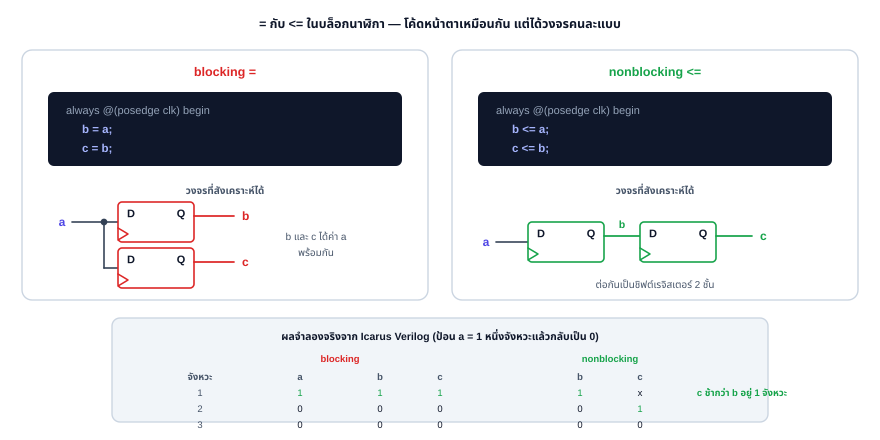
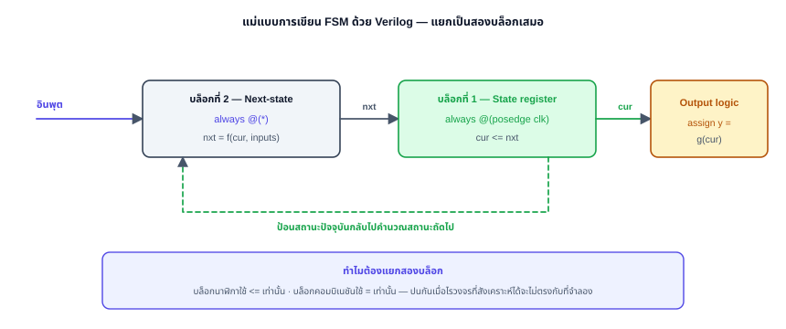
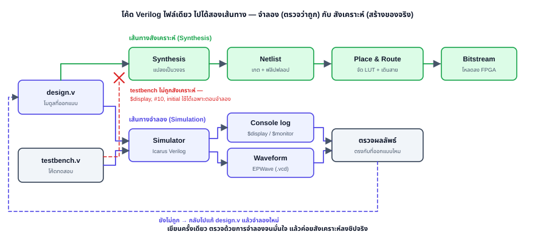
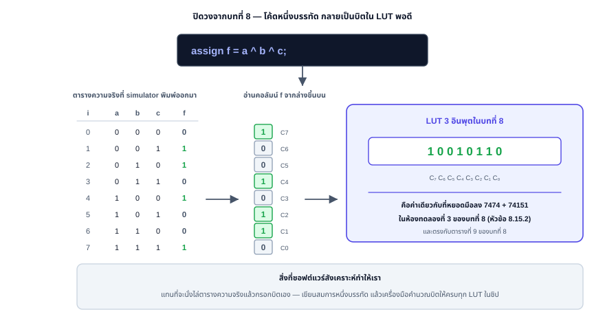

# Chapter 9: แนะนำการออกแบบด้วย HDL (Verilog) และการจำลองด้วย EDA Playground

## Hardware Description Language: Verilog & EDA Playground

---

**รายวิชา:** ตรรกศาสตร์ของดิจิตอลคอมพิวเตอร์ (Digital Computer Logic)
**หลักสูตร:** วิศวกรรมเมคคาทรอนิกส์ ชั้นปีที่ 1
**บทที่:** 9 — สัปดาห์ที่ 13

---

<div class="chapter-tab-content" data-tab-name="Concept" data-tab-icon="💡" id="concept" markdown="1">

## 9.1 บทนำ: ทำไมต้องใช้ HDL

ตลอดแปดบทที่ผ่านมา เราออกแบบวงจรดิจิทัลด้วยการวาด **แผนผังวงจร (schematic)** คือวางเกตทีละตัวแล้วลากสายเชื่อม วิธีนี้เห็นภาพดีสำหรับวงจรเล็ก แต่เมื่อระบบใหญ่ขึ้น เช่น หน่วยประมวลผลที่มีเกตหลายล้านตัว การวาดมือเป็นไปไม่ได้เลย

**ภาษาบรรยายฮาร์ดแวร์ (Hardware Description Language: HDL)** คือภาษาที่ใช้ "เขียนบรรยาย" พฤติกรรมและโครงสร้างของวงจรดิจิทัลเป็นข้อความ แล้วให้เครื่องมือ (synthesis tool) แปลงข้อความนั้นเป็นวงจรเกตจริงโดยอัตโนมัติ ภาษา HDL ที่นิยมมี 2 ตระกูลหลักคือ **Verilog** (และ SystemVerilog) กับ **VHDL** ในบทนี้เราใช้ Verilog เพราะไวยากรณ์ใกล้เคียงภาษา C ที่นักศึกษาคุ้นเคย

> 💡 **เกร็ด:** HDL ไม่ใช่ "ภาษาโปรแกรม" ในความหมายปกติ เพราะโค้ดที่เขียนไม่ได้ทำงานทีละบรรทัดบน CPU แต่ถูกแปลเป็น **วงจรฮาร์ดแวร์ที่ทำงานขนานกันทั้งหมดพร้อมกัน** การคิดแบบ "วงจร" จึงสำคัญกว่าการคิดแบบ "ลำดับคำสั่ง"

### ข้อดีของการออกแบบด้วย HDL

| ประเด็น | วาด schematic | เขียน HDL |
|---|---|---|
| ขนาดวงจรที่จัดการได้ | เล็ก–กลาง | เล็กถึงใหญ่มาก (ล้านเกต) |
| การแก้ไข/ทำซ้ำ | ช้า ต้องวาดใหม่ | แก้ข้อความ ใช้พารามิเตอร์ซ้ำได้ |
| การทดสอบ | ต่อวงจรจริง/จำลองทีละจุด | เขียน testbench ทดสอบอัตโนมัติ |
| การนำกลับมาใช้ | ยาก | ทำเป็นโมดูลเรียกซ้ำได้ |
| เป้าหมายการผลิต | — | สังเคราะห์ลง FPGA/ASIC ได้ |

### RTL คืออะไร

ในทางปฏิบัติเราเขียน HDL ที่ระดับ **RTL (Register-Transfer Level)** คือบรรยายว่าข้อมูลถูกเก็บใน **รีจิสเตอร์ (register)** อะไรบ้าง และในแต่ละจังหวะสัญญาณนาฬิกา ข้อมูลถูก "ย้าย/แปลง" ระหว่างรีจิสเตอร์อย่างไรผ่านวงจรคอมบิเนชัน เครื่องมือสังเคราะห์จะเปลี่ยน RTL เป็นเกตและฟลิปฟลอปจริงให้เอง

<svg viewBox="0 0 720 260" role="img" aria-label="แนวคิด RTL: register ส่งข้อมูลผ่านวงจรคอมบิเนชันไปยัง register ตัวถัดไป พร้อมเส้นป้อนกลับของสัญญาณ clock" style="width:100%; max-width:680px; height:auto; display:block; margin:1.25rem auto; font-family:'Segoe UI',system-ui,sans-serif;">
  <defs>
    <marker id="arrow-rtl" viewBox="0 0 10 10" refX="9" refY="5" markerWidth="7" markerHeight="7" orient="auto-start-reverse">
      <path d="M0,0 L10,5 L0,10 z" fill="#475569"/>
    </marker>
  </defs>

  <!-- Register 1 -->
  <rect x="40" y="70" width="150" height="70" rx="8" fill="#eef2ff" stroke="#4f46e5" stroke-width="2"/>
  <text x="115" y="110" text-anchor="middle" dominant-baseline="central" font-size="14" font-weight="600" fill="#0f172a">Register</text>

  <!-- Combinational Logic -->
  <rect x="285" y="70" width="180" height="70" rx="8" fill="#f1f5f9" stroke="#334155" stroke-width="2"/>
  <text x="375" y="100" text-anchor="middle" font-size="13.5" font-weight="600" fill="#0f172a">Combinational</text>
  <text x="375" y="118" text-anchor="middle" font-size="13.5" font-weight="600" fill="#0f172a">Logic</text>

  <!-- Register 2 -->
  <rect x="560" y="70" width="150" height="70" rx="8" fill="#eef2ff" stroke="#4f46e5" stroke-width="2"/>
  <text x="635" y="110" text-anchor="middle" dominant-baseline="central" font-size="14" font-weight="600" fill="#0f172a">Register</text>

  <!-- Register 1 -> Combinational Logic -->
  <path d="M190,105 L285,105" fill="none" stroke="#475569" stroke-width="2" marker-end="url(#arrow-rtl)"/>

  <!-- Combinational Logic -> Register 2 -->
  <path d="M465,105 L560,105" fill="none" stroke="#475569" stroke-width="2" marker-end="url(#arrow-rtl)"/>

  <!-- Clock feedback loop -->
  <path d="M115,140 L115,210 L635,210 L635,140" fill="none" stroke="#475569" stroke-width="2" marker-end="url(#arrow-rtl)"/>
  <text x="375" y="232" text-anchor="middle" font-size="13" fill="#0f172a">clock</text>
</svg>

---

## 9.2 โครงสร้างพื้นฐานของ Verilog: module และ port

หน่วยพื้นฐานของ Verilog คือ **module** เปรียบได้กับ "กล่องวงจร" หนึ่งกล่อง ที่มีขาเข้า–ออก (port) และมีวงจรอยู่ภายใน

```verilog
module ชื่อโมดูล (
    input  wire a,      // ขาเข้า
    input  wire b,
    output wire y       // ขาออก
);
    // เนื้อวงจรอยู่ตรงนี้
endmodule
```

ชนิดของ port มี 3 แบบ: `input` (ขาเข้า), `output` (ขาออก), และ `inout` (สองทิศทาง ใช้กับบัส tristate)

### wire กับ reg ต่างกันอย่างไร

นี่คือจุดที่ผู้เริ่มต้นสับสนมากที่สุด

| ชนิด | ใช้เมื่อ | เปรียบเหมือน |
|---|---|---|
| `wire` | ค่าถูกขับจากวงจรคอมบิเนชันตลอดเวลา (ใช้กับ `assign` และเชื่อมโมดูล) | เส้นลวดต่อสาย |
| `reg` | ค่าถูกกำหนดภายในบล็อก `always`/`initial` (ไม่จำเป็นต้องเป็นฟลิปฟลอปเสมอไป) | ตัวแปรที่ "จำค่า" จนกว่าจะถูกกำหนดใหม่ |

> ⚠️ **ข้อควรระวัง:** ชื่อ `reg` ไม่ได้แปลว่าจะกลายเป็นรีจิสเตอร์ (ฟลิปฟลอป) เสมอ ถ้าใช้ใน `always @(*)` มันคือวงจรคอมบิเนชัน จะเป็นฟลิปฟลอปก็ต่อเมื่อใช้ใน `always @(posedge clk)`

### การเขียนตัวเลขใน Verilog

รูปแบบคือ `<จำนวนบิต>'<ฐาน><ค่า>` เช่น

| เขียน | ความหมาย |
|---|---|
| `4'b1010` | 4 บิต ฐานสอง = 1010₂ = 10 |
| `8'hFF` | 8 บิต ฐานสิบหก = 255 |
| `4'd9` | 4 บิต ฐานสิบ = 9 |
| `1'b0` | 1 บิตค่า 0 |

> 💡 **เคล็ดลับ:** ถ้าไม่ระบุฐานและจำนวนบิต Verilog จะถือว่าเป็นเลขฐานสิบและขยายความกว้างให้พอดีอัตโนมัติ แต่การเขียนแบบเต็มรูป (เช่น `4'b1010`) ช่วยให้อ่านโค้ดเข้าใจง่ายกว่ามากและลดข้อผิดพลาดเรื่องความกว้างบิต

---

## 9.3 สามระดับการบรรยายวงจร

Verilog เขียนวงจรเดียวกันได้หลายสไตล์ ลองดูตัวอย่าง **เกต AND–OR** `y = (a & b) | c`

### 9.3.1 Gate-level (บรรยายระดับเกต)

ใช้ primitive ของ Verilog ตรง ๆ เหมือนวางเกตในแผนผัง

```verilog
module logic_gate (input wire a, b, c, output wire y);
    wire ab;
    and g1 (ab, a, b);   // ab = a AND b
    or  g2 (y, ab, c);   // y  = ab OR c
endmodule
```

### 9.3.2 Dataflow (บรรยายการไหลของข้อมูลด้วย assign)

ใช้คำสั่ง `assign` เขียนเป็นสมการบูลีน — เหมาะกับวงจรคอมบิเนชันที่ลดรูปจาก K-map มาแล้ว

```verilog
module logic_df (input wire a, b, c, output wire y);
    assign y = (a & b) | c;
endmodule
```

ตัวดำเนินการที่ใช้บ่อย: `&` (AND), `|` (OR), `~` (NOT), `^` (XOR), `~^` (XNOR)

### 9.3.3 Behavioral (บรรยายพฤติกรรมด้วย always)

ใช้บล็อก `always` อธิบาย "พฤติกรรม" เหมาะกับวงจรซับซ้อนและวงจรเชิงลำดับ

```verilog
module logic_bh (input wire a, b, c, output reg y);
    always @(*) begin        // @(*) = ทำใหม่เมื่ออินพุตใดเปลี่ยน
        y = (a & b) | c;
    end
endmodule
```

> 📌 **ข้อสำคัญ:** สำหรับวงจรคอมบิเนชัน เอาต์พุตที่กำหนดใน `always` ต้องประกาศเป็น `reg` และใช้ `always @(*)` ทั้งสามสไตล์นี้สังเคราะห์ออกมาเป็นวงจรเดียวกัน — เลือกสไตล์ตามความซับซ้อนของวงจร ไม่ใช่ตามความชอบส่วนตัว

---

## 9.4 การเขียนวงจรคอมบิเนชัน

### ตัวอย่าง: Full Adder (เชื่อมกับบทที่ 5)

จากบทที่ 5 เรารู้ว่า `S = A ⊕ B ⊕ Cin` และ `Cout = AB + Cin(A ⊕ B)` เขียนเป็น Verilog ได้ตรง ๆ

```verilog
module full_adder (
    input  wire a, b, cin,
    output wire sum, cout
);
    assign sum  = a ^ b ^ cin;
    assign cout = (a & b) | (cin & (a ^ b));
endmodule
```

### ตัวอย่าง: Multiplexer 4:1 ด้วย case (เชื่อมกับบทที่ 5)

```verilog
module mux4to1 (
    input  wire [3:0] d,      // ข้อมูล 4 ช่อง
    input  wire [1:0] sel,    // สายเลือก 2 บิต
    output reg        y
);
    always @(*) begin
        case (sel)
            2'b00: y = d[0];
            2'b01: y = d[1];
            2'b10: y = d[2];
            2'b11: y = d[3];
        endcase
    end
endmodule
```

`[3:0]` คือการประกาศสัญญาณแบบ **บัสหลายบิต (vector)** — ในที่นี้คือ 4 เส้น d[3] ถึง d[0]

> 💡 **เคล็ดลับ:** ใน `case` ของวงจรคอมบิเนชัน ควรครบทุกกรณีของ `sel` (เช่น ครบ 4 กรณีของ 2 บิต) ถ้าขาดกรณีใดไปและไม่มี `default` เครื่องมือสังเคราะห์อาจสร้าง latch ที่ไม่ตั้งใจขึ้นมาแทน mux


### ตัวอย่าง: ระบบเตือนในรถยนต์ (วงจร PLA จากบทที่ 8 หัวข้อ 8.16.1)

วงจรเดียวกับที่เราวาดเป็น cross-point array ในบทที่แล้ว เขียนเป็น Verilog ได้สั้นกว่ามาก — และสังเกตว่า **product term ทั้งสามเทอมกลายเป็น `wire` สามเส้น** ตรงกับแถว $P_1$–$P_3$ ในรูป PLA พอดี

```verilog
module car_warning (
    input  wire k,          // เครื่องยนต์ติด
    input  wire d,          // ประตูเปิด
    input  wire s,          // คาดเข็มขัดแล้ว
    input  wire l,          // ไฟหน้าเปิด
    output wire door_lamp, belt_lamp, light_lamp, buzzer
);
    // product term สามเทอม — ตรงกับแถว P1, P2, P3 ของ PLA ในบทที่ 8
    wire p1 = k & d;        // เปิดประตูขณะเครื่องติด
    wire p2 = k & ~s;       // เครื่องติดแต่ยังไม่คาดเข็มขัด
    wire p3 = l & d & ~k;   // ลืมปิดไฟหน้าตอนลงจากรถ

    assign door_lamp  = p1;
    assign belt_lamp  = p2;
    assign light_lamp = p3;
    assign buzzer     = p1 | p2 | p3;   // ลำโพงตัวเดียว รวมทุกเงื่อนไข
endmodule
```

> ⭐ **นี่คือ "การแชร์ Product Term" ในภาษา Verilog** — เส้น `p1` ถูกใช้ทั้งใน `door_lamp` และ `buzzer` เหมือนที่เกต AND ตัวเดียวป้อน OR สองตัวในวงจร PLA
> ข้อดีคือเราไม่ต้องคิดเองว่าจะแชร์อย่างไร **เครื่องมือสังเคราะห์จะหาเทอมซ้ำและรวมให้อัตโนมัติ** ต่างจากตอนวาด fuse map ด้วยมือที่ต้องไล่ดูเอง

ผลการทดสอบจริงจาก Icarus Verilog ตรงกับตารางสถานการณ์ในบทที่ 8 ทุกแถว

```text
  k=1 d=0 s=1 l=0 -> DOOR=0 BELT=0 LIGHT=0 BUZZER=0   (ขับปกติ)
  k=1 d=0 s=0 l=0 -> DOOR=0 BELT=1 LIGHT=0 BUZZER=1   (ยังไม่คาดเข็มขัด)
  k=1 d=1 s=1 l=0 -> DOOR=1 BELT=0 LIGHT=0 BUZZER=1   (เปิดประตูขณะเครื่องติด)
  k=0 d=1 s=0 l=1 -> DOOR=0 BELT=0 LIGHT=1 BUZZER=1   (ลืมปิดไฟหน้า)
  k=0 d=1 s=0 l=0 -> DOOR=0 BELT=0 LIGHT=0 BUZZER=0   (ปิดไฟแล้ว)
  k=1 d=0 s=1 l=1 -> DOOR=0 BELT=0 LIGHT=0 BUZZER=0   (ขับกลางคืนปกติ)
```

---

## 9.5 การเขียนวงจรเชิงลำดับ

วงจรเชิงลำดับใช้บล็อก `always @(posedge clk)` (ทำงานที่ขอบขาขึ้นของนาฬิกา) และใช้การกำหนดค่าแบบ **nonblocking** คือ `<=` (ไม่ใช่ `=`)

> 📌 **กฎทอง:** วงจรคอมบิเนชันใช้ `always @(*)` กับ `=` (blocking) — วงจรเชิงลำดับใช้ `always @(posedge clk)` กับ `<=` (nonblocking) เพื่อจำลองการอัปเดตฟลิปฟลอปพร้อมกันทุกตัว

### ตัวอย่าง: D Flip-Flop (เชื่อมกับบทที่ 6)

```verilog
module d_ff (
    input  wire clk, rst_n, d,   // rst_n = reset แบบ active-low
    output reg  q
);
    always @(posedge clk or negedge rst_n) begin
        if (!rst_n)  q <= 1'b0;  // รีเซ็ตแบบอะซิงโครนัส
        else         q <= d;
    end
endmodule
```

### ตัวอย่าง: ตัวนับขึ้น 4 บิตแบบ synchronous (เชื่อมกับบทที่ 7)

```verilog
module counter4 (
    input  wire       clk, rst_n,
    output reg  [3:0] count
);
    always @(posedge clk or negedge rst_n) begin
        if (!rst_n) count <= 4'd0;
        else        count <= count + 1'b1;   // นับวน 0..15 แล้วกลับ 0
    end
endmodule
```

วงจรนี้คือตัวนับ mod-16 ที่บทที่ 7 ออกแบบด้วย excitation table — แต่ใน Verilog เขียนเพียงบรรทัดเดียว `count <= count + 1`

> ⚠️ **ข้อควรระวัง:** สัญญาณ `rst_n` ในตัวอย่างนี้เป็น active-low (รีเซ็ตเมื่อเป็น `0`) สังเกตว่า sensitivity list ใช้ `negedge rst_n` คู่กับ `posedge clk` — ถ้าใช้ผิดขอบ วงจรจะไม่รีเซ็ตเมื่อควร


### `=` กับ `<=` ต่างกันอย่างไรจริง ๆ

กฎทองข้างต้นไม่ใช่เรื่องรสนิยม — เขียนผิดแล้ว **ได้วงจรคนละแบบ** ลองดูโค้ดสองชุดที่หน้าตาต่างกันแค่เครื่องหมายเดียว



| | `b = a; c = b;` (blocking) | `b <= a; c <= b;` (nonblocking) |
|:---|:---|:---|
| **ลำดับการทำงาน** | ทำทีละบรรทัดเหมือนภาษา C — พอถึงบรรทัด 2 ค่า `b` ใหม่ถูกใช้แล้ว | อ่านค่าเดิมของทุกตัวก่อน แล้วอัปเดตพร้อมกันตอนจบบล็อก |
| **`c` ได้ค่าอะไร** | ได้ค่า `a` (ค่าใหม่ของ `b`) | ได้ค่า **เดิม** ของ `b` |
| **วงจรที่สังเคราะห์ได้** | ฟลิปฟลอป 2 ตัวขนานกัน ทั้งคู่รับ `a` | ชิฟต์เรจิสเตอร์ 2 ชั้น (`a → b → c`) |

> ⚠️ **จุดสำคัญ:** `<=` จำลอง "ฟลิปฟลอปทุกตัวอ่านค่าอินพุตพร้อมกันที่ขอบนาฬิกาเดียวกัน" ซึ่งตรงกับฮาร์ดแวร์จริง — ถ้าใช้ `=` ในบล็อกนาฬิกา ผลการจำลองจะขึ้นกับ **ลำดับที่เขียนบรรทัด** ซึ่งฮาร์ดแวร์จริงไม่มีแนวคิดนั้นเลย

**นี่คือเหตุผลที่ชิฟต์เรจิสเตอร์ในบทที่ 7 ต้องเขียนด้วย `<=` เท่านั้น** — ถ้าเขียนด้วย `=` ข้อมูลจะทะลุจากชั้นแรกไปชั้นสุดท้ายในจังหวะเดียว แทนที่จะเลื่อนทีละชั้น

---

---

## 9.6 การเขียน FSM ด้วย Verilog

**Finite State Machine** คือวงจรที่จำได้ว่า "ตอนนี้อยู่สถานะไหน" แล้วตัดสินใจว่าจะไปสถานะไหนต่อ — บทที่ 8 เราสร้าง FSM ด้วยการไล่เขียนสมการ $D$ ของฟลิปฟลอปทีละตัวลง fuse map ส่วน Verilog ให้เราเขียนเป็น "ตารางสถานะ" ตรง ๆ แล้วปล่อยให้เครื่องมือคิดสมการเอง

### แม่แบบสองบล็อก (Two-Block Template)



| บล็อก | เขียนด้วย | หน้าที่ | ใช้เครื่องหมาย |
|:---|:---|:---|:---:|
| **State register** | `always @(posedge clk)` | เก็บสถานะปัจจุบัน `cur <= nxt` | `<=` |
| **Next-state logic** | `always @(*)` | คำนวณ `nxt` จาก `cur` และอินพุต | `=` |
| **Output logic** | `assign` | คำนวณเอาต์พุตจาก `cur` | — |

> 📌 **ทำไมต้องแยก?** เพราะบล็อกนาฬิกาต้องใช้ `<=` และบล็อกคอมบิเนชันต้องใช้ `=` (หัวข้อ 9.5) ถ้ารวมไว้บล็อกเดียวแล้วปนเครื่องหมาย ผลจำลองกับวงจรที่สังเคราะห์ได้จะไม่ตรงกัน — เป็นบั๊กที่หายากที่สุดชนิดหนึ่ง

### ตัวอย่าง: เครื่องซักผ้าจากบทที่ 8 (หัวข้อ 8.16.3)

FSM 4 สถานะเดียวกับที่วาดเป็น Registered PAL ในบทที่แล้ว — ตอนนั้นใช้ 11 product term เขียนด้วยมือ ตอนนี้เหลือโค้ดไม่ถึง 25 บรรทัด

```verilog
module washer_fsm (
    input  wire       clk, rst_n,
    input  wire       d,          // ฝาปิดสนิท
    input  wire       t,          // ครบเวลาของขั้นตอนนี้
    output wire       water, motor, spin, drain,
    output wire [1:0] state
);
    localparam S_SOAK = 2'b00, S_WASH = 2'b01, S_SPIN = 2'b10, S_DRAIN = 2'b11;
    reg [1:0] cur, nxt;

    // บล็อกที่ 1 — state register
    always @(posedge clk or negedge rst_n) begin
        if (!rst_n) cur <= S_SOAK;
        else        cur <= nxt;
    end

    // บล็อกที่ 2 — next-state logic: เลื่อนขั้นเมื่อฝาปิดและครบเวลาเท่านั้น
    always @(*) begin
        if (d && t) nxt = cur + 2'b01;
        else        nxt = cur;
    end

    // เอาต์พุตแบบ Moore — ขึ้นกับสถานะอย่างเดียว และคูณด้วย d เป็นอินเตอร์ล็อก
    assign water = (cur == S_SOAK)  && d;
    assign motor = (cur == S_WASH)  && d;
    assign spin  = (cur == S_SPIN)  && d;
    assign drain = (cur == S_DRAIN) && d;
    assign state = cur;
endmodule
```

**`localparam`** ใช้ตั้งชื่อค่าคงที่ให้สถานะ — อ่านง่ายกว่าเขียน `2'b10` กระจายทั่วโค้ด และถ้าจะเปลี่ยนรหัสสถานะก็แก้ที่เดียว

### ผลการจำลองจริง

```text
รีเซ็ต               -> state=00  WATER=1
ครบเวลา (d=1 t=1)    -> state=01  MOTOR=1
ครบเวลา (d=1 t=1)    -> state=10  SPIN=1
ครบเวลา (d=1 t=1)    -> state=11  DRAIN=1
ครบเวลา (d=1 t=1)    -> state=00  WATER=1     ← ครบรอบ

ยังไม่ครบเวลา (t=0)  -> state=00  ค้างสถานะเดิม
เปิดฝากลางคัน (d=0)  -> state=00  เอาต์พุตดับหมด แต่สถานะยังอยู่
ปิดฝาแล้วครบเวลา     -> state=01  ซักต่อจากเดิม
```

> ⭐ **เทียบกับบทที่ 8:** ตอนออกแบบด้วย PAL เราต้องไล่หาสมการ $D_1 = \overline{D}S_1 + \overline{T}S_1 + DTS_1\overline{S_0} + DT\overline{S_1}S_0$ ด้วยมือ
> ใน Verilog เราเขียนแค่ `if (d && t) nxt = cur + 1;` แล้วเครื่องมือสังเคราะห์คำนวณสมการนั้นให้เอง — **นี่คือคุณค่าที่แท้จริงของ HDL**

---

## 9.7 Testbench: การทดสอบวงจรอัตโนมัติ

**Testbench** คือโมดูล Verilog อีกตัวที่ "ป้อนสัญญาณทดสอบ" ให้วงจรที่เราออกแบบ (เรียกว่า DUT — Device Under Test) แล้วพิมพ์ผลออกมา testbench ไม่ต้องสังเคราะห์เป็นฮาร์ดแวร์ จึงใช้คำสั่งจำลองได้เต็มที่

คำสั่งจำลองที่ใช้บ่อย

| คำสั่ง | หน้าที่ |
|---|---|
| `initial` | บล็อกที่ทำงานครั้งเดียวตอนเริ่มจำลอง |
| `#10` | หน่วงเวลาจำลอง 10 หน่วย |
| `$display(...)` | พิมพ์ข้อความครั้งเดียว |
| `$monitor(...)` | พิมพ์อัตโนมัติทุกครั้งที่ค่าที่เฝ้าดูเปลี่ยน |
| `$finish` | จบการจำลอง |

### Testbench ของ Full Adder

```verilog
module tb_full_adder;
    reg  a, b, cin;
    wire sum, cout;

    full_adder dut (.a(a), .b(b), .cin(cin), .sum(sum), .cout(cout));

    integer i;
    initial begin
        $display(" a b cin | sum cout");
        for (i = 0; i < 8; i = i + 1) begin
            {a, b, cin} = i;     // ไล่อินพุต 000..111
            #10;                 // รอให้วงจรเสถียร
            $display(" %b %b  %b  |  %b   %b", a, b, cin, sum, cout);
        end
        $finish;
    end
endmodule
```

ผลลัพธ์ที่คาดหวังตรงกับตารางความจริงของ full adder ในบทที่ 5 ดังนี้

| a | b | cin | sum | cout |
|:---:|:---:|:---:|:---:|:---:|
| 0 | 0 | 0 | 0 | 0 |
| 0 | 0 | 1 | 1 | 0 |
| 0 | 1 | 0 | 1 | 0 |
| 0 | 1 | 1 | 0 | 1 |
| 1 | 0 | 0 | 1 | 0 |
| 1 | 0 | 1 | 0 | 1 |
| 1 | 1 | 0 | 0 | 1 |
| 1 | 1 | 1 | 1 | 1 |

> 💡 **เคล็ดลับ:** เทคนิค `{a, b, cin} = i;` ใช้ตัวดำเนินการ concatenation รวมสามสัญญาณเป็นเวกเตอร์ 3 บิตชั่วคราว แล้วกำหนดค่าจากตัวนับ `i` ทำให้ไล่ครบทั้ง 8 กรณีโดยไม่ต้องเขียน `if` ซ้อนหลายชั้น

### Testbench ของตัวนับ (มีสัญญาณนาฬิกา)

การสร้าง clock ใน testbench ทำได้ด้วยการสลับค่าทุกครึ่งคาบ

```verilog
module tb_counter4;
    reg        clk, rst_n;
    wire [3:0] count;

    counter4 dut (.clk(clk), .rst_n(rst_n), .count(count));

    always #5 clk = ~clk;        // นาฬิกาคาบ 10 หน่วย (สลับทุก 5)

    initial begin
        clk = 0; rst_n = 0;      // เริ่มด้วยรีเซ็ต
        #12 rst_n = 1;           // ปลดรีเซ็ต
        $monitor("t=%0t  count=%b (%0d)", $time, count, count);
        #200 $finish;
    end
endmodule
```

---

## 9.8 การจำลองด้วย EDA Playground

**EDA Playground** (`https://edaplayground.com`) คือเว็บที่จำลอง Verilog ได้ฟรีในเบราว์เซอร์ ไม่ต้องติดตั้งโปรแกรม เหมาะกับการเรียนการสอน

### ขั้นตอนการใช้งาน

1. เปิด `https://edaplayground.com` แล้วสมัคร/ล็อกอิน (ใช้บัญชี Google ได้)

2. แถบด้านซ้าย **Languages & Libraries** → เลือก **SystemVerilog/Verilog**

3. **Tools & Simulators** → เลือก **Icarus Verilog 12.0** (ฟรีและเพียงพอสำหรับวิชานี้)

4. ช่อง **design.sv** (ขวา) → วางโค้ดโมดูลที่ออกแบบ เช่น `full_adder`

5. ช่อง **testbench.sv** (ซ้าย) → วาง testbench เช่น `tb_full_adder`

6. ถ้าต้องการดูรูปคลื่น ติ๊ก **Open EPWave after run** และเพิ่มในโค้ด testbench

   ```verilog
   initial begin
       $dumpfile("dump.vcd");
       $dumpvars(0, tb_counter4);
   end
   ```

7. กดปุ่ม **Run** ด้านบน

8. อ่านผลข้อความที่หน้าต่าง **Log** ด้านล่าง และดูรูปคลื่นในหน้าต่าง **EPWave** (ถ้าเปิดไว้)

> 💡 **เคล็ดลับ:** ชื่อโมดูล testbench ที่ใส่ใน `$dumpvars(0, ชื่อ)` ต้องตรงกับชื่อโมดูล testbench จริง ไม่เช่นนั้นจะไม่เห็นสัญญาณในรูปคลื่น

### การอ่านรูปคลื่น (EPWave)

EPWave แสดงสัญญาณตามแกนเวลา ช่วยตรวจว่าวงจรเชิงลำดับทำงานถูกจังหวะ clock หรือไม่ เช่น ตัวนับควรเพิ่มค่าทีละ 1 ที่ทุกขอบขาขึ้นของ clock และกลับเป็น 0 หลังครบ 15

<svg viewBox="0 0 620 170" role="img" aria-label="ไดอะแกรมเวลาของ clk และ count: สัญญาณ clk เป็นคลื่นสี่เหลี่ยม และ count เพิ่มค่า 0,1,2,3,4,5 ที่ขอบขาขึ้นของ clk แต่ละลูก" style="width:100%; max-width:560px; height:auto; display:block; margin:1.25rem auto; font-family:'Segoe UI',system-ui,sans-serif;">
  <defs>
    <marker id="arrow-wave" viewBox="0 0 10 10" refX="9" refY="5" markerWidth="6" markerHeight="6" orient="auto-start-reverse">
      <path d="M0,0 L10,5 L0,10 z" fill="#dc2626"/>
    </marker>
  </defs>

  <!-- row labels -->
  <text x="10" y="45" font-size="13" font-weight="600" fill="#0f172a">clk</text>
  <text x="10" y="105" font-size="13" font-weight="600" fill="#0f172a">count</text>

  <!-- clk square wave: period 80, high 40 / low 40, starting low -->
  <path d="M60,55 L60,30 L100,30 L100,55 L140,55 L140,30 L180,30 L180,55 L220,55 L220,30 L260,30 L260,55 L300,55 L300,30 L340,30 L340,55 L380,55 L380,30 L420,30 L420,55 L460,55 L460,30 L500,30 L500,55 L540,55"
        fill="none" stroke="#334155" stroke-width="2.25"/>

  <!-- rising edge tick marks -->
  <line x1="100" y1="30" x2="100" y2="120" stroke="#cbd5e1" stroke-width="1" stroke-dasharray="3,3"/>
  <line x1="180" y1="30" x2="180" y2="120" stroke="#cbd5e1" stroke-width="1" stroke-dasharray="3,3"/>
  <line x1="260" y1="30" x2="260" y2="120" stroke="#cbd5e1" stroke-width="1" stroke-dasharray="3,3"/>
  <line x1="340" y1="30" x2="340" y2="120" stroke="#cbd5e1" stroke-width="1" stroke-dasharray="3,3"/>
  <line x1="420" y1="30" x2="420" y2="120" stroke="#cbd5e1" stroke-width="1" stroke-dasharray="3,3"/>
  <line x1="500" y1="30" x2="500" y2="120" stroke="#cbd5e1" stroke-width="1" stroke-dasharray="3,3"/>

  <!-- count value cells -->
  <text x="80" y="105" text-anchor="middle" font-size="13" fill="#1e293b">0</text>
  <text x="140" y="105" text-anchor="middle" font-size="13" fill="#1e293b">1</text>
  <text x="220" y="105" text-anchor="middle" font-size="13" fill="#1e293b">2</text>
  <text x="300" y="105" text-anchor="middle" font-size="13" fill="#1e293b">3</text>
  <text x="380" y="105" text-anchor="middle" font-size="13" fill="#1e293b">4</text>
  <text x="460" y="105" text-anchor="middle" font-size="13" fill="#1e293b">5</text>

  <!-- annotation arrow pointing at a rising edge -->
  <path d="M260,150 L260,128" fill="none" stroke="#dc2626" stroke-width="2" marker-end="url(#arrow-wave)"/>
  <text x="260" y="165" text-anchor="middle" font-size="11.5" fill="#dc2626">เพิ่มค่าที่ขอบขาขึ้น</text>
</svg>

---

---

## 9.9 Simulation กับ Synthesis ต่างกันอย่างไร

โค้ด Verilog ไฟล์เดียวถูกนำไปใช้สองทางที่ต่างกันโดยสิ้นเชิง และนี่คือจุดที่ผู้เริ่มต้นสับสนมากที่สุดรองจาก `=` กับ `<=`



| | **Simulation (จำลอง)** | **Synthesis (สังเคราะห์)** |
|:---|:---|:---|
| **ทำอะไร** | รันโค้ดบนคอมพิวเตอร์เพื่อดูว่าวงจรทำงานถูกไหม | แปลงโค้ดเป็นเกตและฟลิปฟลอปจริง |
| **ใช้ไฟล์ไหน** | `design.v` **และ** `testbench.v` | `design.v` **เท่านั้น** |
| **ผลลัพธ์** | ข้อความใน console + รูปคลื่น | Netlist $\to$ Bitstream $\to$ ลงชิป |
| **เวลาในโค้ด (`#10`)** | หน่วงเวลาจำลองจริง | **ไม่มีความหมาย** สังเคราะห์ไม่ได้ |

### คำสั่งที่ใช้ได้เฉพาะตอนจำลอง (Non-synthesizable)

| คำสั่ง | ใช้จำลอง | สังเคราะห์ได้ |
|:---|:---:|:---:|
| `initial` | ✅ | ❌ |
| `#10` (หน่วงเวลา) | ✅ | ❌ |
| `$display`, `$monitor`, `$finish` | ✅ | ❌ |
| `$dumpfile`, `$dumpvars` | ✅ | ❌ |
| `always @(posedge clk)` | ✅ | ✅ |
| `assign`, `case`, `if-else` | ✅ | ✅ |

> ⚠️ **ข้อผิดพลาดที่พบบ่อย:** เขียน `#10` ลงไปใน `design.v` เพราะอยากให้สัญญาณ "ช้าลงหน่อย" — ตอนจำลองดูเหมือนใช้ได้ แต่พอสังเคราะห์จริง เครื่องมือจะ **ไม่สนใจบรรทัดนั้นเลย** วงจรที่ได้จะทำงานผิดทันที
> การหน่วงเวลาในฮาร์ดแวร์จริงต้องทำด้วย **ตัวนับกับสัญญาณนาฬิกา** เท่านั้น (เหมือนวงจรหน่วงเวลาของแอร์ในบทที่ 8 หัวข้อ 8.16.4)

---

## 9.10 ปิดวงจากบทที่ 8: หนึ่งบรรทัด Verilog กลายเป็นบิตใน LUT

บทที่ 8 หัวข้อ 8.15 จบไว้ด้วยคำสัญญาว่า *"ในบทที่ 9 เราจะให้ซอฟต์แวร์คำนวณค่าที่ต้องหยอดลง LUT ให้อัตโนมัติ"* — หัวข้อนี้คือการพิสูจน์คำสัญญานั้น



### ทดลองเอง: ให้ simulator บอกค่า LUT

โค้ดนี้ไล่อินพุตครบ 8 กรณี เก็บผลลัพธ์ลงเวกเตอร์ แล้วพิมพ์ออกมาเป็นค่า LUT ทั้งชุด

```verilog
module fa_sum  (input wire a, b, c, output wire f);  assign f = a ^ b ^ c;         endmodule
module fa_cout (input wire a, b, c, output wire f);  assign f = (a&b)|(a&c)|(b&c); endmodule

module tb_lut;
    reg  a, b, c;
    wire f_sum, f_cout;
    reg  [7:0] lut_sum, lut_cout;
    integer i;

    fa_sum  u1 (.a(a), .b(b), .c(c), .f(f_sum));
    fa_cout u2 (.a(a), .b(b), .c(c), .f(f_cout));

    initial begin
        for (i = 0; i < 8; i = i + 1) begin
            {a, b, c} = i[2:0];
            #1;
            lut_sum[i]  = f_sum;      // เก็บผลของแต่ละแอดเดรสลงบิตที่ i
            lut_cout[i] = f_cout;
        end
        $display("LUT ของ Sum  (C7..C0) = %b", lut_sum);
        $display("LUT ของ Cout (C7..C0) = %b", lut_cout);
        $finish;
    end
endmodule
```

ผลที่ได้จริงจาก Icarus Verilog

```text
LUT ของ Sum  (C7..C0) = 10010110
LUT ของ Cout (C7..C0) = 11101000
```

> 🎯 **เทียบกับบทที่ 8 ได้เลย** — `10010110` และ `11101000` คือค่าเดียวกับที่นักศึกษาตั้ง DIP Switch หยอดลงฟลิปฟลอป 7474 แล้วต่อเข้า 74151 ในห้องทดลองที่ 3 (หัวข้อ 8.15.2) และตรงกับตารางที่ 9 ของบทที่ 8 ทุกบิต
>
> ต่างกันตรงที่ **ตอนนั้นเราไล่ตารางความจริงแล้วกรอกบิตเอง ตอนนี้เขียนสมการหนึ่งบรรทัดแล้วเครื่องคำนวณให้** — และเมื่อวงจรมี LUT นับแสนตัวใน FPGA จริง นี่คือความต่างระหว่าง "ทำได้" กับ "ทำไม่ได้"

### ภาพรวมของเส้นทางทั้งหมด

$$\underbrace{\texttt{assign f = a \^{} b \^{} c;}}_{\text{บทที่ 9}} \;\longrightarrow\; \underbrace{\text{ตารางความจริง 8 แถว}}_{\text{บทที่ 2--4}} \;\longrightarrow\; \underbrace{\texttt{10010110}}_{\text{บทที่ 8: LUT}} \;\longrightarrow\; \underbrace{\text{SRAM + MUX ในชิป}}_{\text{บทที่ 5--6}}$$

---

## 9.11 เชื่อมโยงสิ่งที่เรียนมาทั้งหมดเข้ากับ HDL

HDL ไม่ใช่เรื่องใหม่ทั้งหมด แต่เป็น "อีกวิธี" ในการแสดงสิ่งที่เรียนมาแล้ว

| เรื่องที่เรียน | บท | เขียนเป็น Verilog ด้วย |
|---|---|---|
| เกตตรรกะ / นิพจน์บูลีน | 2–3 | `assign` กับ `& \| ~ ^` |
| ฟังก์ชันที่ลดรูปจาก K-map | 4 | `assign y = ...` (SOP) |
| adder / decoder / mux | 5 | `assign`, `case`, vector `[n:0]` |
| latch / flip-flop | 6 | `always @(posedge clk)` + `<=` |
| counter / register | 7 | `always @(posedge clk)` + `count <= count + 1` |
| LUT ของ FPGA | 8 | ค่าที่สังเคราะห์ได้จาก `assign` — ดูหัวข้อ 9.10 |
| PLD / FSM บน Registered PAL | 8 | `always` สองบล็อก (state register + next-state logic) — ดูหัวข้อ 9.6 |

> การเรียน HDL จึงเป็นบทปิดท้ายที่ "รวบยอด" ทุกบท และเป็นสะพานไปสู่รายวิชาการออกแบบวงจรดิจิทัลและ FPGA ในชั้นปีถัดไป

---

## 9.12 Verilog Syntax Cheat Sheet (โพยสรุปไวยากรณ์พื้นฐาน)

หน้านี้สรุปโครงสร้างไวยากรณ์ที่ใช้บ่อยสำหรับการทำแลปและการบ้านวิชาลอจิกดิจิทัล

### 1. ตัวดำเนินการ (Operators)

| ประเภท | เครื่องหมาย | ตัวอย่างคำอธิบาย |
|---|---|---|
| **Bitwise** (ลอจิกระดับบิต) | `~` (NOT), `&` (AND), `\|` (OR), `^` (XOR), `~^` (XNOR) | `y = a & b;` (ทำทีละบิต) |
| **Arithmetic** (เลขคณิต) | `+` (บวก), `-` (ลบ), `*` (คูณ) | `count <= count + 1;` |
| **Relational** (เปรียบเทียบ) | `==` (เท่ากับ), `!=` (ไม่เท่ากับ), `<`, `>`, `<=`, `>=` | `if (state == 2'b10)` |
| **Reduction** (ลดมิติระดับบิต) | `&` (AND ทุกบิตในเวกเตอร์), `\|` (OR ทุกบิต) | `&4'b1111` ผลลัพธ์คือ `1'b1` |
| **Logical** (เปรียบเทียบลอจิก) | `!` (Logical NOT), `&&` (AND), `\|\|` (OR) | `if (a == 1 && b == 0)` |
| **Concatenation** (ต่อบิต) | `{}` (รวมบิตเข้าด้วยกัน) | `{carry, sum} = a + b + cin;` |
| **Conditional** (เลือกค่า) | `? :` (เหมือนคำสั่ง if-else บรรทัดเดียว) | `assign y = select ? b : a;` |

---

### 2. โครงสร้างโค้ดตามประเภทวงจร (Standard Coding Patterns)

#### ก. วงจรเชิงผสม (Combinational Logic) - แบบ Dataflow

ใช้ลวด (`wire`) และคำสั่ง `assign` (ทำงานแบบขนานตลอดเวลา)

```verilog
wire y;
assign y = (a & ~b) | (c ^ d);
```

#### ข. วงจรเชิงผสม (Combinational Logic) - แบบ Behavioral

ใช้ตัวแปรแบบ `reg` และบล็อก `always @(*)` โดยกำหนดค่าภายในแบบ **Blocking (`=`)**

```verilog
reg y;
always @(*) begin
    if (select)
        y = b;
    else
        y = a;
end
```

#### ค. วงจรเชิงลำดับ (Sequential Logic)

ใช้ตัวแปรแบบ `reg` และบล็อก `always @(posedge clk)` โดยใช้การกำหนดค่าแบบ **Non-blocking (`<=`)**

```verilog
reg [3:0] count;
always @(posedge clk or posedge reset) begin
    if (reset)
        count <= 4'b0000;
    else
        count <= count + 1'b1;
end
```

---

### 3. โครงสร้างแม่แบบ Testbench สำหรับจำลองการทำงาน

```verilog
`timescale 1ns/1ps // กำหนดมาตราส่วนเวลา (หน่วย/ความละเอียด)

module testbench;
    // 1. ประกาศตัวแปรสัญญาณ
    reg clk;
    reg reset;
    reg a;
    wire y;

    // 2. เรียกใช้งานวงจรที่ต้องการทดสอบ (Instantiation)
    my_design uut (
        .clk(clk),
        .reset(reset),
        .a(a),
        .y(y)
    );

    // 3. บล็อกสร้างสัญญาณนาฬิกา (Clock Generator) - คาบ 10ns
    always begin
        #5 clk = ~clk;
    end

    // 4. บล็อกทดสอบป้อนอินพุต (Stimulus)
    initial begin
        // บันทึกไฟล์คลื่นคลื่นสัญญาณ (EPWave)
        $dumpfile("dump.vcd");
        $dumpvars(0, testbench);

        // กำหนดค่าเริ่มต้น
        clk = 0;
        reset = 1;
        a = 0;
        
        #15 reset = 0; // ปลดรีเซ็ตหลังจากผ่านไป 15ns
        #10 a = 1;
        #20 a = 0;
        #50 $finish;   // สิ้นสุดการจำลอง
    end
endmodule
```

---

## 9.13 ข้อผิดพลาดที่พบบ่อยของผู้เริ่มต้น

- ใช้ `=` (blocking) ในวงจรเชิงลำดับ แทนที่จะใช้ `<=` (nonblocking) ทำให้พฤติกรรมจำลองผิด

- ลืมประกาศเอาต์พุตที่กำหนดใน `always` ให้เป็น `reg`

- เขียน `always @(a or b)` แล้วลืมใส่สัญญาณบางตัวใน sensitivity list ทำให้วงจรคอมบิเนชันทำงานผิด — แก้ด้วย `always @(*)`

- คิดแบบลำดับคำสั่งเหมือนภาษา C ทั้งที่ HDL สร้างฮาร์ดแวร์ที่ทำงานขนานกัน

- ชื่อสัญญาณใน `.port(signal)` ตอนเชื่อมโมดูลสะกดไม่ตรงกับที่ประกาศ

> ⚠️ **ข้อควรระวัง:** ข้อผิดพลาดเหล่านี้ส่วนใหญ่ "จำลองผ่าน" แต่ให้ผลลัพธ์ผิด หรือสังเคราะห์เป็นวงจรที่ไม่ตรงกับที่ตั้งใจ — เครื่องมือจำลองไม่ฟ้อง error เสมอไป จึงต้องตรวจสอบรูปคลื่นและผลลัพธ์อย่างละเอียดทุกครั้ง

---

## 9.14 สรุปท้ายบท

บทนี้แนะนำการออกแบบวงจรดิจิทัลด้วยภาษา Verilog ตั้งแต่โครงสร้าง module/port, ความต่างของ `wire` กับ `reg`, สามระดับการบรรยาย (gate-level, dataflow, behavioral), การเขียนวงจรคอมบิเนชันและเชิงลำดับ, แม่แบบ FSM สองบล็อก, การเขียน testbench และการจำลองจริงบน EDA Playground

สามสิ่งที่ควรติดตัวไปจากบทนี้

1. **`=` กับ `<=` ไม่ใช่รสนิยม** — เขียนผิดแล้วได้วงจรคนละแบบ ไม่ใช่แค่ผลจำลองต่างกัน (หัวข้อ 9.5)
2. **โค้ดที่จำลองผ่าน ไม่ได้แปลว่าสังเคราะห์ได้** — `#delay`, `initial`, `$display` ใช้ได้เฉพาะใน testbench (หัวข้อ 9.9)
3. **HDL ไม่ได้มาแทนความเข้าใจเรื่องวงจร แต่มาแทนงานที่น่าเบื่อ** — เรายังต้องรู้ว่าฟลิปฟลอปกับ LUT ทำงานอย่างไร เพียงแต่ไม่ต้องไล่กรอกบิตเองอีกต่อไป (หัวข้อ 9.10)

เป้าหมายของบทนี้จึงไม่ใช่ให้เขียน Verilog เก่ง แต่ให้เห็นว่าทุกเรื่องที่เรียนมาตลอดเทอม — ตั้งแต่เกตในบทที่ 2 จนถึง LUT ในบทที่ 8 — บรรยายเป็นข้อความและสังเคราะห์กลับเป็นฮาร์ดแวร์เดิมได้ ซึ่งเป็นพื้นฐานสำคัญของการออกแบบระบบดิจิทัลสมัยใหม่

</div>

<div class="chapter-tab-content" data-tab-name="Interactive Sim" data-tab-icon="🎮" id="sim" markdown="1">

## 🎮 ชุดโค้ดพร้อมรัน (Copy → Paste → Run)

โค้ดทุกชุดในหน้านี้ **คอมไพล์และรันผ่านจริงด้วย Icarus Verilog 13.0** แล้ว ผลลัพธ์ที่แสดงคือผลที่ออกมาจริง ไม่ใช่ผลที่คาดเดา

### วิธีใช้บน EDA Playground

1. เปิด [edaplayground.com](https://www.edaplayground.com/) แล้วล็อกอิน
2. **Languages & Libraries** → เลือก **SystemVerilog/Verilog**
3. **Tools & Simulators** → เลือก **Icarus Verilog 12.0** (หรือใหม่กว่า)
4. วางโค้ดฝั่ง **design.sv** และ **testbench.sv** ตามชุดที่เลือกด้านล่าง
5. ติ๊ก **Open EPWave after run** ถ้าต้องการดูรูปคลื่น แล้วกด **Run**

> 💡 **ทำไมไม่มีลิงก์สำเร็จรูปให้กด?** เพราะลิงก์แชร์ของ EDA Playground ผูกกับบัญชีผู้สร้างและอาจถูกตั้งเป็นส่วนตัวหรือถูกลบเมื่อไรก็ได้ การคัดลอกโค้ดวางเองจึงใช้ได้แน่นอนกว่า และได้ฝึกพิมพ์ไปในตัว

---

### ชุดที่ 1 — Full Adder (วงจรคอมบิเนชัน)

**design.sv**

```verilog
module full_adder (
    input  wire a, b, cin,
    output wire sum, cout
);
    assign sum  = a ^ b ^ cin;
    assign cout = (a & b) | (cin & (a ^ b));
endmodule
```

**testbench.sv**

```verilog
`timescale 1ns/1ps
module tb_full_adder;
    reg  a, b, cin;
    wire sum, cout;
    integer i;

    full_adder dut (.a(a), .b(b), .cin(cin), .sum(sum), .cout(cout));

    initial begin
        $dumpfile("dump.vcd");
        $dumpvars(0, tb_full_adder);
        $display(" a b cin | sum cout");
        for (i = 0; i < 8; i = i + 1) begin
            {a, b, cin} = i[2:0];
            #10;
            $display(" %b %b  %b  |  %b   %b", a, b, cin, sum, cout);
        end
        $finish;
    end
endmodule
```

---

### ชุดที่ 2 — ตัวนับ 4 บิต (วงจรเชิงลำดับ + ดูรูปคลื่น)

**design.sv**

```verilog
module counter4 (
    input  wire       clk, rst_n,
    output reg  [3:0] count
);
    always @(posedge clk or negedge rst_n) begin
        if (!rst_n) count <= 4'd0;
        else        count <= count + 1'b1;
    end
endmodule
```

**testbench.sv**

```verilog
`timescale 1ns/1ps
module tb_counter4;
    reg        clk = 0, rst_n;
    wire [3:0] count;

    counter4 dut (.clk(clk), .rst_n(rst_n), .count(count));

    always #5 clk = ~clk;

    initial begin
        $timeformat(-9, 0, " ns", 6);
        $dumpfile("dump.vcd");
        $dumpvars(0, tb_counter4);
        rst_n = 0;
        #12 rst_n = 1;
        $monitor("t=%0t  count=%b (%0d)", $time, count, count);
        #200 $finish;
    end
endmodule
```

---

### ชุดที่ 3 — เครื่องซักผ้า FSM (เชื่อมกับบทที่ 8 หัวข้อ 8.16.3)

**design.sv**

```verilog
module washer_fsm (
    input  wire       clk, rst_n,
    input  wire       d, t,
    output wire       water, motor, spin, drain,
    output wire [1:0] state
);
    localparam S_SOAK = 2'b00, S_WASH = 2'b01, S_SPIN = 2'b10, S_DRAIN = 2'b11;
    reg [1:0] cur, nxt;

    always @(posedge clk or negedge rst_n) begin
        if (!rst_n) cur <= S_SOAK;
        else        cur <= nxt;
    end

    always @(*) begin
        if (d && t) nxt = cur + 2'b01;
        else        nxt = cur;
    end

    assign water = (cur == S_SOAK)  && d;
    assign motor = (cur == S_WASH)  && d;
    assign spin  = (cur == S_SPIN)  && d;
    assign drain = (cur == S_DRAIN) && d;
    assign state = cur;
endmodule
```

**testbench.sv**

```verilog
`timescale 1ns/1ps
module tb_washer_fsm;
    reg clk = 0, rst_n, d, t;
    wire water, motor, spin, drain;
    wire [1:0] state;

    washer_fsm dut (.clk(clk), .rst_n(rst_n), .d(d), .t(t),
                    .water(water), .motor(motor), .spin(spin),
                    .drain(drain), .state(state));

    always #5 clk = ~clk;

    initial begin
        $timeformat(-9, 0, " ns", 6);
        $dumpfile("dump.vcd");
        $dumpvars(0, tb_washer_fsm);

        rst_n = 0; d = 1; t = 0;
        @(posedge clk); #1; rst_n = 1;
        $display("time   d t | state | WATER MOTOR SPIN DRAIN");
        $monitor("%4t  %b %b |  %b   |   %b     %b     %b    %b",
                 $time, d, t, state, water, motor, spin, drain);

        repeat (4) begin t = 1; @(posedge clk); #1; end        // เดินครบ 4 ขั้น
        t = 0; repeat (2) begin @(posedge clk); #1; end        // ยังไม่ครบเวลา
        d = 0; t = 1; repeat (2) begin @(posedge clk); #1; end // เปิดฝากลางคัน
        d = 1; @(posedge clk); #1;                             // ปิดฝา ซักต่อ
        $finish;
    end
endmodule
```

---

### ชุดที่ 4 — พิสูจน์ค่า LUT (เชื่อมกับบทที่ 8 หัวข้อ 8.15)

วางทั้งสองโมดูลไว้ใน **design.sv** และ `tb_lut` ไว้ใน **testbench.sv** ตามโค้ดในหัวข้อ 9.10 — ผลที่ได้คือ `10010110` และ `11101000` ซึ่งเป็นค่าเดียวกับที่หยอดมือลงวงจร 74151 + 7474 ในห้องทดลองที่ 3 ของบทที่ 8

---

### 🧪 ภารกิจ

1. รันชุดที่ 1 แล้วเทียบผลกับตารางความจริงของ Full Adder ในบทที่ 5 — ตรงกันทุกแถวไหม
2. รันชุดที่ 2 พร้อมเปิด EPWave แล้วหาว่า `count` กลับเป็น `0000` ที่เวลาใด
3. ในชุดที่ 3 ลองเปลี่ยน `d = 0` ให้นานขึ้น แล้วสังเกตว่า `state` ค้างอยู่จริงหรือไม่
4. ในชุดที่ 2 ลองเปลี่ยน `<=` เป็น `=` แล้วดูว่ารูปคลื่นเปลี่ยนไปอย่างไร (ทบทวนหัวข้อ 9.5)
</div>

<div class="chapter-tab-content" data-tab-name="Waveform / Truth Table" data-tab-icon="📊" id="waveform" markdown="1">

## 📊 ผลการจำลองจริง (Verified Simulation Outputs)

ผลทั้งหมดในหน้านี้มาจากการรันโค้ดในแท็บ Interactive Sim ด้วย **Icarus Verilog 13.0** จริง ไม่ใช่ผลที่เขียนคาดไว้

### 1. Full Adder — console log

```text
 a b cin | sum cout
 0 0  0  |  0   0
 0 0  1  |  1   0
 0 1  0  |  1   0
 0 1  1  |  0   1
 1 0  0  |  1   0
 1 0  1  |  0   1
 1 1  0  |  0   1
 1 1  1  |  1   1
```

> 🔎 **สังเกตลำดับการไล่อินพุต** — เทคนิค `{a, b, cin} = i[2:0];` ทำให้ `cin` เป็นบิตขวาสุด จึงเปลี่ยนเร็วที่สุด ลำดับที่ได้คือ `000, 001, 010, 011, ...` ตรงกับการนับเลขฐานสองพอดี ถ้าเขียนสลับเป็น `{cin, b, a} = i[2:0];` ลำดับจะกลับด้าน แต่ผลลัพธ์ทุกแถวยังถูกต้องเหมือนเดิม

---

### 2. ตัวนับ 4 บิต — console log

```text
t=12 ns  count=0000 (0)
t=15 ns  count=0001 (1)
t=25 ns  count=0010 (2)
t=35 ns  count=0011 (3)
t=45 ns  count=0100 (4)
t=55 ns  count=0101 (5)
...
t=155 ns  count=1111 (15)
t=165 ns  count=0000 (0)     ← นับครบ 16 ค่าแล้ววนกลับ
```

- **t=12** คือจังหวะที่ปลดรีเซ็ต ค่าจึงเป็น `0000`
- จากนั้นเพิ่มค่าทีละ 1 ทุก **10 ns** ตรงกับคาบสัญญาณนาฬิกาที่ตั้งไว้ (`always #5 clk = ~clk`)
- ครบ `1111` แล้ววนกลับ `0000` เอง เพราะ `count` กว้าง 4 บิต บวกเกินแล้วล้น (overflow) — นี่คือตัวนับ mod-16 แบบเดียวกับบทที่ 7

---

### 3. เครื่องซักผ้า FSM — console log

```text
time   d t | state | WATER MOTOR SPIN DRAIN
 6 ns  1 1 |  00   |   1     0     0    0
15 ns  1 1 |  01   |   0     1     0    0
25 ns  1 1 |  10   |   0     0     1    0
35 ns  1 1 |  11   |   0     0     0    1
45 ns  1 1 |  00   |   1     0     0    0     ← ครบรอบกลับสู่ขั้นแช่
46 ns  1 0 |  00   |   1     0     0    0     ← t=0 ค้างสถานะเดิม
66 ns  0 1 |  00   |   0     0     0    0     ← เปิดฝา เอาต์พุตดับหมด
86 ns  1 1 |  00   |   1     0     0    0     ← ปิดฝา กลับมาทำงานที่สถานะเดิม
95 ns  1 1 |  01   |   0     1     0    0     ← ครบเวลา เลื่อนไปขั้นถัดไป
```

**สามสิ่งที่ผลนี้ยืนยัน**

1. **ลำดับสถานะถูกต้อง** `00 → 01 → 10 → 11 → 00` ตรงกับตารางสถานะในบทที่ 8
2. **อินเตอร์ล็อกทำงาน** ที่ 66 ns เปิดฝา ($d=0$) เอาต์พุตดับหมดทันที แต่ `state` ยังเป็น `00`
3. **จำสถานะได้จริง** ที่ 86 ns ปิดฝากลับ ระบบทำงานต่อจากสถานะเดิม ไม่ได้เริ่มใหม่

---

### 4. ค่า LUT ที่สังเคราะห์ได้ (หัวข้อ 9.10)

```text
LUT ของ Sum  (C7..C0) = 10010110
LUT ของ Cout (C7..C0) = 11101000
```

ตรงกับ **ตารางที่ 9 ของบทที่ 8** และตรงกับค่าที่หยอดมือลงวงจร 74151 + 7474 ในห้องทดลองที่ 3 ทุกบิต

---

### 5. `=` กับ `<=` — ผลจำลองเทียบกัน

ป้อน `a = 1` หนึ่งจังหวะแล้วกลับเป็น `0`

| จังหวะ | `a` | blocking `b` | blocking `c` | nonblocking `b` | nonblocking `c` |
|:---:|:---:|:---:|:---:|:---:|:---:|
| 1 | 1 | 1 | **1** | 1 | **x** |
| 2 | 0 | 0 | **0** | 0 | **1** |
| 3 | 0 | 0 | **0** | 0 | **0** |

> `c` ของฝั่ง nonblocking ตามหลัง `b` อยู่ 1 จังหวะเสมอ เพราะเป็นชิฟต์เรจิสเตอร์ 2 ชั้นจริง ๆ ส่วนฝั่ง blocking ค่า `c` เท่ากับ `b` ตลอด เพราะกลายเป็นฟลิปฟลอปสองตัวที่รับ `a` พร้อมกัน (ดูรูปในหัวข้อ 9.5)
>
> ค่า `x` ในจังหวะแรกของฝั่ง nonblocking คือค่า "ไม่ทราบ" ก่อนที่ `b` จะมีค่าครั้งแรก — เป็นพฤติกรรมปกติของฟลิปฟลอปที่ยังไม่ถูกรีเซ็ต
</div>

<div class="chapter-tab-content" data-tab-name="Challenge" data-tab-icon="🏆" id="challenge" markdown="1">

## 🏆 แบบฝึกหัดท้ายบท

### ภาคที่ 1: ไวยากรณ์และวงจรคอมบิเนชัน

**ข้อ 1 — เกต XNOR**
เขียนโมดูล Verilog ของเกต XNOR 2 อินพุตด้วยสไตล์ dataflow (`assign`) พร้อม testbench ไล่ครบ 4 กรณี แล้วแนบผล console log

**ข้อ 2 — Half Adder**
เขียนโมดูล `half_adder` (เอาต์พุต `sum`, `carry`) พร้อม testbench ไล่ครบ 4 กรณี รันบน EDA Playground แล้วแนบผลลัพธ์

**ข้อ 3 — สามสไตล์ให้ผลเดียวกัน**
เขียน MUX 2:1 ด้วยทั้งสามสไตล์ (gate-level, dataflow, behavioral) ไว้ในไฟล์เดียวกัน แล้วเขียน testbench ตัวเดียวที่ตรวจว่าเอาต์พุตทั้งสามตรงกันทุกกรณี — ถ้าไม่ตรงให้พิมพ์คำว่า `MISMATCH`

**ข้อ 4 — จาก K-map สู่ Verilog**
จากสมการที่ลดรูปแล้วในบทที่ 4 ข้อใดข้อหนึ่ง จงเขียนเป็น `assign` หนึ่งบรรทัด แล้วเขียน testbench ไล่อินพุตครบทุกกรณี ตรวจว่าตรงกับตารางความจริงต้นฉบับ

---

### ภาคที่ 2: วงจรเชิงลำดับและ FSM

**ข้อ 5 — ตัวนับลงพร้อม enable**
ดัดแปลง `counter4` ให้เป็นตัวนับ **ลง** และเพิ่มสัญญาณ `enable` ที่หยุดนับค้างค่าเดิมเมื่อ `enable = 0` พร้อม testbench ที่ทดสอบทั้งการนับ การหยุด และการรีเซ็ต

**ข้อ 6 — `=` กับ `<=` เห็นผลด้วยตา**
รันโค้ดเปรียบเทียบในหัวข้อ 9.5 ด้วยตนเอง แล้วตอบ
- ทำไม `c` ของฝั่ง nonblocking จึงเป็น `x` ในจังหวะแรก?
- ถ้าต้องการสร้าง **ชิฟต์เรจิสเตอร์ 3 ชั้น** ต้องใช้เครื่องหมายใด และเพราะเหตุใดอีกแบบจึงใช้ไม่ได้?
- เปิด EPWave ดูรูปคลื่นของทั้งสองแบบ แล้วอธิบายความต่างที่เห็น

**ข้อ 7 — FSM ตรวจจับลำดับ**
ออกแบบ FSM ตรวจจับลำดับบิต `101` (แบบ overlapping) ด้วยแม่แบบสองบล็อกในหัวข้อ 9.6
- (ก) วาดผังสถานะ (ข) เขียน Verilog (ค) เขียน testbench ป้อนสตรีม `1101011010` แล้วตรวจว่า `found` ขึ้นกี่ครั้งและที่จังหวะใดบ้าง

**ข้อ 8 — เครื่องซักผ้าภาคต่อ**
ดัดแปลง `washer_fsm` ในหัวข้อ 9.6 ให้
- เพิ่มปุ่ม `pause` ที่หยุดค้างสถานะโดยไม่ต้องเปิดฝา
- เพิ่มเอาต์พุต `done` ที่เป็น `1` เมื่อครบรอบระบายน้ำแล้วกลับสู่สถานะแช่
- ทดสอบว่าเปิดฝากลางคันแล้วปิดกลับ ยังทำงานต่อจากเดิม

**ข้อ 9 — ปั๊มน้ำจากบทที่ 8**
เขียนวงจรควบคุมปั๊มน้ำในบทที่ 8 หัวข้อ 8.16.2 เป็น Verilog
$$\text{PUMP}_{\text{next}} = W\overline{L} + W \cdot \text{PUMP} \cdot \overline{H} + WM \qquad \text{ALARM} = \overline{W}$$
- ต้องใช้ `always @(posedge clk)` หรือ `assign` เพราะเหตุใด?
- เขียน testbench ไล่ตามตารางลำดับเหตุการณ์ 6 แถวในบทที่ 8 แล้วตรวจว่าตรงกันทุกแถว
- ทดสอบกรณี $W = 0$ ขณะปั๊มทำงาน — ปั๊มหยุดทันทีหรือไม่?

---

### ภาคที่ 3: Simulation, Synthesis และการเชื่อมโยงกับบทที่ 8

**ข้อ 10 — อะไรสังเคราะห์ได้บ้าง**
จากโค้ดต่อไปนี้ จงระบุว่าบรรทัดใดสังเคราะห์เป็นฮาร์ดแวร์ไม่ได้ และควรแก้อย่างไร

```verilog
module blink (input wire clk, output reg led);
    initial led = 0;
    always @(posedge clk) begin
        #500000;
        led <= ~led;
    end
endmodule
```

**ข้อ 11 — หาค่า LUT ด้วย simulator**
ใช้เทคนิคในหัวข้อ 9.10 หาค่า LUT 3 อินพุต (8 บิต) ของฟังก์ชันต่อไปนี้ แล้วเทียบกับตารางที่ 9 ของบทที่ 8
- (ก) $F = A \cdot B \cdot C$  (ข) $F = A + B + C$  (ค) $F = \overline{A \cdot B \cdot C}$  (ง) $F = A$ เพียงอย่างเดียว

**ข้อ 12 — ระบบเตือนในรถยนต์**
รันโมดูล `car_warning` ในหัวข้อ 9.4 แล้ว
- เขียน testbench ที่ไล่อินพุตครบทั้ง 16 กรณี ($2^4$) แทนที่จะทดสอบแค่ 6 สถานการณ์
- มีกี่กรณีที่ `buzzer` ดัง? ตรงกับที่คำนวณจากสมการด้วยมือหรือไม่?
- เพิ่มเอาต์พุต `door2_lamp` สำหรับประตูผู้โดยสาร แล้วดูว่าต้องเพิ่มโค้ดกี่บรรทัด (เทียบกับตอนแก้ fuse map ด้วยมือในบทที่ 8)

**ข้อ 13 — เปรียบเทียบสองวิธีออกแบบ**
เขียนตารางเปรียบเทียบการออกแบบเครื่องซักผ้า 4 ขั้นตอน ระหว่าง
- **วิธีบทที่ 8:** ไล่ตารางสถานะ → หาสมการ $D$ → เขียน fuse map → วาดวงจร
- **วิธีบทที่ 9:** เขียน FSM สองบล็อกใน Verilog

โดยเปรียบเทียบอย่างน้อย 4 ประเด็น: เวลาที่ใช้ · โอกาสผิดพลาด · การแก้ไขเมื่อเพิ่มสถานะ · ความเข้าใจว่าเกิดอะไรขึ้นในฮาร์ดแวร์

**ข้อ 14 — 🌟 โจทย์บูรณาการ: ไฟจราจรทางข้าม**
นำโจทย์ไฟจราจรทางข้าม (บทที่ 8 แบบฝึกหัดข้อ 25) มาเขียนเป็น Verilog
1. ใช้แม่แบบสองบล็อกในหัวข้อ 9.6
2. เพิ่มตัวนับเวลาภายในโมดูล เพื่อสร้างสัญญาณ "ครบเวลา" เอง (ห้ามใช้ `#delay` — ทบทวนหัวข้อ 9.9)
3. เก็บปุ่มคนข้ามด้วยฟลิปฟลอปเพิ่ม 1 ตัว (set เมื่อกด, clear เมื่อได้ข้ามแล้ว)
4. เขียน testbench ที่กดปุ่มกลางไฟเขียว แล้วตรวจว่าระบบจำการกดไว้จนถึงรอบถัดไป
5. เปิด EPWave แล้วแนบภาพรูปคลื่นที่แสดงครบหนึ่งรอบ
</div>
