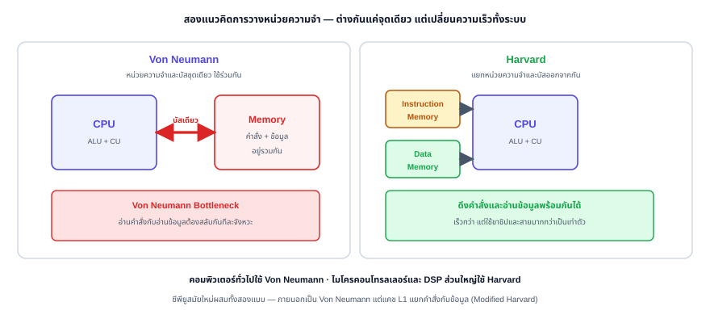
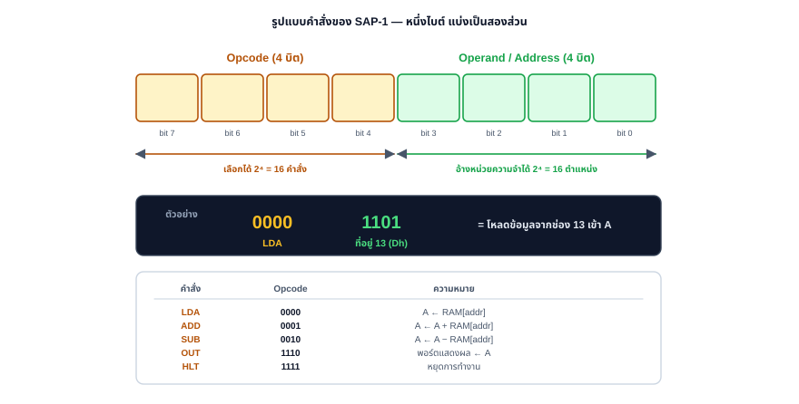
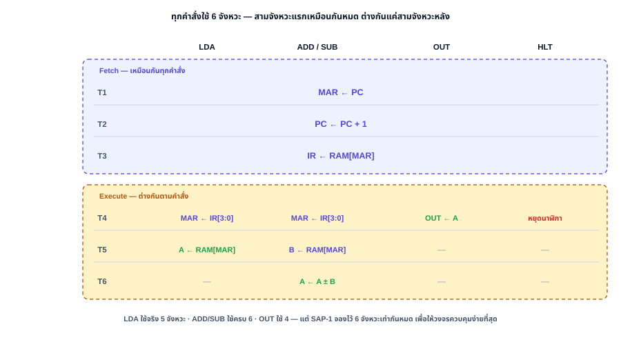

# Chapter 10: สถาปัตยกรรมคอมพิวเตอร์และหน่วยประมวลผลกลางเบื้องต้น

## Introduction to Computer Architecture & CPU Design

---

**รายวิชา:** ตรรกศาสตร์ของดิจิตอลคอมพิวเตอร์ (Digital Computer Logic)  
**หลักสูตร:** วิศวกรรมเมคคาทรอนิกส์ ชั้นปีที่ 1  
**บทที่:** 10 — สัปดาห์ที่ 14  

---

<div class="chapter-tab-content" data-tab-name="Concept" data-tab-icon="💡" id="concept" markdown="1">

## 10.1 สถาปัตยกรรมคอมพิวเตอร์เบื้องต้น (Computer Architecture Overview)

ในการเรียนดิจิทัลลอจิกตั้งแต่บทที่ 1 ถึง 9 เราได้เรียนรู้การทำงานของเกตลอจิก วงจรคำนวณ วงจรเชิงลำดับ (Sequential Circuits) ฟลิปฟลอป และหน่วยความจำมาแล้ว ในบทนี้เราจะนำวงจรพื้นฐานเหล่านั้นมารวมกันเพื่อสร้าง **หน่วยประมวลผลกลาง (CPU)** ซึ่งเป็นหัวใจสำคัญของสถาปัตยกรรมคอมพิวเตอร์

คอมพิวเตอร์ส่วนใหญ่ในปัจจุบันใช้แนวคิดโครงสร้างแบบ **สถาปัตยกรรมฟอนนอยมันน์ (Von Neumann Architecture)** ซึ่งเสนอร่างโดย John von Neumann ในปี 1945 โดยมีหลักการสำคัญคือ **โปรแกรมและข้อมูลถูกเก็บไว้ในหน่วยความจำร่วมกัน (Shared Memory)**

### ส่วนประกอบหลักของระบบคอมพิวเตอร์ตามแนวคิด Von Neumann:
1. **CPU (Central Processing Unit):** ทำหน้าที่ประมวลผลคำสั่งตามโปรแกรม
2. **Memory (หน่วยความจำหลัก):** เก็บทั้งข้อมูล (Data) และคำสั่ง (Instructions) ของโปรแกรม
3. **Input/Output (I/O):** ช่องทางติดต่อกับอุปกรณ์ภายนอก เช่น คีย์บอร์ด จอแสดงผล
4. **System Bus:** เส้นทางเชื่อมโยงการส่งผ่านข้อมูล ประกอบด้วย Address Bus, Data Bus และ Control Bus

<svg viewBox="0 0 720 300" role="img" aria-label="สถาปัตยกรรมฟอนนอยมันน์ (Von Neumann Architecture)" style="width:100%; max-width:680px; height:auto; display:block; margin:1.25rem auto; font-family:'Segoe UI',system-ui,sans-serif;">
  <defs>
    <marker id="arrow-vn" viewBox="0 0 10 10" refX="9" refY="5" markerWidth="7" markerHeight="7" orient="auto-start-reverse">
      <path d="M0,0 L10,5 L0,10 z" fill="#475569"/>
    </marker>
  </defs>

  <!-- Background -->
  <rect width="720" height="300" fill="#f8fafc" rx="8"/>
  
  <!-- CPU Boundary -->
  <rect x="30" y="30" width="320" height="240" rx="8" fill="#eff6ff" stroke="#2563eb" stroke-width="2" stroke-dasharray="4 4"/>
  <text x="190" y="55" text-anchor="middle" font-size="15" font-weight="700" fill="#1e40af">CPU (Central Processing Unit)</text>

  <!-- ALU -->
  <polygon points="50,90 190,90 170,140 190,190 50,190 70,140" fill="#eedffc" stroke="#9333ea" stroke-width="2"/>
  <text x="110" y="145" text-anchor="middle" font-size="14" font-weight="600" fill="#6b21a8">ALU</text>

  <!-- Control Unit -->
  <rect x="210" y="90" width="120" height="100" rx="6" fill="#ecfdf5" stroke="#059669" stroke-width="2"/>
  <text x="270" y="130" text-anchor="middle" font-size="13" font-weight="600" fill="#065f46">Control Unit</text>
  <text x="270" y="150" text-anchor="middle" font-size="13" font-weight="600" fill="#065f46">(CU)</text>

  <!-- Registers -->
  <rect x="50" y="210" width="280" height="45" rx="6" fill="#fff7ed" stroke="#ea580c" stroke-width="2"/>
  <text x="190" y="238" text-anchor="middle" font-size="13" font-weight="600" fill="#9a3412">Registers (PC, AC, IR, MAR, MDR)</text>

  <!-- Memory -->
  <rect x="490" y="30" width="180" height="110" rx="8" fill="#fef2f2" stroke="#dc2626" stroke-width="2"/>
  <text x="580" y="75" text-anchor="middle" font-size="14" font-weight="700" fill="#991b1b">Shared Memory</text>
  <text x="580" y="105" text-anchor="middle" font-size="12" fill="#7f1d1d">Instructions + Data</text>

  <!-- Input/Output -->
  <rect x="490" y="160" width="180" height="110" rx="8" fill="#fafafa" stroke="#52525b" stroke-width="2"/>
  <text x="580" y="215" text-anchor="middle" font-size="14" font-weight="700" fill="#27272a">Input / Output</text>
  <text x="580" y="235" text-anchor="middle" font-size="12" fill="#3f3f46">(I/O Devices)</text>

  <!-- System Bus System -->
  <g fill="none" stroke="#475569" stroke-width="3">
    <!-- CPU to Memory/IO -->
    <path d="M 350,110 L 490,110" marker-end="url(#arrow-vn)"/>
    <path d="M 490,190 L 350,190" marker-end="url(#arrow-vn)"/>
    <!-- Bidirectional paths -->
    <path d="M 350,150 L 490,150" marker-end="url(#arrow-vn)"/>
    <path d="M 490,150 L 350,150" marker-end="url(#arrow-vn)"/>
  </g>
  <text x="420" y="140" text-anchor="middle" font-size="11" fill="#475569" font-weight="600">System Bus</text>
</svg>

---

## 10.2 โครงสร้างภายในและรีจิสเตอร์ของ CPU (Registers and Internal CPU Structure)

เพื่อให้ CPU สามารถดำเนินการตามคำสั่งได้ มันต้องมีหน่วยเก็บข้อมูลชั่วคราวที่มีความเร็วสูงมากๆ อยู่ภายใน ซึ่งเราเรียกว่า **รีจิสเตอร์ (Registers)** โดยสร้างขึ้นจาก D Flip-Flops หลายๆ ตัวต่อขนานกัน

### รีจิสเตอร์ที่สำคัญภายใน CPU:

1. **Program Counter (PC):**
   * เก็บ **ตำแหน่งที่อยู่ (Address)** ของคำสั่งถัดไปในหน่วยความจำที่จะถูกนำมาประมวลผล
   * ค่าของ PC จะเพิ่มขึ้นทีละ 1 (หรือตามขนาดคำสั่ง) โดยอัตโนมัติหลังจากที่มีการดึงคำสั่งไปใช้งานแล้ว
2. **Instruction Register (IR):**
   * เก็บ **รหัสคำสั่ง (Instruction Code)** ที่กำลังถูกประมวลผลอยู่ ณ ขณะนั้น
3. **Accumulator (AC หรือ ACC):**
   * รีจิสเตอร์เอนกประสงค์ที่ใช้เก็บข้อมูลนำเข้าและผลลัพธ์จากการคำนวณของ ALU
4. **Memory Address Register (MAR):**
   * เก็บที่อยู่ของหน่วยความจำที่จะทำกิจกรรมอ่าน (Read) หรือเขียน (Write) ข้อมูล
5. **Memory Data Register (MDR) หรือ Memory Buffer Register (MBR):**
   * เก็บตัวข้อมูลที่เพิ่งอ่านมาจากหน่วยความจำ หรือข้อมูลที่กำลังจะเขียนลงหน่วยความจำ

---

## 10.3 วงจรการทำงานของคำสั่ง (Instruction Cycle)

การทำงานของคอมพิวเตอร์คือวงรอบที่เกิดขึ้นซ้ำๆ อย่างไม่มีที่สิ้นสุด ตราบเท่าที่มีกระแสไฟฟ้าเลี้ยงระบบ เรียกว่า **วงจรอ่านและประมวลผลคำสั่ง (Instruction Cycle)** แบ่งออกเป็น 3 ขั้นตอนหลัก:

<svg viewBox="0 0 500 180" role="img" aria-label="วงจรการทำงานของคำสั่ง" style="width:100%; max-width:500px; height:auto; display:block; margin:1.25rem auto; font-family:'Segoe UI',system-ui,sans-serif;">
  <defs>
    <marker id="arrow" viewBox="0 0 10 10" refX="6" refY="5" markerWidth="6" markerHeight="6" orient="auto-start-reverse">
      <path d="M 0 1.5 L 7 5 L 0 8.5 z" fill="#64748b"/>
    </marker>
  </defs>
  <rect width="500" height="180" fill="#f8fafc" rx="10"/>
  
  <!-- 1. Fetch -->
  <rect x="20" y="40" width="120" height="60" rx="8" fill="#eff6ff" stroke="#2563eb" stroke-width="2"/>
  <text x="80" y="65" text-anchor="middle" font-size="14" font-weight="700" fill="#1e40af">1. Fetch</text>
  <text x="80" y="85" text-anchor="middle" font-size="11" fill="#1e40af">ดึงคำสั่งจาก RAM</text>
  
  <!-- Arrow 1 -> 2 -->
  <path d="M 140 70 L 172 70" fill="none" stroke="#64748b" stroke-width="2" marker-end="url(#arrow)"/>
  
  <!-- 2. Decode -->
  <rect x="180" y="40" width="120" height="60" rx="8" fill="#fff7ed" stroke="#ea580c" stroke-width="2"/>
  <text x="240" y="65" text-anchor="middle" font-size="14" font-weight="700" fill="#9a3412">2. Decode</text>
  <text x="240" y="85" text-anchor="middle" font-size="11" fill="#9a3412">ถอดรหัส Opcode</text>
  
  <!-- Arrow 2 -> 3 -->
  <path d="M 300 70 L 332 70" fill="none" stroke="#64748b" stroke-width="2" marker-end="url(#arrow)"/>
  
  <!-- 3. Execute -->
  <rect x="340" y="40" width="120" height="60" rx="8" fill="#ecfdf5" stroke="#059669" stroke-width="2"/>
  <text x="400" y="65" text-anchor="middle" font-size="14" font-weight="700" fill="#065f46">3. Execute</text>
  <text x="400" y="85" text-anchor="middle" font-size="11" fill="#065f46">ประมวลผลคำสั่ง</text>
  
  <!-- Loop back path -->
  <path d="M 400 100 L 400 135 L 80 135 L 80 108" fill="none" stroke="#64748b" stroke-width="2" stroke-dasharray="4 4" marker-end="url(#arrow)"/>
  <text x="240" y="150" text-anchor="middle" font-size="11" fill="#64748b" font-weight="600">กลับไปเริ่มรอบ Fetch คำสั่งถัดไป</text>
</svg>


### รายละเอียดในแต่ละขั้นตอน:
1. **Fetch (การดึงคำสั่ง):**
   * CPU ส่งค่าจาก **PC** ไปยัง **MAR** เพื่อบอกตำแหน่งหน่วยความจำ
   * ส่งสัญญาณลอจิกระดับต่ำ/สูงเพื่อสั่ง Read
   * หน่วยความจำส่งรหัสคำสั่งกลับมาทาง Data Bus เข้าสู่ **MDR**
   * ย้ายข้อมูลจาก **MDR** ไปเก็บไว้ใน **IR**
   * เพิ่มค่าของ **PC** เพื่อชี้ไปยังคำสั่งถัดไป ($PC \leftarrow PC + 1$)
2. **Decode (การถอดรหัสคำสั่ง):**
   * **Control Unit (CU)** จะอ่านค่ารหัสการทำงาน (Opcode) จาก **IR**
   * ถอดรหัสผ่านวงจรถอดรหัส (Decoder) เพื่อสร้างสัญญาณควบคุมไปยังส่วนต่างๆ ของ CPU
3. **Execute (การทำงานตามคำสั่ง):**
   * ดำเนินการตามความหมายของคำสั่ง เช่น:
     * ดึงข้อมูลจาก RAM มาบวกกับ AC
     * บันทึกข้อมูลจาก AC ลง RAM
     * กระโดดไปยังตำแหน่งอื่น (Jump) โดยการเขียนค่าใหม่ลงใน PC

---

## 10.4 Von Neumann กับ Harvard: ต่างกันแค่จุดเดียว

สถาปัตยกรรมทั้งสองแบบมี CPU, หน่วยความจำ และบัสเหมือนกัน ต่างกันเพียงข้อเดียว — **แยกที่เก็บคำสั่งออกจากที่เก็บข้อมูลหรือไม่**



| ประเด็น | Von Neumann | Harvard |
|:---|:---|:---|
| **หน่วยความจำ** | ชุดเดียว เก็บทั้งคำสั่งและข้อมูล | แยกกัน 2 ชุด |
| **บัส** | ชุดเดียว ใช้ร่วมกัน | แยกกัน 2 ชุด |
| **ดึงคำสั่งพร้อมอ่านข้อมูล** | ทำไม่ได้ ต้องสลับกัน | **ทำพร้อมกันได้** |
| **จำนวนขาชิปและสาย** | น้อยกว่า ต้นทุนต่ำกว่า | มากกว่าเป็นเท่าตัว |
| **ความยืดหยุ่น** | โปรแกรมแก้ไขตัวเองได้ โหลดโปรแกรมใหม่ง่าย | คำสั่งอยู่คนละที่ แก้ระหว่างรันยาก |
| **พบใน** | คอมพิวเตอร์ทั่วไป | ไมโครคอนโทรลเลอร์, DSP |

> ⚠️ **Von Neumann Bottleneck** — เมื่อคำสั่งกับข้อมูลใช้บัสเส้นเดียวกัน CPU จะดึงคำสั่งและอ่านข้อมูลพร้อมกันไม่ได้ ต้องรอสลับกันทีละจังหวะ ยิ่ง CPU เร็วขึ้นเท่าไร คอขวดนี้ยิ่งเด่นชัด — เป็นเหตุผลที่ซีพียูสมัยใหม่ต้องมี **แคช** และแยกแคชคำสั่งกับแคชข้อมูลออกจากกัน (เรียกว่า **Modified Harvard**) ทั้งที่ภายนอกยังเป็น Von Neumann อยู่

---

## 10.5 รูปแบบคำสั่งและชุดคำสั่ง (Instruction Format & Instruction Set)

CPU จะรู้ได้อย่างไรว่าเลขฐานสอง `00001101` ที่อ่านมาจากหน่วยความจำหมายถึงอะไร — คำตอบคือ **ข้อตกลงเรื่องรูปแบบคำสั่ง** ที่กำหนดไว้ตั้งแต่ออกแบบชิป



### ชุดคำสั่งของ SAP-1 (Instruction Set)

| คำสั่ง | Opcode | ความหมาย | สัญกรณ์ RTL |
|:---:|:---:|:---|:---|
| **LDA** | `0000` | โหลดข้อมูลจากตำแหน่งที่ระบุเข้า Accumulator | $A \leftarrow \text{RAM}[addr]$ |
| **ADD** | `0001` | บวกข้อมูลจากตำแหน่งที่ระบุเข้ากับ A | $A \leftarrow A + \text{RAM}[addr]$ |
| **SUB** | `0010` | ลบข้อมูลจากตำแหน่งที่ระบุออกจาก A | $A \leftarrow A - \text{RAM}[addr]$ |
| **OUT** | `1110` | ส่งค่าใน A ออกพอร์ตแสดงผล | $\text{OUT} \leftarrow A$ |
| **HLT** | `1111` | หยุดการทำงานของ CPU | หยุดสัญญาณนาฬิกา |

> 💡 **ทำไม OUT กับ HLT ถึงใช้ opcode `1110` และ `1111`?** เพราะทั้งสองคำสั่งไม่ต้องอ้างที่อยู่หน่วยความจำ ค่า 4 บิตล่างจึงไม่มีความหมาย การเลือก opcode ค่าสูงสุดไว้ให้คำสั่งกลุ่มนี้ช่วยให้วงจรถอดรหัสแยกกลุ่มได้ง่าย

### ข้อจำกัดที่ตามมาจากการแบ่ง 4 + 4 บิต

- **คำสั่งได้มากที่สุด $2^4 = 16$ คำสั่ง** — SAP-1 ใช้จริงเพียง 5 คำสั่ง เหลือที่ว่างอีก 11 ช่อง
- **อ้างหน่วยความจำได้มากที่สุด $2^4 = 16$ ตำแหน่ง** — และตำแหน่งเหล่านี้ต้องแบ่งกันระหว่างโปรแกรมกับข้อมูล เพราะเป็น Von Neumann

> 🧮 **ลองคิดดู:** ถ้าอยากให้ SAP-1 อ้างหน่วยความจำได้ 256 ตำแหน่ง ต้องใช้ address กี่บิต? และคำสั่งต้องยาวขึ้นเป็นกี่บิต? — นี่คือการแลกเปลี่ยน (trade-off) ที่นักออกแบบสถาปัตยกรรมทุกคนต้องเจอ

</div>

<div class="chapter-tab-content" data-tab-name="Interactive Sim" data-tab-icon="🎮" id="sim" markdown="1">

## 10.6 ตัวอย่างสถาปัตยกรรมอย่างง่าย: SAP-1 (Simple-As-Possible CPU)

**SAP-1** เป็นโมเดลคอมพิวเตอร์อย่างง่ายที่ออกแบบโดย Albert Paul Malvino เพื่อประกอบการสอนสถาปัตยกรรมคอมพิวเตอร์เบื้องต้น มีขนาดบัสข้อมูล 8 บิต และบัสที่อยู่ 4 บิต (อ้างอิงหน่วยความจำได้ 16 Bytes)

### แผนภาพจำลองการทำงานเชิงแอนิเมชัน (SAP-1 Animated Operation)
แผนภาพด้านล่างจำลองการทำงานในระดับรีจิสเตอร์และบัส (Register-Transfer level) ของคำสั่ง **`LDA 9h`** (โหลดข้อมูลจากแรมที่อยู่ 9h เข้าสะสมที่ Accumulator) ทีละจังหวะเวลา (T-States) หมุนเวียนต่อเนื่องโดยอัตโนมัติ:

<svg viewBox="0 0 720 480" role="img" aria-label="เครื่องจำลองการทำงาน SAP-1 (SAP-1 Animated Simulator)" style="width:100%; max-width:680px; height:auto; display:block; margin:1.25rem auto; font-family:'Segoe UI',system-ui,sans-serif;">
  <defs>
    <!-- เงาตกกระทบสำหรับกล่อง -->
    <filter id="shadow" x="-10%" y="-10%" width="120%" height="120%">
      <feDropShadow dx="0" dy="2" stdDeviation="3" flood-color="#000" flood-opacity="0.1"/>
    </filter>
  </defs>
  
  <style>
    /* สไตล์ทั่วไป */
    .bg { fill: #f8fafc; rx: 12px; }
    .block { fill: #ffffff; stroke: #cbd5e1; stroke-width: 2px; }
    .title-text { font-size: 11px; fill: #64748b; font-weight: bold; }
    .lbl-text { font-size: 13px; fill: #1e293b; font-weight: 700; }
    .val-text { font-size: 13px; fill: #0f172a; font-family: monospace; font-weight: bold; }
    .bus-main { fill: none; stroke: #e2e8f0; stroke-width: 16px; stroke-linecap: round; }
    .bus-con { fill: none; stroke: #cbd5e1; stroke-width: 4px; }
    
    /* แมปปิ้งแอนิเมชันสำหรับกล่อง */
    .anim-pc { animation: pc-block-anim 12s infinite; }
    .anim-mar { animation: mar-block-anim 12s infinite; }
    .anim-ram { animation: ram-block-anim 12s infinite; }
    .anim-ir { animation: ir-block-anim 12s infinite; }
    .anim-ac { animation: ac-block-anim 12s infinite; }
    .anim-cu { animation: cu-block-anim 12s infinite; }
    
    /* สายสัญญาณแบบวิ่ง */
    .active-signal { fill: none; stroke-width: 4px; stroke-linecap: round; stroke-dasharray: 6 12; }
    .sig-t1 { animation: dash-flow 0.5s linear infinite, path-t1-anim 12s infinite; }
    .sig-t3 { animation: dash-flow 0.5s linear infinite, path-t3-anim 12s infinite; }
    .sig-t4 { animation: dash-flow 0.5s linear infinite, path-t4-anim 12s infinite; }
    .sig-t5 { animation: dash-flow 0.5s linear infinite, path-t5-anim 12s infinite; }
    
    /* แอนิเมชันแสดงค่าใน Register */
    .val-pc-0 { animation: pc-val-0-anim 12s infinite; }
    .val-pc-1 { animation: pc-val-1-anim 12s infinite; }
    .val-mar-0 { animation: mar-val-init-anim 12s infinite; }
    .val-mar-9 { animation: mar-val-exec-anim 12s infinite; }
    .val-ir-x { animation: ir-val-init-anim 12s infinite; }
    .val-ir-lda { animation: ir-val-lda-anim 12s infinite; }
    .val-ac-0 { animation: ac-val-init-anim 12s infinite; }
    .val-ac-data { animation: ac-val-exec-anim 12s infinite; }
    
    /* แอนิเมชันแสดงคำอธิบายข้อความ */
    .txt-t1 { animation: show-t1 12s infinite; }
    .txt-t2 { animation: show-t2 12s infinite; }
    .txt-t3 { animation: show-t3 12s infinite; }
    .txt-t4 { animation: show-t4 12s infinite; }
    .txt-t5 { animation: show-t5 12s infinite; }
    .txt-t6 { animation: show-t6 12s infinite; }
    
    /* วงรอบเวลา (T-States: T1-T6 ใช้เวลาเฟสละ 2 วินาที, รวม 12 วินาที) */
    @keyframes dash-flow { to { stroke-dashoffset: -36; } }
    
    @keyframes show-t1 { 0%, 15% { opacity: 1; } 16.6%, 100% { opacity: 0; } }
    @keyframes show-t2 { 0%, 15% { opacity: 0; } 16.6%, 31.6% { opacity: 1; } 33.3%, 100% { opacity: 0; } }
    @keyframes show-t3 { 0%, 31.6% { opacity: 0; } 33.3%, 48.3% { opacity: 1; } 50%, 100% { opacity: 0; } }
    @keyframes show-t4 { 0%, 48.3% { opacity: 0; } 50%, 65% { opacity: 1; } 66.6%, 100% { opacity: 0; } }
    @keyframes show-t5 { 0%, 65% { opacity: 0; } 66.6%, 81.6% { opacity: 1; } 83.3%, 100% { opacity: 0; } }
    @keyframes show-t6 { 0%, 81.6% { opacity: 0; } 83.3%, 98% { opacity: 1; } 100% { opacity: 0; } }
    
    @keyframes path-t1-anim { 0%, 15% { opacity: 1; stroke: #10b981; } 16.6%, 100% { opacity: 0; } }
    @keyframes path-t3-anim { 0%, 31.6% { opacity: 0; } 33.3%, 48.3% { opacity: 1; stroke: #3b82f6; } 50%, 100% { opacity: 0; } }
    @keyframes path-t4-anim { 0%, 48.3% { opacity: 0; } 50%, 65% { opacity: 1; stroke: #8b5cf6; } 66.6%, 100% { opacity: 0; } }
    @keyframes path-t5-anim { 0%, 65% { opacity: 0; } 66.6%, 81.6% { opacity: 1; stroke: #f97316; } 83.3%, 100% { opacity: 0; } }
    
    @keyframes pc-block-anim { 0%, 33.3% { stroke: #10b981; fill: #ecfdf5; stroke-width: 3px; } 33.4%, 100% { stroke: #cbd5e1; fill: #ffffff; stroke-width: 2px; } }
    @keyframes mar-block-anim { 0%, 16.6% { stroke: #3b82f6; fill: #eff6ff; stroke-width: 3px; } 50%, 66.6% { stroke: #3b82f6; fill: #eff6ff; stroke-width: 3px; } 16.7%, 49.9% { stroke: #cbd5e1; fill: #ffffff; stroke-width: 2px; } 66.7%, 100% { stroke: #cbd5e1; fill: #ffffff; stroke-width: 2px; } }
    @keyframes ram-block-anim { 33.3%, 50% { stroke: #06b6d4; fill: #ecfeff; stroke-width: 3px; } 66.6%, 83.3% { stroke: #06b6d4; fill: #ecfeff; stroke-width: 3px; } 0%, 33.2% { stroke: #cbd5e1; fill: #ffffff; stroke-width: 2px; } 50.1%, 66.5% { stroke: #cbd5e1; fill: #ffffff; stroke-width: 2px; } 83.4%, 100% { stroke: #cbd5e1; fill: #ffffff; stroke-width: 2px; } }
    @keyframes ir-block-anim { 33.3%, 66.6% { stroke: #8b5cf6; fill: #f5f3ff; stroke-width: 3px; } 0%, 33.2% { stroke: #cbd5e1; fill: #ffffff; stroke-width: 2px; } 66.7%, 100% { stroke: #cbd5e1; fill: #ffffff; stroke-width: 2px; } }
    @keyframes ac-block-anim { 66.6%, 100% { stroke: #f97316; fill: #fff7ed; stroke-width: 3px; } 0%, 66.5% { stroke: #cbd5e1; fill: #ffffff; stroke-width: 2px; } }
    @keyframes cu-block-anim { 16.6%, 66.6% { stroke: #ec4899; fill: #fdf2f8; stroke-width: 3px; } 0%, 16.5% { stroke: #cbd5e1; fill: #ffffff; stroke-width: 2px; } 66.7%, 100% { stroke: #cbd5e1; fill: #ffffff; stroke-width: 2px; } }

    @keyframes pc-val-0-anim { 0%, 16.6% { opacity: 1; } 16.61%, 100% { opacity: 0; } }
    @keyframes pc-val-1-anim { 0%, 16.6% { opacity: 0; } 16.61%, 100% { opacity: 1; } }
    @keyframes mar-val-init-anim { 0%, 50% { opacity: 1; } 50.01%, 100% { opacity: 0; } }
    @keyframes mar-val-exec-anim { 0%, 50% { opacity: 0; } 50.01%, 100% { opacity: 1; } }
    @keyframes ir-val-init-anim { 0%, 33.3% { opacity: 1; } 33.31%, 100% { opacity: 0; } }
    @keyframes ir-val-lda-anim { 0%, 33.3% { opacity: 0; } 33.31%, 100% { opacity: 1; } }
    @keyframes ac-val-init-anim { 0%, 83.3% { opacity: 1; } 83.31%, 100% { opacity: 0; } }
    @keyframes ac-val-exec-anim { 0%, 83.3% { opacity: 0; } 83.31%, 100% { opacity: 1; } }
  </style>

  <rect width="720" height="480" class="bg"/>
  
  <!-- แกนบัสหลัก W-Bus -->
  <path d="M 360 40 L 360 380" class="bus-main" />
  <text x="360" y="25" text-anchor="middle" font-size="12" font-weight="800" fill="#475569">W-BUS (8-Bit)</text>
  
  <!-- เส้นทางเชื่อมต่อเข้าหาบัส -->
  <path d="M 170 65 L 360 65" class="bus-con"/>
  <path d="M 170 145 L 360 145" class="bus-con"/>
  <path d="M 170 225 L 360 225" class="bus-con"/>
  <path d="M 170 315 L 360 315" class="bus-con"/>
  <path d="M 360 65 L 550 65" class="bus-con"/>
  <path d="M 360 225 L 550 225" class="bus-con"/>
  <path d="M 360 315 L 550 315" class="bus-con"/>

  <!-- บล็อกฝั่งซ้าย -->
  <!-- Program Counter (PC) -->
  <g transform="translate(50, 40)" filter="url(#shadow)">
    <rect width="120" height="50" rx="6" class="block anim-pc" />
    <text x="10" y="18" class="title-text">Program Counter</text>
    <text x="10" y="38" class="lbl-text">PC:</text>
    <text x="45" y="38" class="val-text val-pc-0">0000 (0h)</text>
    <text x="45" y="38" class="val-text val-pc-1">0001 (1h)</text>
  </g>
  
  <!-- Memory Address Register (MAR) -->
  <g transform="translate(50, 120)" filter="url(#shadow)">
    <rect width="120" height="50" rx="6" class="block anim-mar" />
    <text x="10" y="18" class="title-text">Memory Address Reg</text>
    <text x="10" y="38" class="lbl-text">MAR:</text>
    <text x="50" y="38" class="val-text val-mar-0">0000 (0h)</text>
    <text x="50" y="38" class="val-text val-mar-9">1001 (9h)</text>
  </g>

  <!-- RAM (16x8) -->
  <g transform="translate(50, 200)" filter="url(#shadow)">
    <rect width="120" height="60" rx="6" class="block anim-ram" />
    <text x="10" y="15" class="title-text">RAM (16x8)</text>
    <text x="10" y="32" font-size="11" fill="#475569" font-weight="600">@0h: 0000 1001</text>
    <text x="10" y="48" font-size="11" fill="#475569" font-weight="600">@9h: 0101 0101</text>
  </g>
  
  <!-- Accumulator (AC) -->
  <g transform="translate(50, 290)" filter="url(#shadow)">
    <rect width="120" height="50" rx="6" class="block anim-ac" />
    <text x="10" y="18" class="title-text">Accumulator</text>
    <text x="10" y="38" class="lbl-text">AC:</text>
    <text x="40" y="38" class="val-text val-ac-0">0000 0000</text>
    <text x="40" y="38" class="val-text val-ac-data">0101 0101</text>
  </g>

  <!-- บล็อกฝั่งขวา -->
  <!-- Instruction Register (IR) -->
  <g transform="translate(550, 40)" filter="url(#shadow)">
    <rect width="120" height="50" rx="6" class="block anim-ir" />
    <text x="10" y="18" class="title-text">Instruction Reg (IR)</text>
    <text x="10" y="38" class="lbl-text">IR:</text>
    <text x="35" y="38" class="val-text val-ir-x">XXXX XXXX</text>
    <text x="35" y="38" class="val-text val-ir-lda">0000 1001</text>
  </g>
  
  <!-- Control Unit (CU) -->
  <g transform="translate(550, 120)" filter="url(#shadow)">
    <rect width="120" height="50" rx="6" class="block anim-cu" />
    <text x="10" y="18" class="title-text">Control Unit</text>
    <text x="10" y="38" class="lbl-text" fill="#ec4899">CON:</text>
    <text x="50" y="38" class="val-text" fill="#ec4899">Active Signals</text>
  </g>
  
  <!-- B Register -->
  <g transform="translate(550, 200)" filter="url(#shadow)">
    <rect width="120" height="50" rx="6" class="block" />
    <text x="10" y="18" class="title-text">B Register</text>
    <text x="10" y="38" class="lbl-text">B:</text>
    <text x="30" y="38" class="val-text">0000 0000</text>
  </g>
  
  <!-- Adder/Subtractor (ALU) -->
  <g transform="translate(550, 290)" filter="url(#shadow)">
    <rect width="120" height="50" rx="6" class="block" />
    <text x="10" y="18" class="title-text">Adder / Subtractor</text>
    <text x="10" y="38" class="lbl-text" fill="#8b5cf6">ALU:</text>
    <text x="45" y="38" class="val-text" fill="#8b5cf6">A + B</text>
  </g>
  
  <!-- เชื่อมต่อจาก IR ลงมา CU ตรง ๆ -->
  <path d="M 610 90 L 610 120" class="bus-con" stroke="#8b5cf6" stroke-width="3"/>

  <!-- เส้นสตรีมสัญญาณแบบเคลื่อนที่แบบระบุสเตต -->
  <!-- T1: PC -> MAR -->
  <path d="M 170 65 L 360 65 L 360 145 L 170 145" class="active-signal sig-t1" />
  
  <!-- T3: RAM -> IR -->
  <path d="M 170 225 L 360 225 L 360 65 L 550 65" class="active-signal sig-t3" />
  
  <!-- T4: IR -> MAR -->
  <path d="M 550 65 L 360 65 L 360 145 L 170 145" class="active-signal sig-t4" />
  
  <!-- T5: RAM -> AC -->
  <path d="M 170 225 L 360 225 L 360 315 L 170 315" class="active-signal sig-t5" />

  <!-- แผงคำอธิบายสถานะด้านล่าง -->
  <g transform="translate(50, 390)" filter="url(#shadow)">
    <rect width="620" height="65" fill="#1e293b" rx="6"/>
    <circle cx="25" cy="32" r="10" fill="#f43f5e" />
    <text x="25" y="36" text-anchor="middle" font-size="12" font-weight="900" fill="#fff">i</text>
    
    <!-- Step T1 -->
    <g class="txt-t1">
      <text x="50" y="28" class="desc-text" fill="#f43f5e" font-weight="bold">จังหวะ T1 (Fetch): ส่งที่อยู่คำสั่งจาก PC ไป MAR</text>
      <text x="50" y="48" font-size="11.5" fill="#94a3b8">PC ส่งค่าตำแหน่ง '0000' วิ่งผ่านบัสหลัก (W-Bus) ไปบันทึกที่ MAR เพื่อใช้อ้างอิงแรม</text>
    </g>
    <!-- Step T2 -->
    <g class="txt-t2">
      <text x="50" y="28" class="desc-text" fill="#10b981" font-weight="bold">จังหวะ T2 (Fetch): ตัวนับโปรแกรม PC เพิ่มค่า</text>
      <text x="50" y="48" font-size="11.5" fill="#94a3b8">ค่าใน PC จะเพิ่มขึ้น 1 โดยอัตโนมัติ (PC = 0001) เพื่อรอรับการดึงคำสั่งถัดไป</text>
    </g>
    <!-- Step T3 -->
    <g class="txt-t3">
      <text x="50" y="28" class="desc-text" fill="#3b82f6" font-weight="bold">จังหวะ T3 (Fetch): อ่านคำสั่งจาก RAM เข้าไปเก็บใน IR</text>
      <text x="50" y="48" font-size="11.5" fill="#94a3b8">แรมส่งคำสั่ง ณ ตำแหน่ง 0h คือ '0000 1001' (LDA 9h) ผ่าน W-Bus เข้าไปโหลดลง IR</text>
    </g>
    <!-- Step T4 -->
    <g class="txt-t4">
      <text x="50" y="28" class="desc-text" fill="#a855f7" font-weight="bold">จังหวะ T4 (Execute): ส่งที่อยู่ของข้อมูลจาก IR ไปยัง MAR</text>
      <text x="50" y="48" font-size="11.5" fill="#94a3b8">IR ส่งค่าตำแหน่ง Operand 4 บิตล่าง (คือ '1001' หรือ 9h) ผ่าน W-Bus เข้า MAR อีกครั้ง</text>
    </g>
    <!-- Step T5 -->
    <g class="txt-t5">
      <text x="50" y="28" class="desc-text" fill="#f97316" font-weight="bold">จังหวะ T5 (Execute): นำข้อมูลจากแรมโหลดเก็บเข้า Accumulator (AC)</text>
      <text x="50" y="48" font-size="11.5" fill="#94a3b8">แรมดึงข้อมูลที่เก็บในตำแหน่ง 9h (คือ '0101 0101') ส่งออกไปยัง W-Bus เพื่อบันทึกเข้าสะสมใน AC</text>
    </g>
    <!-- Step T6 -->
    <g class="txt-t6">
      <text x="50" y="28" class="desc-text" fill="#10b981" font-weight="bold">จังหวะ T6 (Done): สิ้นสุดคำสั่งอย่างสมบูรณ์</text>
      <text x="50" y="48" font-size="11.5" fill="#94a3b8">คำสั่ง LDA 9h สำเร็จสมบูรณ์ โดยมีข้อมูล 0101 0101 ใน AC และเครื่องพร้อมเริ่มทำงานในรอบใหม่</text>
    </g>
  </g>
</svg>


---

## 10.7 โปรแกรมตัวอย่างบน SAP-1: คำนวณ 5 + 3 − 2

แอนิเมชันด้านบนแสดงคำสั่งเดียว คราวนี้ลองเขียน **โปรแกรมทั้งโปรแกรม** แล้วไล่ดูว่าหน่วยความจำ 16 ไบต์ถูกใช้อย่างไร

### ขั้นที่ 1 — เขียนโปรแกรมเป็นภาษาแอสเซมบลี

```text
LDA 13      ; A ← ค่าที่ช่อง 13 (คือ 5)
ADD 14      ; A ← A + ค่าที่ช่อง 14 (คือ 3)  → A = 8
SUB 15      ; A ← A − ค่าที่ช่อง 15 (คือ 2)  → A = 6
OUT         ; ส่ง A ออกพอร์ตแสดงผล
HLT         ; หยุด
```

### ขั้นที่ 2 — แปลงเป็นเลขฐานสองแล้ววางลงหน่วยความจำ

รูปแบบคือ `[opcode 4 บิต][address 4 บิต]` ตามหัวข้อ 10.5

| ที่อยู่ | เลขฐานสอง | ฐานสิบหก | ความหมาย |
|:---:|:---:|:---:|:---|
| `0` (0h) | `0000 1101` | `0D` | LDA 13 |
| `1` (1h) | `0001 1110` | `1E` | ADD 14 |
| `2` (2h) | `0010 1111` | `2F` | SUB 15 |
| `3` (3h) | `1110 0000` | `E0` | OUT |
| `4` (4h) | `1111 0000` | `F0` | HLT |
| `5`–`12` | `0000 0000` | `00` | (ว่าง) |
| `13` (Dh) | `0000 0101` | `05` | **ข้อมูล: 5** |
| `14` (Eh) | `0000 0011` | `03` | **ข้อมูล: 3** |
| `15` (Fh) | `0000 0010` | `02` | **ข้อมูล: 2** |

> ⭐ **นี่คือหัวใจของสถาปัตยกรรม Von Neumann** — ช่อง `0`–`4` เก็บ **คำสั่ง** ส่วนช่อง `13`–`15` เก็บ **ข้อมูล** ทั้งที่อยู่ในหน่วยความจำก้อนเดียวกัน สิ่งเดียวที่บอกว่าไบต์ไหนเป็นอะไร คือ **ลำดับที่ CPU ไปอ่าน** ถ้า PC ชี้ผิดที่ CPU จะพยายามรัน "ข้อมูล" เป็นคำสั่งทันที

### ขั้นที่ 3 — ไล่ตามด้วยมือ

| หลังคำสั่ง | PC | A | B | OUT | หมายเหตุ |
|:---|:---:|:---:|:---:|:---:|:---|
| (รีเซ็ต) | 0 | 0 | 0 | 0 | เริ่มต้น |
| LDA 13 | 1 | **5** | 0 | 0 | โหลดค่าแรก |
| ADD 14 | 2 | **8** | 3 | 0 | B รับ 3 มาก่อน แล้ว A = 5+3 |
| SUB 15 | 3 | **6** | 2 | 0 | B รับ 2 มาก่อน แล้ว A = 8−2 |
| OUT | 4 | 6 | 2 | **6** | ส่งค่าออกพอร์ต |
| HLT | 5 | 6 | 2 | 6 | หยุด |

ผลลัพธ์สุดท้าย: **6** — และในหัวข้อ 10.10 เราจะสร้าง CPU ตัวนี้ด้วย Verilog แล้วรันโปรแกรมเดียวกันนี้จริง เพื่อยืนยันว่าได้ 6 เหมือนกัน

</div>

<div class="chapter-tab-content" data-tab-name="Waveform / Truth Table" data-tab-icon="📊" id="waveform" markdown="1">

## 10.8 ไมโครออปเปอเรชัน: สิ่งที่เกิดขึ้นในแต่ละจังหวะนาฬิกา

คำสั่งหนึ่งคำสั่งไม่ได้เสร็จในหนึ่งจังหวะนาฬิกา แต่ถูกซอยย่อยเป็น **ไมโครออปเปอเรชัน (Micro-operation)** ทีละจังหวะ SAP-1 ใช้ 6 จังหวะต่อคำสั่ง เรียกว่า **T-state** ($T_1$–$T_6$)



### อ่านตารางนี้อย่างไร

**ช่วง Fetch ($T_1$–$T_3$) เหมือนกันทุกคำสั่ง** เพราะ CPU ยังไม่รู้ว่าคำสั่งคืออะไรจนกว่าจะอ่านมาถึง

| จังหวะ | ไมโครออปเปอเรชัน | เหตุผล |
|:---:|:---|:---|
| $T_1$ | $\text{MAR} \leftarrow \text{PC}$ | บอกหน่วยความจำว่าจะอ่านช่องไหน |
| $T_2$ | $\text{PC} \leftarrow \text{PC} + 1$ | เตรียมชี้คำสั่งถัดไปไว้เลย |
| $T_3$ | $\text{IR} \leftarrow \text{RAM}[\text{MAR}]$ | คำสั่งเข้ามาอยู่ใน IR แล้ว |

**ช่วง Execute ($T_4$–$T_6$) ต่างกันตาม opcode** เพราะตอนนี้วงจรควบคุมถอดรหัส IR ได้แล้ว

> 💡 **ทำไม PC ถึงบวกที่ $T_2$ ไม่ใช่ตอนจบคำสั่ง?** เพราะ MAR รับค่า PC ไปแล้วตั้งแต่ $T_1$ การบวก PC ตอนนี้จึงไม่กระทบการอ่านคำสั่งปัจจุบัน แต่ประหยัดจังหวะไปหนึ่งจังหวะ — เป็นเทคนิคพื้นฐานของการออกแบบวงจรควบคุม

> ⚠️ **สังเกตว่าบางจังหวะไม่ทำอะไรเลย** — LDA ว่างที่ $T_6$ ส่วน OUT ว่างทั้ง $T_5$ และ $T_6$ SAP-1 ยอมเสียจังหวะเปล่าเพื่อให้ตัวนับ T-state วนครบ 6 เท่ากันทุกคำสั่ง ทำให้วงจรควบคุมง่ายที่สุด
>
> ซีพียูจริงแก้ปัญหานี้ด้วย **Pipeline** คือให้คำสั่งถัดไปเริ่ม Fetch ทันทีที่คำสั่งปัจจุบันเข้าสู่ Execute แทนที่จะรอให้จบก่อน

---

## 10.9 การออกแบบชิ้นส่วน CPU ด้วย Verilog

เราสามารถสร้างโมดูลย่อยของ CPU ได้ด้วยภาษา Verilog ตัวอย่างด้านล่างคือการออกแบบ **หน่วยคำนวณและประมวลผลทางคณิตศาสตร์ (ALU)** ขนาด 8 บิต และ **Program Counter (PC)**

### ตัวอย่างที่ 10.1: โค้ด Verilog สำหรับ ALU 8 บิตอย่างง่าย

```verilog
module alu_8bit (
    input  [7:0] A,          // อินพุตตัวแรก
    input  [7:0] B,          // อินพุตตัวที่สอง
    input  [1:0] op,         // รหัสการทำงาน (00: บวก, 01: ลบ, 10: AND, 11: OR)
    output reg [7:0] out,    // ผลลัพธ์
    output reg zero          // แฟล็กแสดงผลลัพธ์เป็นศูนย์ (Zero Flag)
);

    always @(*) begin
        case (op)
            2'b00: out = A + B;       // Addition
            2'b01: out = A - B;       // Subtraction
            2'b10: out = A & B;       // Bitwise AND
            2'b11: out = A | B;       // Bitwise OR
            default: out = 8'b0;
        endcase
        
        // กำหนดสถานะ Zero Flag
        if (out == 8'b0)
            zero = 1'b1;
        else
            zero = 1'b0;
    end

endmodule
```

### ตัวอย่างที่ 10.2: โค้ด Verilog สำหรับ Program Counter (PC) 4 บิต

```verilog
module program_counter (
    input clk,               // สัญญาณนาฬิกา
    input reset,             // สัญญาณรีเซ็ตลอจิก Active-High
    input enable,            // สัญญาณอนุญาตให้เพิ่มค่า (Count Enable)
    output reg [3:0] pc_out  // ค่าที่อยู่อินสตรักชันเอาต์พุต
);

    always @(posedge clk or posedge reset) begin
        if (reset) begin
            pc_out <= 4'b0000;
        end else if (enable) begin
            pc_out <= pc_out + 1'b1;
        end
    end

endmodule
```


### ทดสอบ ALU ด้วย Testbench

```verilog
module tb_alu;
    reg  [7:0] A, B;
    reg  [1:0] op;
    wire [7:0] out;
    wire       zero;

    alu_8bit dut (.A(A), .B(B), .op(op), .out(out), .zero(zero));

    task chk(input [7:0] a, b, input [1:0] o);
        begin
            A = a; B = b; op = o; #5;
            $display("  A=%3d B=%3d op=%b -> out=%3d zero=%b", a, b, o, out, zero);
        end
    endtask

    initial begin
        chk(  5,   3, 2'b00);   // บวก
        chk( 10,   4, 2'b01);   // ลบ
        chk(  7,   7, 2'b01);   // ลบแล้วได้ศูนย์ → ตรวจ zero flag
        chk(200, 100, 2'b00);   // บวกแล้วล้น 8 บิต
        $finish;
    end
endmodule
```

ผลรันจริงจาก Icarus Verilog

```text
  A=  5 B=  3 op=00 -> out=  8 zero=0
  A= 10 B=  4 op=01 -> out=  6 zero=0
  A=  7 B=  7 op=01 -> out=  0 zero=1     ← zero flag ทำงาน
  A=200 B=100 op=00 -> out= 44 zero=0     ← 300 ล้น 8 บิต เหลือ 44
```

> ⚠️ **แถวสุดท้ายคือบทเรียนสำคัญ** — $200 + 100 = 300$ แต่ 8 บิตเก็บได้สูงสุด 255 ผลลัพธ์จึงวนเหลือ $300 - 256 = 44$ โดยที่วงจร **ไม่ฟ้องอะไรเลย** ซีพียูจริงจึงต้องมี **Carry Flag** และ **Overflow Flag** เพิ่มจาก Zero Flag เพื่อให้โปรแกรมตรวจจับกรณีนี้ได้

---

## 10.10 ประกอบทุกอย่างเข้าด้วยกัน: SAP-1 ที่รันได้จริง

ถึงจุดนี้เรามีชิ้นส่วนครบแล้ว — ALU (บทที่ 5), รีจิสเตอร์และตัวนับ (บทที่ 6–7), หน่วยความจำ (บทที่ 8) และภาษา Verilog (บทที่ 9) เหลือแค่ประกอบเข้าด้วยกันตามตารางไมโครออปเปอเรชันในหัวข้อ 10.8

### โค้ด SAP-1 ฉบับสมบูรณ์

```verilog
module sap1 (
    input  wire       clk, rst_n,
    output reg  [7:0] out_port,
    output wire       halted
);
    localparam LDA = 4'h0, ADD = 4'h1, SUB = 4'h2, OUT = 4'hE, HLT = 4'hF;

    reg [7:0] ram [0:15];       // หน่วยความจำ 16 x 8 บิต (บทที่ 8)
    reg [3:0] pc, mar;          // ตัวนับโปรแกรมและรีจิสเตอร์ที่อยู่
    reg [7:0] ir, a, b;         // รีจิสเตอร์คำสั่ง, Accumulator, ตัวตั้งที่สอง
    reg [2:0] t;                // ตัวนับ T-state (บทที่ 7)
    reg       hlt;

    assign halted = hlt;
    wire [3:0] opcode  = ir[7:4];    // แยกฟิลด์ตามหัวข้อ 10.5
    wire [3:0] operand = ir[3:0];

    integer i;
    initial begin                    // โปรแกรมจากหัวข้อ 10.7
        ram[0] = {LDA, 4'hD};        // LDA 13
        ram[1] = {ADD, 4'hE};        // ADD 14
        ram[2] = {SUB, 4'hF};        // SUB 15
        ram[3] = {OUT, 4'h0};        // OUT
        ram[4] = {HLT, 4'h0};        // HLT
        for (i = 5; i < 13; i = i + 1) ram[i] = 8'h00;
        ram[13] = 8'd5;              // ข้อมูล
        ram[14] = 8'd3;
        ram[15] = 8'd2;
    end

    always @(posedge clk or negedge rst_n) begin
        if (!rst_n) begin
            pc <= 0; mar <= 0; ir <= 0; a <= 0; b <= 0;
            t  <= 1; hlt <= 0; out_port <= 0;
        end else if (!hlt) begin
            case (t)
              // ---------- Fetch: เหมือนกันทุกคำสั่ง ----------
              3'd1: begin mar <= pc;       t <= 2; end
              3'd2: begin pc  <= pc + 1;   t <= 3; end
              3'd3: begin ir  <= ram[mar]; t <= 4; end
              // ---------- Execute: ต่างกันตาม opcode ----------
              3'd4: begin
                      case (opcode)
                        LDA, ADD, SUB: mar      <= operand;
                        OUT:           out_port <= a;
                        HLT:           hlt      <= 1'b1;
                      endcase
                      t <= 5;
                    end
              3'd5: begin
                      case (opcode)
                        LDA:      a <= ram[mar];
                        ADD, SUB: b <= ram[mar];
                      endcase
                      t <= 6;
                    end
              3'd6: begin
                      case (opcode)
                        ADD: a <= a + b;
                        SUB: a <= a - b;
                      endcase
                      t <= 1;
                    end
            endcase
        end
    end
endmodule
```

### Testbench ที่พิมพ์รีจิสเตอร์ทุกจังหวะ

```verilog
`timescale 1ns/1ps
module tb_sap1;
    reg clk = 0, rst_n;
    wire [7:0] out_port;
    wire       halted;

    sap1 cpu (.clk(clk), .rst_n(rst_n), .out_port(out_port), .halted(halted));
    always #5 clk = ~clk;

    initial begin
        $dumpfile("dump.vcd");
        $dumpvars(0, tb_sap1);
        rst_n = 0; @(posedge clk); #1; rst_n = 1;
        $display("T  PC MAR   IR    A    B   OUT");
        while (!halted) begin
            @(posedge clk); #1;
            $display("%0d  %0d   %0d  %h  %3d  %3d   %3d",
                     cpu.t, cpu.pc, cpu.mar, cpu.ir, cpu.a, cpu.b, out_port);
        end
        $display("\nหยุดทำงาน (HLT) — ผลลัพธ์ที่พอร์ตเอาต์พุต = %0d", out_port);
        $finish;
    end
endmodule
```

> 💡 **`cpu.t` คืออะไร?** เป็นการอ้างสัญญาณ *ภายใน* โมดูลจาก testbench (hierarchical reference) ทำได้เฉพาะตอนจำลอง ใช้ส่องดูรีจิสเตอร์ที่ไม่ได้ต่อออกมาที่ขาชิป — เครื่องมือดีบักที่มีประโยชน์มาก

### ผลรันจริง (ตัดมาเฉพาะช่วงสำคัญ)

```text
T  PC MAR   IR    A    B   OUT
4  1   0  0d    0    0     0      ← IR ได้ LDA 13 แล้ว
5  1   13  0d    0    0     0      ← MAR ชี้ไปช่อง 13
6  1   13  0d    5    0     0      ← A = 5
...
6  2   14  1e    5    3     0      ← B รับ 3 มาแล้ว
1  2   14  1e    8    3     0      ← A = 5 + 3 = 8
...
6  3   15  2f    8    2     0      ← B รับ 2 มาแล้ว
1  3   15  2f    6    2     0      ← A = 8 − 2 = 6
...
5  4   3  e0    6    2     6      ← OUT ส่ง 6 ออกพอร์ต
4  5   4  f0    6    2     6      ← เจอ HLT

หยุดทำงาน (HLT) — ผลลัพธ์ที่พอร์ตเอาต์พุต = 6
```

> 🎯 **ตรงกับการไล่ด้วยมือในหัวข้อ 10.7 ทุกขั้นตอน** — CPU ที่เราเพิ่งสร้างขึ้นมาจากศูนย์ อ่านโปรแกรมของตัวเองจากหน่วยความจำ ถอดรหัส และคำนวณได้ถูกต้อง

### สิ่งที่ SAP-1 ยังไม่มี (และซีพียูจริงต้องมี)

| ขาดอะไร | ทำไมถึงสำคัญ |
|:---|:---|
| **คำสั่งกระโดด (JMP / JZ)** | ไม่มีก็เขียนลูปหรือเงื่อนไขไม่ได้เลย — โปรแกรมทำได้แค่ไหลจากบนลงล่าง |
| **คำสั่งเขียนกลับหน่วยความจำ (STA)** | ตอนนี้ผลลัพธ์เก็บได้แค่ใน A ออกได้ทางพอร์ตเท่านั้น |
| **Carry / Overflow Flag** | ตรวจไม่ได้ว่าผลลัพธ์ล้น 8 บิตหรือไม่ (ดูตัวอย่าง 200 + 100 ข้างบน) |
| **Stack และคำสั่งเรียกโปรแกรมย่อย** | เขียนฟังก์ชันหรือโปรแกรมย่อยไม่ได้ |
| **Pipeline** | เสียจังหวะเปล่าไปมากตามที่เห็นในหัวข้อ 10.8 |

> การเพิ่มคำสั่ง **JMP** เข้าไปใช้โค้ดเพิ่มเพียงไม่กี่บรรทัด (แค่ให้ $T_4$ เขียนค่า operand ลง PC) — เป็นโจทย์ท้าทายในแบบฝึกหัดข้อ 10 ท้ายบท


</div>

<div class="chapter-tab-content" data-tab-name="Challenge" data-tab-icon="🏆" id="challenge" markdown="1">

## 🏆 แบบฝึกหัดท้ายบท

### ภาคที่ 1: สถาปัตยกรรมและวงรอบคำสั่ง

**ข้อ 1 — Von Neumann กับ Harvard**
อธิบายความแตกต่างของสองสถาปัตยกรรม พร้อมตอบว่า
- **Von Neumann Bottleneck** เกิดจากอะไร และแก้บรรเทาได้อย่างไร
- เพราะเหตุใดไมโครคอนโทรลเลอร์ส่วนใหญ่จึงเลือก Harvard ทั้งที่ใช้ขาชิปมากกว่า

**ข้อ 2 — บทบาทของ PC**
หน้าที่ของ **Program Counter** ในจังหวะ Fetch สำคัญอย่างไร และเพราะเหตุใด SAP-1 จึงบวกค่า PC ที่จังหวะ $T_2$ แทนที่จะรอจนจบคำสั่ง

**ข้อ 3 — คำนวณขนาดชุดคำสั่ง**
คำสั่งขนาด 16 บิต แบ่งเป็น Opcode 6 บิต และ Address 10 บิต
- มีคำสั่งได้สูงสุดกี่คำสั่ง
- อ้างหน่วยความจำได้สูงสุดกี่คำ (Words)
- ถ้าอยากให้อ้างหน่วยความจำได้ 4,096 คำ โดยคงความยาวคำสั่งไว้ที่ 16 บิต จะเหลือ Opcode กี่บิต และคำสั่งลดลงเหลือกี่คำสั่ง

**ข้อ 4 — ไมโครออปเปอเรชัน**
เขียนขั้นตอน Fetch Cycle ในระดับ Micro-operation ให้ครบทุกจังหวะ พร้อมระบุว่ารีจิสเตอร์ใดเปลี่ยนค่าในแต่ละจังหวะ

**ข้อ 5 — อ่านตารางไมโครออปเปอเรชัน**
จากตารางในหัวข้อ 10.8
- คำสั่งใดใช้จังหวะจริงน้อยที่สุด และเสียจังหวะเปล่าไปกี่จังหวะ
- ถ้าออกแบบใหม่ให้แต่ละคำสั่งใช้จังหวะเท่าที่จำเป็นจริง ๆ จะประหยัดเวลาได้กี่เปอร์เซ็นต์เมื่อรันโปรแกรมในหัวข้อ 10.7
- การทำแบบนั้นทำให้วงจรควบคุมซับซ้อนขึ้นอย่างไร

---

### ภาคที่ 2: เขียนโปรแกรมบน SAP-1

**ข้อ 6 — แปลงโปรแกรมเป็นเลขฐานสอง**
จงเขียนโปรแกรมคำนวณ $12 + 7 - 4$ แล้วแสดงผล โดย
- (ก) เขียนเป็นภาษาแอสเซมบลี (ข) แปลงเป็นเลขฐานสองและฐานสิบหก (ค) เขียนตารางหน่วยความจำทั้ง 16 ช่อง (ง) ไล่ค่า A ทีละคำสั่ง

**ข้อ 7 — ข้อจำกัดของหน่วยความจำ 16 ช่อง**
โปรแกรมในหัวข้อ 10.7 ใช้ไป 5 ช่องสำหรับคำสั่ง และ 3 ช่องสำหรับข้อมูล
- เหลือช่องว่างอีกกี่ช่อง
- ถ้าต้องบวกเลข 10 จำนวนเข้าด้วยกัน จะเขียนโปรแกรมลง SAP-1 ได้หรือไม่ เพราะเหตุใด
- เสนอวิธีแก้อย่างน้อย 1 วิธี

**ข้อ 8 — เมื่อ PC ชี้ผิดที่**
สมมติว่า PC ถูกรีเซ็ตเป็น `13` แทนที่จะเป็น `0` แล้วเริ่มทำงาน
- CPU จะอ่านไบต์ `0000 0101` (ข้อมูลเลข 5) มาเป็นคำสั่งอะไร
- จะเกิดอะไรขึ้นต่อไป
- เหตุการณ์นี้สะท้อนจุดอ่อนข้อใดของสถาปัตยกรรม Von Neumann

---

### ภาคที่ 3: Verilog และการต่อยอด

**ข้อ 9 — Accumulator**
เขียนโมดูล Verilog ของ Accumulator 8 บิต ที่มีขา `load` และ `reset` แบบซิงโครนัส พร้อม testbench ที่ทดสอบทั้งการโหลด การรีเซ็ต และการคงค่าเมื่อ `load = 0`

**ข้อ 10 — ⭐ เพิ่มคำสั่ง JMP ให้ SAP-1**
เพิ่มคำสั่ง **JMP** (opcode `0011`) ที่ทำให้ $\text{PC} \leftarrow \text{operand}$
- (ก) เพิ่มไมโครออปเปอเรชันลงในตารางหัวข้อ 10.8 ว่าควรทำที่จังหวะใด
- (ข) แก้โค้ดในหัวข้อ 10.10 (เพิ่มไม่เกิน 3 บรรทัด)
- (ค) เขียนโปรแกรมที่วนซ้ำไม่รู้จบ แล้วรันดูว่า PC วนกลับจริงหรือไม่
- (ง) เพราะเหตุใดคำสั่งกระโดดจึงเป็นสิ่งที่ทำให้คอมพิวเตอร์ "คำนวณอะไรก็ได้" ต่างจากเครื่องคิดเลข

**ข้อ 11 — ⭐ เพิ่ม Carry Flag**
จากตัวอย่าง $200 + 100 = 44$ ในหัวข้อ 10.9
- เพิ่มสัญญาณ `carry` ให้ ALU โดยขยายผลลัพธ์เป็น 9 บิต (`{carry, out} = A + B;`)
- แก้ testbench ให้แสดง carry แล้วยืนยันว่ากรณี 200 + 100 ได้ `carry = 1`
- อธิบายว่าโปรแกรมจะใช้ carry flag ทำอะไรได้บ้าง

**ข้อ 12 — 🌟 โจทย์บูรณาการ: เปรียบเทียบสามวิธีสร้างวงจรเดียวกัน**
ตลอดสามบทที่ผ่านมา เราสร้าง "วงจรที่จำสถานะและทำงานเป็นลำดับ" ด้วยสามวิธี

| วิธี | บท | ตัวอย่าง |
|:---|:---:|:---|
| ต่อเกตและฟลิปฟลอปด้วยมือ | 6–7 | ตัวนับ mod-N |
| โปรแกรมลง PLD (fuse map) | 8 | เครื่องซักผ้าบน Registered PAL |
| เขียน HDL แล้วสังเคราะห์ | 9–10 | SAP-1 CPU |

จงเขียนรายงานสั้น ๆ (ไม่เกิน 1 หน้า) เปรียบเทียบทั้งสามวิธีในประเด็น
1. ความยากในการออกแบบครั้งแรก
2. ความยากในการแก้ไขเมื่อข้อกำหนดเปลี่ยน
3. ความเข้าใจว่าเกิดอะไรขึ้นจริงในฮาร์ดแวร์
4. ขนาดวงจรที่ใหญ่ที่สุดที่แต่ละวิธีรับไหว
5. สรุปว่าถ้าต้องออกแบบวงจรควบคุมลิฟต์ 8 ชั้น จะเลือกวิธีใด เพราะเหตุใด

---

<details>
<summary>คลิกเพื่อดูเฉลยแนวคิดข้อ 1–5</summary>

### เฉลยแนวคิด

**ข้อ 1**
- **Von Neumann:** หน่วยความจำและบัสชุดเดียว เก็บทั้งคำสั่งและข้อมูล — ดึงคำสั่งกับอ่านข้อมูลต้องสลับกันทีละจังหวะ เกิด **Von Neumann Bottleneck** บรรเทาได้ด้วยแคช (โดยเฉพาะการแยกแคชคำสั่งกับแคชข้อมูล = Modified Harvard)
- **Harvard:** แยกหน่วยความจำและบัสของคำสั่งกับข้อมูลออกจากกัน ดึงพร้อมกันได้ เร็วกว่า แต่ใช้ขาชิปและสายมากกว่าเป็นเท่าตัว
- ไมโครคอนโทรลเลอร์เลือก Harvard เพราะโปรแกรมถูกเบิร์นไว้ถาวรใน Flash และแทบไม่เปลี่ยน จึงแยกออกมาได้โดยไม่เสียความยืดหยุ่น แถมได้ความเร็วและความแน่นอนของเวลาเพิ่ม

**ข้อ 2**
PC ชี้ตำแหน่งคำสั่งถัดไปที่จะดึงมาประมวลผล — ถ้าไม่มี CPU จะไม่รู้ว่าต้องทำคำสั่งใดต่อ
SAP-1 บวก PC ที่ $T_2$ ได้เพราะ MAR รับค่า PC ไปเก็บแล้วตั้งแต่ $T_1$ การบวกตอนนี้จึงไม่กระทบการอ่านคำสั่งปัจจุบัน และประหยัดไปหนึ่งจังหวะ

**ข้อ 3**
- คำสั่งสูงสุด $2^6 = 64$ คำสั่ง
- หน่วยความจำสูงสุด $2^{10} = 1{,}024$ คำ
- ถ้าต้องการ $4{,}096 = 2^{12}$ คำ ต้องใช้ address 12 บิต เหลือ opcode $16 - 12 = 4$ บิต ได้คำสั่งเพียง $2^4 = 16$ คำสั่ง

**ข้อ 4**
- $T_1: \text{MAR} \leftarrow \text{PC}$ (MAR เปลี่ยน)
- $T_2: \text{PC} \leftarrow \text{PC} + 1$ (PC เปลี่ยน)
- $T_3: \text{IR} \leftarrow \text{RAM}[\text{MAR}]$ (IR เปลี่ยน)

**ข้อ 5**
- **OUT** ใช้จริงเพียง 4 จังหวะ เสียเปล่า 2 จังหวะ · LDA เสียเปล่า 1 จังหวะ
- โปรแกรมในหัวข้อ 10.7 มี LDA 1 + ADD 1 + SUB 1 + OUT 1 + HLT 1 = 5 คำสั่ง ใช้ $5 \times 6 = 30$ จังหวะ ถ้าใช้เท่าที่จำเป็น (5 + 6 + 6 + 4 + 4 = 25) จะประหยัดราว 17%
- แลกกับวงจรควบคุมที่ต้องรู้ว่าแต่ละคำสั่งจบที่จังหวะใด ทำให้ตัวถอดรหัสซับซ้อนขึ้นมาก

</details>
</div>
